# Maven 适合初学者

> 原文：<https://levelup.gitconnected.com/getting-started-with-maven-in-5-minutes-a8a20d875ae5>

## 初学者理解和安装 Maven

[Technofunnel](https://medium.com/technofunnel) 展示了另一篇关于 Maven 入门的文章。在这篇文章中，我们将简单地寻找将 Maven 集成到您的 Java 项目中所需的步骤，这些步骤包括“理解 basic”。pom”文件在 Java 中。我们将从零开始创建一个小项目，并将整合”。pom”文件，并在我们的本地系统上执行该项目。

这篇文章对于开始学习 Java 和 Maven 的人来说会很有用。这些步骤如下:

## **1。安装 Java 并添加环境变量**

为了开始，我们需要将 Java 安装到本地系统中，并将其添加到系统的环境变量中。在设置中，我们将使用 Java 15。下面给出了安装 Java 15 的链接

[https://www . Oracle . com/Java/technologies/javase/JDK 15-archive-downloads . html](https://www.oracle.com/java/technologies/javase/jdk15-archive-downloads.html)

 [## Java SE 15 归档文件下载

### 您的搜索没有匹配任何结果。我们建议您尝试以下方法来帮助找到您正在寻找的内容:检查…

www.oracle.com](https://www.oracle.com/java/technologies/javase/jdk15-archive-downloads.html) 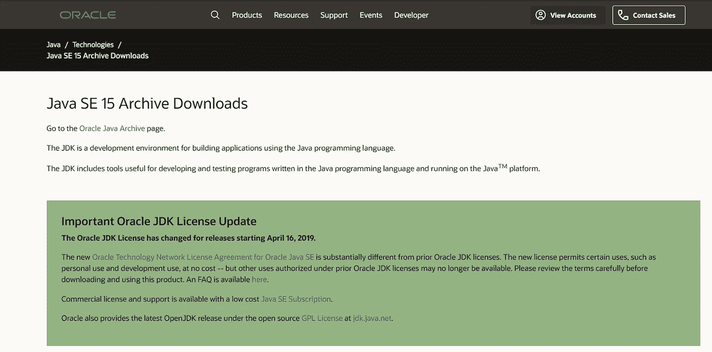

为 Maven 安装 Java 并添加路径

我们可以在特定的路径下下载 java，对于我的系统来说 java 安装在**“C:\ Program Files \ Java \ JDK-15”。**我们需要将以下路径添加到环境变量中。在**系统变量**中添加一个名为“JAVA_HOME”的变量，路径指向**“C:\ Program Files \ JAVA \ JDK-15”**位置。

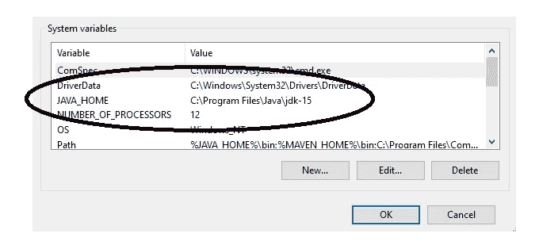

向环境变量添加 Java 路径

在**系统变量**中选择路径，并将以下路径添加到顶部的列表中。我们需要在系统变量中选择“Path”并添加“ **%JAVA_HOME%\bin**

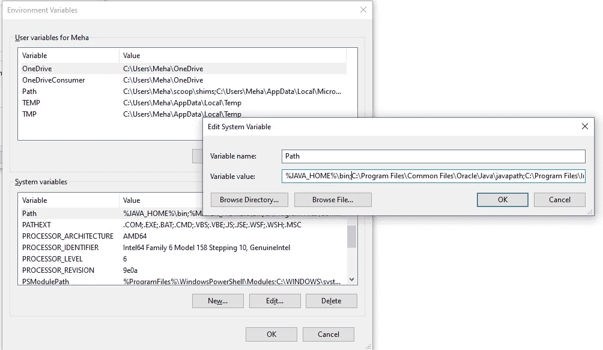

Java 中的环境变量

我们在列表的顶部添加了“ **%JAVA_HOME%\bin** ”。

## **2。我们现在可以在本地系统中安装 Maven 了**

我们可以从以下网站下载 Maven。我们可以将“bin.zip”下载到系统中。并将解压后的文件夹放在系统的某个存储库中。

 [## 下载 Apache Maven

### Apache Maven 3.8.1 是最新发布的版本，也是所有用户的推荐版本。当前选择的下载镜像…

maven.apache.org](https://maven.apache.org/download.cgi) 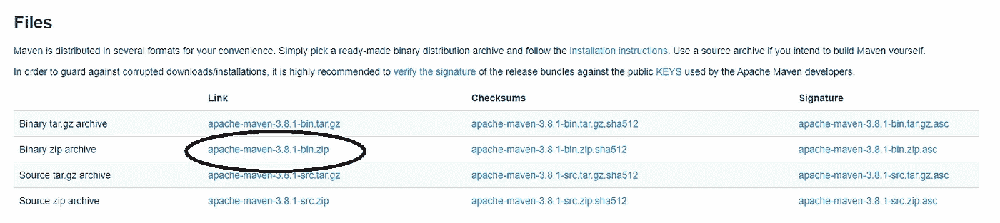

正在本地系统中安装 Maven

我已经将解压后的文件夹保存到了以下文件夹位置“ **C:\Program Files\Java** ”。

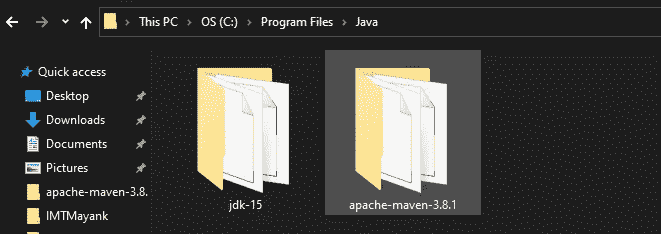

复制以下位置，并在系统变量中添加一个名为“MAVEN_HOME”的新变量，路径如下。

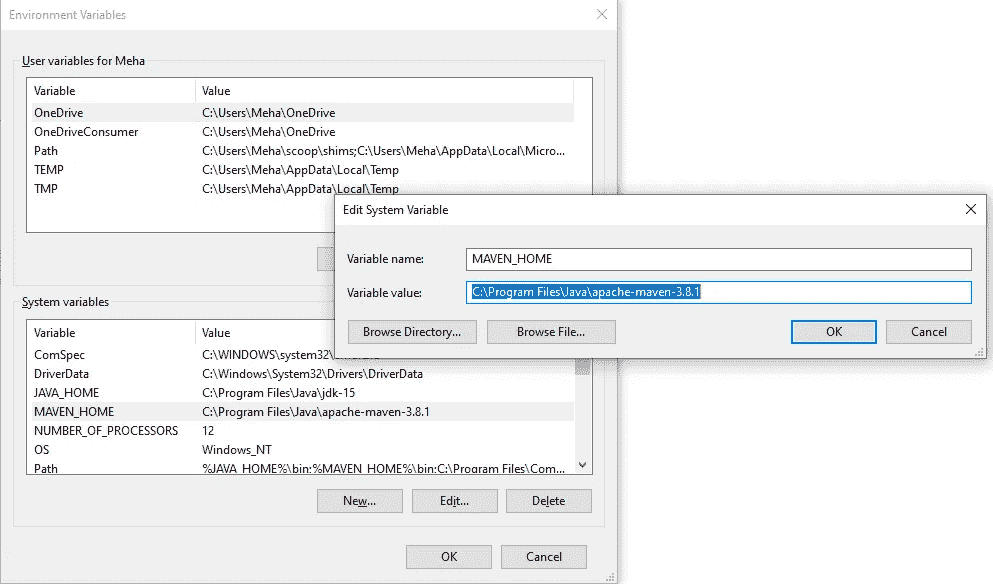

向系统添加 Maven 环境路径

将 Maven bin 文件夹位置添加到系统变量中的 path 变量中。对于 path 变量，您可以在 Java Home 旁边添加“%MAVEN_HOME\bin”

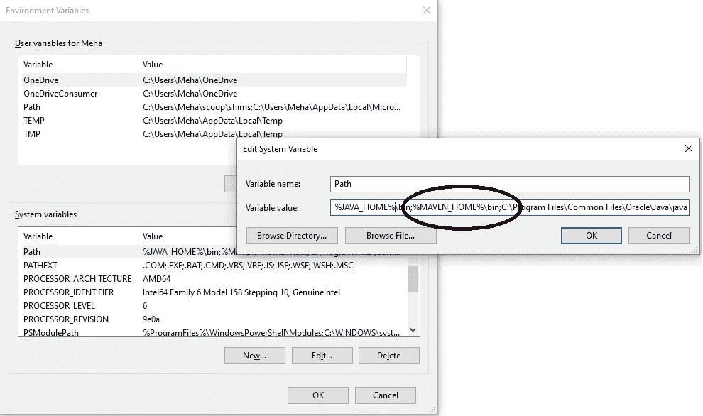

向系统添加 Maven 路径

## 3.创建一个样例 Java 项目来开始

一旦我们安装了 Maven 和 Java，并将其添加到环境变量和 path 中的 path 中。我们可以做的下一件事是创建一个 Java 项目。我们将使用 Eclipse 创建一个简单的项目

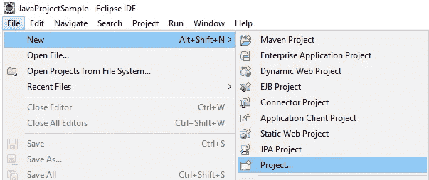

创建示例 Maven 项目

它将打开一个小部件，您可以在其中选择项目的类型

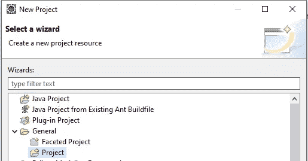

## **4。向项目添加文件和文件夹**

创建项目后，将以下文件和文件夹结构添加到项目中。“ **src/main/java** 是我们添加 java 文件的文件夹

将 pom.xml 添加到项目中

## 5.向“pom.xml”添加内容

一旦我们创建了 POM 文件，我们需要在项目中指定以下属性和值。这些属性是:

*   **groupId** :指定项目所属的公司
*   **artifactId** :您正在创建的工件/项目的名称
*   **型号版本**:始终保持为 4.0.0
*   **版本**:您想要指定的应用程序版本
*   **打包**:指定您想要打包应用程序的方式

下面给出了示例“pom.xml ”:

[https://gist . github . com/mayankgupta 688/d 8d 9 BC EDC 70800 B3 e 242189 b 879d 58 fc](https://gist.github.com/Mayankgupta688/d8d9bcedc70800b3e242189b879d58fc)

## 6.执行“mvn 清理”和“mvn 编译”命令

下一步是在创建项目的文件夹中执行下面的命令。在我的例子中，我已经创建了“HelloWorld”项目，所以这些命令需要从同一个位置执行。

*   mvn 清洁
*   mvn 编译

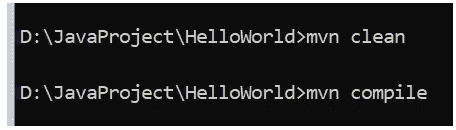

清理和编译命令

如果使用低于 10 的 Java 版本，您将会遇到以下错误

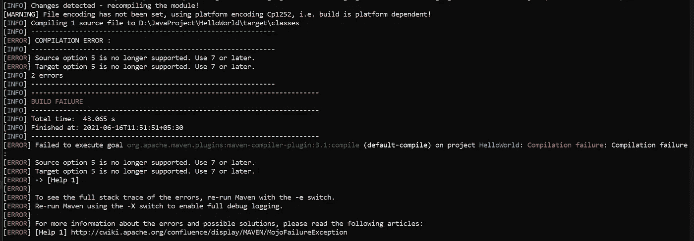

Java 版本的 maven pom 错误

为了消除这个错误，我们需要在“POM”文件中添加一个插件。同样添加的插件是“ **maven-compiler-plugin** ”。还要将发布版本更新为所使用的 Java 版本。POM 文件将更新为以下内容:

解决 Java 版本不匹配的 Maven 错误

现在，当我们运行“mvn compile”命令时，它将正常工作。

## 7.创建并执行 Java 文件

我已经将以下代码添加到 Java 文件“**HelloWorld.java**”中

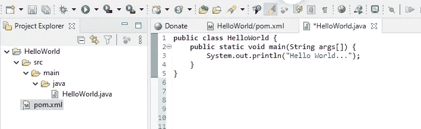

使用以下命令从命令提示符运行以下 Java 文件:

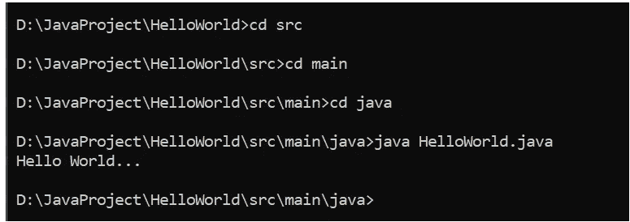

## 8.将 Java 文件打包成“jar”

我们可以将应用程序打包在“jar”中，我们可以在命令提示符下执行以下命令:

*   mvn 编译

当我们运行“mvn compile”时，应用程序的“Jar”文件会出现在应用程序的“target”文件夹中。然后我们可以使用这些“jar”文件。

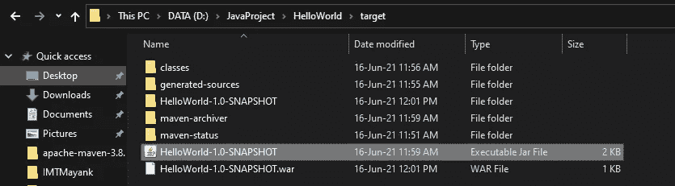

运行 mvn 编译命令

## **9。将项目转换为 Maven 项目**

一旦创建了整个结构，我们需要将 project 转换为 maven project。为此，选择项目，转到配置并点击“**转换为 Maven 项目**”。你可以看到下面的图片。

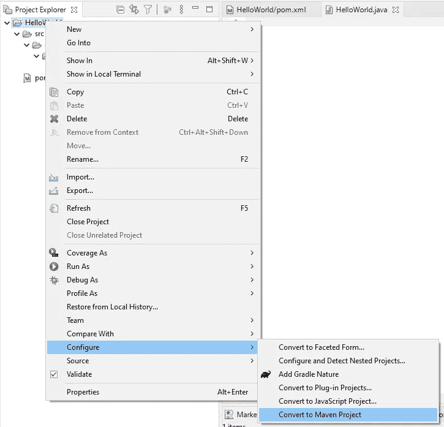

## **10。向项目添加依赖关系**

一旦一切就绪并开始运行，我们现在可以使用 maven 来安装项目的依赖项。在下图中，我们有一个“**依赖关系**”标签，我们可以在其中添加多个“**依赖关系**”。对于每一个依赖项，我们需要指定

*   groupId
*   artifactId
*   版本

一旦添加了依赖项并保存了命令，Maven 将安装依赖项，并在项目的“Maven Dependencies”文件夹中可用。从而自动管理项目的所有依赖项和版本。

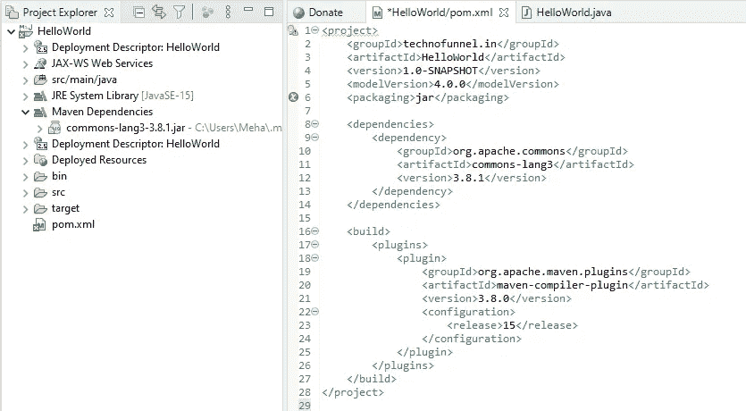

## 结论:

这就是我们如何创建一个 Maven 项目并开始同样的工作。