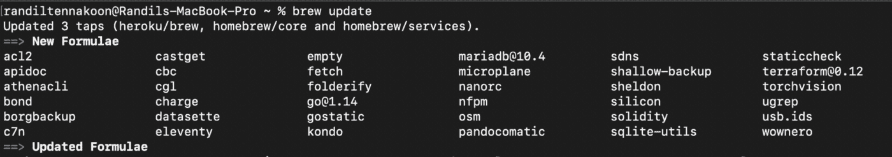
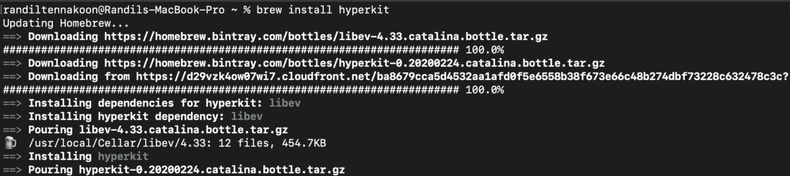
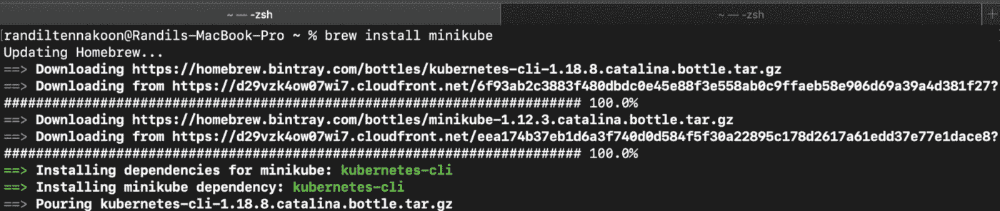
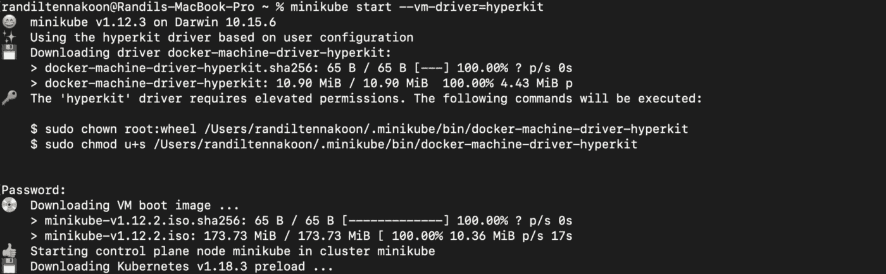
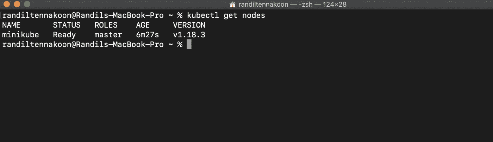

# 开始使用 Minikube 作为您的本地 Kubernetes 集群

> 原文：<https://levelup.gitconnected.com/getting-started-with-minikube-as-your-local-kubernetes-cluster-cfebf87abc39>

## 免费创建您的单节点本地 Kubernetes 集群。


真实机构在 [Unsplash](https://unsplash.com/?utm_source=unsplash&utm_medium=referral&utm_content=creditCopyText) 上拍摄的

**Kubernetes** 或 ***K8s*** 在 DevOps 中起着主要作用，目前，大多数应用程序都可能部署在 Kubernetes 集群中。在 2013 年推出 Docker 之前，虚拟化在 IT 行业发挥了巨大的作用。

你肯定听说过不同的工具，如 ***虚拟盒子******虚拟机软件*** 等，而且很可能你今天已经体验过了。但是在容器出现之后，开发人员开始将他们的应用程序容器化，因为这种技术给了他们更进一步的可行性解决方案。

一旦 Google 引入了 Kubernetes，这是一个在集群环境中管理容器化应用程序的强大系统，真正的变化就开始发生了。Kubernetes 是一个开源系统，拥有自己的架构，并兼容不同的第三方工具和适配器。

在集群环境中，您可能有几个主节点和工作节点，其中大多数可以是物理机器或云环境。但是，如果您需要在本地机器上测试一些东西，该怎么办呢？它可能是一个简单的容器化应用程序，也可能是一个需要在部署之前进行测试的生产级应用程序。无论如何，这并不意味着您需要购买所有必需的物理机或云环境来在集群中测试它们。

那么，你会有什么选择呢？

这是迷你库贝的照片。

# Minikube 是什么？

Minikube 是一个开源工具，它为您提供了一个**单节点**集群，主进程和工作进程都在该节点内运行。您可以轻松地在计算机上安装 Minikube，并使用它测试您的应用程序。Minikube 为您提供预装 Docker 作为您的容器运行时，这样您就不需要单独安装 Docker。

Minikube 需要一个虚拟机管理程序或虚拟机管理程序*(例如:Virtual Box、VMware、Hyperkit、Hyper-V、KVM 等)*和 Kubernetes 命令行工具，即所谓的 ***kubectl*** 来与您的 Kubernetes 工作负载和服务进行交互。您可以使用以下链接根据您的操作系统安装 Minikube。

 [## minikube 启动

### minikube 是本地 Kubernetes，专注于让 Kubernetes 易于学习和开发。你所需要的是码头工人…

minikube.sigs.k8s.io](https://minikube.sigs.k8s.io/docs/start/) 

# 安装 Minikube

本教程我使用的是 Mac，与其他操作系统相比，这个过程在 Mac 上更容易一些。然而，如果你使用的是其他操作系统而不是 Mac OS，你可以通过上面的链接按照所有的步骤操作。

此外，如果您使用的是 Mac，您可以和我一起继续，我会向您展示在 Mac 上需要遵循的所有必要步骤。要安装 Minikube，你需要在 Mac 电脑上安装**自制软件**。如果你还没有安装它，使用下面的链接来安装家酿。

[](https://brew.sh/) [## 公司自产自用

### macOS(或 Linux)缺失的软件包管理器。

brew.sh](https://brew.sh/) 

此外，您可能在 Mac 上安装了 Homebrew，但最近没有更新它。所以，在安装 Minikube 之前，我们先在 Mac 上更新一下 Homebrew。在终端上运行以下命令，将 Homebrew 更新到其最新功能。

```
$ brew update
```



作者截图

你不需要总是打开发射台来获得终端，按**命令+空格键**来获得聚光灯搜索，在那里你可以键入 ***终端*** 并打开它。

如果你想知道更多 Mac 上隐藏的功能和快捷方式，去看看下面的帖子，熟悉它们。

[](https://randiltennakoon.medium.com/10-features-hidden-in-your-mac-1ae526b18cf6) [## Mac 中隐藏的 10 项功能

### 许多用户甚至在使用 Mac 几年后都没有意识到这些隐藏的功能。

randiltennakoon.medium.com](https://randiltennakoon.medium.com/10-features-hidden-in-your-mac-1ae526b18cf6) 

一旦你完成了自制，你可以去选择一个虚拟机管理器来安装 Minikube。我使用 ***Hyperkit*** 作为我的管理程序，因为用自制软件安装很容易，而且你可以选择你喜欢的。要安装 Hyperkit，请在终端上运行以下命令。

```
$ brew install hyperkit
```



作者截图

一旦您完成安装 Hyperkit，您就可以开始安装 Minikube。要安装 Minikube，请在您的终端上运行以下命令。

```
$ brew install minikube
```



作者截图

在这个截图中，你可以看到 Minikube 正在安装 Kubernetes 命令行工具***(kubectl)****作为依赖项，这样你就不需要单独安装了。但是如果你有任何关于 ***kubectl、*** 的问题，请务必参考关于 ***安装和设置 kubectl*** 的官方文档。*

*[](https://kubernetes.io/docs/tasks/tools/) [## 安装工具

### 在您的计算机上设置 Kubernetes 工具。Kubernetes 命令行工具 kubectl 允许您运行命令…

kubernetes.io](https://kubernetes.io/docs/tasks/tools/) 

如果您能够成功完成到此为止的所有步骤，那么您就准备好启动您的本地 Kubernetes 集群了。但在此之前，在你的终端上运行 **kubectl** 和 **minikube** ，以验证你是否得到相关的输出。

一旦完成了 **kubectl** 和 **minikube** 的操作，就可以使用下面的命令启动本地集群。

```
$ minikube start --vm-driver=hyperkit
```

`minikube start`是我们用来启动本地 Kubernetes 集群的命令，在这个命令中，您需要指定您正在使用哪个管理程序来运行 Minikube。因为我们选择 Hyperkit 作为 hypervisor，所以我们需要在上面的`minikube start`命令的末尾指定它。

此命令将需要一些时间来完成，当您第一次运行它时，它可能会询问您的 Mac 密码来完成此过程。



作者截图

现在您几乎完成了安装。接下来，您可以尝试不同的 ***kubectl*** 命令来获得输出。运行以下命令将您的节点放入集群。

```
$ kubectl get nodes
```



作者截图

上面的屏幕截图证实了我们已经成功地在我们的计算机上安装了 Minikube，并且在这个屏幕截图中，您可以看到我们的集群只有一个节点，正如我上面提到的，Minikube 为我们提供了一个单节点集群，以便在本地环境中测试我们的应用程序。

也试试下面的命令，查看更多关于 Kubernetes 和 Minikube 的信息。

```
$ kubectl version
```

使用这个命令，您可以看到 Kubernetes 客户端和服务器版本，当您将第三方工具和适配器与 Kubernetes 集成时，这些版本非常重要。

```
$ minikube status
```

此命令为您提供 Minikube 的当前状态，您可以验证 Minikube 是否在您的计算机上运行。

在您的终端上运行`kubectl`和`minikube`，您将看到所有可用的命令，当您深入 Kubernetes 时，熟悉这些命令总是一个好的实践。* 

# *结论*

****恭喜恭喜！*** 🎉*

*您已经使用 Minikube 创建了本地 Kubernetes 集群。Minikube 是从 Kubernetes 开始的一个很好的工具，它为你提供了入门所需的所有基本特性。如果你是 DevOps 的初学者，我觉得使用 Minikube 会给你更好的上手体验，而且不用花钱。*

*感谢您的阅读！*