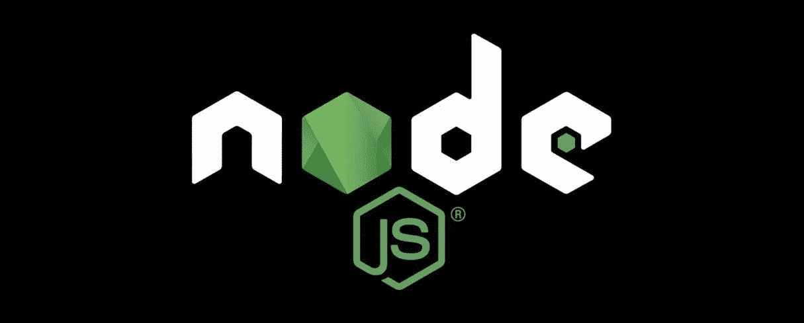

# Node.js 入门

> 原文：<https://levelup.gitconnected.com/getting-started-with-node-js-48397c5f3c52>

## 异步编程和 Node.js 世界简介



# Node.js 是什么？

Node.js 是一个跨平台的运行时环境，面向服务器端，开源，用 JavaScript 编写。或者简单地说，它是一个用 JavaScript 编写的用于 Web 服务器的平台。

web 服务器的一个常见任务是打开服务器上的文件并将内容返回给客户端。

下面是 PHP 或 ASP 处理文件请求的方式:

*   将任务发送到计算机的文件系统。
*   等待文件系统打开并读取文件。
*   将内容返回给客户端。
*   准备好处理下一个请求。

下面是 Node.js 处理文件请求的方式:

*   将任务发送到计算机的文件系统。
*   准备好处理下一个请求。
*   当文件系统打开并读取文件时，服务器将内容返回给客户端。

> Node.js 使用**异步编程**，我们将在适当的时候回到这个话题。

# 下载并安装 Node.js

安装 Node.js 非常容易。只需进入 [Node.js 网站](https://nodejs.org/en/download)，选择相应的 OS，按照指南操作即可。

要检查安装是否成功，请打开“终端”并检查版本，如下所示:

```
node -v
```

它应该会返回类似这样的结果

```
v13.7.0
```

> 注意:版本号可能不同

还要检查 npm 版本:

```
npm -v
```

它应该会返回类似这样的结果

```
6.13.6
```

> 注意:版本号可能不同

当我们安装 Node.js 时，npm(节点包管理器)随之而来。

# 探索 Node.js

Node.js 安装完成后，下一步是在终端中键入命令`node`。您可以在终端上运行 JavaScript 命令，如下所示:

或者通过创建一个 Javascript 文件如`test.js`进行测试，然后添加以下代码:

允许 Node 运行 JS 文件的命令是如下的`node FILENAME`:

```
node test.js
```

结果会是这样的

```
Hello, World!
Hi!
```

接下来，转到 Node.js 网站中的[指南部分](https://nodejs.org/en/docs/guides/getting-started-guide)，您将看到显示单词“Hello World”的示例代码，如下所示:

创建一个包含上述内容的名为 app.js 的文件，然后使用`node app.js`在命令行上运行它

访问 [http://localhost:3000](http://localhost:3000) 你会看到一条消息写着“Hello World”。

一些关键词的含义:

*   `require('http')` →导入 http 模块，这是 Node.js 的主模块
*   `createServer()` →使用参数请求和响应创建服务器
*   `.setHeader()` →指定内容类型
*   `.end()` →是回应的结尾和“Hello World”这个词
*   `.listen()` →设置网络服务器的端口和主机名(主机名可选)

# fs 模块的第一个项目

现在，让我们开始使用名为 fs(文件系统)的内置模块编写 Node.js 的过程。

我们将创建一个包含两个文件的项目文件夹，即:

*   `package.json` →指定项目名称、项目版本以及其他依赖项的文件。
*   `app.js` →代码将要写入的主文件。

文件`package.json`使用 JSON 格式，每次都强制指定名称和版本，其他值是可选的。例如:

```
// The contents of 'package.json'
{
  "name": "hello-node",
  "version": "0.0.1"
}
```

我们也可以使用`npm init`来创建`package.json`文件。

## 写文件

在`app.js`文件中，键入以下内容:

运行`node app.js`看到有一个用内容‘Hello node . js’创建的文件 **message.txt** 。

`fs.writeFile(filename, data, encoding, callback)` →将接受第一个参数作为文件名，第二个参数是要写入文件的信息，第三个参数是编码(默认为 *utf8* )，最后一个参数是回调函数(我们将在本文稍后讨论)。

当`file`是文件名时，将数据异步写入文件，替换已存在的文件。`data`可以是字符串，也可以是缓冲区。

当`file`是文件描述符时，行为类似于直接调用`fs.write()`(这是推荐的)。

如果`data`是一个缓冲器，则`encoding`选项被忽略。例如:

> 在同一个文件上多次使用`fs.writeFile()`而不等待回调是不安全的。对于这种情况，建议使用`fs.createWriteStream()`。有关更多信息，请参考文档。

## 读取文件

尝试通过添加一些文本来编辑 *message.txt* 文件，然后使用下面的示例来读取该文件:

`.readFile()`异步读取文件的全部内容。

回调被传递了两个参数`(err, data)`，其中`data`是文件的内容。

如果没有指定编码，则返回原始缓冲区。

如果`options`是一个字符串，那么它指定了编码:

```
fs.readFile('/etc/passwd', 'utf8', callback);
```

当路径是一个目录时，`fs.readFile()`和`fs.readFileSync()`的行为是特定于平台的。在 macOS、Linux 和 Windows 上，将返回一个错误。在 FreeBSD 上，将返回目录内容的表示。

> `*fs.readFile()*`函数缓冲整个文件。为了最大限度地降低内存成本，在可能的情况下，最好通过`*fs.createReadStream()*`进行流式传输。有关更多信息，请参考文档。

# 回调函数

你可能想知道什么是回调函数，为什么使用它，等等。

在我们定义回调之前，我们需要理解它们为什么存在。它们的存在是因为节点的异步特性。每个人都知道异步编程“更好”但“更难”。

好吧，最后那句话有点过于简单化了。

让我们更深入一点，比较同步和异步编写的代码。

你马上会注意到的是，异步版本是…丑陋的。看起来我们为了一点点收益，把事情变得不必要的复杂。

异步编程最好的一点是，当您的代码等待某件事情完成时(比如 API 调用或来自数据库的响应)，它可以做其他事情。

换句话说，当一个进程花费很长时间时，你的代码不会被阻塞。这就是 Node.js 被创建的主要原因:运行同步代码的服务器需要花费大量时间等待。

如果服务器能够在等待 I/O 的同时处理请求，事情就会做得更快。

对于异步编程来说，事情确实有点复杂，尤其是在您开始的时候，但是这并不是一个很难理解的概念，而且好处是值得的。

随着对“异步编程”和“非阻塞”等术语的更好理解，让我们来回答我们最初的问题。

> 回调只是一个函数，作为参数传递给另一个函数，当异步任务完成时，该函数将调用它。

这里有一个例子:

当`fs.readFile()`获取完文件`fileName`后，它执行回调函数，如果抛出错误，该函数将处理错误，并将获取的文件记录到控制台。

注意回调函数有两个参数:`err`和`data`。按照惯例，回调函数的第一个参数是一个错误。如果父函数抛出一个错误，它会在那里等待你去处理，如果没有抛出错误(有时会发生)，那么第一个参数应该是 null。

同样按照惯例，以下参数是响应数据。查找[错误优先回调](https://nodejs.org/api/errors.html#errors_error_first_callbacks)了解更多相关信息。

这一切都很好，但为什么不简单地将上面的内容写成这样:

```
let file = fs.readFile(fileName);
console.log("file: ", file);
```

简而言之，因为*异步*。在上面的例子中，当我们试图记录时，`file`将是未定义的，因为在我们到达`console.log()`之前，`fs.readFile()`不会完成获取。

但是，这个

```
let file = 1 + 1;
console.log("file: ", file);
```

会管用的。

对于只和同步编程打过交道的新人来说，感觉有点混乱；你过着充满爱和逻辑的幸福生活，突然，第 3 行可以在第 2 行之前执行？！为了确保万无一失，你应该随时随地使用回调吗？号码

回调是在我们不知道什么时候做什么的时候使用的。再一次，考虑类似 API 调用、从数据库获取数据或硬盘 I/O 的事情。所有这些都需要时间，所以我们希望在我们等待的事件完成时调用我们的回调。因此有了术语**事件驱动编程**。

如果你觉得你只是有点明白，不要感到孤独。就像生活中的许多事情一样，需要一点亲身经历才能得到。

在你获得实践经验之前，让我给你介绍下一个你将陷入的困境，叫做[回调地狱](http://callbackhell.com)。我让你自己想办法。

# 什么是 npm？

如前所述，npm(节点包管理器)是一个为我们管理节点包的向导。npm 包括一个 CLI(命令行客户端),可以用来为您的项目下载和安装开源库/包。这里有一个例子:

```
npm install PACKAGENAME
```

`PACKAGENAME`的包将被安装在当前目录下名为 *node_modules* 的文件夹中。你可以在 [npmjs](https://www.npmjs.com) 查看套餐。

# 结论

在本文中，我们了解了什么是 Node.js，它的功能是什么，如何使用它。我们还了解了什么是 npm，以及一些关于 http 和 fs 模块的基本知识。希望本文能为您的 Node.js 之旅提供一个良好的起点！

点击查看我的博客[。](https://the-minimalist.now.sh/)

我走了，~噗~！