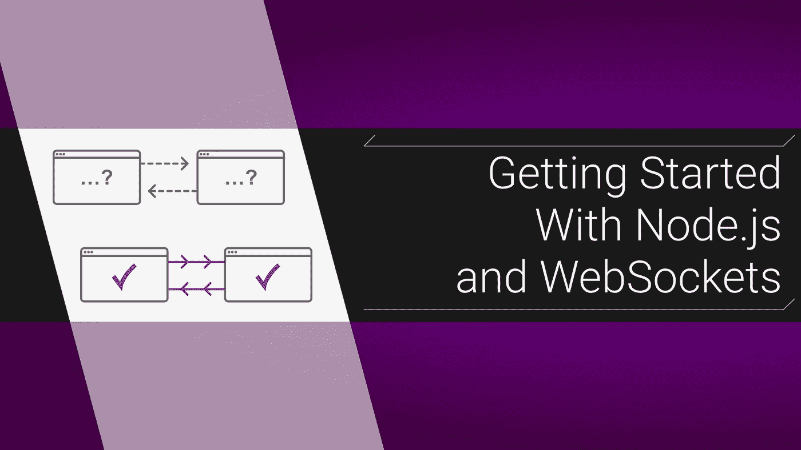
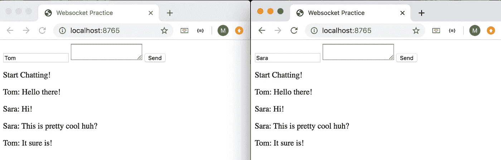

# Node.js 和 WebSockets 入门

> 原文：<https://levelup.gitconnected.com/getting-started-with-node-js-and-websockets-f22dd0452105>

## 让我们做一个聊天游乐场



WebSockets 是 http 的弟弟妹妹。它们让你保持一个*打开的*连接，以便实时更新。让我们创建一个简单的聊天室，只显示来自用户的消息。长话短说，除了实现之外，我就不多说了，所以如果你需要背景信息[看看这个解释](https://pusher.com/websockets)。

# 概观

我们打算做一个游乐场，让 2+标签在一个小聊天室相互交谈。



我们的两个标签实时地相互交流

我们将使用两个主文件:`server.js`和`index.html`。我们将使用一个 Express 服务器来提供我们的`index.html`文件，并且我们将使用`w[s](https://www.npmjs.com/package/ws)` [库](https://www.npmjs.com/package/ws)作为我们的第二个 WebSocket 服务器。此外，我们将在前端使用普通的 JS，因为 WebSockets 在现代浏览器中可用；React 之类的框架与之无关。

## 装置

在终端中，运行:

```
mk websockets
cd websockets
> server.js 
> index.html
npm init -y
npm i express ws nodemon
```

然后将 `“start”: “nodemon server.js”`添加到您的`package.json`脚本中。

# 创建我们的主服务器

它所做的只是主持我们的`index.html`:

```
*const* **express** = require('*express*');
*const* **path** = require('*path*');
*const* **app** = **express**();**app**.get('/', (**req**, **res**) => {
  **res**.sendFile(**path**.join(**__dirname**, '*index.html*'));
});*const* **port** = 8765;
**app**.listen(**port**, () => {
 ** console**.log(`*listening* [*http://localhost:*${**port**}](http://localhost:${port}`))[`)](http://localhost:${port}`));
});
```

请记住，我们最终的 WebSockets 服务器将与我们的主要服务器*不同*。如果这是一个真实的项目，我们的 API、路线和资产都将放在这个服务器中。我们将很快到达套接字服务器，但是让我们开始我们的`index.html`文件:

```
<!DOCTYPE **html**>
<**html** lang="*en*">
  <**title**>Websocket Practice</**title**>
</**head**>
<**body**>
  <**input** id="*name*"/>
  <**textarea** id="*message*" ></**textarea**>
  <**button**>Send</**button**>
  <**div** id='*messages*'></**div**>
</**body**>
</**html**>
```

稍后我们将添加一个`<script>`标签，但是现在我们可以做`npm start`并看到我们的页面已经启动并运行了。

# 创建 WebSocket 服务器

首先，让我们处理我们的前端客户端建立连接。回到我们的`server.js`文件，把这个扔进去:

```
*const* **express** = **require**('*express*');
*const* **path** = require('*path*');
*const* **WebSocket** = **require**('*ws*'); // new
*const* **app** = **express**();***// express code****const* **socketServer** = *new* **WebSocket**.Server({port: 3030});**socketServer**.on('connection', (**socketClient**) => {
  **console**.log('*connected*');
  **console**.log('*client Set length:* ', **socketServer**.clients.size); **socketClient**.on('*close*', (**socketClient**) => {
    **console**.log('*closed*');
    **console**.log('*Number of clients:* ', **socketServer**.clients.size);
  });
});
```

我们正在做的是在端口`3030`上设置我们的WebSocket 服务器。当一个前端客户端访问这个服务器并打开一个稳定的连接时，触发`connection`事件。目前，我们的 WebSocket 服务器所做的只是记录“连接”，然后告诉我们当前有多少客户端对象连接到它。另外，注意，`clients`属性是一个[集合](https://developer.mozilla.org/en-US/docs/Web/JavaScript/Reference/Global_Objects/Set)，*不是*数组。

## 关闭连接

我们还将在每次客户端连接关闭时记录日志。这通常发生在浏览器关闭或刷新时。这里需要注意的重要一点是，客户机方法嵌套在初始服务器连接事件的内部。WebSockets 是开放的连接，因此处理客户端的方法(即连接)应该是嵌套的。

# 从客户端连接

设置好套接字服务器后，我们需要构建我们的客户机。由于这个项目非常简单，我将把 JS 放在我们的`index.html`文件的脚本标签中:

```
...
<**div** id='*messages*'></**div**>
<**script**>*const* **ws** = *new* **WebSocket**('*ws://localhost:3030*');
**ws**.onopen = () => { 
  **console**.log('*Now connected*'); 
};</**script**>
</**body**>
...
```

`new WebSocket(url)`部分正在启动与我们的 socket 服务器的连接。最需要注意的是，我们的 url 使用的是`ws`协议，而不是`http`(在现实世界中，总是使用[安全的](https://www.freecodecamp.org/news/how-to-secure-your-websocket-connections-d0be0996c556/) `[wss](https://www.freecodecamp.org/news/how-to-secure-your-websocket-connections-d0be0996c556/)`)。通过这个连接，我们将一个方法分配给它的`onopen`方法，当一个连接成功打开时，这个方法被触发。

## 测试它

让我们运行`npm start`并在两个选项卡中打开 [http://localhost:8765](http://localhost:8765/) 。在我们的节点控制台中，我们会看到它将客户端数量记录为`2`。尝试刷新选项卡。客户端将被关闭并重新打开，但不会再添加任何内容。添加更多客户端的唯一方法是在更多选项卡中访问 url。

# 从服务器获取和发送消息

这里的想法是，每个前端客户端将它们的消息发送到服务器，然后服务器将消息发送回所有客户端。把它想象成一个中继系统。我们还将把这些消息“保存”到一个数组中，这样任何新连接的客户端都可以看到以前发送的消息。

**我们只发送连接事件的整个消息数组，否则我们只发送单个消息:**

```
// ...
*const* **socketServer** = *new* **WebSocket**.Server({port: 3030});const **messages** = ['Start Chatting!'];**socketServer**.on('connection', (**socketClient**) => {
 ** console**.log('*connected*');
 **console**.log('*Number of clients:* ', **socketServer**.clients.size);
 **socketClient**.send(**JSON**.stringify(**messages**));

 **socketClient**.on('*message*', (**message**) => {
 **messages**.push(**message**);
 **socketServer**.clients.forEach((**client**) => {
      *if* (**client**.readyState === **WebSocket**.OPEN) {
        **client**.send(**JSON.**stringify([**message**]));
      }
    });
  }); **socketClient**.on('*close*', (**socketClient**) => {
// ...
```

这里的主要内容是我们在`socketClient`上收听的新事件`message`。每当服务器*收到来自客户端的消息*时，该事件就会被触发。如前所述，我们希望从一个客户端到达服务器的每条消息都被发送到所有客户端。这就是为什么我们要遍历`socketServer.clients`集合，并使用`send`方法向每个集合发送消息。我们还确保连接也是开放的。

# 从客户端获取和发送消息

用这个编辑`index.html`:

```
...
<**button** onClick="fire()">Send</**button**>
<**div** id="*messages"*></**div**><**script**>
*const* **getElement** = (**id**) => **document**.getElementById(**id**);*const* **addMessage** = (**message**) => {
  const **pTag** = **document**.createElement('*p*');
  **pTag.**appendChild(**document**.createTextNode(**message**));
  **getElement**('*messages*').appendChild(**pTag**);
};const **ws** = new **WebSocket**('*ws://localhost:3030*');**ws**.onopen = () => { 
  **console**.log(*'Now connected*'); 
};**ws**.onmessage = (**event**) => {
  *const* **messages** = **JSON**.parse(**event**.data);
  **messages**.forEach(**addMessage**);
};const **fire** = () => {
  const **username** = **getElement**('name').value || '*???*'
 ** ws**.send(`${**username**}: ${**getElement**('message').value}`);
  **getElement**('message').value = '';
};</**script**>
```

前两个新方法是帮助器:`getElement`是 document.getElementById 的别名，`addMessage`处理向`<p>`标签添加消息。关键的方法是`onmessage`和`fire`。

## onmessage

这是 WebSocket 函数，当我们的客户端*从服务器接收到*一条新消息时就会触发这个函数。**这就是我们的页面自动更新的方式**，它是我们的监听器。我们所做的就是深入到`event`对象和 JSON 解析数据。现在，在我们的例子中，我们在一个数组中发送数据，这就是我们使用`forEach`的原因，但是你不必像那样发送数据。

## 火

神奇之处在第二行，`ws.send(string)`，这是将我们的字符串数据发送到服务器的套接字方法。其他部分只是从表单中获取值并清理我们的输入(别忘了给按钮添加这个方法)。

# 开始玩吧！

你完了！你已经有足够的代码来真正开始学习了。添加日志，玩参数，[读一些文档](https://developer.mozilla.org/en-US/docs/Web/API/WebSockets_API)。开始探索，玩得开心！

大家编码快乐，

麦克风