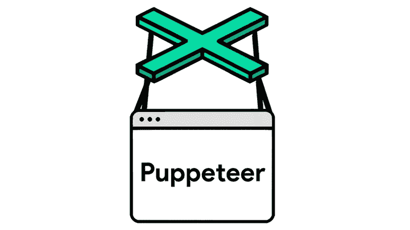
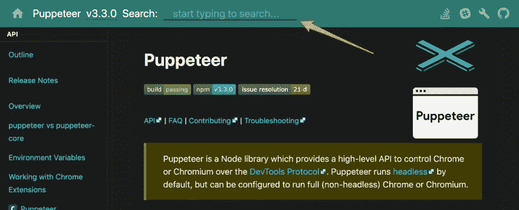

# 木偶师入门

> 原文：<https://levelup.gitconnected.com/getting-started-with-puppeteer-24fc44f0a637>


木偶师可能是目前最有名的无头浏览器自动化库。它提供了一个高级 Node.js API，允许您启动 Chrome 或 Chrome 浏览器实例并向其发送命令。事实证明，它易于安装，使用简单，性能良好。



# 一些背景故事📖

木偶师的工作方式是在 [DevTools 协议](https://chromedevtools.github.io/devtools-protocol/)之上提供一个薄薄的层。

DevTools 协议赋予你在浏览器的“检查元素”工具栏中做所有酷事情的能力。实际上这个协议和大多数基于眨眼的浏览器 *(Chrome，Chromium 等)是一样的。)*提供用于 DOM 检查、网络剖析、调试和所有其他我们可以使用的酷功能的工具。
*在《木偶师》中，你可以做几乎任何你能在实际浏览器中做的事情，不包括黑客。*

木偶师属于谷歌 Chrome 旗下，具体由 Chrome DevTools 团队维护。这个事实本身就应该让你对项目的长期可持续性有一些信心。此外，它保证与 Chromium/Chrome 浏览器中的最新功能保持同步。你通常不必等待一个特性被移植到库中。

所以让我们开始吧！👷

# 去图书馆

最初确保你在一台安装了 Node.js > =v10.18.1 的机器上，这样我们就可以使用最新的木偶版本。

创建一个名为**木偶师-示例**的新项目文件夹，这样我们就可以开始整个过程了。

```
mkdir puppeteer-example
  cd puppeteer-example
```

现在我们可以开始引导所需的 Node.js 设置。

```
npm init -y
```

这样你就可以安装你喜欢的库了，比如[左键盘](https://www.npmjs.com/package/left-pad)或者[浏览器重定向](https://www.npmjs.com/package/browser-redirect)，但是你现在可以跳过它😂。回到我们的目标:

```
npm install puppeteer@3
```

在安装库的时候，你可能会在你的控制台上看到一条消息，说*正在下载 Chromium xxx* 。这条消息是为了让您知道，通过 puppet er 库，还下载了针对您的操作系统的特定版本的 Chromium(在 node_modules 中的*),供您的 puppet er 安装使用。原因是每一个木偶版本**只能保证**与捆绑的特定 Chromium 版本一起工作。特别提示:如果您的磁盘空间有限，那么在您完成之后，从您的测试或未使用的木偶项目中删除 node_modules 目录。*

# 初次相遇🤞

我们完成了安装，现在可以开始写代码了。您可能会惊讶于几行代码能做多少事情。

对于我们的第一个任务，我们将尝试探索官方木偶网站 https://pptr.dev/。
创建一个测试文件`index.js`，内容如下:

```
const puppeteer = require("puppeteer");(async function () {
  const browser = await puppeteer.launch({ headless: false }); // We use this option to go into non-headless mode
  const page = await browser.newPage(); // Create a new page instance
  await page.goto("https://pptr.dev"); // Navigate to the pptr.dev website await page.waitFor(5000); // Wait for 5 seconds to see the beautiful site
  await browser.close(); // Close the browser
})();
```

现在，通过使用`node test.js`运行这段代码，您将看到 Chromium 实例启动并导航到 pptr.dev 网站 5 秒钟，然后关闭。

我确信，对于 web 自动化爱好者来说，这是一个舒适的地方。唯一缺少的组件是您需要运行的场景，以及对 Puppeteer 宣传的直观而简单的 API 的感受。

为什么不看一看呢？

# 探索一个简单的场景🕵

跳过客套话，我们的目标是探索 pptr.dev 网站为我们提供的自动完成搜索功能。



# 大声思考

所以让我们开始描述一个*实际用户*需要做什么来获得这个自动完成特性以达到它的目的。

我们期望用户:
**1。**打开
页面 **2。**尝试查找自动完成搜索
**3。**为他正在寻找的 API 方法键入他的查询
4。点击列表中最相关的结果
5。期待看到他选择的商品的部分

为了测试木偶师 API 是否像它声称的那样直观，我们可以继续将这种想法转化为木偶师命令。

```
/* Somewhere else... */
const Homepage = {
  autocompleteSearchInput: "input[type='search']",
};
const apiSearchTerm = "metrics"; // The API method we are looking for
/* ... */await page.goto("https://pptr.dev");
await page.waitForSelector(Homepage.autocompleteSearchInput);
await page.type(Homepage.autocompleteSearchInput, apiSearchTerm);
await page.click("search-item");// Find the API name using XPath
const $apiMethod = await page.$x(
  "//api-method-name[text()='" + apiSearchTerm + "']"
)[0];// Check if this method name section is actually visible on the viewport
const isApiMethodVisible = await $apiMethod.isIntersectingViewport();assert.equal(isApiMethodVisible, true);
```

好吧，就这样了！🎉上面的代码，也包含一些内务处理，在我看来，基于我们设计的思考过程，看起来相当简单，我甚至不认为我需要解释大多数命令的作用。该 API 成功地翻译成清晰的语言，而不依赖于其他外部抽象。

我们可以考虑的一点是用于检测我们正在寻找的 API 方法是否确实在浏览器视窗中的命令组合。在这个领域有经验的人知道，要断言这个事实，你要么创建你自己的定制命令(*进行视口尺寸计算*)要么依赖一个已经为我们实现的框架命令。

与众不同的是，我们直接从木偶师那里得到的命令被认为是最可靠的，因为它是由平台本身提供的。

# 少了一两件东西🙈

在我们都同意 API 相当直观且易于使用之后，我们可以回顾并提及一些在使我们的开发体验变得更好方面似乎“缺失”的东西。

## 1)用关键字`async`填充你的代码

正如你肯定观察到的，有这个 *async* 关键字，你必须把它撒在你的代码中，至少对我来说感觉有点吵。这个关键字是必需的，因为浏览器 API 具有事件驱动的特性。用 JavaScript 围绕异步和事件驱动平台编码的方法是使用[承诺](https://developer.mozilla.org/en-US/docs/Web/JavaScript/Reference/Global_Objects/Promise)来建模你的操作，而 Puppeteer 已经做到了这一点。

为了减轻处理这些异步操作的痛苦，JavaScript 在语言语法中添加了一些新的关键字。这些关键字是你在我们的代码上看到的[异步&等待](https://developer.mozilla.org/en-US/docs/Web/JavaScript/Reference/Statements/async_function)。因为 Puppeteer 的 API 需要使用承诺，所以我们编写代码的最佳方式是对大多数命令使用这种 *async/await* 语法。

## 2)尚无可用的链接

由于一些设计决策和库的性质，正如我们在上面提到的，目前还不支持我们所谓的*方法链接*。有了这种能力，我们的代码阅读起来会更加流畅。想象一下:

```
await page.$("input[type='search']").click().type("metrics").submit();
```

我不能保证，但我认为有一些第三方库解决方案可以尝试。如果你想了解一下状态和可能的外部解决方案，你可以从查看一个相关的 GitHub [问题](https://github.com/puppeteer/puppeteer/issues/928)开始。

# 关闭

您刚刚快速地了解了如何设置 Puppeteer 并为自动完成搜索编写了一个简单的场景。从现在开始，你只能靠你自己了，除了所有将出现在 Web 自动化之家的菜谱。

我的建议是开始在你自己的用例上做实验，作为睡前故事，在 GitHub 上浏览详细的 API 文档。几乎可以肯定的是，您会发现一些意想不到的事情。

*十字贴来自*[*Web 自动化之家*](https://www.thehomeofwebautomation.com/getting-started-puppeteer/)

*照片来自* [*凯文·Ku*](https://www.pexels.com/el-gr/@kevin-ku-92347?utm_content=attributionCopyText&utm_medium=referral&utm_source=pexels)*at*[*Pexels*](https://www.pexels.com/el-gr/photo/ai-macro-577585/?utm_content=attributionCopyText&utm_medium=referral&utm_source=pexels)