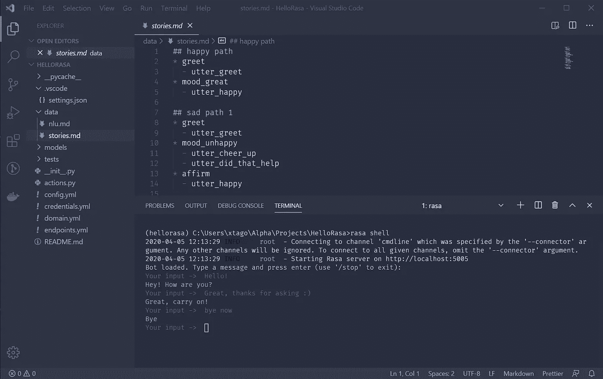

# 使用 VS 代码在 Windows 上开始使用 Rasa

> 原文：<https://levelup.gitconnected.com/getting-started-with-rasa-on-windows-with-vs-code-966d06520bbb>

Rasa 是一个用于对话式人工智能的开源系统。本教程概述了如何使用 Visual Studio 代码在 Windows 上入门。



# 这个教程适合你吗？

安装和初始化 Rasa 有更简单的方法。例如，我在 Docker-Compose 上取得了很大的成功——它又快又简单。然而，Docker Desktop for Windows 要求启用 Hyper-V 功能，这对于在同一台机器上使用 VirtualBox 的任何人来说都是不允许的，尽管在 VirtualBox 内部使用 Docker 确实可以工作，但它阻止了您使用主机的专用 GPU 通过 Tensorflow 进行模型训练。

如果你和我一样处于 Docker/Hyper-V/VirtualBox 的困境，本教程提供了一个不需要 Docker 的替代方案。如果你不使用 VirtualBox，Docker 在你的主机上运行良好，你可能不需要这个教程。在这种情况下，我推荐 Rasa 的安装文档:

[](https://rasa.com/docs/rasa/user-guide/installation/) [## 装置

### Rasa 大师班的新剧集现已推出！观看现在✕你可以安装 Rasa 开源使用画中画(需要…

rasa.com](https://rasa.com/docs/rasa/user-guide/installation/) [](https://rasa.com/docs/rasa/user-guide/docker/building-in-docker/) [## 在 Docker 中构建 Rasa 助手

### 所有图像标签都以版本号开头。当前版本是 1.9.5。这些标签是:{版本}-完整标签包括…

rasa.com](https://rasa.com/docs/rasa/user-guide/docker/building-in-docker/) 

# 步骤概述

1.  用 MiniConda 安装 Python
2.  为我们的 Rasa 项目创建一个虚拟环境
3.  配置 Visual Studio 代码以使用虚拟环境
4.  初始化新的 Rasa 项目并训练默认模型

# 1.用 MiniConda 安装 Python

为 Windows 安装 MiniConda。这将包括 Python 和 Pip。下载可以在这里找到:

https://docs.conda.io/en/latest/miniconda.html

Rasa 需要 Python 3，与 Python 2 不兼容，因此下载 Python 3.7 的安装程序并完成设置过程。如果安装程序给出了覆盖系统路径变量的选项，我建议不要这样做，尤其是如果您已经安装了系统 Python。在这种情况下，MiniConda 会将事情分开，所以没有必要覆盖 PATH 变量，在下面的部分中，我们将确保 VS 代码使用的是 Python 及其包的正确版本。

Python 3.8 在我写作的时候是可用的，但是它的依赖项(特别是 Tensorflow)不会为我安装，除非我使用 Python 3.7。这是我用 MiniConda 安装 Python 3.7 的主要原因。您的里程可能会有所不同。

# 2.创建虚拟环境

安装 MiniConda 后，我们可以为 Rasa 项目创建一个虚拟环境，这将有助于保持 Python 包的包含和版本的约束。这比全局安装包更可取。

在 Windows 开始菜单中搜索“Anaconda 提示符”。该名称可能看起来像“Anaconda Prompt (miniconda3)”。运行它，这将打开一个命令提示符。在命令行中，运行以下命令:

*   `conda create -n hellorasa python=3.7`
*   `conda activate hellorasa`
*   `pip install rasa`

这些命令将分别创建一个名为“hellorasa”的新虚拟环境，为当前控制台会话激活该环境，然后安装 rasa。

您可以通过运行以下命令来确认安装:

`rasa --version`

如果它输出 Rasa 版本，则安装成功。请随意关闭 Anaconda 提示符，因为我们将配置 Visual Studio 代码来使用这种环境，这将允许您从 ide 内部运行集成终端，而不是使用 Anaconda 提示符。

# 3.配置 Visual Studio 代码

如果您还没有安装 Visual Studio 代码，可以从以下位置下载:

[https://code.visualstudio.com/Download](https://code.visualstudio.com/Download)

让我们为 Python 配置 VS 代码设置。首先，安装来自微软的 Python 扩展:

[](https://marketplace.visualstudio.com/items?itemName=ms-python.python) [## 计算机编程语言

### 一个对 Python 语言有丰富支持的 Visual Studio 代码扩展(对于所有积极支持的版本…

marketplace.visualstudio.com](https://marketplace.visualstudio.com/items?itemName=ms-python.python) 

也可以按 Ctrl+Shift+X 打开扩展模块窗口，然后搜索 Python。安装扩展后重启 VS 代码。

接下来，在计算机上创建一个新的空文件夹，并在 VS 代码中打开它。我叫我的“HelloRasa”，但你可以叫它任何东西。我们将使用这个文件夹来包含 Rasa 项目文件以及一些 VS 代码设置来为 Python 设置路径。

在 VS 代码中打开文件夹，按 Ctrl+Shift+P，输入“Python: Select Interpreter”。这应该会提示您一个可供选择的解释器列表。选择一个与您用 Conda 配置的虚拟环境相匹配的，应该是这样的:

`Python 3.7.7 64-bit ('hellorasa': conda)`

这将在当前文件夹中名为`.vscode/settings.json`的文件中配置 Python 路径。打开该文件，因为我们需要添加一些设置来使终端工作。

编辑`.vscode/settings.json`设置这三个选项:

。vscode/settings.json

您可能需要将“%HOMEPATH%\\miniconda3”的实例替换为 miniconda 安装的实际路径，并且可能需要将`hellorasa`替换为您为虚拟环境选择的名称。

再次重启 VS 代码以应用这些更改。现在，您应该能够使用 Ctrl+Shift+`(Ctrl+Shift-back tick)从 VS 代码运行终端了，这样做会自动激活虚拟环境。

要验证这是否有效，请在该终端窗口中运行以下命令:

*   `python --version`
*   `conda --version`
*   `rasa --version`

# 4.初始化 Rasa

现在已经安装了 Python 和 Rasa，是时候创建一个 Rasa 项目了。确保您的“HelloRasa”文件夹在 VS 代码中打开，打开一个终端，并运行:

```
rasa init
```

就是这样！`init`命令将交互式地提示您几个问题。如果你愿意，你可以运行`rasa init --no-prompt`,它将使用默认设置。

从现在开始，您将能够使用任何其他 Rasa 命令，例如:

*   `rasa train`训练你的模型
*   `rasa shell`和你的 Rasa 机器人说话

如果您不熟悉如何定制 Rasa，下一步很好的做法是遵循他们出色的文档:

[](https://rasa.com/docs/) [## Rasa 文档

### 没有人

rasa.com](https://rasa.com/docs/) 

黑客快乐！