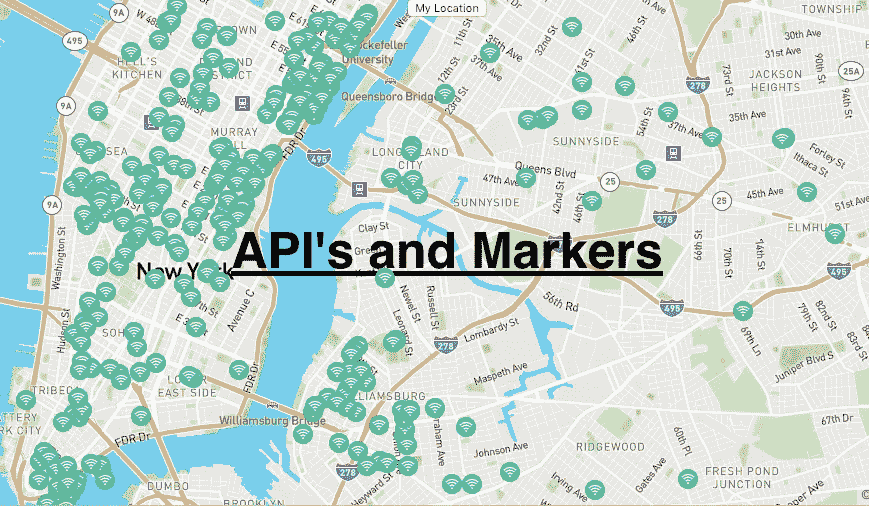
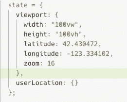
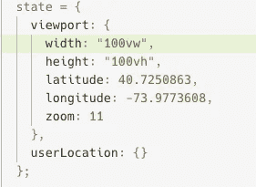
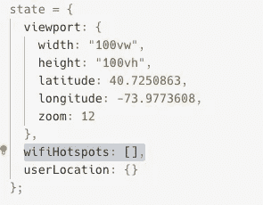
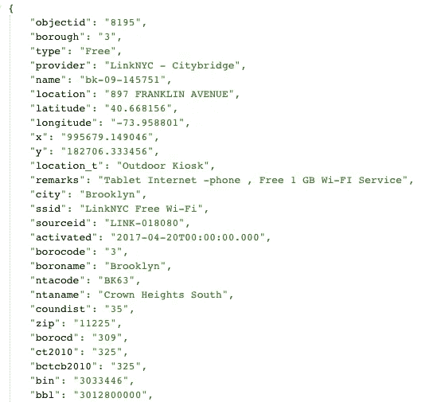
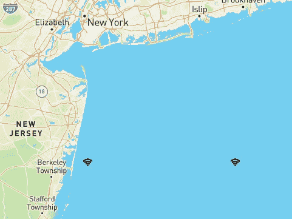
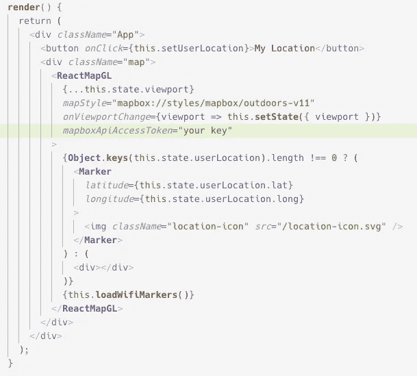
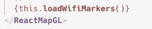
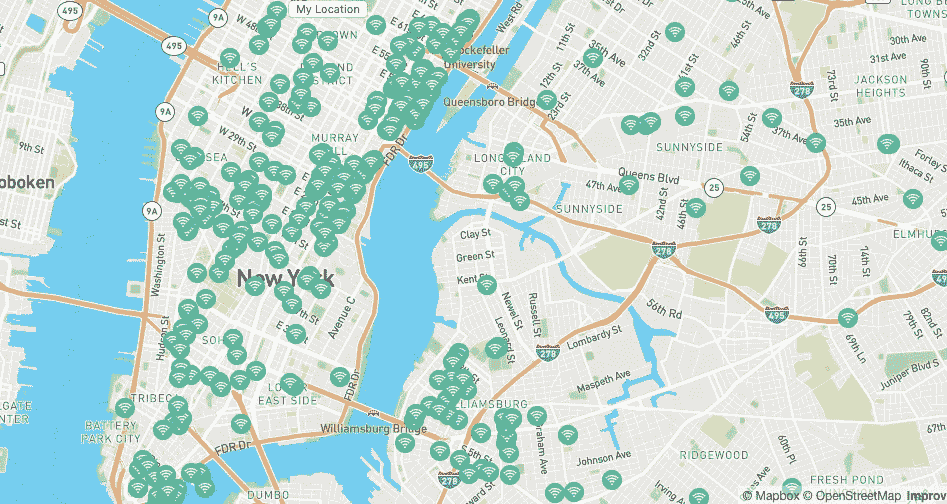

# React 和 MapBox GL JS 入门:从 API 设置地图标记。

> 原文：<https://levelup.gitconnected.com/getting-started-with-react-and-mapbox-gl-js-setting-map-markers-from-an-api-513c2570c6f3>

# 首先:

同样，如果你还没有阅读其他的“React 和 MapBox 入门”文章，我推荐它，这样我们就可以在同一页上了。虽然这不是必须的，但是你应该能够理解我在做什么，即使你没有跟上所有的教程。

【React MapBox GL JS 入门，

[MapBox GL JS 入门:带地理定位的用户位置](https://medium.com/better-programming/getting-started-with-mapbox-gl-js-user-location-with-geolocation-f32c3e323526)和

【React 和 MapBox GL JS 入门:带标记组件的用户位置标记。

# 目标:从传入的 API 设置标记。

它看起来会像这样，但是没有文本。



这也不会太难。如果你是按照以前的文章，我们需要做的就是删除一些功能，这样我们就不会在俄勒冈州开始每一次重新渲染(即使它很漂亮)。然后，我们将从我们的 API 在地图上渲染标记。

# 我们需要什么:

1.  如果你打算使用和我一样的 API，那么我们应该将我们的起始位置重置为 NYC。如果你使用你自己的 API，那么设置你自己的起始坐标并确保 API 有经度和纬度。
2.  我用的是纽约的 Wifi 热点定位 API。([链接到 API](https://data.cityofnewyork.us/resource/yjub-udmw.json) )。
3.  标记组件和图标。
4.  一些好的老式编码。

# 重置起始位置:

同样，如果您使用自己的 API，您可能应该使用该位置区域作为起点。否则，每次重新渲染时，我们都将在俄勒冈州(美丽的地方)，并且必须点击“我的位置”，这很烦人，所以让我们将“我的位置”设置为我们的 API。

现在我们改变我们的纬度，经度，从这里开始放大:



对此:



现在我们在纽约了！

# 状态中的站 API:

我们需要从端点获取 API，并将数据保存到 state，以便我们可以使用它。

用空数组的值在状态中添加`wifiHotspots`键:



现在编写一个 fetch 函数来保存 state 中的站点数据，我们可以用我们的`componentDidMount`生命周期方法加载它。像这样。

```
**componentDidMount**() {
  this.**fetchStationAPI**();
}**fetchStationAPI** = () => {
  **fetch**(`https://data.cityofnewyork.us/resource/yjub-udmw.json`)
  .**then**(res => res.**json**())
  .**then**(hotspots => {
     this.**setState**({
        wifiHotspots: hotspots
     });
   });
};
```

现在我们有 1000 个数据点。那太多了。

# 独家免费 Wifi:

1000 个数据点很多。Wifi 要么免费，要么受限(根据 API)。你可以在我们的一个 hotSpot 对象中看到一个“type”键，它告诉你它是免费的还是受限的。以及许多其他有趣的信息。



我已经决定我只想要免费的 wifi 点。你可以做任何你想做的事。它只会把我们的数据减少 300 个点。所以我写了一个过滤函数，将状态设置为只免费 wifi。

```
**filterFreeWifi** = hotspots => {
    return hotspots.**filter**(spot => {
        return spot.type === "Free";
     });
};
```

然后在我们的 API fetch 中调用它，并将 state 设置为输出。所以现在我们的获取看起来像这样。

```
**fetchStationAPI** = () => {
  **fetch**("https://data.cityofnewyork.us/resource/yjub-udmw.json")
  .**then**(res => res.**json**())
  .**then**(hotspots => {
     let freeWifi = this.**filterFreeWifi**(hotspots);
     this.**setState**({
       wifiHotspots: freeWifi
      });
  });
};
```

免费 WIFI！！！

# 为每个对象加载标记:

所以现在我们的状态拥有一个对象数组。每个对象都包含一堆有趣的数据，其中最重要的是纬度和经度。这些是`Marker`组件所需要的(还记得上一个教程吗？).这意味着我们只需映射状态，对于每个对象，我们返回一个标记组件，将 lat 和 long 设置为对象 lat 和 long。

我在这里使用来自[的 Wifi 图像 SVG(它在我们的公共文件夹中)。并将该图像导入我们的`Marker`。](https://www.flaticon.com/free-icon/wifi_262359#term=wifi&page=6&position=90)

作者署名为图标: ***图标由***[***S***](https://www.freepik.com/home)*[*【www.flaticon.com*](http://www.flaticon.com/)*制成。**

```
***loadWifiMarkers** = () => {
  return this.state.wifiHotspots.**map**(spot => {
    return (
      <**Marker** *key*={spot.objectid}
         *latitude*={**parseFloat**(spot.latitude)}
         *longitude*={**parseFloat**(spot.longitude)}
      >
        
      </**Marker**>
    );
  });
};*
```

# *语法分析浮动:*

*您会注意到我们的对象中的纬度和经度值是字符串。当我试图将纬度和经度设置为字符串时，我注意到了这一点，但它不起作用。*

*所以我用`**parseInt**`把它们转换成整数。结果是这样的。*

**

*然后，我花了很长时间试图弄清楚为什么我的免费 wifi 试图航行到佛罗里达州。为什么只有两个马克笔？它们为什么会在海里？免费无线网的奇怪位置。*

*你看纬度和经度都是巨大的小数(`40.7250863`，在这个小数上调用`**parseInt**`，就变成了`41`。它会自动向上或向下舍入。*

*我花了 3 个小时才算出这两个标记实际上是 1000 个向上或向下舍入到整数的标记。我非常沮丧，写了一篇可怕的文章,关于从编码中休息一下。只有一个人看过，不推荐。*

*这就是为什么我们用`parseFloat("40.7250863")`，也就是`40.7250863`。*

# ***加载标记:***

*现在我们只是在 ReactMapGL 组件中调用这些标记。*

**

*这个小家伙负责这项工作。*

**

*现在我们有了这个。*

**

# *结论:*

*所以现在我们从一个 API 端点动态呈现标记组件！还不错。现在我们都对 MapBoxGL JS 有了很好的基本了解。*

# *接下来:*

*我们将使我们的 Wifi 图标具有交互性。所以当你点击其中一个，你会看到每个物体的一些有趣的细节。*

*谢谢你忠实的读者！*