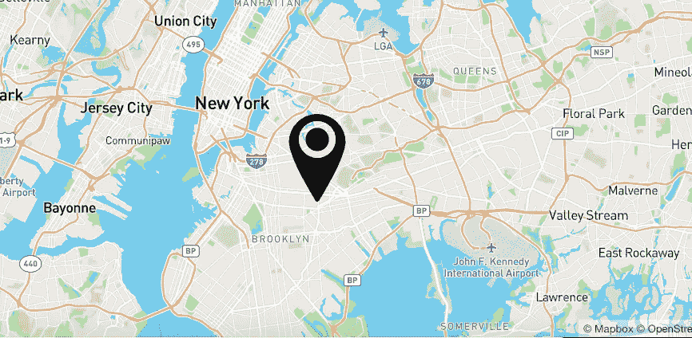
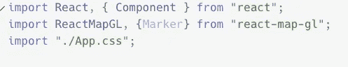
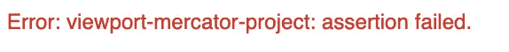
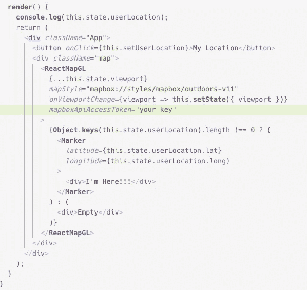
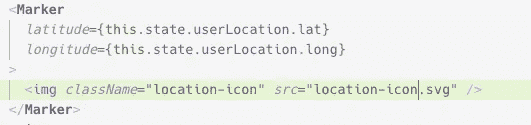
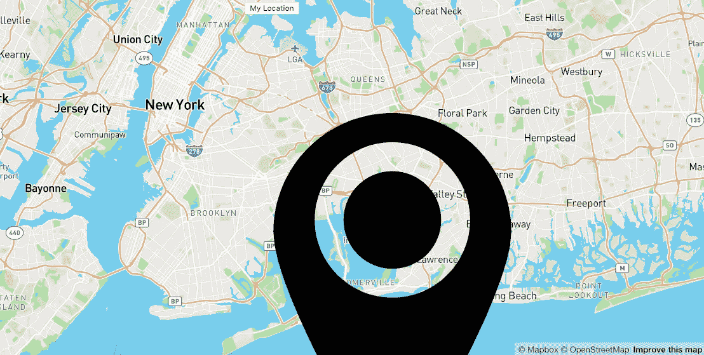
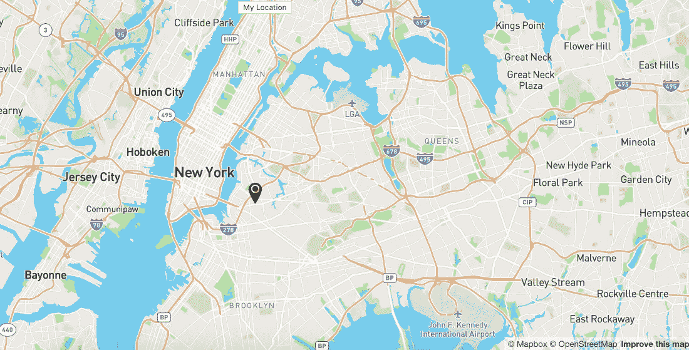

# React 和 MapBox GL JS 入门:带有标记组件的用户位置标记

> 原文：<https://levelup.gitconnected.com/getting-started-with-react-and-mapbox-gl-js-user-location-marker-with-marker-component-716a3f1abf83>

# 首先:

如果你没有读过其他的文章，你可能会有点迷失，或者你可以让自己成为一个高手。但是，如果你想跟着我一起走，回去跟着我的其他文章，这样你就可以和我们在一起了！

否则，带走你想要的任何信息，祝你好运！

[React MapBox GL JS](https://medium.com/swlh/getting-started-with-react-and-mapbox-gl-js-daa96477dd2c)*和*入门

[MapBox GL JS 入门:带地理定位的用户位置](https://medium.com/better-programming/getting-started-with-mapbox-gl-js-user-location-with-geolocation-f32c3e323526)

# 目标:设置地图标记

我们会做到这一点。但没那么戏剧化。



这将相当容易。我们会简单地在你的位置上做个标记。

在以后的文章中，我将从 API 中加载一些标记。

# 我们需要什么:

所以现在只要按一下按钮，我们的地图就会加载我们的位置。我们将使用该信息在地图上我们的位置设置一个标记。

1.  标记组件
2.  在状态下创建`userLocation`对象
3.  某种标记图标

# 标记组件:

好了，所以这个组件是 ReactMapGL 库的一个特性，所以我们要做的就是导入它。

```
import ReactMapGL, { Marker } from "react-map-gl";
```

现在我们的导入部分看起来像这样。



# **状态中的用户位置:**

注意:我们需要给我们的状态添加一个`userLocation`。我们将标记设置为这个值。**我们不能使用已经存在于我们** `**viewport**` **对象中的纬度和经度的原因是，每当你调整地图时，这个值总是在变化。**

如果我们这样做了，那么我们的标记将只是停留在我们的地图上，而不是在用户与它交互时保持固定。

所以我们需要将它添加到我们的状态中，然后在`setUserLocation`中添加`setState`。

```
state = {
  viewport: {
     width: "100vw",
     height: "100vh",
     latitude: 42.430472,
     longitude: -123.334102,
     zoom: 16
   },
  userLocation: {}
};
```

在我们的`setUserLocation`函数中，我们将`userLocation`设置为点击按钮时的位置。在我们的`render()`下用`console.log(this.state.userLocation)`测试一下。

```
**setUserLocation** = () => {
  navigator.geolocation.**getCurrentPosition**(position => {
     let setUserLocation = {
         lat: position.coords.latitude,
         long: position.coords.longitude
      };
     let newViewport = {
        height: "100vh",
        width: "100vw",
        latitude: position.coords.latitude,
        longitude: position.coords.longitude,
        zoom: 10
      };
      this.**setState**({
        viewport: newViewport,
        userLocation: setUserLocation
     });
  });
};
```

这是一个很大的函数，但是很容易阅读。因此，这将在单击按钮时将我们的`userLocation`状态对象设置为我们的当前位置。

# 使用标记组件:

现在我们需要使用我们导入的`Marker`组件。我们把它放在我们的`ReactMapGL`组件之间。

```
<**ReactMapGL** {...this.state.viewport}
  *mapStyle*="mapbox://styles/mapbox/outdoors-v11"
  *onViewportChange*={viewport => this.**setState**({ viewport })}
  *mapboxApiAccessToken*="your token"
>
  <**Marker**>I'm Here!!!</**Marker**>
</**ReactMapGL**>
```

如果你重新加载地图，你会看到这个错误。



这个错误烂透了。它让我在一个不相关的问题上耽搁了一会儿。

我们需要的是在组件中设置`latitudes`和`longitudes`。就这样。

```
<**Marker** *latitude*={this.state.viewport.latitude}
  *longitude*={this.state.viewport.longitude}
>
  I'm Here!!!
</**Marker**>
```

现在我们的标记出现了。但不是在正确的位置。这是因为我们将纬度和经度设置为错误的值。这就是可信条件的用武之地。

因为我们从远离我们的位置(俄勒冈州)开始我们的地图，我们不希望我们的`Marker`组件做任何事情，除非我们点击“我的位置”，所以我们需要设置一个条件来处理它。

像这样。

```
// this goes between our ReactMapGL component
{**Object**.**keys**(this.state.userLocation).length !== 0 ? (
  <**Marker** *latitude*={this.state.userLocation.lat}
    *longitude*={this.state.userLocation.long}
  >
    <div>I'm Here!!!</div>
  </**Marker**>
) : ( 
   <div>Empty</div>
)}
```

所以现在我们的`render`长这样。



装上子弹！那是你！

你可以把它拖来拖去,“我在这里”就不动了！

# 添加图标:

去下载一个你想用的图标。出于演示的目的，我刚刚使用了来自 Google 的一个。我选择了这个[图标](https://www.google.com/search?q=location+icon+vector+file&source=lnms&tbm=isch&sa=X&ved=0ahUKEwi4gumLoKvkAhUkWN8KHVcGC4sQ_AUIESgB&biw=1366&bih=512#imgrc=ACuZxk4-eK-ufM:)。

将此添加到您的公共文件中，命名为`location-icon`。删除“我在这里！！!"div 的，并让我们的`src`属性指向我们的图标。

现在我们的`Marker`组件看起来像这样。



现在，当我们点击应用程序上的“我的位置”时，我们会看到这个！



如果你问我，我会说这有点太激进了。

让我们调整尺寸。

放入`App.css`中。

```
img {
  width: 30px;
  height: 30px
}
```

现在我们有了这个。



呃。实际上我不在那里。假新闻。假新闻！！！

# 对从 API 添加标记感兴趣吗？

【React 和 MapBox GL JS 入门:从 API 设置地图标记。

# 结论:

所以在这里，我们使用`Marker`组件设置一个用户标记，当导航地图时，该组件保持在它的位置上。我们正在建造巨大的东西！

# 接下来:

接下来，我将带您从 API 加载标记点！

感谢您的阅读，如果您有任何问题，请告诉我。