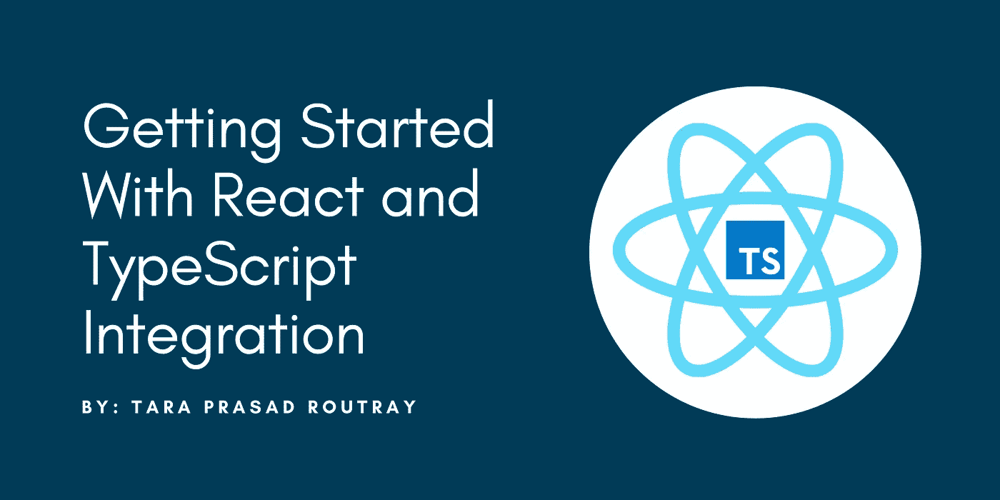

# React 和 TypeScript 集成入门

> 原文：<https://levelup.gitconnected.com/getting-started-with-react-and-typescript-integration-dfde9c962760>

## 学习将 TypeScript 添加到现有的 React 应用程序中，或者创建一个内置了 TypeScript 的新 React 应用程序。



TypeScript 是微软创建的一种开源编程语言，它将代码编译成普通的 JavaScript。最初的发布是在 2012 年完成的，从那以后它一直处于积极的开发中，但它每年都继续受到欢迎。TypeScript 和 JavaScript 之间的主要区别在于它们是两种独立的编程语言，但是 TypeScript 在很大程度上基于 JavaScript，因为它是 JavaScript 的超集。使用 TypeScript，您可以获得一些主要的优势，如严格类型、结构类型、类型注释、类型推断等。

在本文中，我将详细介绍如何向 React 应用程序添加 TypeScript。这里我们将把代码库从普通的 JavaScript 移植到类型脚本代码。

# 在 React 中使用 TypeScript 的两种方法

1.  使用 TypeScript 模板启动一个新的 React 应用程序。
2.  将 TypeScript 添加到现有的 React 应用程序中。

# 方式 1:使用 TypeScript 模板启动一个新的 React 应用程序

执行以下命令，使用 TypeScript 模板启动一个新的 React 应用程序。

```
npx create-react-app my-app --template typescript
```

# 方式 2:向现有的 React 应用程序添加 TypeScript

执行以下命令将 TypeScript 添加到现有的 React 应用程序中。

```
npm install --save typescript [@types/node](http://twitter.com/types/node) [@types/react](http://twitter.com/types/react) [@types/react-dom](http://twitter.com/types/react-dom) [@types/jest](http://twitter.com/types/jest)
```

接下来，将文件重命名为 TypeScript 文件(例如`src/index.js`到`src/index.tsx`)并重启您的开发服务器！

> 注意:类型错误将显示在与构建错误相同的控制台中。在恢复应用程序开发或构建项目之前，您需要修复这些“类型错误”。

太棒了。您已经完成了在 React 应用程序中安装和使用 TypeScript 的学习，并构建了令人难以置信的应用程序。

> 如果你喜欢阅读这篇文章，并发现它很有帮助，请鼓掌，与你的朋友分享，并关注我以获得我即将发布的文章的更新。你可以在 [LinkedIn](https://www.linkedin.com/in/tararoutray/) 上和我联系。