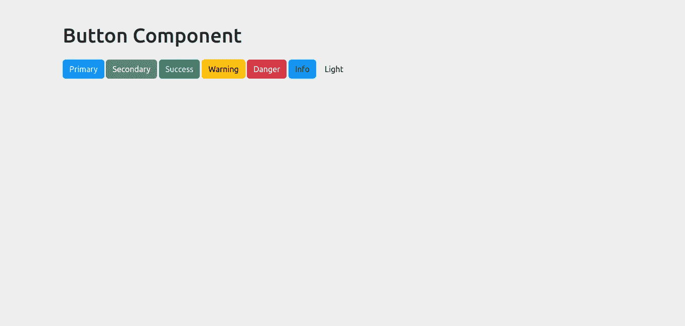
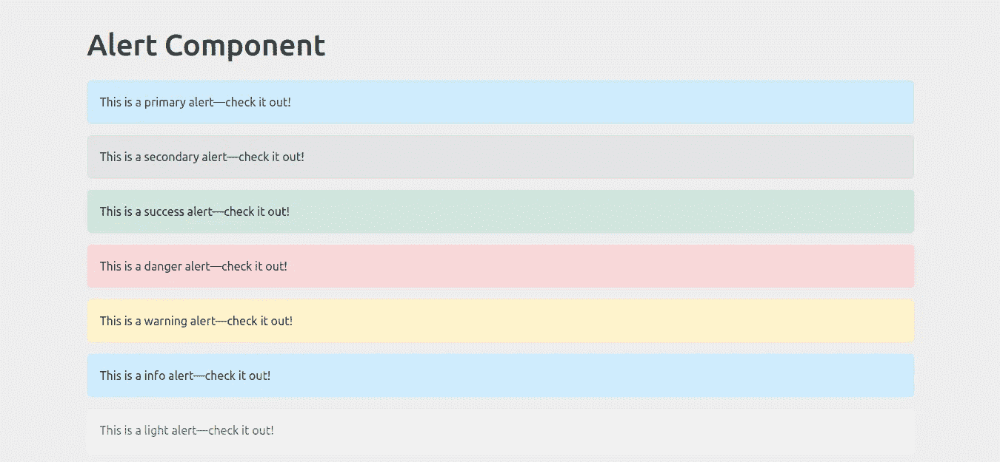
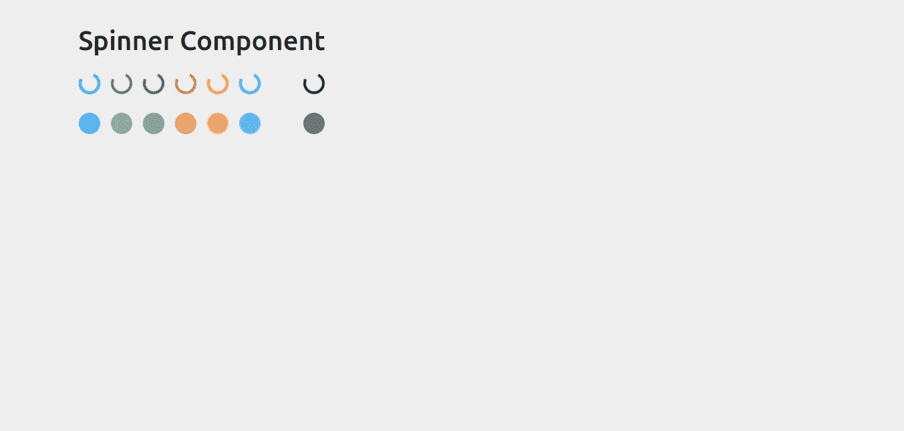

# React-Bootstrap UI 库入门

> 原文：<https://levelup.gitconnected.com/getting-started-with-react-bootstrap-ui-library-7969bb915b1b>

## 了解如何在 React 项目中正确安装和使用 Bootstrap。


根据 Stack Overflow 开发者调查，React 是目前最受欢迎的 JavaScript 框架。在本文中，我将向您介绍一个名为“React-Bootstrap”的 UI 库，它提供了非常棒的 UI 组件。互联网上有很多 React UI 库，但是 React-Bootstrap 是 web 开发人员中最受欢迎的选择。感谢创建者维护了它与标准引导框架的相似性以及广泛的引导主题的可用性。

# 在 React 中集成 React-Bootstrap UI 库的 4 步指南

1.  安装 React 引导程序
2.  将资产文件导入应用程序
3.  导入组件
4.  使用组件

# 步骤 1:安装 React 引导程序

在 React 项目中打开一个终端，执行以下命令，开始使用 NPM(节点包管理器)安装包。

```
npm install react-bootstrap bootstrap
```

如果你喜欢使用 yarn，那么执行下面的命令。

```
yarn add react-bootstrap bootstrap
```

上面的命令将安装两个包— Bootstrap 和 React-Bootstrap。除了 React-Bootstrap 之外安装 Bootstrap 的目的是:React-Bootstrap 包不附带任何 CSS。它只包含组件。因此，它需要一个额外的包来包含 CSS 文件。

# 步骤 2:将资产文件导入到应用程序中

打开`index.js`，添加下面一行来包含 Bootstrap 框架的 CSS 文件。

```
import 'bootstrap/dist/css/bootstrap.min.css';
```

您现在可以开始在您的应用程序中使用 React-Bootstrap UI 库及其组件。

# 步骤 3:导入组件

您可以通过指定引导组件的名称及其包名来导入 React 引导组件。添加以下代码行，将按钮导入 React 页面。

```
import Button from 'react-bootstrap/Button';
```

您必须导入如上所示的单个组件，而不是整个库。因为它只包括您使用的特定组件。通过这样做，您可以显著减少发送给客户端的代码量。

# 步骤 4:使用组件

以下是如何在 React 应用程序中使用任何引导组件。我将演示几个，但是您可以参考官方文档来查看所有组件。

*   按钮组件
*   警报组件
*   旋转组件

## 4.1.按钮组件

通过在页面顶部添加以下行来导入组件。

```
import Button from 'react-bootstrap/Button';
```

然后，您可以在导入的组件上使用 props 来更改其布局。比如 Button 就有无数的`variant`、`type`、`target`、`size`等道具。参考下面的代码片段来显示一个按钮。

将其包含在`App.js`文件中，会看到如下输出。



## 4.2.警报组件

通过在页面顶部添加以下行来导入组件。

```
import Alert from 'react-bootstrap/Alert';
```

然后，您可以在导入的组件上使用 props 来更改其布局。比如 Alert 就有`variant`这样的道具。请参考下面的代码片段来显示警报。

将其包含在`App.js`文件中，您将看到以下输出。



## 4.3.旋转组件

通过在页面顶部添加以下行来导入组件。

```
import Spinner from 'react-bootstrap/Spinner';
```

然后，您可以在导入的组件上使用 props 来更改其布局。比如 Spinner 有`variant`这样的道具。参考下面的代码片段来显示一个微调器。

将其包含在`App.js`文件中，您将看到以下输出。



访问下面的 GitHub 库下载文件。

 [## GitHub-tararoutray/react-bootstrap-demo:一个演示应用程序，展示了如何将 bootstrap 与…

### 这个项目是用 Create React App 引导的。在项目目录中，您可以运行:在…中运行应用程序

github.com](https://github.com/tararoutray/react-bootstrap-demo) 

请访问 React-Bootstrap 的官方文档页面，了解关于其组件的更多信息。

 [## 反应引导

### 最流行的前端框架，为 React 重建。

react-bootstrap.github.io](https://react-bootstrap.github.io/) 

太棒了。您已经学习了如何在 React 应用程序中安装和使用 React-Bootstrap UI 库，以及如何创建令人惊叹的应用程序。

> 如果你喜欢阅读这篇文章，并发现它对你有用，那么请鼓掌，与你的朋友分享，并关注我以获得我即将发布的文章的更新。你可以在 [LinkedIn](https://www.linkedin.com/in/tararoutray/) 上和我联系。