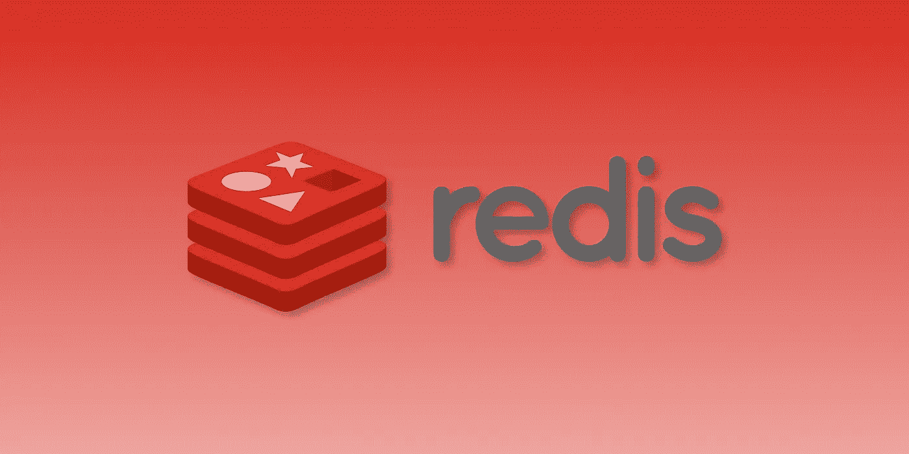

# Redis 入门:比您想象的要简单

> 原文：<https://levelup.gitconnected.com/getting-started-with-redis-its-easier-than-you-think-23d3729230fa>



Redis 是一种数据存储，它提供了优于传统数据库的性能优势。然而，它远不是数据库的替代品，而是一个小型、快速、易于使用的工具，可以补充您现有的应用程序。

在这篇简短的文章中，我们将分析 Redis 是什么以及它是如何工作的。更重要的是，我们还将了解 Redis 不是什么，以便您可以就如何使用它做出正确的决定。在此过程中，我们还将介绍一些示例代码，以便您可以了解它是如何工作的。

# Redis 架构

Redis 有两个关键特性，使其成为一些软件挑战的理想解决方案:

1.  Redis 是一个键值数据存储。这意味着键是散列的，因此我们可以在常数 O(1)时间内查找数据。我们不需要查询数据库，只需要询问 Redis 这个键是否存在。如果是，Redis 将返回值。
2.  Redis 在内存中运行。在硬件层面上，Redis 在 RAM 中而不是在磁盘上保存和操作数据。如果你学过计算机科学，你就会知道 RAM 的操作比磁盘的读/写要快得多。

当然，Redis 在内存中运行的事实对数据持久性有影响。因此，Redis 也能够将数据的当前快照保存到磁盘。

# Redis 架构的实际意义

Redis 背后的这些架构决策导致了有趣的结果:

优点:

*   与数据库相比，Redis 的速度快得离谱，大约每秒 100，000 次读/写
*   Redis 实现了高效的数据结构来操作数据，而不需要编写类似 SQL 的查询
*   因为太简单了，Redis 的开销很小。这是一个大约 16，000 行 C 代码的小应用程序

缺点:

*   因为它在 RAM 上，所以数据持久性可能是一个问题，所以如果您进行重要的更改，您需要指示 Redis 将快照保存到磁盘上
*   Redis 在创建数据对象之间的关系方面能力有限——它不能替代关系数据库(如 MySQL)或基于文档的数据库(如 MongoDB)
*   如果没有合适的规则，生产应用程序中的集群和密钥管理可能会是一个挑战

# 我可以用 Redis 做什么？

Redis 有许多潜在的应用，可以满足您快速访问数据的需求:

*   当您知道数据不太可能发生显著变化时，跨不同的页面缓存昂贵的数据库查询的结果
*   缓存最近的更改/更新/帖子/事件，为您网站的“最近添加”部分提供动力，无需像`SELECT * FROM posts WHERE ... ORDER BY time DESC LIMIT 10;`一样查询整个数据库即可动态更新
*   在排行榜中缓存和统计新的分数/价格/展示次数，以支持您网站的“最高分数”或“热门故事”部分，方法是使用 Redis 的增量命令来统计展示次数，或者如果某个集合是唯一的且其分数超过某个阈值，则向该集合添加一个关键字
*   创建一个发布-订阅模型，在该模型中，Redis 以本机方式管理向订阅者推送新事件
*   创建和维护一个独立的消息队列，用于在应用程序中的服务之间传递数据，因为 Redis 列表可以在固定的时间内从头部或尾部推送和弹出
*   在站点的各个页面上缓存用户的会话数据，这样您就不需要重新查询数据库来获取不太可能改变的用户信息

# Redis 代码是什么样子的？

Redis 有大量的特性——太多了，我无法在这里深入介绍。然而，Redis 中的基本数据类型如下:

## 用线串

这些是 Redis 中的基本键值对。设置给定键的值，并在以后访问/更新它。

```
127.0.0.1:6379> SET coffees_drunk 0
OK
127.0.0.1:6379> INCR coffees_drunk
(integer) 1
127.0.0.1:6379> INCR coffees_drunk
(integer) 2
127.0.0.1:6379> INCR coffees_drunk
(integer) 3
127.0.0.1:6379> GET coffees_drunk
"3"
```

## 列表

大多数编程语言将列表实现为一个堆栈。所以，你可以追加到列表的末尾，然后弹出列表中的最后一项。但是如果你想得到列表中的第一项(类似队列的行为)，那么这需要 O(n)时间，因为整个列表需要被移回来。

因为 Redis 是用 C 写的，他们可以做一些内存管理，使得在 O(1)时间内在列表的左边和右边进行 push/pop。

```
127.0.0.1:6379> LPUSH mylist "apple"
(integer) 1
127.0.0.1:6379> LPUSH mylist "banana"
(integer) 2
127.0.0.1:6379> RPUSH mylist "carrot"
(integer) 3
127.0.0.1:6379> LRANGE mylist 0 -1
1) "banana"
2) "apple"
3) "carrot"
```

## 设置

集合是无序的数据组，集合中的所有项目都是唯一的。Redis 还允许您比较和组合集合。

```
127.0.0.1:6379> SADD cars "Accord"
(integer) 1
127.0.0.1:6379> SADD cars "Camry"
(integer) 1
127.0.0.1:6379> SADD cars "Focus"
(integer) 1
127.0.0.1:6379> SISMEMBER cars "Camry"
(integer) 1
127.0.0.1:6379> SISMEMBER cars "Jetta"
(integer) 0
127.0.0.1:6379> SMEMBERS cars
1) "Accord"
2) "Camry"
3) "Focus"
```

## 有序集合

有些情况下，您希望数据分组且唯一(像集合一样)，但顺序也很重要。Redis 有序集稍微复杂一点，但是当你需要它们的时候，它们非常强大。

比如按出生年份排序的总统:

```
127.0.0.1:6379> ZADD presidents 1732 "washington"
(integer) 1
127.0.0.1:6379> ZADD presidents 1743 "jefferson"
(integer) 1
127.0.0.1:6379> ZADD presidents 1917 "kennedy"
(integer) 1
127.0.0.1:6379> ZADD presidents 1809 "lincoln"
(integer) 1
127.0.0.1:6379> ZADD presidents 1856 "wilson"
(integer) 1
127.0.0.1:6379> ZRANGE presidents 0 -1
1) "washington"
2) "jefferson"
3) "lincoln"
4) "wilson"
5) "kennedy"
```

## 混杂

哈希允许你像对待对象一样对待键。每个键现在存储一组相关信息。例如，您可以创建一个`user`键，其中包含用户的用户名、电子邮件、姓名、地址等信息。

```
127.0.0.1:6379> HSET superhero:1 name "Superman"
(integer) 1
127.0.0.1:6379> HSET superhero:1 power "Strength"
(integer) 1
127.0.0.1:6379> HSET superhero:1 aka "Clark Kent"
(integer) 1
127.0.0.1:6379> HMSET superhero:2 name "Flash" power "Speed" aka "Barry Allen"
OK
127.0.0.1:6379> HMSET superhero:3 name "Batman" power "Wealth" aka "Bruce Wayne"
OK
127.0.0.1:6379> HGET superhero:1 name
"Superman"
127.0.0.1:6379> HGETALL superhero:2
1) "name"
2) "Flash"
3) "power"
4) "Speed"
5) "aka"
6) "Barry Allen"
```

# 学习 Redis 的基础知识

Redis 用一种有趣的方式向您介绍语法。有一个[在线互动教程](https://try.redis.io/)会带你了解所有的基础知识。

# 在本地安装 Redis

准备好自己开始玩 Redis 了吗？

```
$ wget [http://download.redis.io/releases/redis-5.0.5.tar.gz](http://download.redis.io/releases/redis-5.0.5.tar.gz)
$ tar xzf redis-5.0.5.tar.gz
$ cd redis-5.0.5
$ make
```

*注意:这是在撰写本文时 Redis 的当前版本。如果你正在阅读这篇文章，你真的应该访问* [*Redis 下载页面*](https://redis.io/download) *获取最新版本。*

# 在应用程序中使用 Redis

对于大多数应用程序框架来说，让 Redis 在您的应用程序中工作非常容易。以下是一些最常见的:

*   Spring Boot: [春季数据 Redis](https://docs.spring.io/spring-data/data-redis/docs/current/reference/html/)
*   轨道: [redis-rails](https://github.com/redis-store/redis-rails)
*   姜戈:[姜戈-雷迪斯](https://github.com/niwinz/django-redis)
*   拉勒维尔:[预测](https://laravel.com/docs/5.8/redis)
*   NodeJS: [node_redis](https://github.com/NodeRedis/node_redis)

当然，不仅仅是 web 应用程序可以使用 Redis。任何应用程序都可能受益于 Redis 服务器。所有主要语言都有客户。Redis 网站上有完整的客户名单。

# 让您的应用更上一层楼

Redis 是一个提高应用程序性能的神奇工具。当您缓存数据或将最近的条目/计数器保存在内存中时，可以显著减少用户的加载时间。

最精彩的部分？入门没那么难！您可以在现有工具的基础上使用 Redis，没有任何缺点。试试吧！

# 喜欢你在这里读到的吗？

我免费与我的电子邮件列表分享我最好的内容。

[加入我的电子邮件系列中目前的 500 名其他开发人员。](https://sunny-architect-5371.ck.page/0a60026a5d)