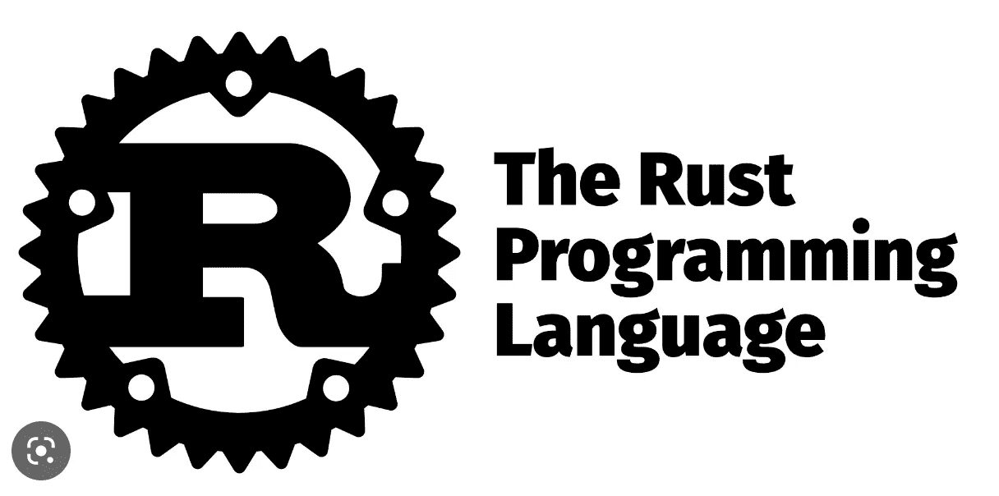

# Rust 编程入门

> 原文：<https://levelup.gitconnected.com/getting-started-with-rust-programming-f226808e3274>

Rust 是一种强大的编程语言，因其高效和安全而越来越受欢迎。这里有一些提示，让你开始你的旅程，掌握锈。

# 学习基础知识

学习 Rust 基础知识的最好方法是阅读官方的 Rust 书籍。这个全面的资源涵盖了这门语言的所有基础知识，并且是免费的。

# 通过练习来练习

一旦你通读了 Rust 的书，实践你所学到的东西是很重要的。尝试在像[exercim . io](https://exercism.io/)和 [CodeWars](https://www.codewars.com/) 这样的网站上解决编程难题。

# 利用教程

要获得更具体的帮助，请查看许多在线教程。Rust By Example 提供了简洁的代码片段和有用的解释。Rust 编程语言也有大量的教程。

# 加入社区

Rust 社区是一个友好且乐于助人的开发者团体。参与的方式多种多样。可以在 [Discord](https://discordapp.com/invite/rust-lang) 上和其他 Rust 用户聊天，在 [Reddit](https://www.reddit.com/r/rust/) 上提问，参加 [Rust 论坛](https://users.rust-lang.org/)。

# 保持动力

研究铁锈可能是一个漫长而具有挑战性的过程，所以保持动力很重要。为自己设定现实的目标，达到目标后奖励自己。你也可以加入一个 Rust 学习小组，或者和其他 Rust 开发者一起参加虚拟会议。

通过一点点的奉献和实践，你很快就能写出 Rust 代码了！