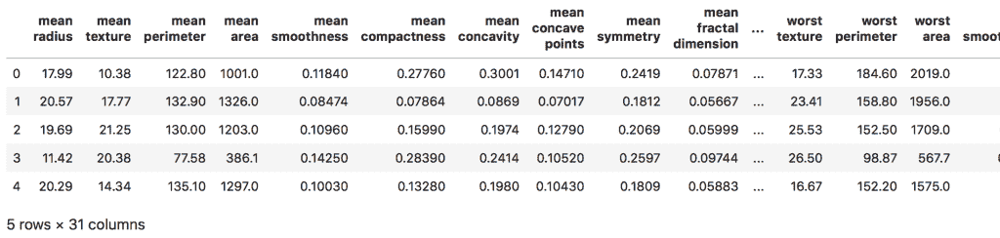
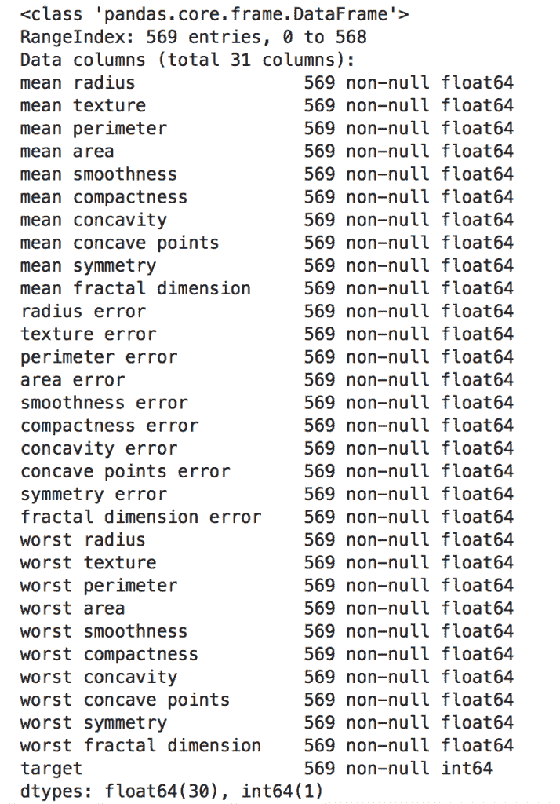
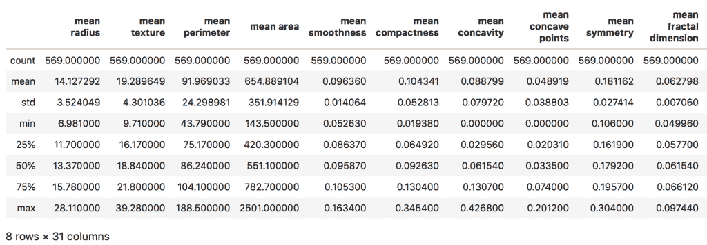
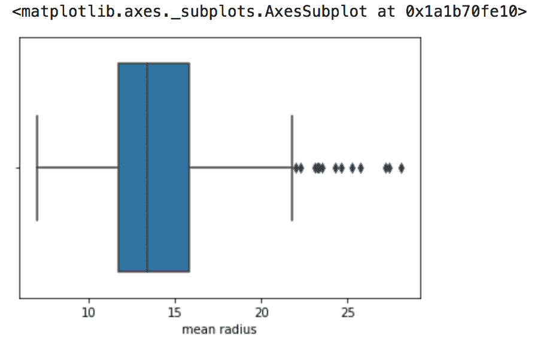
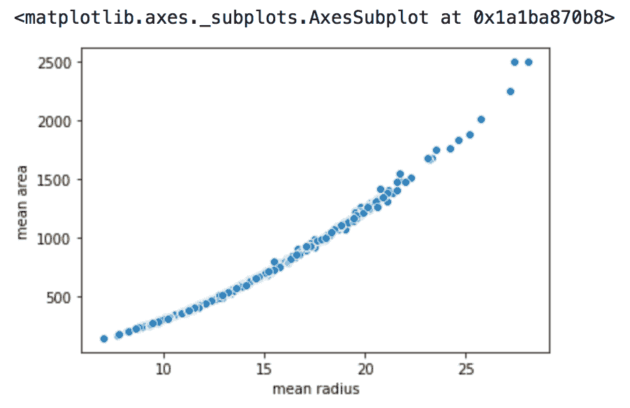

# Scikit-learn 玩具数据集入门

> 原文：<https://levelup.gitconnected.com/getting-started-with-scikit-learns-toy-datasets-8cb8c015fd15>

开始接触数据科学可能会有点吓人。幸运的是，最受欢迎的 python 数据科学包之一 scikit-learn(或 sklearn)附带了几个“玩具”数据集，可以帮助您从一开始就做好准备。

在这篇博文中，我们将讨论你需要做些什么来查看这些数据集并投入使用。我们将要讨论的方法相对来说比较基础，但是作为一个工作数据科学家工具箱的基本框架。

## 先决条件

在本教程中，我们将使用 python 和来自 [SciPy](https://www.scipy.org/) 生态系统的一些库。如果您以前从未使用过 python 和/或不知道什么是 SciPy，不要担心！一次安装所有需要的东西的好方法是下载 [Anaconda](https://www.anaconda.com/) 发行版。它是免费的，为 python 和 R 提供了一个平台，同时为跨 Windows、macOS 和 Linux 的简单包管理提供了框架。如果您还没有安装它，请确保在继续阅读之前访问下载页面并设置好一切。

## 导入库

在用 Anaconda 安装好所有东西之后，我建议打开 Anaconda Navigator 并打开 Jupyter 笔记本或 Jupyter 实验室。这两个工具都提供了一个笔记本工作流，允许您将代码组织到单元格中，这些单元格在运行时可以立即显示输出。当您到达那里时，我们需要做的第一件事是导入加载和使用我们的数据所必需的库。

```
import seaborn as sns
import pandas as pd
from sklearn import datasets
```

第一个库是 seaborn，我们将使用它来可视化我们的数据。它提供了仅用几行代码就能做出各种漂亮的图形的能力。下一个库是 pandas，我们将使用它来查看我们的数据，并获得关于其中不同功能的一些基本信息。我们的最后一个库 sklearn 主要用于为机器学习应用准备数据。现在，我们只是用它来获得我们将要使用的玩具数据集。

## 导入数据集

现在我们已经导入了所有的包，我们可以开始数据了。参考[文档](https://scikit-learn.org/stable/datasets/index.html)可以看到 sklearn 自带的所有数据集。在本教程中，我们将使用乳腺癌数据集。该数据集包含乳腺肿瘤的测量值和特征，以及它们是否最终为恶性的指标。从这样的数据中建立一个模型的基本目标是看你是否能准确地预测一个新病人的肿瘤最终是否是恶性的。这在数据科学和机器学习模型中被称为分类问题，但我们不会在本教程中过多讨论。要将其加载到 python 中，您只需执行以下代码:

```
data = datasets.load_breast_cancer()
```

Sklearn 将这些对象视为字典，这是 python 的内置数据类型之一。要查看与其相关的所有值，只需运行

```
data.keys() dict_keys(['data', 'target', 'target_names', 'DESCR', 'feature_names', 'filename'])
```

本词典中的“描述”键包含了我们的数据实际上是什么、它来自哪里、它的不同特征等等的描述。现在就让我们来看看:

```
print(data['DESCR'])

.. _breast_cancer_dataset:

Breast cancer wisconsin (diagnostic) dataset
--------------------------------------------

**Data Set Characteristics:**

    :Number of Instances: 569

    :Number of Attributes: 30 numeric, predictive attributes and the class

    :Attribute Information:
        - radius (mean of distances from center to points on the perimeter)
        - texture (standard deviation of gray-scale values)
        - perimeter
        - area
        - smoothness (local variation in radius lengths)
        - compactness (perimeter^2 / area - 1.0)
        - concavity (severity of concave portions of the contour)
        - concave points (number of concave portions of the contour)
        - symmetry 
        - fractal dimension ("coastline approximation" - 1)

        The mean, standard error, and "worst" or largest (mean of the three
        largest values) of these features were computed for each image,
        resulting in 30 features.  For instance, field 3 is Mean Radius, field
        13 is Radius SE, field 23 is Worst Radius.

        - class:
                - WDBC-Malignant
                - WDBC-Benign

    :Summary Statistics:

    ===================================== ====== ======
                                           Min    Max
    ===================================== ====== ======
    radius (mean):                        6.981  28.11
    texture (mean):                       9.71   39.28
    perimeter (mean):                     43.79  188.5
    area (mean):                          143.5  2501.0
    smoothness (mean):                    0.053  0.163
    compactness (mean):                   0.019  0.345
    concavity (mean):                     0.0    0.427
    concave points (mean):                0.0    0.201
    symmetry (mean):                      0.106  0.304
    fractal dimension (mean):             0.05   0.097
    radius (standard error):              0.112  2.873
    texture (standard error):             0.36   4.885
    perimeter (standard error):           0.757  21.98
    area (standard error):                6.802  542.2
    smoothness (standard error):          0.002  0.031
    compactness (standard error):         0.002  0.135
    concavity (standard error):           0.0    0.396
    concave points (standard error):      0.0    0.053
    symmetry (standard error):            0.008  0.079
    fractal dimension (standard error):   0.001  0.03
    radius (worst):                       7.93   36.04
    texture (worst):                      12.02  49.54
    perimeter (worst):                    50.41  251.2
    area (worst):                         185.2  4254.0
    smoothness (worst):                   0.071  0.223
    compactness (worst):                  0.027  1.058
    concavity (worst):                    0.0    1.252
    concave points (worst):               0.0    0.291
    symmetry (worst):                     0.156  0.664
    fractal dimension (worst):            0.055  0.208
    ===================================== ====== ======

    :Missing Attribute Values: None

    :Class Distribution: 212 - Malignant, 357 - Benign
```

然后，我们可以通过运行来访问数据本身

```
data['data']
```

和

```
data['target']
```

“数据”关键字包含肿瘤本身的所有不同特征，而目标包含指示肿瘤是否为恶性的二进制值。仅仅通过字典处理数据会很快变得令人讨厌。所以为了让我们的生活更容易，我们可以把所有的东西都放进熊猫的数据框里。我已经编写了一个小函数，它将为任何玩具 sklearn 数据集自动执行这个过程:

```
def sklearn_to_df(sklearn_dataset):
    data = sklearn_dataset['data']
    cols = sklearn_data['feature_names']
    target = sklearn_dataset['target']    
    df = pd.DataFrame(data, columns=cols)
    df['target'] = pd.Series(target) return df
```

要使用该函数并获得我们的数据帧，只需执行以下操作:

```
cancer_df = sklearn_to_df(datasets.load_breast_cancer())
```

## 首先看一下数据

现在我们已经加载了数据，让我们开始查看它吧！熊猫有一些专门为此设计的方法。我们要用的是。head()，。info()和。描述()。

```
cancer_df.head()
```



基本上所有这些都是输出我们数据的前 5 行。这是您在处理任何新数据集时应该做的第一件事，只是为了感受一下它的样子。通过这样做，我们可以了解列本身的数据类型，以及是否存在我们应该担心的缺失值

```
cancer_df.info()
```



由此，我们可以立即看到我们的数据集中总共有 569 行。我们还看到，每一列都包含 569 个非空条目，这意味着我们不需要担心任何明显的缺失值。这通常是这种玩具数据集的情况，但你永远不要指望它在现实世界中！真实的数据通常是杂乱的，弄清楚如何处理它是数据科学家工作的一个重要方面。接下来要注意的是最右边的数据类型。除了我们的目标之外的一切都是一个浮点数，或者一个带小数位的数值。目标，我们已经知道是一个二进制值，因为这是一个分类值，存储为一个整数。下一件显而易见的事情是获得关于这些列的一些基本统计数据。我们可以在一行中简单地运行

```
cancer_df.describe()
```



太神奇了！只用一行代码，pandas 就给了我们大量有价值的统计数据。我们立即知道所有肿瘤特征的平均值、标准差、最小值、最大值和四分位数。这只是这个库在处理数据方面有多么强大的众多例子之一。如果我们愿意，我们也可以通过直接引用它们并使用 Pandas 内置的一些统计方法来获得不同功能的单独统计数据。对于分类问题，重要的是我们的目标是“平衡的”，这意味着我们应该有和 1 一样多的 0。我们现在不会深入讨论为什么这很重要，但是让我们继续下去，看看这个目标数据有多平衡。

```
cancer_df['target'].mean()0.6274165202108963
```

因为这里的平均值大于 0.5，这意味着该数据集中的大多数肿瘤是恶性的。该值约为 0.63，目标值并不严重失衡，但这肯定是数据科学家在创建模型时需要考虑的因素。

## Seaborn 可视化

我们现在对我们的数据在数字意义上的样子有了一个很好的想法，但是我们还需要一种方式来呈现给其他人。正如我前面提到的，seaborn 库使这变得非常容易，特别是因为它是专门为熊猫数据帧而构建的。如果我们想获得。上面描述()方法时，我们可以使用一个方框图。要得到这个，你只要跑就行了

```
sns.boxplot('mean radius', data = cancer_df)
```



就是这样！这是 seaborn 盒图的最基本版本。通过方框图方法接受的各种参数，还可以对它做许多其他的事情。我鼓励你看一看[文档](https://seaborn.pydata.org/generated/seaborn.boxplot.html)中的这些内容，并尝试一下，看看你能想到什么。

接下来，让我们试着做一个散点图。这些在建模时是非常宝贵的，因为它们可以显示不同特征之间的相关性。如果数据集中的不同要素之间存在相关性，则表明为了使模型更加简单，可以舍弃其中的一个要素。还是那句话，我们不会在这里谈论为什么这是必要的，所以我们只是来看看如何去做。我们将着眼于肿瘤的测量半径和它的面积之间的相关性。这是一个作弊的例子，因为基础几何告诉我们，这两个变量之间应该有一个平方关系。让我们确认一下:

```
sns.scatterplot('mean radius', 'mean area', data = cancer_df)
```



在我看来这很像抛物线！我们可以使用 seaborn 的一些其他内置方法来证实这一点，但是我将把它留给另一个教程。

## 摘要

在本教程中，我们看了一个通过 sklearn 库提供的玩具数据集。通过一个相对基本的函数，我们能够将这些数据加载到 pandas 数据框架中，并利用一些强大的 pandas 方法使理解我们的数据变得容易。将这与 seaborn 结合起来，给了我们快速获得好看的视觉效果所必需的工具。我们在这里所做的一切总共只用了 19 行代码。这可能看起来都很基本，但这是一个数据科学家每天都要依赖的工作。描述性统计和可视化通常会提供见解，可以在您开始建模时节省大量时间！