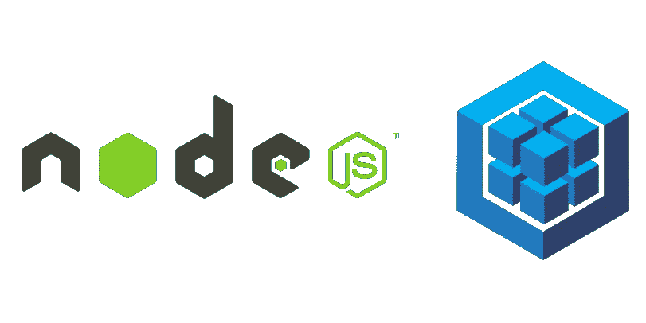

# Sequelize CLI 入门

> 原文：<https://levelup.gitconnected.com/getting-started-with-sequelize-cli-c33c797f05c6>



Sequelize 是一个流行的、易于使用的 JavaScript 对象关系映射(ORM)工具，可用于 SQL 数据库。如果你正在阅读这篇文章，你可能已经知道你想在 Node.js 项目中使用 ORM，所以我们不会详细解释。简而言之，Sequelize 是原始 SQL 的抽象层，使我们能够使用 JavaScript 与数据库进行交互。

*   [什么是 ORM，为什么要使用它](https://blog.bitsrc.io/what-is-an-orm-and-why-you-should-use-it-b2b6f75f5e2a)

太好了，但是我们如何开始 Sequelize 呢？在本演练中，我们将使用 [Sequelize CLI](https://github.com/sequelize/cli) (命令行界面)来创建 Postgres 数据库，并使用 MacOS 或 Linux 中的终端生成模型、迁移和种子文件。

让我们首先将 Postgres、Sequelize 和 Sequelize CLI 安装在一个我们称之为`sequelize-project`的目录中:

```
mkdir sequelize-project
cd sequelize-project
npm init -y
npm install sequelize pg
npm install --save-dev sequelize-cli
```

接下来，我们将初始化一个 Sequelize 项目，然后在代码编辑器中打开目录:

```
npx sequelize-cli init
code .
```

初始化项目会创建四个子目录:`config`、`migrations`、`models`和`seeders`。首先，我们将查看`config`来设置我们的项目以使用 Postgres。

对于未来的项目，您将使用`config/config.json`来控制用户访问，命名数据库，并决定 Sequelize 将使用哪种 SQL 方言。现在，您可以剪切和粘贴，用下面的代码替换当前文件中的内容。

`sequelize-project/config/config.json`:

```
{
  "development": {
    "database": "sequelize_project_development",
    "host": "127.0.0.1",
    "dialect": "postgres"
  },
  "test": {
    "database": "sequelize_project_test",
    "host": "127.0.0.1",
    "dialect": "postgres"
  },
  "production": {
    "database": "sequelize_project_production",
    "host": "127.0.0.1",
    "dialect": "postgres"
  }
}
```

很好，现在我们可以告诉 Sequelize CLI 创建 Postgres 数据库了:

```
npx sequelize-cli db:create
```

接下来我们将创建一个模型，我们称之为`User`:

```
npx sequelize-cli model:generate --name User --attributes firstName:string,lastName:string,email:string,password:string
```

运行`model:generate`使用我们通过`--name`和`--attributes`传递的信息来创建一个模型文件，Sequelize 将使用它来组织传递给我们的节点项目的其他部分的信息，以及一个迁移，Sequelize 将使用它来在我们的数据库中设置适当的表。

稍后，您将使用这些文件[定制模型和关系](https://medium.com/@brunopgalvao/creating-sequelize-associations-with-the-sequelize-cli-tool-d83caa902233)。现在，Sequelize CLI 将生成我们需要的代码。我们的文件应该是这样的:

`sequelize-project/models/user.js`:

```
'use strict';
module.exports = (sequelize, DataTypes) => {
  const User = sequelize.define('User', {
    firstName: DataTypes.STRING,
    lastName: DataTypes.STRING,
    email: DataTypes.STRING,
    password: DataTypes.STRING,
  }, {});
  User.associate = function(models) {
    // associations can be defined here
  };
  return User;
};
```

`sequelize-project/migrations/20190914184520-create-user.js`:
(Sequelize CLI 将在此使用当前日期和时间，因此您将在文件名中看到与`20190914184520`不同的内容。)

```
'use strict';
module.exports = {
  up: (queryInterface, Sequelize) => {
    return queryInterface.createTable('Users', {
      id: {
        allowNull: false,
        autoIncrement: true,
        primaryKey: true,
        type: Sequelize.INTEGER
      },
      firstName: {
        type: Sequelize.STRING
      },
      lastName: {
        type: Sequelize.STRING
      },
      email: {
        type: Sequelize.STRING
      },
      password: {
        type: Sequelize.STRING
      },
      createdAt: {
        allowNull: false,
        type: Sequelize.DATE
      },
      updatedAt: {
        allowNull: false,
        type: Sequelize.DATE
      }
    });
  },
  down: (queryInterface, Sequelize) => {
    return queryInterface.dropTable('Users');
  }
};
```

现在我们需要执行迁移，这将在 Postgres 数据库中创建`Users`表和必要的列:

```
npx sequelize-cli db:migrate
```

现在让我们创建一个种子文件:

```
npx sequelize-cli seed:generate --name user
```

到目前为止，Sequelize CLI 已经为我们完成了大部分编码工作，但是这里我们需要直接参与进来。我们将用描述我们想要插入的数据的代码替换自动生成文件中的注释部分。

在下面这个简单的例子中，我们插入了一个 JavaScript 对象，为我们在`User`模型中描述的每个属性添加了一个键，加上用于时间戳的`createdAt`和`updatedAt`。

`sequelize-project/seeders/20190904165805-user.js`:

```
module.exports = {
  up: (queryInterface, Sequelize) => {
    return queryInterface.bulkInsert('Users', [{
        firstName: 'John',
        lastName: 'Doe',
        email: 'demo@demo.com',
        password: '$321!pass!123$',
        createdAt: new Date(),
        updatedAt: new Date()
      }], {});
  },down: (queryInterface, Sequelize) => {
    return queryInterface.bulkDelete('Users', null, {});
  }
};
```

一旦我们保存了种子文件，让我们执行它:

```
npx sequelize-cli db:seed:all
```

现在来看看回报。进入`psql`并查询数据库，查看`Users`表:

```
psql sequelize_project_development
SELECT * FROM "Users";
```

您应该会看到一行显示了我们在简单的种子文件中包含的信息。

恭喜你！您已经使用 Sequelize 命令行界面设置 Sequelize 来协调 SQL 数据库和节点之间的交互。现在你已经准备好 [**学习如何使用 Sequelize**](https://medium.com/@brunopgalvao/using-the-sequelize-cli-and-querying-4ba8d0ac4314) 查询你的数据库了！

> 这篇文章是与纽约市的软件工程师、编辑和作家杰里米·罗斯(Jeremy Rose)合著的。

## 其他有用的顺序化 CLI 命令:

*   查看所有可用命令的列表:`npx sequelize-cli --help`
*   犯了迁移错误？您可以随时回滚:`npx sequelize-cli db:migrate:undo`
*   犯了播种错误？您可以随时撤销:`npx sequelize-cli db:seed:undo`

## 有关 Sequelize CLI 的更多信息:

*   [使用顺序 CLI 并查询](https://medium.com/@brunopgalvao/using-the-sequelize-cli-and-querying-4ba8d0ac4314)
*   [使用序列 CLI 创建序列关联](https://medium.com/@brunopgalvao/creating-sequelize-associations-with-the-sequelize-cli-tool-d83caa902233)
*   [使用 Faker 开始 Sequelize CLI](https://medium.com/@brunopgalvao/getting-started-with-sequelize-cli-using-faker-824b3f4c4cfe)
*   将 CLI 和 Express 排序
*   [用序列命令行界面和快速路由器构建快速 API](https://medium.com/@brunopgalvao/build-an-express-api-with-sequelize-cli-and-express-router-963b6e274561)
*   [用序列 CLI 和单元测试构建 Express API！](https://medium.com/@brunopgalvao/building-an-express-api-with-sequelize-cli-and-unit-testing-882c6875ed59)

# 资源

*   [https://sequelize.org/master/manual/migrations.html](https://sequelize.org/master/manual/migrations.html)