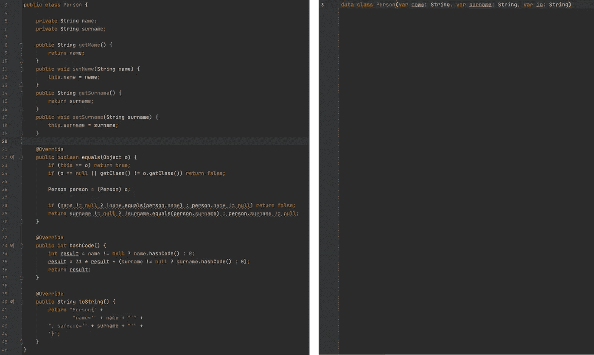
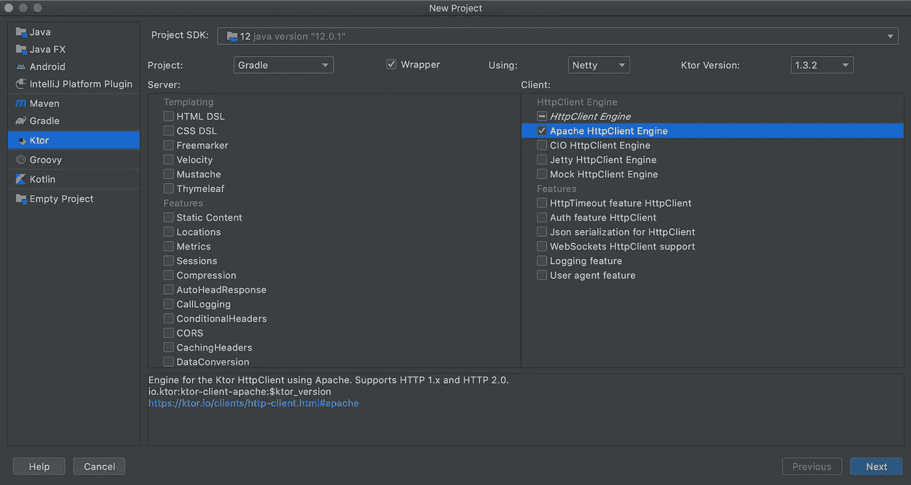

# 服务器端 Kotlin 入门

> 原文：<https://levelup.gitconnected.com/getting-started-with-server-side-kotlin-cc207fda255e>

## 初学者指南

## 用 JetBrain 的 Ktor 框架


照片由大卫·伊斯坎德尔在 Unsplash 上拍摄

otlin 的第一个稳定版本 1.0 于 2016 年发布，从那时起我们见证了它给游戏带来的简单性和有效性。谷歌宣布支持 Kotlin 作为 Android 平台上 Java 的替代方案，从那以后，Kotlin 近年来吸引了很多关注。

与 Java 类似，Kotlin 编译成字节码，并且与 JVM 兼容，所以它可以像 Java 一样执行。它具有面向对象和函数式编程结构，并且完全可以与 Java 互操作。

现在，与其谈论代码可以有多干净和简洁，不如让我们看看它的实际应用。下面是 Java 和 Kotlin 中同一个类的对比



左边是 Java 类，右边是 Kotlin 数据类

这就是我们真正看到 Kotlin 潜力的地方，可以消除的无用代码的数量。

# 服务器端开发

> Kotlin 非常适合开发服务器端应用程序，它允许您编写简洁而富于表现力的代码，同时保持与现有的基于 Java 的技术堆栈的完全兼容性，以及平滑的学习曲线

有多个[框架](https://kotlinlang.org/docs/reference/server-overview.html#frameworks-for-server-side-development-with-kotlin)支持使用 Kotlin 进行服务器端开发。在本文中，我们将使用 [**Ktor**](https://ktor.io/) 作为服务器端框架。Ktor 使我们能够创建可以运行和面向多个平台的客户端和服务器端应用程序。

# 目标

到本文结束时，我们将为 CRUD 操作创建一些基本的 RESTful APIs，并使用 Ktor 使用一个名为 Netty 的嵌入式服务器在本地托管它。

需要一些 Kotlin 的基础知识，因为我们不会在本文中讨论 Kotlin 的基础知识。如果您有 Java 背景，这个 GitHub 页面提供了 Java 到 Kotlin 转换的备忘单

[](https://github.com/MindorksOpenSource/from-java-to-kotlin) [## MindorksOpenSource/从 java 到 kotlin

### 从 Java 到 Kotlin——Java 到 kot Lin 的备忘单

github.com](https://github.com/MindorksOpenSource/from-java-to-kotlin) 

# 入门指南

让我们开始设置用于开发的智能集成开发环境

1.  从[这里](https://www.jetbrains.com/idea/download/)下载并安装 IntelliJ
2.  打开 IntelliJ，点击*配置*并选择*插件*


3.转到 *Marketplace* ，搜索插件- *Ktor* ，安装，重启 IDE。

4.继续并选择*创建新项目。*

5.在下一个屏幕中，选择 *ApacheHttpClientEngine*



6.单击 Next 并填写所有其他细节，如包名和项目位置，以完成项目的创建。

# “你好世界！”

Ktor 中的“Hello World”应用程序如下所示:

在这里，我们创建了一个嵌入式服务器的实例， [Netty](https://netty.io/) ，并监听端口 8080。

`routing`是在 Ktor 中安装路由的高阶函数。您可以检查实现以了解更多信息

```
*/**
 * Gets or installs a [Routing] feature for the this [Application] and runs a [configuration] script on it
 */* @ContextDsl
fun Application.routing(configuration: Routing.() -> Unit): Routing =
    *featureOrNull*(Routing)?.*apply*(configuration) ?: *install*(Routing, configuration)
```

在`routing`块中，我们定义了一个路由来响应请求。因此，如果您在浏览器上访问 LocalHost，服务器应该发送 **Hello World！**以纯文本形式。

继续在 *src 下的 *Application.kt* 文件中进行这些更改，然后*运行应用程序。现在，通过在浏览器中输入 [http://127.0.0.1:8080/](http://127.0.0.1:8080/) 来点击 localhost。

这就是你在 Ktor 中创建第一个应用程序的方法！

# 构建应用程序

最终，我们的应用程序中会有许多端点，虽然我们可以在`routing`块中添加多个函数，但为了更好的可读性，我们需要根据这些函数的目的对它们进行分组。

Ktor 为我们提供了定义和组织路线的灵活性。我们可以创建文件夹，然后将每个端点放在自己的文件中，甚至按功能分组。

多亏了 Kotlin，我们还可以为 *Route* 类创建扩展函数，如下所示:

# 路线层次结构

我们可以定义路由层次结构，每个路由本身定义一个新的 URL

在这种情况下，访问 URL 将是[http://127 . 0 . 0 . 1:8080/customer/1](http://127.0.0.1:8080/customer/1)
，其中“1”是“customerId”

这里，我们使用`call.parameters`属性访问路由参数。

要访问查询字段，我们可以使用以下命令:

```
call.respondText(call.request.queryParameters[“customerId”].toString())
```

# 执行 CRUD 操作

考虑一个带有*客户*模型的示例应用程序。数据类如下所示:

```
data class Customer(
    val id: Int,
    val firstName: String,
    val lastName: String
)
```

为了简单起见，我们将在一个可变列表上执行所有的 CRUD 操作，该列表在下面提到的 *CustomerRepo* 类中定义

```
class CustomerRepo {
    val customerList = *mutableListOf*<Customer>()
}
```

让我们在一个单独的文件中定义属于*客户路线*的所有路线，如下所述

注意，我们正在返回一个*响应*对象。响应对象是一个简单的数据类

```
data class Response(
    val message: String
)
```

这里，我们通过在 *build.gradle* 文件中添加以下依赖项，使用‘Gson’来处理应用程序中的 JSON 内容

```
implementation "io.ktor:ktor-gson:$ktor_version"
```

该功能是一个[内容协商](https://ktor.io/servers/features/content-negotiation.html)转换器，可以通过以下方式安装

```
fun main() {
    val server = *embeddedServer*(Netty, port = 8080) **{** *install*(ContentNegotiation) **{** *gson* **{** setPrettyPrinting()
            **}
        }** routing **{** *customer*(customerRepo = CustomerRepo())
        **}
    }** server.start(wait = true)
}
```

现在，如果您运行该应用程序，您应该能够通过使用[http://127 . 0 . 0 . 1:8080/customer](http://127.0.0.1:8080/customer)作为基本 URL，后跟您想要执行的操作的路径，来执行在 *CustomerRoute* 中定义的所有操作。您可以通过任何可用的客户端访问这些端点，比如 [Postman](https://www.postman.com/) 。

**以下是我们在 *CustomerRoute*** 中定义的所有 URL 的列表

1.  获取所有记录-GET-[http://127 . 0 . 0 . 1:8080/customer](http://127.0.0.1:8080/customer)
2.  具体记录—获取—[http://127 . 0 . 0 . 1:8080/customer/1](http://127.0.0.1:8080/customer/1)
    其中 customerId: 1
3.  创建新记录—发布—[http://127 . 0 . 0 . 1:8080/customer/create](http://127.0.0.1:8080/customer/create)

```
Post body: 
 {
  "id":"1",
  "firstName":"Name",
  "lastName":"Surname"
 }
```

4.删除记录-删除-[http://127 . 0 . 0 . 1:8080/customer/DELETE/1](http://127.0.0.1:8080/customer/delete/1)
其中 customerId: 1

5.更新记录—上传—[http://127 . 0 . 0 . 1:8080/customer/update/1](http://127.0.0.1:8080/customer/update/1)
其中 customerId: 1

```
Put body: 
 {
  "id":"1",
  "firstName":"Name",
  "lastName":"Surname"
 }
```

这就是本文的全部内容。在下一篇文章中，我们将探索如何使用协程并在 Ktor 中实现架构设计。敬请期待！

您可以在 GitHub 上找到示例存储库

[](https://github.com/KunalChaubal/KtorCrudSample) [## KunalChaubal/KtorCrudSample

### 在 GitHub 上创建一个帐户，为 KunalChaubal/KtorCrudSample 的开发做出贡献。

github.com](https://github.com/KunalChaubal/KtorCrudSample) 

随意叉它/贡献它

编码快乐！