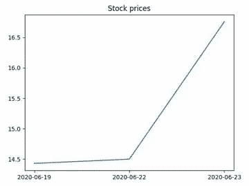

# Python 股票市场分析入门

> 原文：<https://levelup.gitconnected.com/getting-started-with-stock-market-analysis-in-python-12ac0e3eb5db>


照片由德米特里·斯塔里诺夫拍摄

如今利用计算机技术来预测股票收益是非常普遍的。因此，许多股票预测算法依赖于机器学习技术来搜索股票数据中的模式和见解。但是，在这样做之前，首先需要获得一个包含必要股票数据的数据集，然后将它加载到程序的数据结构中。本文介绍了如何完成开始使用 Python 进行股票数据分析所需的第一步。

# 从 Yahoo Finance 获取股票数据

我可以从哪里获取数据进行分析？这可能是您决定以编程方式执行股票分析后的第一个问题。如果是这样，Yahoo Finance API 是与您的问题最相关的答案之一，它允许您免费获取股票市场数据。有了构建在 Yahoo Finance API 之上的`yfinance`库，只需几行代码就可以在 Python 中完成获取特定时间段内某只股票的数据的过程。该库可以通过 pip 安装，如下所示:

```
pip install yfinance
```

成功安装后，您可以开始使用该库。假设您想获得 Inovio Pharmaceuticals，Inc. (INO)过去三个月的历史股价。这可以通过以下方式完成:

```
>>> import yfinance as yf
>>> tkr = yf.Ticker(‘INO’)
>>> hist = tkr.history(period=”3mo”)
```

根据您的需要，您可以指定另一个周期—有效周期包括:1d、5d、1mo、3mo、6mo、1y、2y、5y、10y、ytd、max。

# 熊猫数据框架中的股票数据

```
It is important to note that yfinance returns data in the pandas dataframe format:

>>> type(hist)<class ‘pandas.core.frame.DataFrame’>
```

因此，您可以立即使用 pandas dataframe 对象可用的方法:

```
>>> hist.head()Date Open High Low Close Volume Dividends Stock Splits

2020–03–30 9.20 9.32 7.60 8.02 31303900 0 0
2020–03–31 7.94 8.05 7.25 7.44 13557300 0 0
2020–04–01 7.32 8.09 7.09 7.70 15973400 0 0
2020–04–02 7.63 7.65 7.10 7.52 10865400 0 0
2020–04–03 7.31 7.94 7.24 7.74 11052900 0 0
```

假设你只对收盘价感兴趣。以下代码显示了如何重新格式化 dataframe，以便它只包含必要的列:

```
>>> df = hist.iloc[:,0:1]
>>> df = df.reset_index() 
>>> columns = dict(map(reversed, enumerate(df.columns)))
>>> df = df.rename(columns=columns) 
>>> df.head()0 1
0 2020–03–30 9.20
1 2020–03–31 7.94
2 2020–04–01 7.32
3 2020–04–02 7.63
4 2020–04–03 7.31
```

# 提取特定日期的股票价格

在对某种股票进行股票分析时，大多数情况下，您可能会对某些日期(通常是公司发生重大事件的日期)和最近日期的股票价格感兴趣。例如，公布一家公司的季度数据可能会影响其当前的股价。

在下面的代码中，您将指定的日期及其最近的日期转换为字符串，然后您可以使用这些字符串在先前通过 Yahoo Finance 获得的数据集中进行搜索:

```
>>> from datetime import date, timedelta, datetime
>>> event_date = ‘22-Jun-2020’ 
>>> dat_prev = datetime.strftime(datetime.strptime(event_date,’%d-%b-%Y’) — timedelta(days = 1) , ‘%Y-%m-%d’) 
>>> dat_cur = datetime.strftime(datetime.strptime(event_date,’%d-%b-%Y’), ‘%Y-%m-%d’)
>>> dat_next = datetime.strftime(datetime.strptime(event_date,’%d-%b-%Y’) + timedelta(days = 1) , ‘%Y-%m-%d’)
```

当谈到交易日期时，问题是你不能通过简单地重复日历日期来获得最近的日期——股票交易所在周末和假日不工作。因此，您可以使用以下代码将日期调整为交易日期:

```
>>> while not any(df[0] == dat_prev): 
      dat_prev = datetime.strftime(datetime.strptime(dat_prev,'%Y-%m-%d') — timedelta(days = 1) , '%Y-%m-%d')
>>> while not any(df[0] == dat_next): 
      dat_next = datetime.strftime(datetime.strptime(dat_next,'%Y-%m-%d') + timedelta(days = 1) , '%Y-%m-%d')

>>> print('Date_prev: ', dat_prev) 
>>> print('Date_cur: ', dat_cur)
>>> print('Date_next: ', dat_next)Date_prev: 2020–06–19
Date_cur: 2020–06–22
Date_next: 2020–06–23
```

现在您可以提取上述日期的股票价格:

```
>>> prev_price = float(df[(df[0] == dat_prev)][1].values.tolist()[0])
>>> cur_price = float(df[(df[0] == dat_cur)][1].values.tolist()[0])
>>> next_price = float(df[(df[0] == dat_next)][1].values.tolist()[0])>>> print(‘The price on the day before the report: ‘, prev_price)
>>> print(‘The price on the day of the report: ‘, cur_price)
>>> print(‘The price on the next day of the report: ‘, next_price)
```

输出应该如下所示:

```
The price on the day before the report: 14.43
The price on the day of the report: 14.5
The price on the next day of the report: 16.76
```

# 绘制股票数据

您所拥有的数据的可视化表示提供了了解股票情况的最快方式。使用 matplotlib，您只需几行代码就可以绘制数据:

```
>>> import matplotlib.pyplot as plt 
>>> plt.plot([dat_prev,dat_cur,dat_next],[prev_price,cur_price,next_price])
>>> plt.title(‘Stock prices’) 
>>> plt.show()
```

生成的图形应该如下所示:



# 结论

这篇文章举例说明了股票价格分析的一些初始阶段。关于更具体的例子，请查看文章[用 pandas](https://www.oracle.com/news/connect/run-sql-data-queries-with-pandas.html) 运行 SQL 数据查询中的数据组内的分析处理。你可能也想看看我最近发表的用机器学习进行的[股价分析](/stock-price-analysis-with-machine-learning-7d42ad96b975)。

在接下来的文章中，我将讨论如何使用自然语言处理(NLP)技术，比如情绪分析来分析股票走势。与此同时，你可能想看看我以前的帖子[直截了当地介绍了抓取和自然语言处理](https://medium.com/swlh/getting-straight-to-the-point-with-scraping-and-natural-language-processing-1a62aba65586)，它解释了 NLP 以及其他一些技术如何被用来获得关于股票走势的最有趣的新文章。