# 从零开始在 GCP 使用 Terraform

> 原文：<https://levelup.gitconnected.com/getting-started-with-terraform-on-gcp-from-scratch-f607df91c47>

在这个简短的 how 教程中，我想向您展示如何从头开始设置/准备您的 GCP 项目，以便与您的 Terraform 设置进行交互，包括每一个微小的步骤。

## 要求

我只希望你准备好两件事:

*   已启用计费的有效 GCP 帐户
*   Terraform 的安装版本([terra form+GCP](https://learn.hashicorp.com/tutorials/terraform/install-cli?in=terraform/gcp-get-started)入门)

## 创建新的 GCP 项目

让我们开始吧，不要担心，我们不会只通过 GUI 执行几个步骤:

首先，我们在 GCP 创建一个新项目:

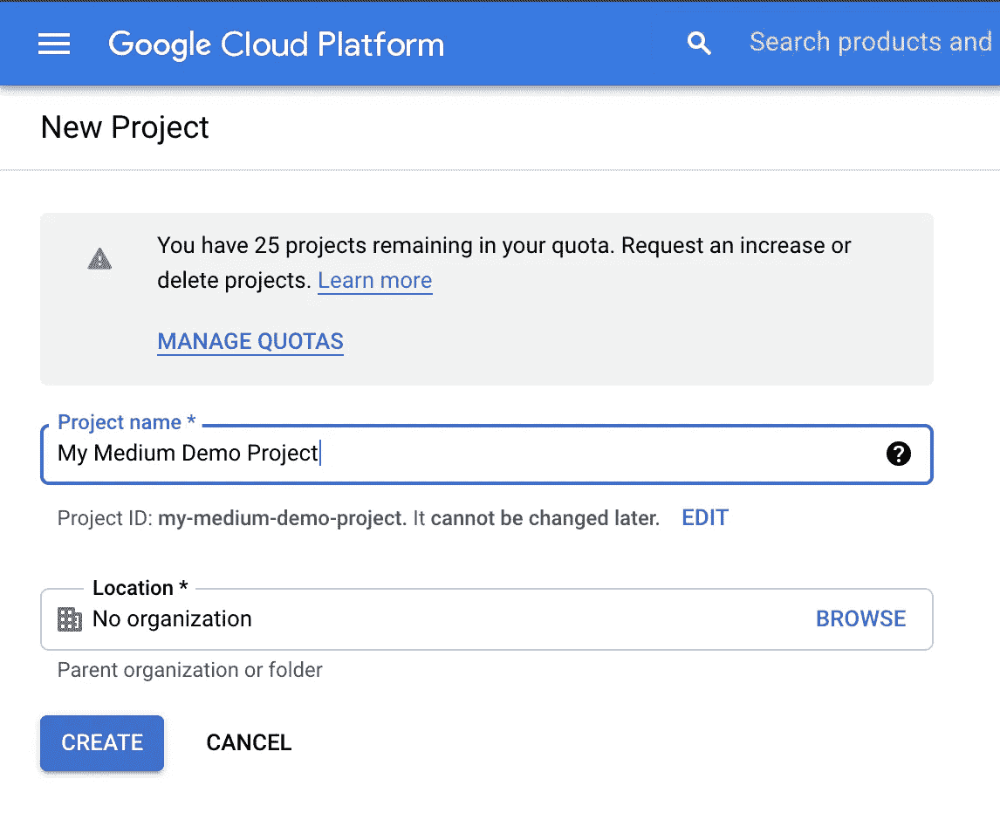

## 为 Terraform 创建服务帐户

接下来，我们转到“IAM & Admin ->服务帐户”部分。在这里，您可以看到还没有创建单个服务帐户。为了让 Terraform 访问我们的项目，并使用 GCP API，我们必须为它创建一个帐户。因此，点击“创建服务帐户”。

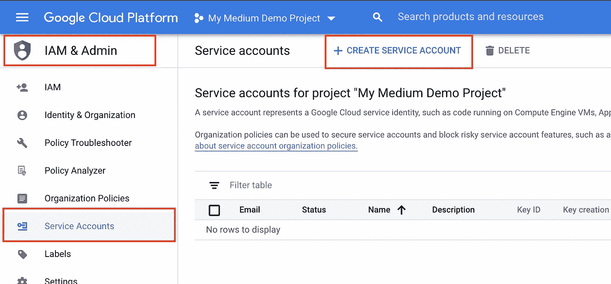

输入 Terraform 服务帐户的名称和描述，然后点击“创建”。

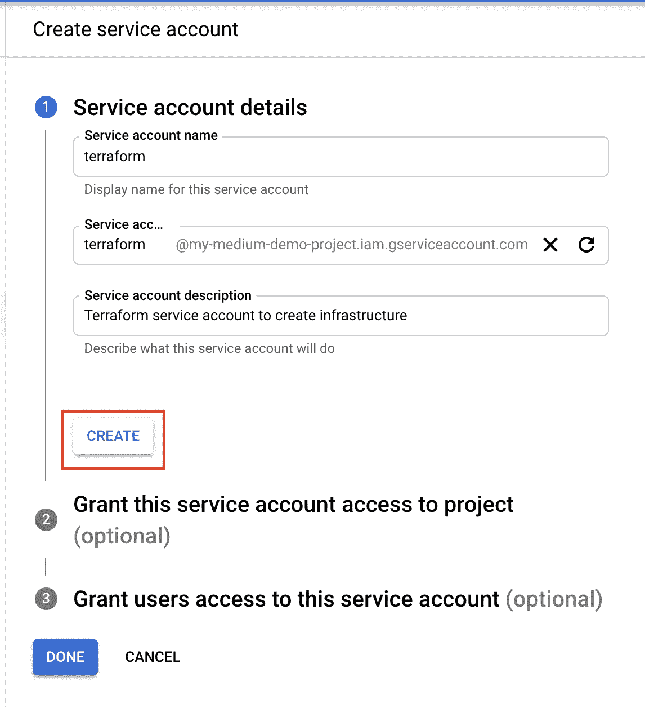

接下来，我们将“编辑”角色应用到这个服务帐户，这样他就可以访问项目的所有资源。尽管这为该服务帐户提供了很多“权力”,但它绝对有意义，因为该帐户必须创建/修改/删除我们稍后配置的所有资源。

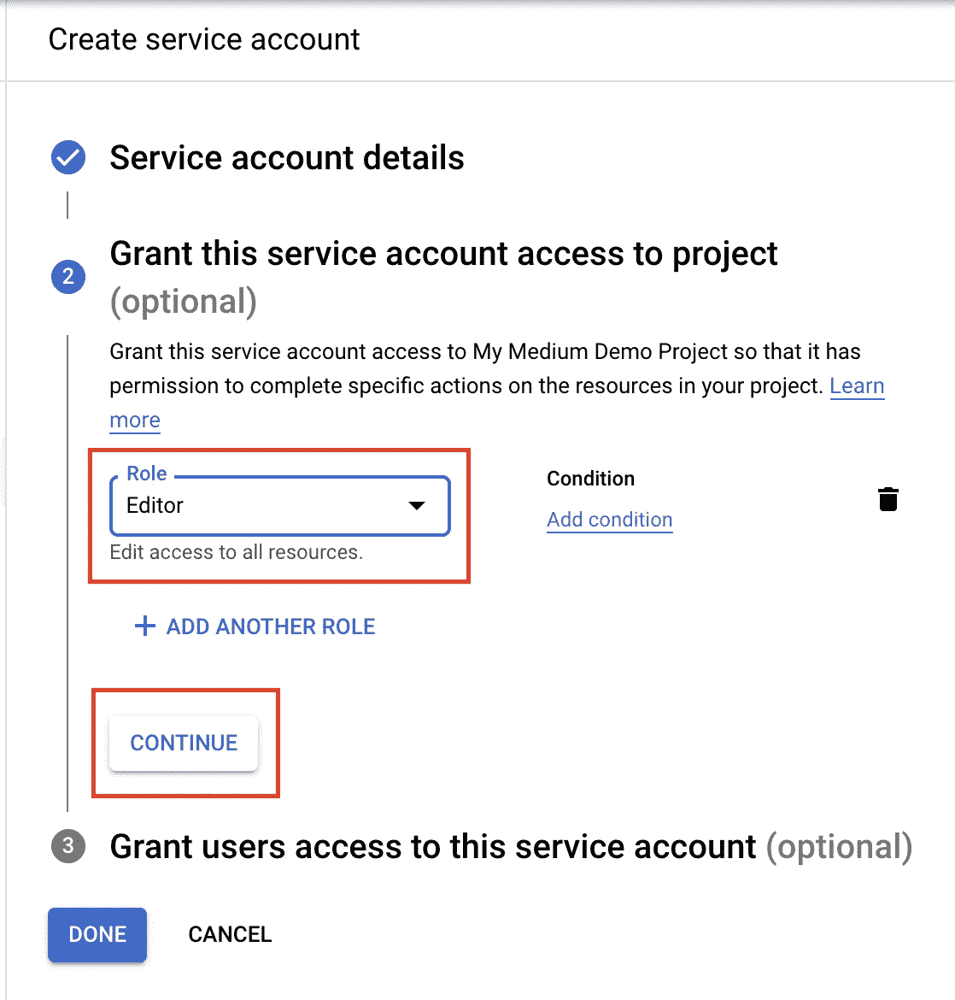

之后，我们只需点击“完成”,我们的服务帐户就创建好了。

回到“服务帐户”页面，我们点击右侧的三个点，然后单击“创建密钥”。

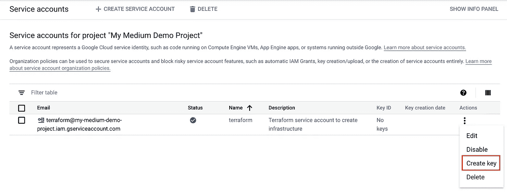

接下来，你选择想要使用的密钥类型，然后点击“创建”。我个人总是选择 JSON 键类型。

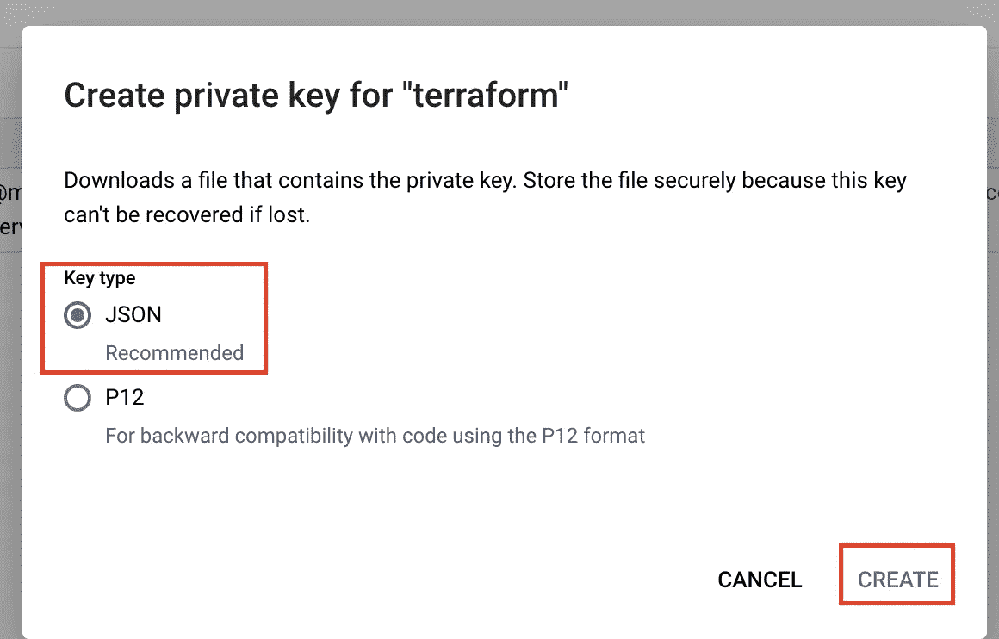

点击“Create”后，JSON 密钥会以纯文本的形式下载到您的文件系统中。请绝对确保您不会提交此文件或与其他人共享。否则，此人将获得您项目的编辑权限！我个人总是使用`gcloud kms encrypt`功能来加密密钥，以便能够将其提交给 VCS。但那是我以后要写的另一篇文章的一部分。

## 创建一个新的“状态”——桶

接下来，我们转到“存储”部分，在这里我们必须“启用计费”才能使用它。在这里，我们只需选择我们已经存在的帐单帐户，并确认它。

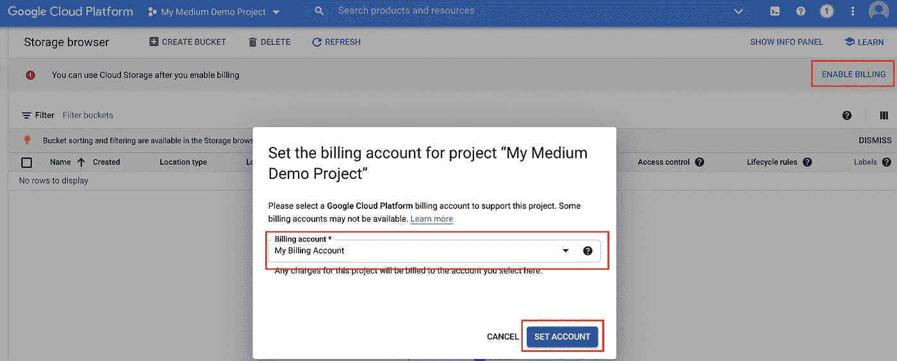

之后，我们可以通过“Create bucket”按钮创建一个新的 Bucket，输入一个名称，并在所有其他部分保留默认值。当然，您也可以自由地更改默认值，但是对于这篇简短的操作指南来说，这是没有必要的。该存储桶稍后将用于保存当前地形状态。称它为`XYZ-state`是一个很好的习惯，所以很明显它包含了一些`state`数据。

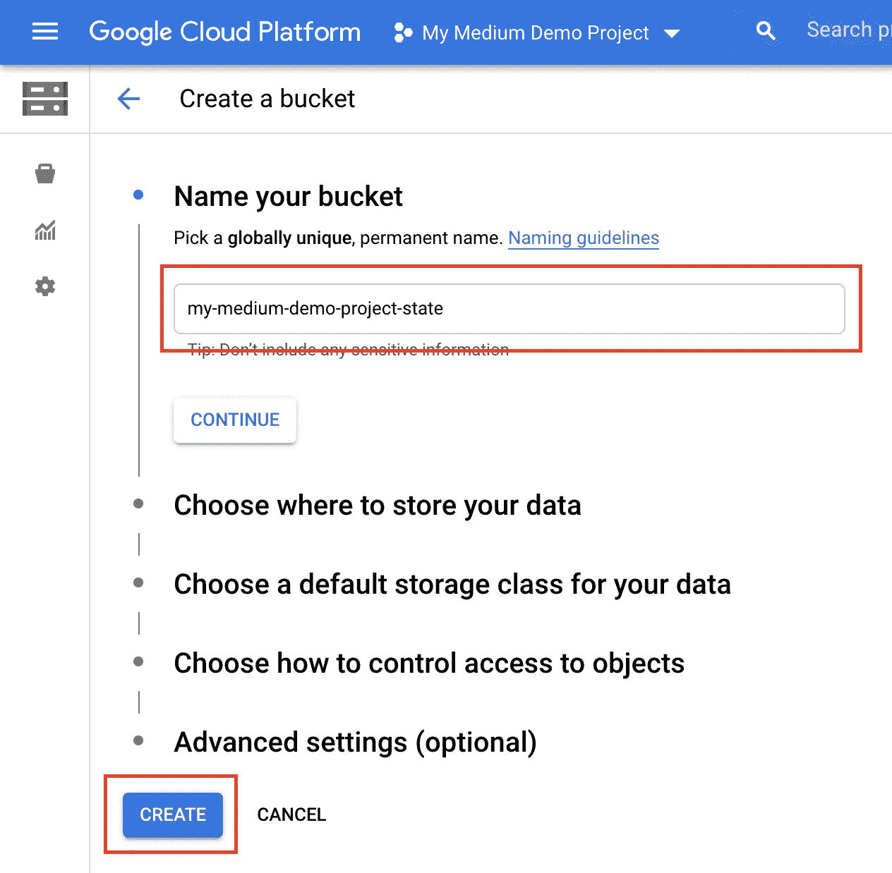

## 通过 Terraform 创建规格

所以足够 GCP 用户界面点击。理论上，你也可以通过 CLI 来完成，但是一开始，我认为 GUI 更有助于理解。

现在是时候得到一些地球上的东西了。

首先，让我们创建一个新的`main.tf`文件，其中包含我们的 Terraform 配置:

上述 terraform 代码的简短描述:

首先，我们必须告诉 Terraform 我们想要使用哪些提供商。因为我们想在 GCP 上工作，所以我们用版本`3.51.0`(我写这篇文章时的最新版本)来获取`hashicorp/google`。

下一步，我们声明一个后端。对于初始设置来说，这一步不是绝对必须的，但是在我看来，定义后端是非常重要的，也是最佳实践。如果您不提供后端，那么 Terraform 会将您的基础设施的当前状态保存到您的本地磁盘。但这在生产工作时会带来许多风险，例如，您必须始终将状态提交到您的 VCS，以便在运行 Terraform 时，项目中的其他所有人也可以获得最新状态，否则您会妨碍彼此，甚至可能会丢失/覆盖它。因此，为了解决这个问题，我们可以定义后端，它告诉 Terraform 应该查看一些 GCP 云存储，以找到 Terraform 创建的基础架构的当前状态，并在应用更改后，它还会写回此状态。因此，每个人都在运行这个 Terraform 文件，同时通过云共享当前状态。存储桶名称是我们刚刚在前面的设置步骤中通过 UI 创建的存储桶。

`prefix`是可选的，但是我推荐它，这样你的状态就不会保存在你的 bucket 的根级别上。本节中的`credentials`和随后的`provider "google"`都是在为 Terraform 创建服务帐户后下载的密钥的相对文件路径，在我的例子中，我将其重命名为`terraform-sa.json`。

## 初始化地形

现在终于到了在我们的 CLI 中运行一些实际命令来将这个计算实例设置到云的时候了！

作为启动 Terraform 的第一个命令，在修改了提供者或模块之后，您必须运行`terraform init`以便 terraform 可以检查它必须加载哪些依赖项。如果您不这样做，下面的命令将抛出错误，告诉您请运行`terraform init`。此外，init 命令将为 Terraform 创建初始状态。在我们的例子中，它也将直接上传到我们的 bucket。

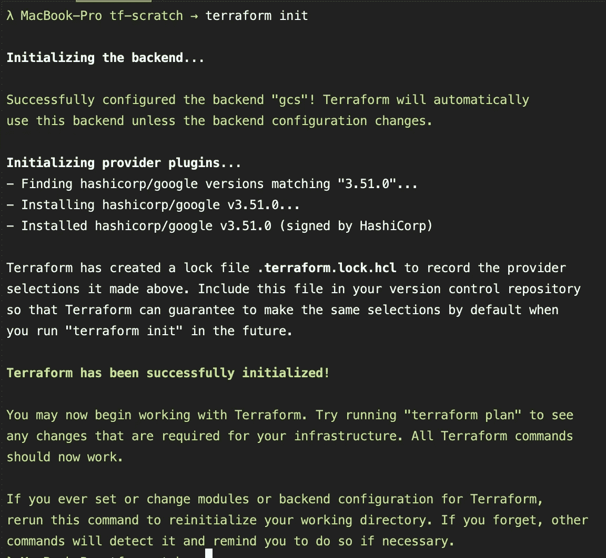

运行“地形初始化”

当您现在检查我们之前在您的 GCP 中创建的桶时，贵由将会看到`terraform init`命令创建了一个名为`default.tfstate`的新文件，包含我们的初始状态，它位于我们在`main.tf`文件中定义的前缀下提供的桶中。

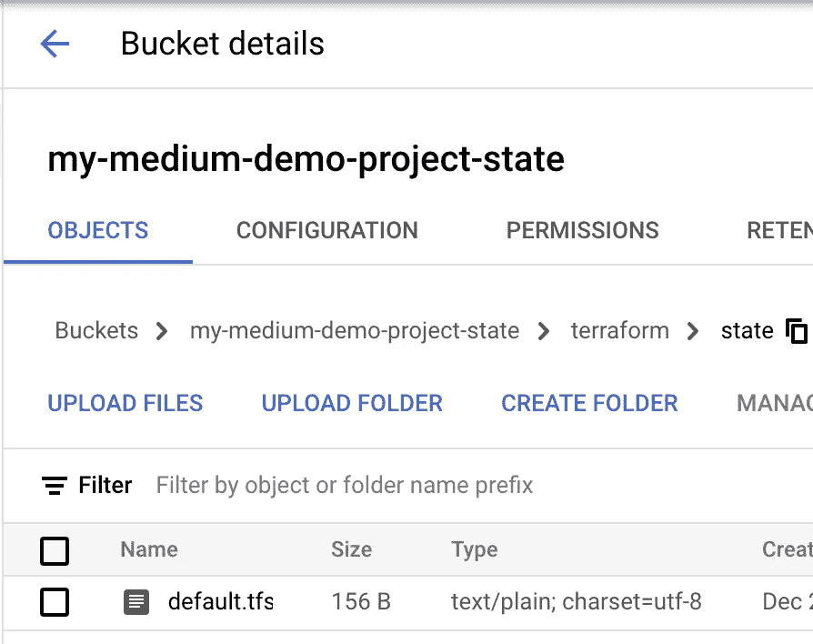

我们在 GCP 桶上的地形的初始状态

## 验证、规划和应用 Terraform

现在我们准备好出发了。但是在我们真正将我们的第一台机器部署到云之前，我们应该使用`terraform validate`和`terraform plan`来检查我们的配置。

`terraform validate`是一个超级快速的命令，它只是从语法的角度快速验证我们的配置是否正确，但是它不会检查属性值是否设置正确。无论哪种方式，我建议在运行`terraform plan`和`terraform apply`命令之前运行它，以便在进行大型部署时节省一些时间，这样会在语法级别上出错。

如果你只是从上面取了我的代码，`terraform validate`应该没问题，并告诉你你当前的配置是有效的。

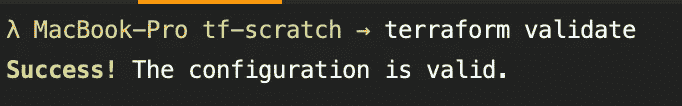

运行“地形验证”

如果我们现在运行`terraform plan`，terraform 会告诉我们，它将在云上创建三个资源，启用两个 API，设置一个计算实例，以及此配置。您可能会注意到这里有很多`(known after apply)`值。这是因为在部署资源之前，这些值中有许多是不可知的。例如，`id`是我们没有定义的东西，也不感兴趣，Google 应该在创建实例时处理它。

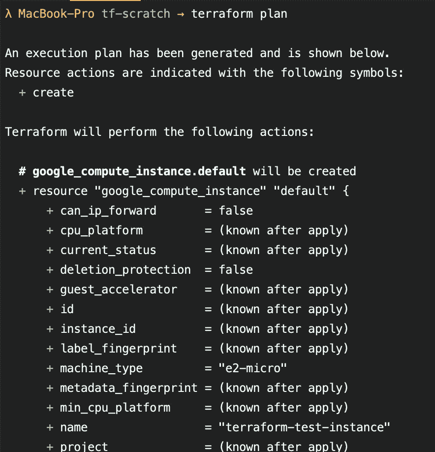

运行“地形计划”

当我们对 Terraform 告诉我们它将创建/修改/删除的资源感到满意时，我们可以进入下一步并运行`terraform apply`。当我们运行它时，Terraform 自动显示与`terraform plan`相同的输出，除了之后，它会问你是否真的要应用这些更改。你必须输入`yes`，然后按回车键确认。如果您想自动接受此步骤，您可以使用`terraform apply -auto-approve`来跳过此步骤并自动应用更改。

⚠️ **但是**我强烈建议你**不要**在任何生产系统中使用它，而只用于测试或者最多在沙盒系统中使用。改变基础设施总是至关重要的，这可能会在应用非预期的更改时导致许多错误。所以，一定要仔细检查你正在批准的东西！

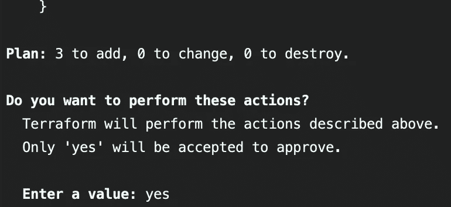

运行“terraform apply ”,并被 terraform 请求批准

由于上面的修改对我们来说似乎是正确的，我们输入`yes`并点击回车键来应用这些修改。

⚠️确保你已经根据你的需要修改了后端的桶名，项目 ID，以及`main.tf`文件中你的凭证文件的路径，因为它们对我的项目是唯一的！

等待最多几分钟后(启用 API 可能需要很长时间),您就可以在 CLI 中看到来自 Terraform 的成功消息，还可以查看 GCP GUI 上的计算引擎页面，并看到您现在是一个计算引擎的骄傲“所有者”😉。如果所有 API 都已启用，启动计算引擎应该只需要 10-30 秒。

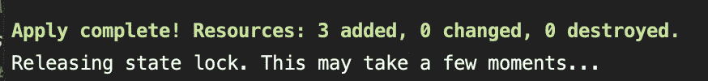

“terraform 应用”成功消息

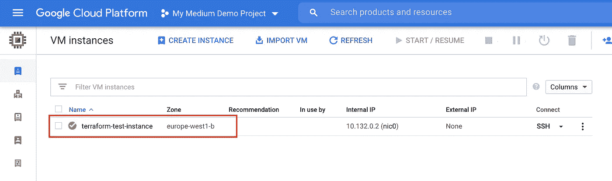

GCP 图形用户界面中计算引擎

## 打扫

当然，在这个简短的教程之后，我们希望清理我们的实例/资源，这样我们就不会产生不必要的成本。幸运的是，这至少和创建基础设施一样简单。

我们只需运行`terraform destroy`命令。运行这个命令 Terraform 会给我们提供一个资源列表，当我们进入`yes`时，这些资源将被销毁。类似于`apply`命令，我们也可以使用`-auto-approve`标志来跳过确认，但是不推荐这样做。

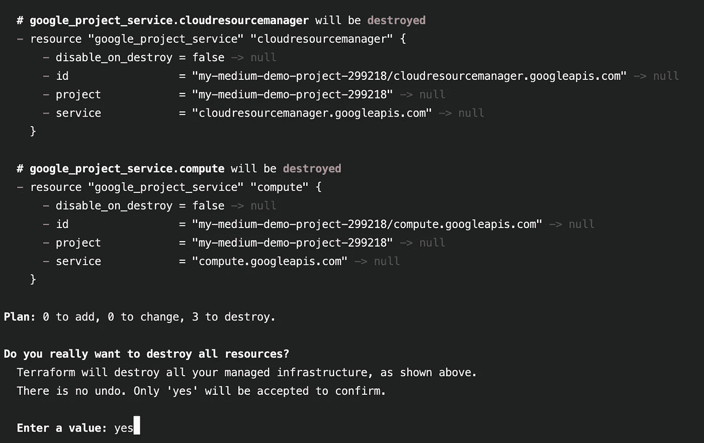

运行“地形破坏”

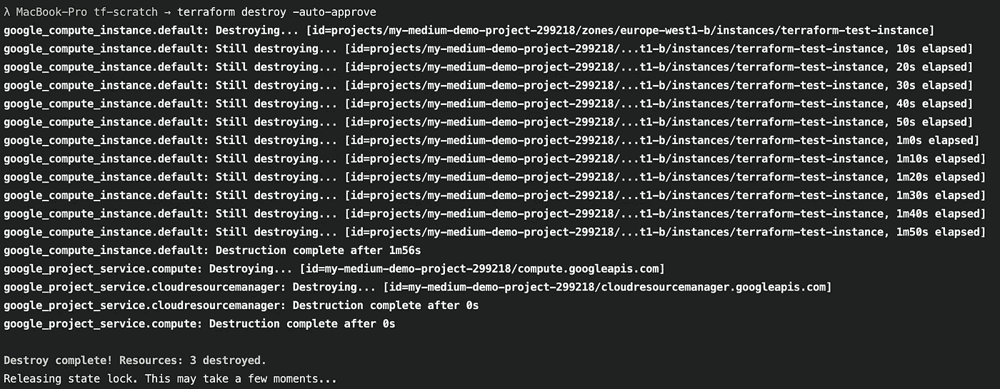

“地形破坏-自动批准”的输出

现在，您的基础架构又干净了。

## 摘要

我希望我能给你一个很好的介绍，告诉你如何使用 GCP 从头开始建立你的下一个 Terraform 项目。

感谢您花时间阅读我的文章。

## 你想联系吗？

如果你想联系我，请在 LinkedIn 上打电话给我。

另外，请随意查看我的书籍推荐📚。

 [## 我的书籍推荐

### 在接下来的章节中，你可以找到我对所有日常生活话题的书籍推荐，它们对我帮助很大。

mr-pascal.medium.com](https://mr-pascal.medium.com/my-book-recommendations-4b9f73bf961b)  [## 通过我的推荐链接加入 Medium—Pascal Zwikirsch

### 作为一个媒体会员，你的会员费的一部分会给你阅读的作家，你可以完全接触到每一个故事…

mr-pascal.medium.com](https://mr-pascal.medium.com/membership)