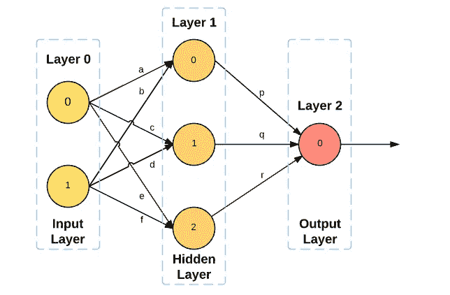
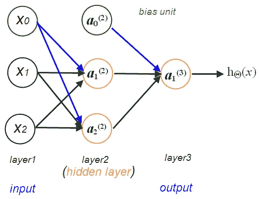

# 神经网络基础入门

> 原文：<https://levelup.gitconnected.com/getting-started-with-the-basics-of-neural-network-4893d643785e>

随着机器学习和人工智能的兴起，对神经网络的需求也在增加。神经网络由一系列算法组成，这些算法通过类似于人脑工作方式的方法在数据集中搜索连接。

神经网络可以修改输入；结果，网络产生了更好的输出，而无需重新调整输出原理。

使用 Python 构建一个简单的神经网络可能看起来很复杂，但是使用正确的方法和步骤，可以顺利完成。除了过程，因为我们使用 python，你应该注意[最常见的 Python 编程错误](https://codeforgeek.com/most-common-python-programming-mistakes/)以获得更好的结果。

# 构建简单神经网络的步骤

神经网络的结构通常是多重的，并涉及包含数百万个神经元的各种层来处理数据集。我们将从一个简单的网络开始，以便更好地理解和掌握。



这篇文章将是关于基本的和主要的双层网络。这项任务可以通过有限且可访问的数据集来完成。

# 1:前馈传播



输入`X`允许到达所有层的单元的信息产生输出。网络的架构分析宽度、深度，并激活每一层的特征。深度反映隐藏层的数量，而宽度显示每个层上的单元数量。此外，还有一些设置激活操作，如双曲正切、Sigmoid 和整流线性。

# 2:可视化数据

神经网络的功能取决于许多变量，因为它获取输入、处理计算并传递输出。把它想象成各层神经元的形式，因为单层的每一个神经元都与前后各层的神经元相连。所有的计算都发生在这些神经元内，并根据神经元之间的连接权重而变化。关键是获得正确的重量，以达到预期的效果。

# 3:模型表示

在神经网络中，建议对分析性复发进行分析，并将其放在类似于大脑的架构中。它具有变体，因为除了作为权重的θ参数之外，逻辑函数还被称为 sigmoid 激活特征。

对于激活单元，重新估计和确定前一层中每个单元的加权输入。可以说，神经网络具有执行通常具有更高和更高级输入的统计复发的想法的效果。

# 4:成本函数

它指的是关于可靠样本和预期输出的神经网络质量的度量。这也可能依赖于偏差和权重之类的波动。成本函数必须被认为是单个值，而不是向量，因为它相当于神经网络的属性。

事实上，成本函数是一种神经网络。

```
C (W,B,Sr,Er)
```

这里`W`是神经权重的权重，`B`是它的一个偏差，`S`代表输入，`E`是预期输出。对于层`i`中的任何神经元`j`，关注`Y i/j`和`A i/j`是有用的，因为这两个值依赖于`W`、`B`和`Sr`。

# 5:s 形渐变

sigmoid 函数最适合最后一个图层，因为它的结束值范围为 0 到 1。然而,(双曲正切)更适合隐藏层，所有其他使用的函数都适用。使用的参数是权重`W1`、`W2`和偏差`b1`、`b2`。`W1`和`b1`是输入层和隐藏层的链接，而`W2`和`b2`是隐藏层和结束层的链接。根据神经网络的基本规则，激活`A1`和`A2`估计如下:

```
A1 = h(W1*X+b1)
A2 = g(W2*A1+b2)
```

这里的`g`和`h`代表激活功能，`W1`、`W2`、`b1`、`b2`为常用模式。这通过实现如下 sigmoid 激活函数将该过程引向原始代码:

```
g (z) = 1/(1+e^(-z))
```

这里`z`代表一个矩阵。`numpy`用于矩阵计算，使编码相对容易。

# 6:随机初始化

这导致神经网络算法的最具挑战性的步骤，即反向传播。该函数将针对网络的 4 个参数，即(`W1`、`W2`、`b1`、`b2`)，反弹损失函数的梯度。

# 7:梯度检查

在获得损失函数的所有梯度之后，使用梯度下降算法来更新参数。一圈所需的所有任务的实现都完成了。现在，这些将被放在主程序的一个函数中。该函数用作矩阵`X`和`Y`的输入，单位`n_x`、`n_h`、`n_y`，梯度下降算法的迭代总数，并联合所有函数返回参数。

# 8:学习参数

在这一步，该函数将重新获得神经网络的参数。该函数预测(X 个参数)将元素的矩阵 X 作为输入。为此，需要异或函数的计算机，并且通过使用 0.5 的边缘来回弹期望结果 y 的模型的参数。

所有需要的功能都差不多完成了。现在进入主程序，维护矩阵 X 和 Y 以及超参数`n_x`、`n_h`、`n_y`、`num_of_iters`、`learning_rate`。有了这个设置，训练模型就容易多了。

# 摘要

要了解关于这个主题的更多信息，面向初学者的免费 python 编程课程会很有用。为了建立一个具有多层和隐藏单元的更广泛的网络，将需要算法的其他变体。以上步骤很有帮助，可以在任何级别使用 Python 构建神经网络。

*原载于*[*https://codeforgeek.com*](https://codeforgeek.com/basics-neural-network/)*。*