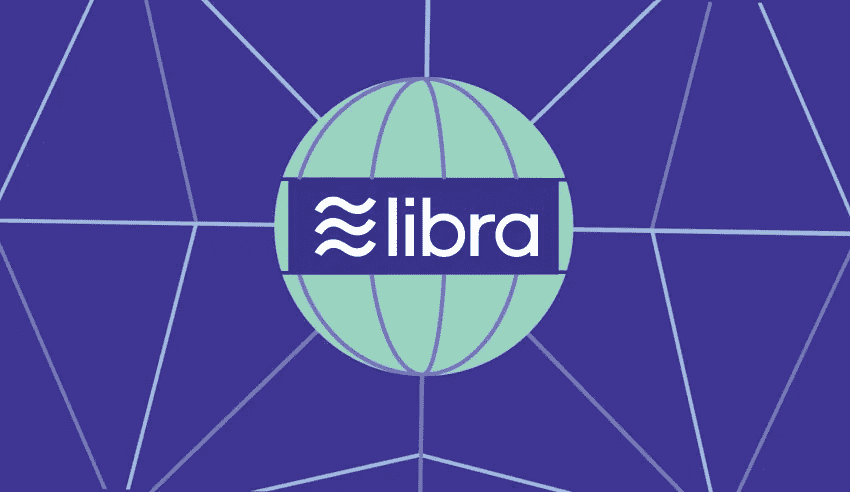
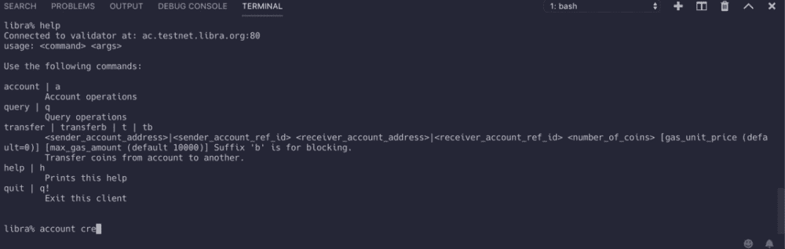

# 开始使用新的脸书 Libra 编程语言

> 原文：<https://levelup.gitconnected.com/getting-started-with-the-facebook-libra-programming-language-a1d21aa837e0>



脸书今天发布了一种名为 Libra 的新加密货币

acebook [透露](https://techcrunch.com/2019/06/18/facebook-libra/)它是新的全球加密货币和编程环境，名为 Libra。天秤座会让你买东西或者送钱给人，费用几乎为零。大多数都是早期炒作，因为现在说它有多好还为时过早。

[](https://techcrunch.com/2019/06/18/facebook-libra/) [## 脸书宣布天秤座加密货币:你需要知道的一切

### 脸书终于公布了其加密货币 Libra 的细节，这种货币可以让你买东西或汇款给…

techcrunch.com](https://techcrunch.com/2019/06/18/facebook-libra/) 

脸书也给了我们一些代码来玩，所以让我们试一试。我们将深入技术部分。如果你想跳过编程，可以看看上面的 TechCrunch 文章。如果你是加密货币的新手，我建议阅读“ [*《比特币和区块链的基础:加密货币及其技术简介*](https://amzn.to/313o8FS) ”一书。

> Libra 的使命是建立一个简单的全球货币和金融基础设施，为数十亿人提供支持。


[天秤座如何工作](https://libra.org/en-US/vision/#how_it_works)

*天秤座*是货币， *Move* 是天秤座的编程语言。移动语言是用 Rust 语言写的。

为什么生锈？我只能猜测，Rust 已经被证明是一种设计非常好的、健壮的、快速的、安全的、有趣的语言。

“Move”是一种新的编程语言，用于在 Libra 区块链上实现定制交易逻辑和“智能合约”。由于 Libra 的目标是每天服务数十亿人，Move 的设计以安全和保障为最高优先级。


[https://github.com/libra/libra](https://github.com/libra/libra)

Rust 绝对击败了 2019 年 StackOverflow 调查，成为最受欢迎的编程语言。我希望在未来几年能更经常地听到关于铁锈的消息。


[https://insights . stack overflow . com/survey/2019 #最喜欢最害怕最想要的](https://insights.stackoverflow.com/survey/2019#most-loved-dreaded-and-wanted)

幸运的是，我们不必了解 Rust 就可以开始了解天秤座。但是如果你仍然想学习 Rust，这本“[*《Rust 编程语言*](https://amzn.to/2LRBbql) ”的书实际上是开始学习 Rust 的地方。

下面是我们开始用 Libra 语言编程所需要的东西。


# 假设

本文档中的所有命令都假定:

*   您运行的是 Linux (Red Hat 或基于 Debian)或 macOS 系统。
*   您有稳定的互联网连接。
*   `git`已安装在您的系统上。
*   家酿安装在 macOS 系统上。
*   `yum`或`apt-get`安装在 Linux 系统上。

# 克隆 Libra 核心存储库

```
git clone [https://github.com/libra/libra.git](https://github.com/libra/libra.git)
```

# 设置 Libra 核心

要安装 Libra Core，转到`libra`目录并运行安装脚本来安装依赖项，如下所示:

```
cd libra
./scripts/dev_setup.sh
```

安装脚本执行以下操作:

*   安装`rustup`——这是 Rust 编程语言的安装程序，Libra Core 就是用它实现的。
*   安装所需版本的`rust-toolchain`。
*   安装`CMake` —管理构建过程。
*   安装`protoc` —一个用于协议缓冲区的编译器。
*   安装 Go —用于构建协议缓冲区。


如果您的设置失败，请参见[故障排除](https://developers.libra.org/docs/my-first-transaction#setup)

# 构建 Libra CLI 客户端并连接到 Testnet

要连接到 Libra testnet 上运行的验证器节点，运行如下所示的客户端。

```
./scripts/cli/start_cli_testnet.sh
```


抓紧了，这可能需要一些时间。

一旦客户端连接到 testnet 上的一个节点，您将会看到下面的输出。要随时退出客户端，请使用`quit`命令。

# 检查 CLI 客户端是否正在您的系统上运行


如果您看到**“连接到验证器”**，则一切就绪。如果没有，请排除故障，参见[故障排除](https://developers.libra.org/docs/my-first-transaction#setup)

# 创建您的钱包帐户

请注意，使用 CLI 创建帐户不会更新区块链，它只是创建一个本地密钥对。

要创建 Alice 的帐户，请输入以下命令:

`libra% account create`



创建钱包

如果一切顺利，我们应该得到一个公共地址。


创建第一个钱包

`#0`是我们账户的索引，十六进制字符串是我们账户的地址。

# 处理

对于交易，我们需要另一个钱包来发送。所以再创造一个。


创建第二个钱包

你不必记住所有这些，使用`account list`命令。


列出所有帐户

# 向我们的钱包中添加硬币


*   0 是钱包帐户的索引。
*   150 是天秤座要加到我们钱包里的金额。

成功的帐户造币命令还将在区块链上创建 wallet #0 帐户。

# 检查余额


我们查询钱包的余额，记住`0`是我们钱包的索引。


# 转账

要提交将 10 Libra 从#0 账户转移到#1 账户的交易，请输入以下命令:

`libra% transfer 0 1 10`

*   0 是#0 帐户的索引。
*   1 是#1 帐户的索引。


将钱从钱包 0 转移到钱包 1

检查余额。


# 恭喜你！

你做到了！我们仅仅触及了表面，接下来你应该学习移动语言。[从这里开始](https://developers.libra.org/docs/move-overview)

[](https://developers.libra.org/docs/move-overview) [## 移动天秤座入门

### Move 是一种新的编程语言，旨在为 Libra 区块链提供安全和可编程的基础。安…

developers.libra.org](https://developers.libra.org/docs/move-overview) 

# 天秤座生态系统

天秤座生态系统由不同类型的实体组成:

*   [客户](https://developers.libra.org/docs/welcome-to-libra#clients)
*   [验证器节点](https://developers.libra.org/docs/welcome-to-libra#validator-nodes)
*   [开发者](https://developers.libra.org/docs/welcome-to-libra#developers)

# 客户

天秤座客户:

*   是一款能够与 Libra 区块链交互的软件。
*   可以由最终用户或代表最终用户运行(例如，对于托管客户端)。
*   允许用户构造、签署和提交交易到一个[验证器节点](https://developers.libra.org/docs/reference/glossary#validator-node)。
*   可以向 Libra 区块链发出查询(通过 validator 节点)，请求交易或账户的状态，并验证响应。

# 验证器节点

[验证器节点](https://developers.libra.org/docs/reference/glossary#validator-node)是 Libra 生态系统中的实体，它们共同决定哪些交易将被添加到 Libra 区块链中。验证器使用一个[一致协议](https://developers.libra.org/docs/reference/glossary#consensus-protocol)，这样它们可以容忍恶意验证器的存在。

验证器节点维护区块链上所有事务的历史记录。在内部，验证器节点需要保持当前状态来执行事务并计算下一个状态。我们将在事务的[生命周期中了解更多关于验证器节点的组件。](https://developers.libra.org/docs/life-of-a-transaction)

# 开发商

Libra 生态系统支持各种各样的开发者，从为 Libra Core 做贡献的人到使用区块链构建应用程序的人。术语“开发人员”包括所有这些群体。开发人员可能:

*   建立天秤座客户。
*   构建与 Libra 客户端交互的应用程序。
*   撰写在区块链执行的智能合约。
*   贡献给 Libra 区块链软件。

## 关于天秤座的更多信息

[](https://decrypt.co/7502/facebook-libra-coin-cryptocurrency-launch-calibra) [## 脸书向世界揭示了天秤座这个重要的新密码

### 经过两年的猜测，脸书终于推出了“天秤币”，一种据说将…

decrypt.co](https://decrypt.co/7502/facebook-libra-coin-cryptocurrency-launch-calibra) [](https://hackernoon.com/the-ultimate-guide-to-understanding-blockchain-and-cryptocurrencies-f37cf4c0043) [## 理解区块链和加密货币基础知识的终极指南

### 如果你看了那个滑稽讽刺的家伙解释比特币，却几乎一点也不理解——不要担心——今天我们…

hackernoon.com](https://hackernoon.com/the-ultimate-guide-to-understanding-blockchain-and-cryptocurrencies-f37cf4c0043) [](https://medium.com/free-code-camp/how-to-setup-a-powerful-api-with-graphql-koa-and-mongodb-339cfae832a1) [## 如何用 GraphQL、Koa 和 MongoDB 建立一个强大的 API

### 构建一个 API 超级好玩！尤其是当您可以利用 Koa、GraphQL 和 MongoDB 等现代技术时。

medium.com](https://medium.com/free-code-camp/how-to-setup-a-powerful-api-with-graphql-koa-and-mongodb-339cfae832a1) [](https://medium.com/swlh/im-giving-out-my-best-business-ideas-hoping-someone-will-build-them-fcdd83db7879) [## 我给出了我最好的商业想法，希望有人会创造它们

### 是的，我给出了一些我最好的想法。我不是圣人，但我绝对属于那种做事…

medium.com](https://medium.com/swlh/im-giving-out-my-best-business-ideas-hoping-someone-will-build-them-fcdd83db7879)