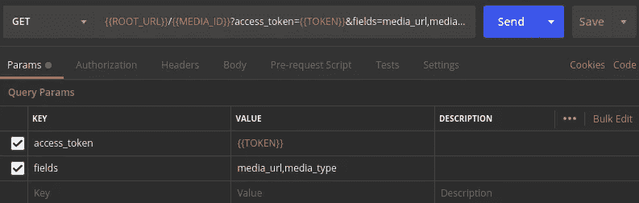
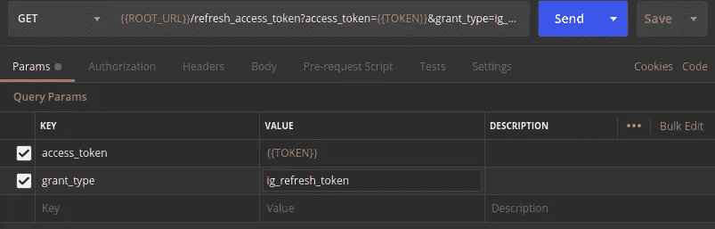

# Instagram 基本显示 API 入门

> 原文：<https://levelup.gitconnected.com/getting-started-with-the-instagram-basic-display-api-5124c92c4935>


## 使用脸书新 Instagram 基本显示 API 的快速入门教程

为了保护用户的安全和隐私，脸书最近对他们的 Instagram API 进行了彻底检查。新的 Instagram 基本显示 API，提供基本的消费者使用访问，[于 2019 年 10 月 15 日](https://developers.facebook.com/blog/post/2019/10/15/launch-instagram-basic-display-api/)推出。这对使用将于 2020 年 3 月 31 日关闭的 c̶u̶r̶r̶e̶n̶t̶遗留 API 的第三方应用开发者产生了巨大影响。

基本的显示 API 仍在开发中。最近，[脸书提供了对长期 API 令牌](https://developers.facebook.com/blog/post/2020/01/14/instagram-basic-display-api-long-lived-access-tokens-available/)的支持，其有效期为 60 天。以前，只有短暂的 API 令牌可用，它们的有效期只有 1 小时。

> 在这个快速入门教程中，我们将带您完成获得长期令牌的步骤，以便您可以开始向 Instagram Basic Display API 发送请求。有了这个令牌，您就可以尝试熟悉这个 API 了。

本教程假设您具备以下条件:

*   **一个脸书开发者账户**，你将需要它来创建一个脸书/Instagram 应用。当然，我们不会在这里构建一个完整的应用程序，但是我们需要一个应用程序 ID 和密钥来访问 API。
*   **一个 Instagram 账户**——你将在 API 中查询一个实际 Instagram 用户的个人资料和帖子数据，该用户已经允许你的“应用”这样做。你需要一个 Instagram 账户，以便*成为那个用户*并给予你的应用许可。
*   **访问** `**curl**` **或邮递员。**我们对 API 的第一个请求将在 web 浏览器中发送(稍后将详细介绍),以获取授权代码。一旦我们有了授权代码，对 API 的所有其他请求都是基本的 HTTP `GET`和`POST`请求，这些*可以通过`curl`完成。然而，为了让我们的请求更有条理，我们将使用 Postman(你可以在这里[下载](https://www.postman.com/downloads/))。*

你准备好开始了吗？我们走吧。

## 创建一个使用 Instagram 平台的新脸书应用程序

首先，我们需要用脸书创建一个新的应用程序。每个在脸书注册的应用程序都有自己的 API 密钥和密码，作为应用程序的开发者，你需要这些密钥和密码来调用脸书的任何 API(包括 Instagram 基本显示 API)。

在为开发者登录[脸书后，你会看到一个“我的应用”的菜单项，在这个菜单项下你应该点击 ***创建应用*** 。](https://developers.facebook.com)

您将被要求提供一个应用程序*显示名称*和*联系人电子邮件*，您可以自行决定:


点击 ***创建应用 ID*** 。

现在您的脸书应用程序已经创建，您需要设置一些配置以使其可用。

首先，我们要设置我们的应用程序的平台。出于我们的目的，我们将创建一个 *web* 应用程序。从应用仪表板，在左侧栏的“设置”菜单下，点击*。*

**

*在基本设置页面上，滚动到最底部，您会看到一个按钮 ***添加平台*** 。点击此按钮。您将看到一组平台选项。点击 ***网站*** ，会在你的 app 基础设置中增加一个新的网站入口。你需要为你的“网站”添加一个网址——你可以随意添加任何你喜欢的网址。你不会用它的。然后，点击页面下方的 ***保存修改*** 。*

**

*接下来，你需要给你的应用添加 Instagram 功能。在页面侧边栏上，点击 ***产品*** 菜单项。这将带您进入“添加产品”页面。你会看到 Instagram 列在那里——点击 ***设置*** 。*

*现在，你会看到 Instagram 列在侧边栏的“⊕.产品”下面点击 ***基本显示工具条中的*** 。*

**

*在这个页面的底部，你会看到一个 ***新建 App*** 按钮。点击此按钮创建 Instagram 应用程序。类似于你的脸书应用，你需要给这个 Instagram 应用一个*显示名称*。选择你喜欢的任何东西。*

*现在，你的应用已经设置为 Instagram 应用。你会注意到当前的“基本显示”页面现在有了更多的信息，包括你的 **Instagram 应用 ID** 和你的 **Instagram 应用秘密**。这是**非常重要的** —当您稍后进行 API 调用时，您将需要您的 Instagram 应用 ID 和您的 Instagram 应用机密。这些密钥**与你的脸书应用 ID 和应用密码**不同(你在本教程的其余部分将不需要它们)。*

**

*记下你的 Instagram 应用 ID 和密码！你很快就会需要这些了！*

*在页面的下部，您将看到输入您的*有效 OAuth 重定向 URIs* 、一个*取消授权回调 URL* 和一个*数据删除请求 URL* 的字段。您将需要为所有这 3 个输入有效的网址才能继续，但实际上我们稍后将遇到的只是有效的 OAuth 重定向 URI。*

*这些是什么？这些是特定的网址，一旦用户在 Instagram 上执行了某个操作，脸书/Instagram 就会将他们重定向到这些网址。例如，Instagram 有一个所谓的“授权窗口”。弹出的窗口显示，“ *John 的超级 Instagram 应用程序将请求访问您的 Instagram 数据。您要授权此应用执行此操作吗？”*在 Instagram 用户告诉 Instagram 授权后，Instagram 将*重定向*用户回到你的应用程序——到*有效 OAuth 重定向 URI* 。你需要告诉 Instagram 把那些用户重定向到哪里。*

*Instagram 需要这些条目的有效 URL。你并不真正关心网址是什么。再往下，我们将学习如何在 Instagram 进行重定向后获取我们需要的数据。尽管如此，我们仍然需要一个产生有效的`200` HTTP 状态的网页 URL。我推荐使用 [httpstat.us](https://httpstat.us) 。该站点根据您的请求返回 HTTP 状态代码。例如，[https://httpstat.us/200](https://httpstat.us/200)返回一个状态`200`，而[https://httpstat.us/403](https://httpstat.us/403)返回一个状态`403`。我们将对所有条目使用`200`:*

**

*对于本教程，您的应用程序还需要获得授权，才能访问 Instagram 用户的*个人资料*数据和*媒体*(帖子)数据。在页面的下方，你会看到“Instagram 基本展示应用评论”在这下面，您将看到`instagram_graph_user_profile`和`instagram_graph_user_media`的列表。对于这两者，点击右侧的 ***添加到提交*** 按钮。*

**

*点击页面下方的 ***保存修改*** 。*

*这部分你差不多完成了。最后要做的是在你的 app 中添加一个 Instagram 测试用户。因为你的应用还在开发中，还没有被审查和批准现场使用(我们不会这么做)，所以你只能让特定的 Instagram 用户测试你的应用。您需要将这些测试用户添加到您的应用程序设置中。*

*在左侧边栏菜单的“角色”下，点击 ***角色*** 。*

**

*在页面底部的“Instagram 测试者”下，点击 ***添加 Instagram 测试者*** 。在弹出的窗口中，输入您将在使用 API 时使用的 Instagram 帐户的用户名。然后，点击 ***提交*** 。*

*您输入的 Instagram 用户将收到邀请成为测试员。要接受此邀请，您需要在网络浏览器中登录 Instagram。然后，导航到您的“设置”并找到“应用程序和网站”您将看到一个“Tester Invites”列表，您新创建的应用程序应该列在该列表下。*

**

*点击 ***接受*** 。*

*好吧！你的应用已全部设置完毕。它被配置为与 Instagram 配合使用。你有一个 Instagram 应用程序 ID 和密码。您邀请了一名 Instagram 用户成为应用测试员，该 Instagram 用户已经接受了邀请。现在是时候前进了！*

## *允许您的应用程序访问您的 Instagram 帐户的个人资料和媒体*

*Instagram 网站应用的典型流程是这样的:*

1.  *在网站上，有一个按钮，上面写着类似于 ***连接我的 Instagram 账户*** 。*
2.  *用户点击这个按钮，会将用户重定向到 Instagram，显示一个“授权窗口”。在幕后，该重定向将某些数据传递给 Instagram(例如，您的 Instagram 应用程序 ID 和用户在授权您的应用程序后应被重定向回的 URL)。*
3.  *用户点击 ***授权*** 按钮。Instagram 会将用户重定向到您提供的任何有效的 OAuth 重定向 URI(T15 )(我们在上面讨论过)。当 Instagram 进行重定向时，它还包括一个授权码作为`GET`查询参数。*
4.  *在幕后，您使用该授权代码并调用 API 以将其交换为令牌，然后使用该令牌对 API 进行后续调用。*

*现在，出于我们的目的，我们不打算构建一个带有按钮的网页。我们只需要立即将浏览器发送到授权窗口页面。该页面的 URL 是:*

```
*https://api.instagram.com/oauth/authorize
  ?client_id={instagram-app-id}
  &redirect_uri={redirect-uri}
  &scope={scope}
  &response_type=code*
```

*对于`instagram-app-id`，您将使用 **Instagram 应用 ID** ，该 ID 显示在🡒 Instagram 🡒产品基本展示页面上。**重要提示:**确保你使用的是你的 Instagram 应用 ID，而**不是**你的脸书应用 ID。*

*对于`redirect-uri`，使用`[https://httpstat.us/200](https://httpstat.us/200)` —这是我们为我们的应用程序列出的*有效 OAuth 重定向 URI* 。*

*对于`scope`，我们希望我们的 API 测试能够访问 Instagram 用户的*个人资料*和*媒体*(帖子)数据。所以，`scope`，会是`user_profile,user_media`。*

*总而言之，您的授权窗口应该如下所示:*

```
*https://api.instagram.com/oauth/authorize?client_id=6201234567890178&redirect_uri=https://httpstat.us/200&scope=user_profile,user_media&response_type=code*
```

*在 web 浏览器中输入该 URL。如果您还没有登录 Instagram(作为您在上面邀请的 Instagram 测试用户)，那么您将被要求登录 Instagram。登录。*

*接下来，您将看到授权窗口:*

**

*点击 ***授权*** 。*

*现在，Instagram 将你的网络浏览器重定向到`[https://httpstat.us/200](https://httpstat.us/200.)`——这是我们通过提供`redirect_uri`告诉它做的。你的浏览器中显示的网页毫无用处；它只会说`200 OK`。但是，对我们来说重要的是附加在重定向 URL 后面的**授权码**。如果您查看浏览器的 URL 栏，您应该会看到一个类似如下的 URL:*

```
*[https://httpstat.us/200?code=**AQBvJwCZtYdj1zLH_5myoAA1GRRpDhs1vcHFMzB4gvRk6dLkq5dNd24EVZ5FD9WoqQhfSuo6arUB17MPu2gRqEzP6EpsAl-9_2eC9-L6mWYQdWDyarkwDSNEs8T3gvoH-**](https://httpstat.us/200?code=AQBvJwCZtYdj1zLH_5myoAA1GRRpDhs1vcHFMzB4gvRk6dLkq5dNd24EVZ5FD9WoqQhfSuo6arUB17MPu2gRqEzP6EpsAl-9_2eC9-L6mWYQdWDyarkwDSNEs8T3gvoH-mWFaJGvbj1wiLKTdw2z1gBocF34Qd4mFGUf5WIzCmoBLh4io59eB5EGGFoiYzuILxZPDudKOXVQv3ESFzD_G03scHtUraFlEX5faCvz6ZO7Xw#_)**WLMHzhwwd6DJqP5PxJGf2ve53m7aGMEua3MzV8FZQVz5AfwWPN3G87n25jMBGgGGVj6G4pxJ9HqzNKmdpYK8GHKnRn**[**_G03scHtUraFlEX5faCvz6ZO7Xw**#_](https://httpstat.us/200?code=AQBvJwCZtYdj1zLH_5myoAA1GRRpDhs1vcHFMzB4gvRk6dLkq5dNd24EVZ5FD9WoqQhfSuo6arUB17MPu2gRqEzP6EpsAl-9_2eC9-L6mWYQdWDyarkwDSNEs8T3gvoH-mWFaJGvbj1wiLKTdw2z1gBocF34Qd4mFGUf5WIzCmoBLh4io59eB5EGGFoiYzuILxZPDudKOXVQv3ESFzD_G03scHtUraFlEX5faCvz6ZO7Xw#_)*
```

*我们有授权码了！有了这些代码，我们可以开始使用 **Postman** 来调用 API。*

*重定向 URL 中的授权码是从`code=`到(但不包括)结尾的`#_`的所有内容。因此，在上面的 URL 中，授权代码应该是:*

```
*[AQBvJwCZtYdj1zLH_5myoAA1GRRpDhs1vcHFMzB4gvRk6dLkq5dNd24EVZ5FD9WoqQhfSuo6arUB17MPu2gRqEzP6EpsAl-9_2eC9-L6mWYQdWDyarkwDSNEs8T3gvoH-](https://httpstat.us/200?code=AQBvJwCZtYdj1zLH_5myoAA1GRRpDhs1vcHFMzB4gvRk6dLkq5dNd24EVZ5FD9WoqQhfSuo6arUB17MPu2gRqEzP6EpsAl-9_2eC9-L6mWYQdWDyarkwDSNEs8T3gvoH-mWFaJGvbj1wiLKTdw2z1gBocF34Qd4mFGUf5WIzCmoBLh4io59eB5EGGFoiYzuILxZPDudKOXVQv3ESFzD_G03scHtUraFlEX5faCvz6ZO7Xw#_)WLMHzhwwd6DJqP5PxJGf2ve53m7aGMEua3MzV8FZQVz5AfwWPN3G87n25jMBGgGGVj6G4pxJ9HqzNKmdpYK8GHKnRn[_G03scHtUraFlEX5faCvz6ZO7Xw](https://httpstat.us/200?code=AQBvJwCZtYdj1zLH_5myoAA1GRRpDhs1vcHFMzB4gvRk6dLkq5dNd24EVZ5FD9WoqQhfSuo6arUB17MPu2gRqEzP6EpsAl-9_2eC9-L6mWYQdWDyarkwDSNEs8T3gvoH-mWFaJGvbj1wiLKTdw2z1gBocF34Qd4mFGUf5WIzCmoBLh4io59eB5EGGFoiYzuILxZPDudKOXVQv3ESFzD_G03scHtUraFlEX5faCvz6ZO7Xw#_)*
```

*抓住那个密码。我们需要它。顺便说一下，授权码的有效期为 1 小时，只能使用一次。*

## *使用授权码获得一个短期 API 令牌*

*虽然您可以使用`curl`来进行我们将在本教程中使用的其余 API 调用，但我们将使用 Postman，这(在我看来)是保持我的 API 调用有组织和可重用的一个很好的方式。*

*在 Postman 中，为`[https://api.instagram.com/oauth/access_token](https://api.instagram.com/oauth/access_token.)`创建一个新的`POST`请求。这个请求需要一些参数作为表单数据附加到请求体。您将需要以下键值对:*

*`client_id`:您的 Instagram 应用 ID*

*`client_secret`:你的 Instagram 应用秘密*

*`grant_type` : `authorization_code`*

*`redirect_uri` : `[https://httpstat.us/200](https://httpstat.us/200)`*

*`code`:上一步的授权码。*

*在 Postman 中，应该是这样的:*

**

*使用 Postman 发送请求，用授权码交换一个短期令牌*

*然而，要真正利用 Postman，我们应该利用一些全局变量*。这个请求的一些部分(比如`client_id`和`client_secret`)我们将在未来的请求中反复使用。**

**所以，在继续之前，点击 Postman 窗口右上角的设置图标，就在您的环境列表旁边。在弹出的“管理环境”中，点击 ***全局*** 按钮。添加`APP_ID`和`APP_SECRET` 变量，如下所示:**

****

**在 Postman 中为需要重用的数据使用变量**

**现在，我们将调整我们的`POST`查询的主体参数，引用变量:**

****

**POST 请求，用授权码交换短期令牌，现在使用变量**

**发送请求。您得到的响应应该是 JSON 格式的，带有一个`access_token`和一个`user_id`，如下所示:**

****

**为访问令牌和用户 id 交换的授权码**

**`user_id`是 Instagram 测试用户独有的。我们将在未来的多个请求中使用它。继续将它作为`USER_ID`添加到您的 Postman 变量中，以便我们可以重用它。**

**`access_token`是短命的 API 令牌。它只在 1 小时内有效。虽然我们可以用它在接下来的一个小时里发出多个 API 请求，但我们真正想要的是长寿命的 API 令牌。所以，我们就用这个短命的`access_token`一次，换一个长命令牌。因为我们只使用一次这个短暂的令牌，所以不需要将它添加到我们的 Postman 变量中。**

## **将短期 API 令牌交换为长期 API 令牌**

**有了短暂的`access_token`，让我们请求获得一个长期的 API 令牌。**

**在 Postman 中，创建一个对`[https://graph.instagram.com/access_token](https://graph.instagram.com/access_token.)`的`GET`请求。实际上，我们将在未来的许多请求中使用**根 URL、** `[**https://graph.instagram.com**](https://graph.instagram.com,)` **、**。所以，我们把这个设为一个名为`**ROOT_URL**`的 Postman 变量。**

**我们的`GET`请求需要一些查询参数:**

**`client_secret`:你的 Instagram App secret，现在存储为 Postman 变量`APP_SECRET`**

**`access_token`:我们在之前的请求中获得的短命`access_token`。**

**`grant_type` : `ig_exchange_token`**

**总而言之，邮递员应该是这样的:**

****

**顺便说一下，对于这个请求的 URL，您只需要输入`**{{ROOT_URL}}**/access_token`。当您输入查询参数时，Postman 会将这些值附加到您的请求 URL。**

**发送请求。您将获得一个带有`access_token`、`token_type`和`expires_in.`的 JSON**

****

**作为响应收到了长期 API 访问令牌**

**太棒了。现在，有了这个长寿的`access_token`，您可以在接下来的 60 天里向 API 发出请求。您也可以刷新令牌，只要令牌未过期且至少已存在 24 小时(且未被取消应用授权的 Instagram 用户撤销)，就可以再延长 60 天。**

**取这个`access_token`值，并使它成为一个名为`TOKEN`的邮差变量。我们肯定会大量重用这个值。**

## **使用长期 API 令牌检索 Instagram 个人资料数据**

**本教程的大部分工作是所有的设置和初始请求，以获得一个长期的 API 令牌(最后！).现在你有了它，你就可以使用 Instagram 基本显示 API 了。**

**我们将给出 3 个简单的例子来帮助您开始——一个用于请求用户*资料*数据，一个用于请求该用户发布的*媒体*列表，另一个用于请求关于特定帖子的附加*媒体*数据。之后，您应该已经准备好使用 [API 引用](https://developers.facebook.com/docs/instagram-basic-display-api/reference)来自己进行进一步的调用。**

**首先，让我们发送一个 API 请求来查询用户的`username`、`account_type`和`media_count`。在 Postman 中，我们将使用以下查询参数向`{{ROOT_URL}}/{{USER_ID}}`发送一个`GET`请求:**

****

**Postman GET 请求用户的帐户类型、用户名和媒体计数。**

**注意`fields`是我们想要检索的逗号分隔的字段列表。您可以[读取用户节点引用](https://developers.facebook.com/docs/instagram-basic-display-api/reference/user)来查看哪些字段可供您使用。**

**该请求返回以下 JSON 响应:**

****

**请求返回用户的帐户类型、用户名、媒体计数和用户 id。**

## **使用长期 API 令牌检索 Instagram 媒体数据**

**现在，让我们试试这个用户发布的*媒体*的 id 列表。从`media_count`我们可以看到，这个用户已经发帖 403 次了。Instagram 的 API 将返回一个“页面”记录，以及“分页”光标信息，您可以在将来请求[从一个页面转到下一个](https://developers.facebook.com/docs/graph-api/using-graph-api#paging)页面时使用这些信息。**

**在 Postman 中，创建一个对`**{{ROOT_URL}}**/**{{USER_ID}}**/media`的`GET`请求，使用以下参数:**

****

**邮递员从该用户获取检索媒体列表的请求**

**响应 JSON 包含`data`，这是一个媒体信息数组。每个条目都有一个媒体`id`和`timestamp`。在所有这些`data`之后，我们有了`paging`光标信息。**

****

**Response 是媒体 id 和时间戳的数组，后面跟着寻呼信息。**

**最后，让我们从这些 media `id`条目中选择一个，请求有关该特定介质的更多信息。**复制其中一个列出的 id，并使其成为名为** `**MEDIA_ID**` **的 Postman 变量。****

**为此，创建另一个 Postman `GET`请求，这次是对 URL `**{{ROOT_URL}}**/**{{MEDIA_ID}}**`的请求。每个媒体记录有多个我们可以检索的字段([参见这里的引用](https://developers.facebook.com/docs/instagram-basic-display-api/reference/media#fields))，但是我们将使我们的请求变得简单，只要求`media_url`和`media_type`:**

****

**邮递员获取关于特定媒体记录的详细信息的请求**

**JSON 响应显示了请求的数据:**

****

**响应包括我们请求的媒体字段的数据**

**就是这样！现在，配备了一个长期访问令牌和这些示例，您可以向 Instagram 基本显示 API 提出自己的请求来熟悉它。**

**然而，还有最后一件我们想熟悉的作品《T21》。我们想练习*刷新*一个长寿命的 API 令牌，这样我们就可以在 60 天之后继续使用它。让我们做最后一块，然后我们就都完成了！**

## **刷新长期 API 令牌，再访问 60 天**

**您还记得，当我们第一次获得长期访问令牌时，响应包括一个`expires_in`整数。这是我们的令牌过期前的秒数。这仅仅是不到 60 天的时间(如果你好奇的话，可以向上滚动，自己算算)。**

**60 天后，令牌将过期。但是，要求我们的 Instagram 用户重新授权该应用程序，然后通过使用授权码来获得一个短期令牌，并将其交换为长期令牌，这太麻烦了。只要 Instagram 用户没有*取消*我们的应用程序的授权，我们的应用程序应该仍然被允许访问用户的个人资料和媒体。然而，我们需要做的是刷新我们的令牌，给我们自己 60 天的访问权限。**

**为此，我们用以下参数向`{{ROOT_URL}}/refresh_access_token`发出一个简单的`GET`请求:**

****

**邮递员 GET 请求刷新有效的长期访问令牌**

**一旦您发送此请求，您将收到一个带有**新访问令牌**的响应，该令牌在接下来的 60 天内有效。您的原始令牌仍将有效，并且在到期时仍将过期。但是，您可以丢弃它，开始使用新的访问令牌，直到下次刷新。**

## **回顾和总结**

**让我们快速回顾一下我们在本教程中已经完成的内容。请记住，我们的目标是完成为 Instagram 的基本显示 API 获取长期 API 令牌的必要步骤。一旦我们有了令牌，我们就可以调用 API，请求有关用户配置文件和媒体的数据，只要该用户已经授权我们的应用程序进行这些请求，并且我们的令牌还没有过期。**

**为此，我们经历了以下步骤:**

1.  **创建一个脸书应用程序，并将其配置为使用 Instagram 基本显示 API。**
2.  **设置我们应用程序的*有效 OAuth 重定向 URI* ，这样我们就可以成功浏览 Instagram 的“授权窗口”**
3.  **添加一个 *Instagram Tester* ，这是一个我们可以访问的 Instagram 账号。然后，作为 Instagram 用户，接受邀请成为测试人员。**
4.  **访问显示 Instagram“授权窗口”的 URL，该窗口要求 Instagram 用户授权应用程序访问该用户的 Instagram 个人资料和媒体数据。**
5.  **获取*授权码*，在用户授权您的应用程序后，该授权码将作为参数传递给 OAuth 重定向 URI。**
6.  **用这个*授权码*发送一个 HTTP 请求(使用 Postman)来换取一个短命的 API 令牌(有效期 1 小时)。**
7.  **利用 Postman 的*变量*在不同的请求之间更容易地重用值。**
8.  **使用这个*短期令牌*发送另一个请求，以将其交换为长期 API 令牌(在接下来的 60 天内有效)。**
9.  **使用这个*长期令牌*发送请求，向 API 查询用户的配置文件和媒体数据。**
10.  **向*发送一个带有长期令牌的请求，刷新*令牌，接收回另一个令牌，该令牌在接下来的 60 天内仍然有效。**

**那相当多。有了这个，你就可以自己玩 Instagram Basic Display API 了。尽情享受吧！**

***阿尔文·李*是亚利桑那州凤凰城的一名全栈开发人员和远程工作者。他专门从事 web 开发、技术咨询以及为初创公司和小型企业构建原型。他在月光网上有空，在那里你可以[查看他的个人资料](https://www.moonlightwork.com/app/users/2862/profile)或者[请求雇佣他提供服务](https://www.moonlightwork.com/r/2862)。**