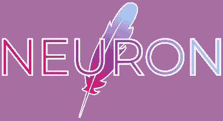

# 神经元语言入门

> 原文：<https://levelup.gitconnected.com/getting-started-with-the-neuron-language-9f5d69158731>

*用* [*神经元*](https://github.com/underpig1/neuron-lang) *开发的分步指南。*



## 安装[神经元](https://github.com/underpig1/neuron-lang)

安装了`[npm](https://preview.npmjs.com/package/neuron-lang)`后，在命令行中键入以下内容:

```
npm install --global neuron-lang
```

## 创建新文件

创建一个名为`main.neuron`的文件。这将包含我们的程序。在命令行中，导航到包含该文件的目录:

```
cd path/to/main.neuron
```

## 创造一个简单的你好，世界！程序

在`main.neuron`中，键入以下内容:

```
sayHello {
 log(Hello #0!);
}
```

这是标准的函数和对象语法，`#0`是传递给函数`sayHello`的第一个参数。现在可以按如下方式调用该函数:

```
sayHello(world);
```

这将记录“你好，世界！”

## 内嵌函数

我们可以创建一个新的函数，它也可以返回值。在`main.neuron`中:

```
sayHello {
 return(Hello #0); // or return: Hello #0
}log([sayHello => world] in Neuron!);
```

用`neuron main.neuron`在命令行运行时，应该会记录“神经元中的 Hello world！”

## 传递多个参数

现在我们可以将另一个函数的输出通过管道传输到我们的`sayHello`函数中:

```
add {
 return(#0 plus #1 is [#0 + #1].);
}sayHello {
 log(Hello! It appears as though [add => #0 #1]!);
}sayHello(0, 1);
```

我们程序的输出应该是“你好！看起来好像 0 加 1 等于 1。”

## 迭代器

我们可以用迭代器进一步扩展程序的功能:

```
for (i => 10) {
 sayHello(#i, [#i  -  1]);
}
```

这将记录“你好！看起来好像 0 加-1 等于 0。”和“你好！看起来好像 1 加 0 等于 1。”直到迭代器，用`#i`表示，达到 9。

神经元编程语言能够集成到我们的程序中的其他特性包括条件、变量、迭代器和对象。

## 运行程序

通过`[npm](https://preview.npmjs.com/package/neuron-lang)`安装 Neuron，文件可以这样执行:

```
neuron main.neuron
```

# 接下来呢？

Neuron 也可以用于浏览器中的 web 应用程序。对于前端 web 开发来说，Neuron 是一种极其高效的语言。如果你对[神经元语言](https://github.com/underpig1/neuron-lang)感兴趣并想了解更多，请访问[知识库](https://github.com/underpig1/neuron-lang)。[文档](https://neuron-lang.readthedocs.io/en/master/)包含了关于神经元语言的信息、各种教程以及神经元语言的参考资料。Neuron 目前正在大力开发中，欢迎您的贡献和支持！考虑让一个[明星](https://github.com/underpig1/neuron-lang)或[发微博](https://twitter.com/intent/tweet?text=Check%20out%20the%20Neuron%20programming%20language%20for%20front-end%20web%20development:%20https://github.com/underpig1/neuron-lang)谈论这件事。谢谢大家！

## 资源

[神经元语言](https://github.com/underpig1/neuron-lang)

[学习神经元](https://neuron-lang.readthedocs.io/en/master/)