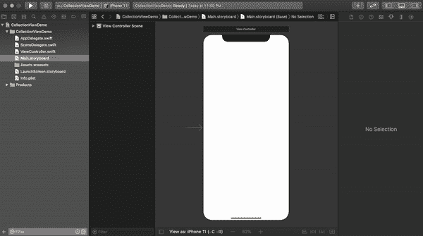
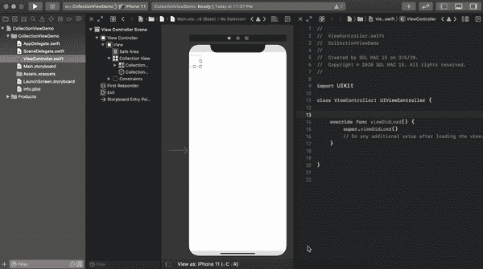
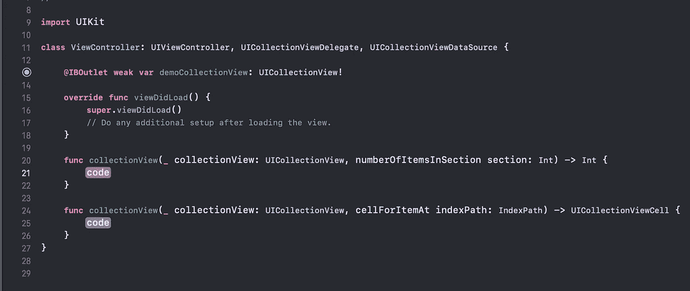
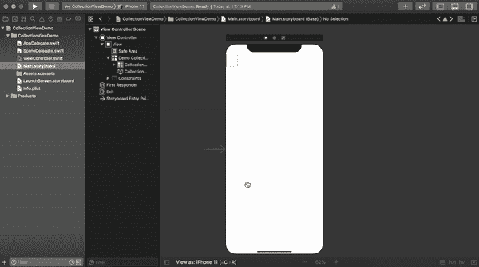
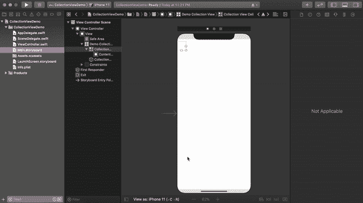
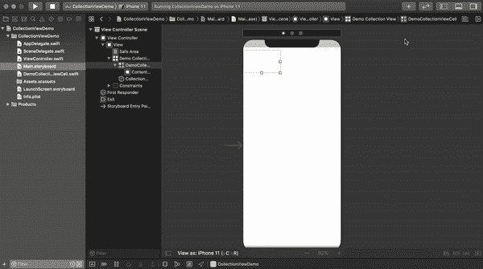
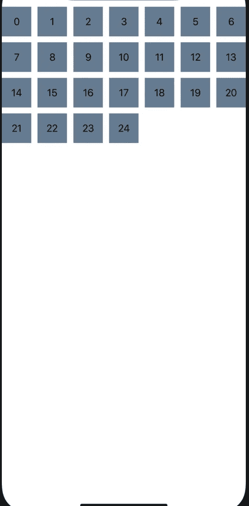
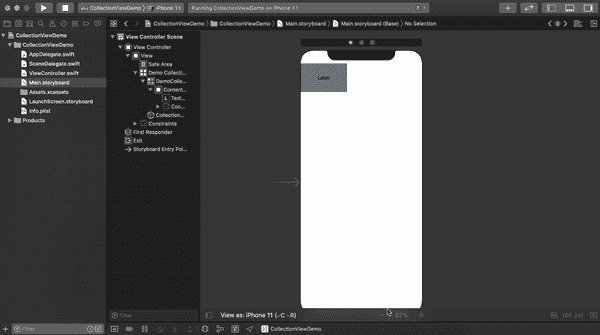
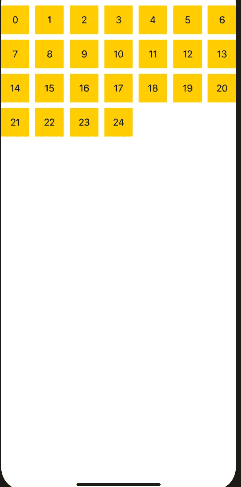

# With UICollectionView 入门

> 原文：<https://levelup.gitconnected.com/getting-started-with-uicollectionview-in-swift-a1a1ee56e47a>


图片由[杰西卡·鲁斯切洛](https://unsplash.com/@jruscello)通过 [Unsplash](https://unsplash.com/) 拍摄

# 概观

在 iOS 中，CollectionView 是一种显示用户排序数据的灵活方式。与 Tableview 一样，它也有不同的方法在网格或可定制的布局中显示数据。在本教程中，我们将学习如何使用默认和自定义单元格在 iOS 中配置基本集合视图。所以让我们开始吧

> 本教程使用 **Swift 5，Xcode 11.2，iOS 13 &故事板界面编写。**

1.  **使用默认单元格配置 CollectionView:**让我们看看如何一步一步地使用默认单元格配置 collection view。

**步骤 1** : **创建 Xcode 项目&设置集合视图**:打开你的 Xcode - >创建一个新的 Xcode 项目- >选择 ios 和单视图应用作为你的项目模板- >随意命名- >创建。之后，你的文件结构应该是这样的。


打开你的“Main.storyboard”文件，你会在那里找到一个视图控制器。从对象库中拖放 CollectionView。将约束设置为(0，0，0，0)，如下所示



现在，在项目导航器中通过“Option + click”打开“ViewController.swift”文件。将 CollectionView 的 outlate 插入视图控制器文件。



将“ViewController”类扩展为“UICollectionViewDelegate”和“UICollectionViewDataSource”。你必须添加一些协议存根，添加它们。你的“视图控制器”应该是这样的



现在为您的 CollectionView 设置委托和数据源。您可以通过在“viewDidLoad”方法中编写两行代码来实现。在我的情况下，这些是

```
demoCollectionView.delegate = **self**demoCollectionView.dataSource = **self**
```

或者你可以像这样用故事板来设置它



就是这样。您的 CollectionView 已配置并设置为显示数据。

**步骤 2:设置集合视图单元格**:当您从对象库添加一个集合视图到您的视图控制器时，您应该注意到，默认情况下，一个单元格也被添加到该集合视图中。我们将为 CollectionView 单元格创建一个新的 Cocoa Touch 文件，子类化“UICollectionViewCell”。从 storyboard 中选择 CollectionView 单元格，为该单元格设置自定义类和标识符。



如果您在此之前完成，您的 CollcetionView 单元格也将配置为显示数据。

**第三步:显示数据:**现在我们将使用 CollectionView 及其单元格来显示数据。在此之前，我们将在 CollectionView 单元格中加入一个标签。在单元格中水平和垂直放置标签 central。将该标签的出口改为单元格类，并根据需要更改单元格的背景颜色。



如下所示编辑您的“numberOfRowsInSection”方法。此方法实际返回 CollectionView 拥有的行数。在我的例子中，我想显示 25 个静态单元格。

```
**func** collectionView(**_** collectionView: UICollectionView, numberOfItemsInSection section: Int) -> Int {**return** 25}
```

如下配置您的“cellForRowAt”函数。此方法将使用单元格的类和标识符配置 CollectionView 的每个单元格。我们用每个单元格对应的单元格编号来设置之前获取的标签文本。

```
**func** collectionView(**_** collectionView: UICollectionView, cellForItemAt indexPath: IndexPath) -> UICollectionViewCell {**let** cell = collectionView.dequeueReusableCell(withReuseIdentifier: "DemoCollectionViewCell", for: indexPath) **as**! DemoCollectionViewCellcell.textLbl.text = "\(indexPath.row)"**return** cell}
```

“ViewController”类的完整代码片段应该如下所示。

```
**import** UIKit**class** ViewController: UIViewController, UICollectionViewDelegate, UICollectionViewDataSource {**@IBOutlet** **weak** **var** demoCollectionView: UICollectionView!**override** **func** viewDidLoad() {**super**.viewDidLoad()demoCollectionView.delegate = **self**demoCollectionView.dataSource = **self**}**func** collectionView(**_** collectionView: UICollectionView, numberOfItemsInSection section: Int) -> Int {**return** 25}**func** collectionView(**_** collectionView: UICollectionView, cellForItemAt indexPath: IndexPath) -> UICollectionViewCell {**let** cell = collectionView.dequeueReusableCell(withReuseIdentifier: "DemoCollectionViewCell", for: indexPath) **as**! DemoCollectionViewCellcell.textLbl.text = "\(indexPath.row)"**return** cell}}
```

在模拟器上构建并运行项目。你会看到这样的东西。



2.**使用自定义单元格配置 CollectionView:**我们还可以使用 XIB 文件创建一个单元格，并使用 collection view 对其进行配置。让我们看看我们如何能做到。

**步骤 1** : **创建一个 Xcode 项目&设置集合视图**:我们将在本教程中使用相同的项目和集合视图。您可以像我上面描述的那样创建一个不同的项目和集合视图。

**第二步:设置集合视图单元格**:创建一个新的 Cocoa Touch 文件。创建一个子类化“UICollectionViewCell”的类。**请确保您勾选了“同时创建 XIB 文件”框**。为单元格设置标识符。



现在，将一个视图从对象库中拖放到您的自定义单元格中，并将其固定为(0，0，0，0)和安全区域。

将标签拖放到视图中，并将标签约束设置为水平居中和垂直居中。将这个标签的出口作为 textLbl 到它的单元格类。更改视图的背景颜色。听起来很熟悉？是的，我们按照类似的步骤来配置默认单元。

我们使用 XIB 文件作为集合视图的单元格，这就是为什么我们必须向集合视图注册单元格。我们可以使用它的名称和标识符来注册这个单元。将此写入“ViewController”类的“viewDidLoad()”。

```
demoCollectionView.register(UINib(nibName: "CustomCollectionViewCell", bundle: **nil**), forCellWithReuseIdentifier: "CustomCollectionViewCell")
```

按如下方式更改 CollectionView 委托和数据源方法，以使用自定义单元格显示数据。

```
**func** collectionView(**_** collectionView: UICollectionView, numberOfItemsInSection section: Int) -> Int {**return** 25}**func** collectionView(**_** collectionView: UICollectionView, cellForItemAt indexPath: IndexPath) -> UICollectionViewCell {**let** cell = collectionView.dequeueReusableCell(withReuseIdentifier: "CustomCollectionViewCell", for: indexPath) **as**! CustomCollectionViewCellcell.textLbl.text = "\(indexPath.row)"**return** cell}
```

“ViewController”类的完整代码片段应该如下所示。

```
**import** UIKit**class** ViewController: UIViewController, UICollectionViewDelegate, UICollectionViewDataSource {**@IBOutlet** **weak** **var** demoCollectionView: UICollectionView!**override** **func** viewDidLoad() {**super**.viewDidLoad()demoCollectionView.delegate = **self**demoCollectionView.dataSource = **self**demoCollectionView.register(UINib(nibName: "CustomCollectionViewCell", bundle: **nil**), forCellWithReuseIdentifier: "CustomCollectionViewCell")}**func** collectionView(**_** collectionView: UICollectionView, numberOfItemsInSection section: Int) -> Int {**return** 25}**func** collectionView(**_** collectionView: UICollectionView, cellForItemAt indexPath: IndexPath) -> UICollectionViewCell {**let** cell = collectionView.dequeueReusableCell(withReuseIdentifier: "CustomCollectionViewCell", for: indexPath) **as**! CustomCollectionViewCellcell.textLbl.text = "\(indexPath.row)"**return** cell}}
```

构建并再次运行，您将看到使用自定义 XIB 单元格将数据加载到 CollectionView 中。



祝贺🎉 🎉 🎉现在您知道了如何配置带有默认和自定义单元格的 CollectionView。你可以使用不同种类的集合视图方法做很多很酷的事情。请查看[苹果文档](https://developer.apple.com/documentation/uikit/uicollectionview)以获得进一步的澄清。

**如果你觉得这篇文章有用，请分享并鼓掌**👏👏👏
在[媒体](https://medium.com/@arifulislam14)上查看我的其他文章，并在 [LinkedIn](https://www.linkedin.com/in/arifparvez14/) 上联系我。

感谢您阅读&快乐编码🙂