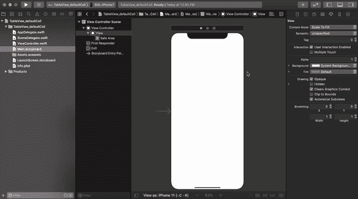
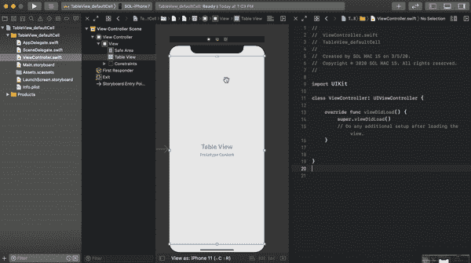
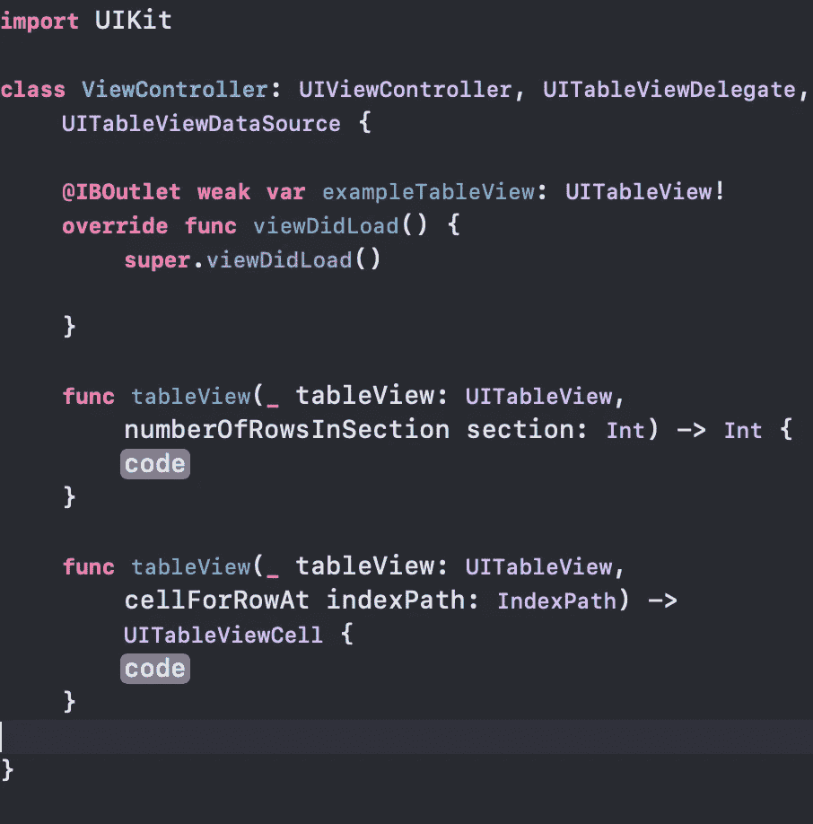
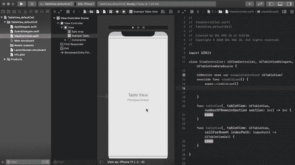
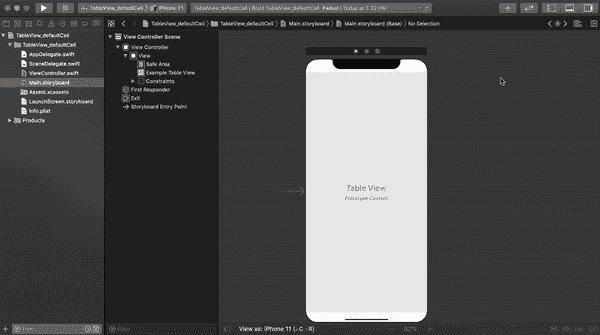
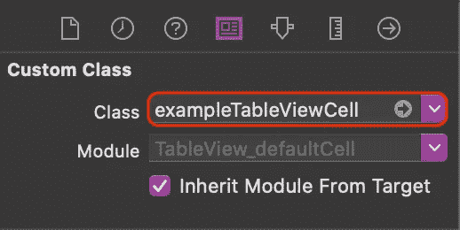
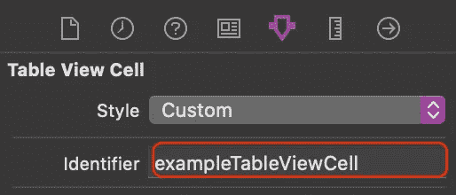
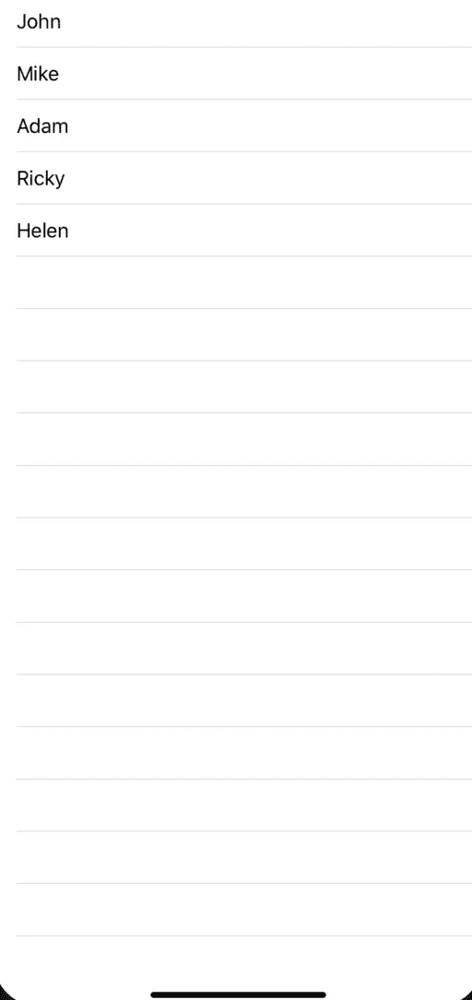
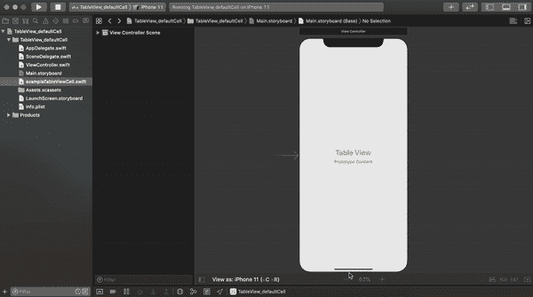
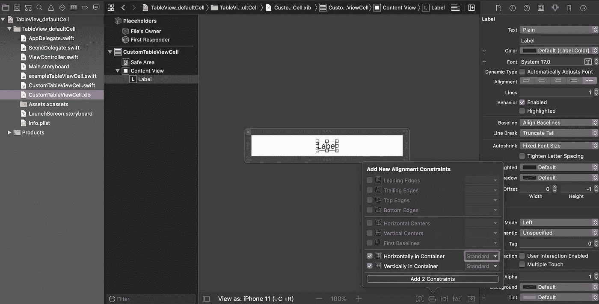

# with UITableView 入门

> 原文：<https://levelup.gitconnected.com/getting-started-with-uitableview-in-swift-9b04e6fd8b9a>


图片由[埃克托尔·j·里瓦斯](https://unsplash.com/@hjrc33)通过 [Unsplash](https://unsplash.com/) 拍摄

# **概述**

在 iOS 开发中，表格视图是最基本和可重用的设计界面之一。它可以使用按列排列的行来呈现大量数据。在本教程中，我们将学习如何使用默认和自定义单元格在 iOS 中配置基本的 TableView。所以让我们开始吧

> 本教程使用 **Swift 5，Xcode 11.2，iOS 13 &故事板界面编写。**

1.  **使用默认单元格配置表格视图:**让我们看看如何一步一步地使用默认单元格配置表格视图。

**第一步** : **创建 Xcode 项目&设置表格视图**:打开你的 Xcode - >创建一个新的 Xcode 项目- >选择 ios 和单视图应用作为你的项目模板- >随意命名- >创建。之后，你的文件结构应该是这样的。


打开你的“Main.storyboard”文件，你会在那里找到一个视图控制器。从库中拖放表格视图。将约束设置为(0，0，0，0)，如下所示



现在，在项目导航器中通过“Option + click”打开“ViewController.swift”文件。将 TableView 的 outlate 插入视图控制器文件。



将“ViewController”类扩展为“UITableViewDelegate”和“UITableViewDataSource”。你必须添加一些协议存根，添加它们。你的“视图控制器”应该是这样的



现在为 TableView 设置委托和数据源。您可以通过在“viewDidLoad”方法中编写两行代码来实现。在我的情况下，这些是

```
exampleTableView.delegate = **self**exampleTableView.dataSource = **self**
```

或者你可以像这样用故事板来设置它



就是这样。您的 TableView 已配置并设置为显示数据。

**步骤 2:设置 TableView 单元格**:现在将一个 TableView 单元格从库中拖放到您的表格中。创建新的 Cocoa Touch 文件。创建一个子类化“UITableViewCell”的类。



从 storyboard 中选择 TableView 单元格，为我们刚刚创建的单元格设置自定义类。



为单元格设置标识符。在我的例子中，为了简单起见，我将标识符命名为类名。



这就是你的细胞配置。

**第三步:显示数据:**现在我们将使用 TableView 及其单元格来显示数据。我们将使用下面的数组作为我们的数据源。

```
**var** name = ["John", "Mike", "Adam", "Ricky", "Helen"]
```

如下所示编辑您的“numberOfRowsInSection”方法。该方法实际上返回 TableView 拥有的行数。

```
**func** tableView(**_** tableView: UITableView, numberOfRowsInSection section: Int) -> Int {**return** name.count}
```

如下配置您的“cellForRowAt”函数。此方法将使用单元格的类和标识符来配置 TableView 的每个单元格。我们使用数组的每个元素设置 TableView 单元格的默认标签文本。

```
**func** tableView(**_** tableView: UITableView, cellForRowAt indexPath: IndexPath) -> UITableViewCell {**let** cell = tableView.dequeueReusableCell(withIdentifier: "exampleTableViewCell", for: indexPath) **as**! exampleTableViewCellcell.textLabel?.text = name[indexPath.row]**return** cell}
```

“ViewController”类的完整代码片段应该如下所示。

```
**import** UIKit**class** ViewController: UIViewController, UITableViewDelegate, UITableViewDataSource {**@IBOutlet** **weak** **var** exampleTableView: UITableView!**var** name = ["John", "Mike", "Adam", "Ricky", "Helen"] **override** **func** viewDidLoad() {**super**.viewDidLoad()exampleTableView.delegate = **self**exampleTableView.dataSource = **self**}**func** tableView(**_** tableView: UITableView, numberOfRowsInSection section: Int) -> Int {**return** name.count}**func** tableView(**_** tableView: UITableView, cellForRowAt indexPath: IndexPath) -> UITableViewCell {**let** cell = tableView.dequeueReusableCell(withIdentifier: "exampleTableViewCell", for: indexPath) **as**! exampleTableViewCellcell.textLabel?.text = name[indexPath.row]**return** cell}}
```

在模拟器上构建并运行项目。你一定会看到这样的东西。



2.**使用自定义单元格配置 TableView:**我们还可以使用 XIB 文件创建一个单元格，并使用 table view 对其进行配置。让我们看看我们如何能做到。

**步骤 1** : **创建一个 Xcode 项目&设置 TableView** :我们将在本教程中使用相同的项目和 TableView。您可以像我上面描述的那样创建一个不同的项目和 TableView。

**第二步:设置 TableView 单元格**:创建一个新的 Cocoa Touch 文件。创建一个子类化“UITableViewCell”的类。**请确保您勾选了“同时创建 XIB 文件”框**。为单元格设置标识符。



将标签拖放到自定义单元格中，并将标签的约束设置为水平居中和垂直居中。



就像我们在上面的 TableView 中获取 outlet 一样，将这个标签的 outlet 作为 nameLbl 获取到它的单元格类中。您的 cell 类应该有这样的代码。

```
**import** UIKit**class** CustomTableViewCell: UITableViewCell {**@IBOutlet** **weak** **var** nameLbl: UILabel!**override** **func** awakeFromNib() {**super**.awakeFromNib()}**override** **func** setSelected(**_** selected: Bool, animated: Bool) {**super**.setSelected(selected, animated: animated)}}
```

我们使用 XIB 文件作为表格视图的单元格，这就是为什么我们必须用表格视图注册单元格。我们可以使用它的名称和标识符来注册这个单元。将此写入“ViewController”类的“viewDidLoad()”。

```
exampleTableView.register(UINib(nibName: "CustomTableViewCell", bundle: **nil**), forCellReuseIdentifier: "CustomTableViewCell")
```

按如下方式更改 TableView 委托和数据源方法，以使用自定义单元格显示数据。

```
**func** tableView(**_** tableView: UITableView, numberOfRowsInSection section: Int) -> Int {**return** name.count}**func** tableView(**_** tableView: UITableView, cellForRowAt indexPath: IndexPath) -> UITableViewCell {**let** cell = tableView.dequeueReusableCell(withIdentifier: "CustomTableViewCell", for: indexPath) **as**! CustomTableViewCellcell.nameLbl.text = name[indexPath.row]**return** cell}
```

“ViewController”类的完整代码片段应该如下所示。

```
**import** UIKit**class** ViewController: UIViewController, UITableViewDelegate, UITableViewDataSource {**@IBOutlet** **weak** **var** exampleTableView: UITableView!**var** name = ["John", "Mike", "Adam", "Ricky", "Helen"]**override** **func** viewDidLoad() {**super**.viewDidLoad()exampleTableView.delegate = **self**exampleTableView.dataSource = **self**exampleTableView.register(UINib(nibName: "CustomTableViewCell", bundle: **nil**), forCellReuseIdentifier: "CustomTableViewCell")}**func** tableView(**_** tableView: UITableView, numberOfRowsInSection section: Int) -> Int {**return** name.count}**func** tableView(**_** tableView: UITableView, cellForRowAt indexPath: IndexPath) -> UITableViewCell {**let** cell = tableView.dequeueReusableCell(withIdentifier: "CustomTableViewCell", for: indexPath) **as**! CustomTableViewCellcell.nameLbl.text = name[indexPath.row]**return** cell}}
```

构建并再次运行，您将看到使用自定义 XIB 单元格将数据加载到您的 TableView 中。


祝贺🎉 🎉 🎉现在您知道了如何用默认和自定义单元格配置 TableView。你可以使用不同的 TableView 方法做很多很酷的事情。请查看[苹果文档](https://developer.apple.com/documentation/uikit/uitableview)进一步分类。

**如果你觉得这篇文章有用，请分享并鼓掌**👏👏👏
在[媒体](https://medium.com/@arifulislam14)上查看我的其他文章，并在 [LinkedIn](https://www.linkedin.com/in/arifparvez14/) 上联系我。

感谢您阅读&快乐编码🙂