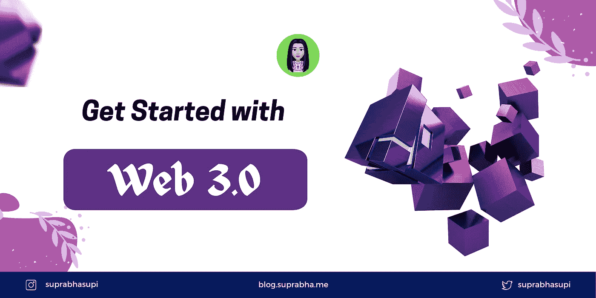
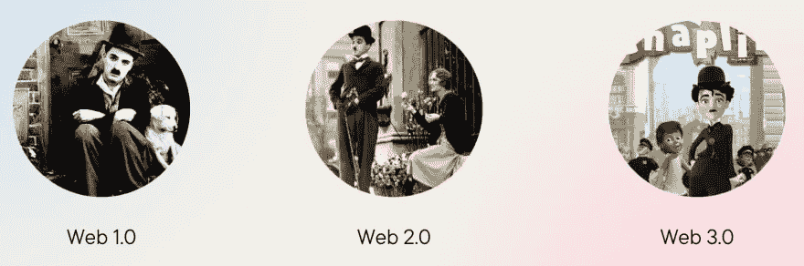
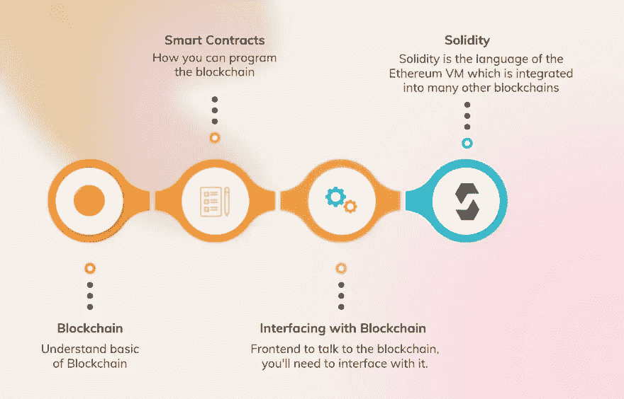

# 前端工程师开始使用 Web 3.0

> 原文：<https://levelup.gitconnected.com/getting-started-with-web-3-0-for-frontend-engineer-63289f093507>

面向前端工程师的 Web 3.0

网络的每一个新出现起初都令人困惑(无法理解)。Web 3.0 是针对网站和应用程序的第三代互联网服务，将专注于使用基于机器的数据理解来提供数据驱动的语义 Web。

# 网络 1️.0️

*   Web 1.0 是一个只读网站📖
*   期间:1989 年至 2005 年

# 网络 2️.0️

*   Web 2.0 是一个读写网络📝
*   大约 2005 年至今

**例子** : Airbnb，脸书，Twitter，Instagram，Youtube，WhatsApp

*   📝网站就像上传到社交网络服务的用户创建的内容*

# 网络 3️.0️

*   Web 3.0 是一个读写互动的网络(由人工智能驱动)🌏
*   在区块链上运行的分散式应用
*   不使用用户个人信息赚钱的应用程序
*   📝Web 3.0 并不新鲜，Jeffrey Zeldman，Web 1.0 和 2.0 应用程序的早期开发者之一，早在 2006 年就写了一篇博客支持 Web 3.0 *

用电影术语来说吧😉

# Web 2.0 和 Web 3.0 的能力🔥

# Web 2.0

*   任何社交帖子都可以被平台删除
*   服务器可以为任何服务而停机
*   支付服务可能决定不允许支付某些工作
*   计算机使用唯一网址形式的 HTTP 协议来查找信息，这些信息通常存储在一台服务器上的固定位置。

# Web 3.0

*   平台不可能删除你的帖子
*   服务器无法关闭
*   不能阻止付款
*   由于信息是根据其内容找到的，因此它可以同时存储在多个位置，因此是分散的

# Web 3.0 🎖️的特点

*   **开放:**它是开放的，因为它是用开源软件制作的
*   **无信任:**网络将允许参与者直接互动，无需通过可信的中介
*   **无许可:**包括用户和提供者，可以在不需要控制组织许可的情况下参与。
*   自治的
*   分布式和健壮的
*   本机内置支付

# 支付💰

让我们来谈谈两个支付模块:

a.网络支付

b.本地付款

# a.网络支付

Stripe 和 Paypal 等公司通过实现电子支付创造了数十亿美元的价值。

# b.本地付款

它建立在根级别上。
特点:

*   安全的
*   容易的
*   匿名的

**本地支付的最佳加密钱包是 MetaMask 和 Torus**

# 去中心化是 Web 3.0 的核心原则

# Web 3.0 应用程序的示例🌐

1.  **Siri**

有了 Siri，我们有了三星 Bixby，亚马逊的 Alexa，它能够理解我的问题，比如最近的公园在哪里，并给出正确的答案。

**2。Wolfram Alpha**

这是一个计算智能平台，现在使用 web3。)是一个“计算知识引擎”，通过计算直接回答你的问题。

**3。Steemit**

web 3.0 社交网络网站的绝佳范例。

**4。索拉**

Steemit 是 web 3.0 社交网络网站的一个很好的例子。它是一个去中心化的奖励平台，完全基于 Steem 区块链社交媒体模型运行。它向在网站上贡献内容的内容创作者或博客作者奖励加密货币。

**5。IDEX**

由于 IDEX 是一个基于以太坊的交易所，用户需要一个以太坊钱包在平台上交易。

**6。电子聊天**

e-Chat 是一个 web 3.0 应用程序，由去中心化的区块链提供支持。广泛用于发送加密货币。App Store 和 Play Market 为他们的用户提供了一款电子聊天应用。

**7。LBRY**

[LBRY](https://lbry.com/) 是一个 web 3.0 视频和音乐网站，拥有不同形式的内容库，如书籍、音乐和视频。

**8。以太网**

[Ethlance](https://ethlance.com/) 是一个 web 3.0 远程工作平台。分散式应用程序运行在以太坊区块链之上，在那里任何人都可以雇佣并开始工作，以换取以太加密货币，这在旧技术中是不可能的。

# 语义万维网🌐

目标是使互联网数据机器可读。

*   Web 3.0 ❗=语义网。
*   Web 3.0 使用基于语义 Web 概念和自然语言处理的技术，使用户交互更加直观，它还具有其他功能，如广泛使用人工智能和机器学习。
*   在语义网的发展过程中，计算机将能够直接理解互联网数据。使用语义网背后的想法是它理解并解释数据的上下文和概念。因此，当用户搜索答案时，web 3.0 会向最终用户提供最准确、最相关的结果。
*   语义网的目标是使互联网数据机器可读。

# 身份在 Web 3.0 中如何工作🤔

*   身份将被绑定到与应用程序交互的用户的钱包地址。
*   钱包地址是完全匿名的，除非用户决定公开绑定自己的身份。
*   用户可以跨多个 Dapps(去中心化应用)选择同一个钱包。

# 赞成的意见👍

*   搜索结果的效率
*   大公司也将不再控制数据、服务或网站。
*   分享信息会更容易。
*   不受限制的平台:用户可以更容易地将他们的资产或财富转移到世界任何地方。
*   **单一个人资料创建:**有了 web 3.0，用户无需为不同平台创建个人资料。一个单独的概要文件可以在任何平台上工作，用户可以完全拥有任何给定的信息。
*   👉没有用户的许可，任何公司都不能访问他们的数据或验证其准确性。然而，用户可以选择分享他们的个人资料，并向广告商或品牌出售他们的数据。
*   **连接:** Web 3.0 将在多个应用程序中提供相同的内容，服务将在任何地方的不同设备上提供。

# 骗局👎

*   web3 上的交易速度较慢，因为它们是分散的。
*   Web 3.0 对于新人来说，概念的把握会很复杂。
*   只有先进的设备才能处理 Web 3.0，将买不起这种设备的人拒之门外。
*   UX——与 web3 应用程序交互可能需要额外的步骤、软件和教育。
*   大多数成功的 Dapps 将很小一部分代码放在区块链上，因为它很贵。
*   人们会花太多时间在互联网上。

# Web 3.0 🛣路线图

如果你真的对学习 Web 3.0 感兴趣，那么这里有一个快速路线图

# 参考🧐

*   [https://web3.foundation/](https://web3.foundation/)
*   [https://www.useweb3.xyz/](https://www.useweb3.xyz/)
*   [https://coinmarketcap.com/alexandria/article](https://coinmarketcap.com/alexandria/article)

# 总结⅀

Web 3.0 代表了 web/Internet 发展的下一个迭代或阶段，可能会像 Web 2.0 一样具有破坏性，代表着一个巨大的范式转变。Web 3.0 建立在去中心化、开放性和更大的用户效用的核心概念之上。

了解 web 3 应用程序及其特性。

下一节，我们将研究元宇宙和 NFT😍

🌟[推特](https://twitter.com/suprabhasupi)📚[电子书](https://gum.co/css-pseudo-class-elements) |🌟 [Instagram](https://www.instagram.com/suprabhasupi/)

# 分级编码

感谢您成为我们社区的一员！**聘请不可思议的软件工程师在** [**平台上升一级**](https://jobs.levelup.dev/) **。**

 [## 提升就业平台

### 软件工程师、数据科学家、经理、设计师、建设者和程序员的最佳角色

作业. levelup.dev](https://jobs.levelup.dev)