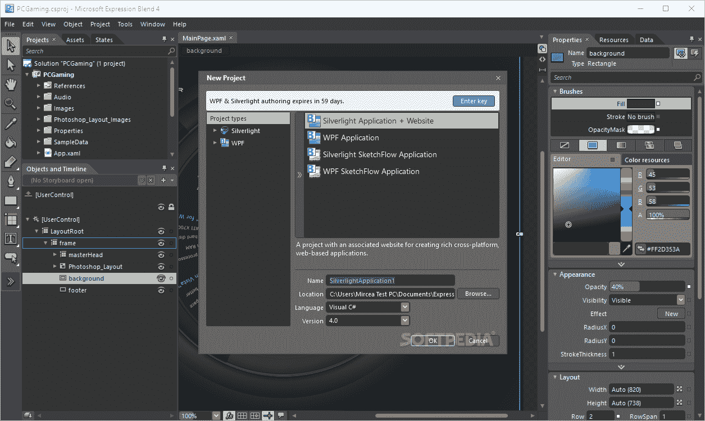
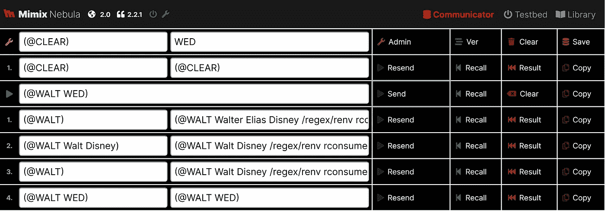
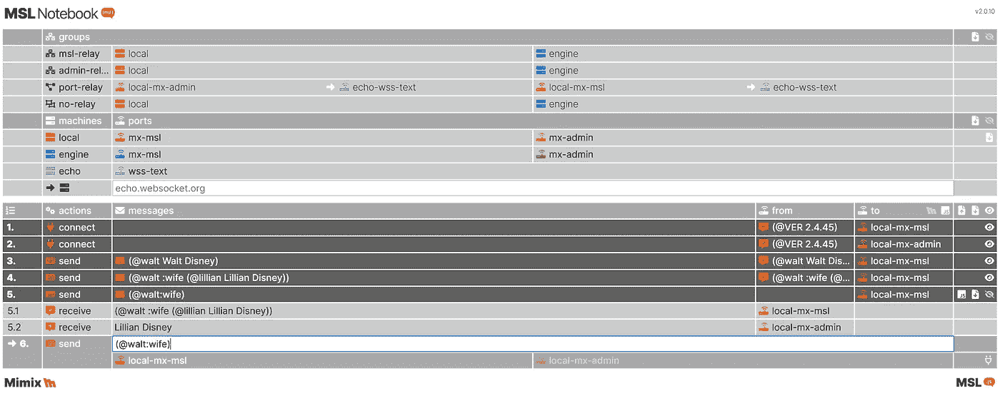
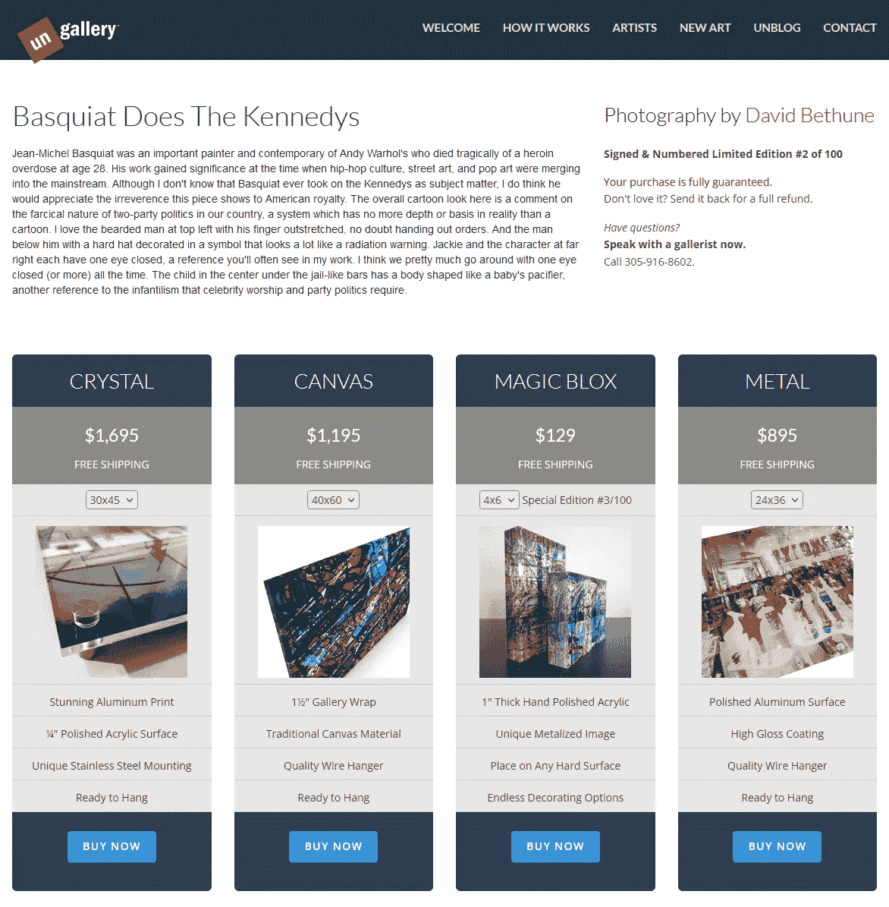
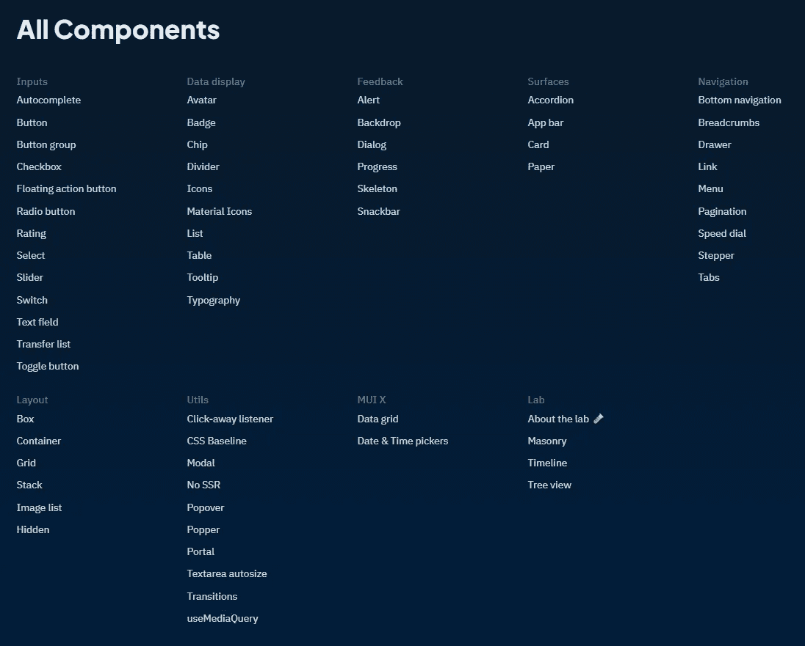
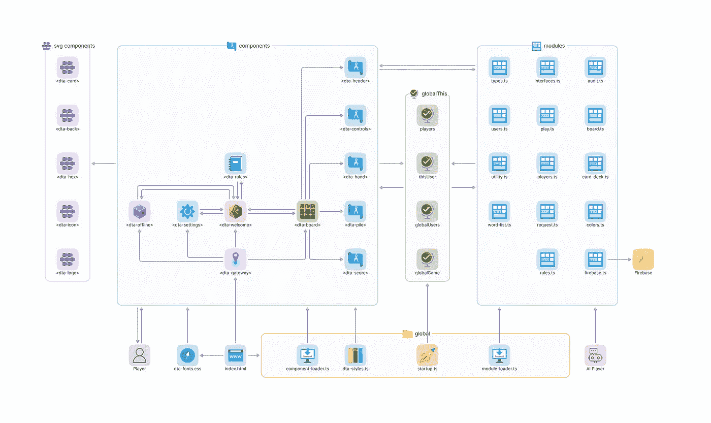
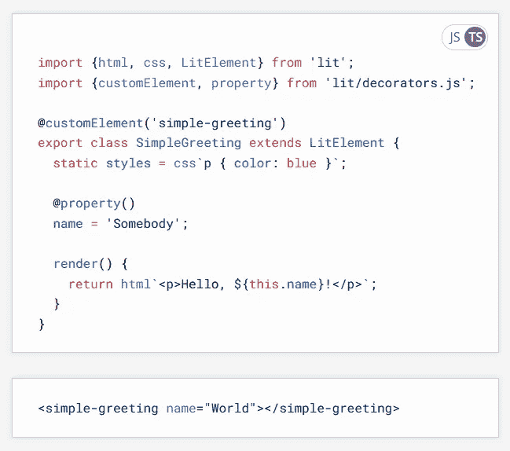
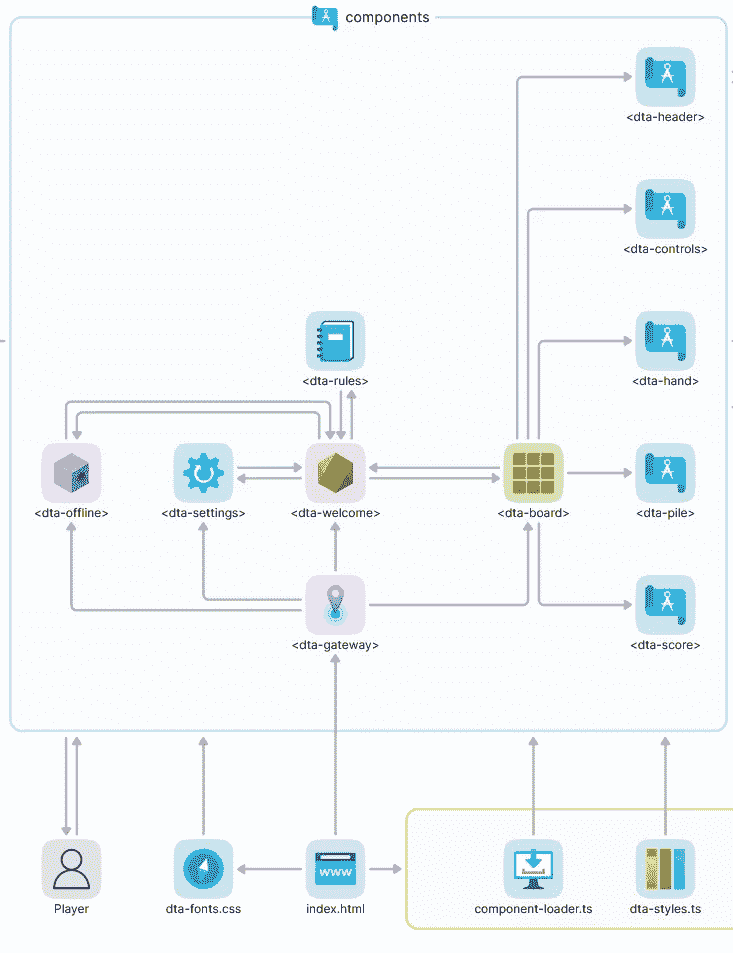

# Web 组件入门& Lit |第 1 部分

> 原文：<https://levelup.gitconnected.com/getting-started-with-web-components-lit-part-1-911aa7058e9b>

# 第 1 部分| HTML Web 组件简介

> 来自谷歌的 [Lit](https://lit.dev) ，是一个开始使用 web 组件的简单方法。这些是 HTML 的升级形式，解决了 Angular、React 和 Vue 等框架解决的许多问题。不同的是，Lit 还解决了那些框架*制造的*的许多问题。继续读下去，看看为什么我称 Lit 为反框架，为什么我认为你应该在你的下一个项目中强烈考虑它。

**快速索引**
第 1 部分:[介绍 Web 组件](https://medium.com/@mimixco/getting-started-with-web-components-lit-part-1-911aa7058e9b)
第 2 部分:[设置 Lit 和 Vite](https://medium.com/@mimixco/getting-started-with-web-components-lit-part-2-3cd878aeca73)
第 3 部分:[构建单页面 App](https://medium.com/@mimixco/getting-started-with-web-components-lit-part-3-81ba933f0f56)

# 互动的问题

自从在网页中使用 JavaScript 的早期，许多框架就试图克服处理 DOM 的丑陋。第一批网页没有任何交互性，正是因为这太糟糕了。任何 JS 程序都必须检查像`<input>`或`<button>`这样的实际 HTML 元素，并动态地改变它们的内容或行为，这看起来马上就像意大利面条代码，因为这就是它。

最早流行的解决方案， [jQuery](https://jquery.com/) ，使得以编程方式处理页面的单个元素变得更加容易，但是仍然让用户编写大量原始的、一次性的代码。第一个真正的框架是 AngularJS ，它给了程序员一种将网页视为应用的方法。它有一系列崇高的目标。它以沉重的代价实现了这些目标。

微软 Expression Studio 是将设计和开发引入一个过于复杂的 IDE 的早期(也是可怕的，失败的)尝试。自那以后，许多其他封闭框架也进行了同样的尝试。

# 上去吗？

Angular 不仅仅是与页面上的元素对话。它附带了一个数据绑定模型，更新一些幕后数据来反映页面上发生的事情。这个被称为 [MVC](https://en.wikipedia.org/wiki/Model%E2%80%93view%E2%80%93controller) 或模型-视图-控制器的模型深深融入了 Angular 的设计。它允许模型(服务器或本地数据源)和视图(用户看到的页面外观)之间的双向数据流。

理论上，让数据上升和下降一样容易是非常好的。一个程序员的梦想，对吧？Susan 在日历上更改了她的可用性，后端的数据库立即有了新的日期。第一次迭代 AngularJS 就是这样工作的。

实际上，双向数据是站不住脚的。打破自己的东西太容易了，防止这种破坏需要太多的脚手架。就像以前一样，任何复杂程度的应用程序看起来都像意大利面条，而且速度很慢。

我的一项发明的早期定制 web 界面有多个 [websockets](https://en.wikipedia.org/wiki/WebSocket) 是用 Angular 编写的，并使用了我为之前的项目开发的 UI 脚手架。

在 Lit 中重新编写同样的工具产生了一个更有吸引力和功能更多的“笔记本风格”的应用程序，像 [Jupityr](https://jupyter.org/) 可以管理与后端服务器的对话。

# 棱角和朋友:系列

在 AngularJS 变得过于流行之前，谷歌意识到了这些问题，并通过引入一个新版本，命名为 *Angular* ，并在改变后的框架上构建所有后续版本，从而消除了这些问题。这两者是不兼容的，因为新的 Angular 不允许双向数据绑定。

大约在同一时间，脸书(实际上看不到他在使用谷歌框架)发布了他们自己的 MVC 框架，这是他们为内部使用而创建的。那就是[反应](https://en.wikipedia.org/wiki/React_(JavaScript_library))。Vue 由曾在 Angular 工作过的一名前谷歌员工创建。

[Ungallery](https://ungallery-alpha.web.app/) 是我为自己的另一项发明写的 AngularJS 应用。像这些 ***现在购买*** 艺术面板这样的定制 web 组件，在 React 这样的框架中根本不存在。

# 输入 Web 组件

看到大量的框架都试图解决相同的问题(丑陋、不灵活的 DOM 无数据绑定)，W3C 试图通过允许程序员以标准化的方式编写他们自己的所有元素来改进 HTML 标准本身。这些是[网络组件](https://en.wikipedia.org/wiki/Web_Components)。

换句话说，我可以决定我的页面将由填充了`<dta-panel>`内容的`<dta-page>`元素组成，而不是由`
`和`
`元素组成。我的自定义元素将以我选择的任何方式布局。因为这些定制元素的属性和值也可以通过编程来设置(使用标准语法，不同的框架不会互相冲突)，所以这些 HTML 扩展可以支持任何类型的数据绑定。

web 组件的另一个目标是清除 DOM 中 CSS 样式继承的问题。CSS 的级联部分(名字中的“C”)很难调试。有时候，你只是想要你自己的 CSS 在你想要的地方，没有任何来自上面的层叠。在糟糕的名称选择中，W3C 选择了 *shadow DOM* 作为非继承 CSS 的概念。事实上，顾名思义，它不仅扩展到样式，还扩展到整个 DOM。远离 DOM 是很好的编程实践，但是我认为您应该知道。

还需要一个标准来阻止巨型框架造成的围墙花园效应。React 有数百种网络元素可供你选择，无数的应用程序都充满了这些组件。各种对话框、控件、滑块、日历等。React 拥有所有这些。这很好，但是…你已经学会了他们做任何事情的方式。如果你想要一个行为不像 React 的输入框或下拉列表，那么，你就有麻烦了。无论你写什么，都必须至少符合 React，因为你的应用程序的其余部分都在 React 中，对吗？

所有流行的框架都不缺少组件。这个列表只是针对 [React MDI](https://mui.com/material-ui/) 。但是如果这些都不是你想要的呢？或者……更有可能的是，如果你喜欢的东西**行为**像这些，但看起来不像它们中的任何一个呢？

# 直到裸露的金属

框架的对立面是**裸机** HTML。也就是说，只有 HTML、JS、CSS 和 SVG 的 [MDN 标准文档](https://developer.mozilla.org/en-US/)中的东西——没有任何东西是由单一供应商控制的。裸机 web 组件不需要任何导入语句，也没有任何依赖关系。从最小的手机到最大的电视，它在每种设备上的每种浏览器中都以同样的方式工作。将来它不需要仅仅因为一个平台这么说就升级。

在我忘记之前，关于 web 组件或 Lit 的任何内容都不能排除您使用任何其他框架或 HTML 规范的任何部分。你不能用定制组件来破坏任何东西，这是他们设计的一部分。这意味着你可以使用 Lit 来**将一个应用从静态 HTML 演变为更动态的元素，而无需从头重写。你也可以使用 Lit 将不同框架中的单个组件升级到你在 Lit 中定制的组件，而不需要改变你的页面。您甚至可以将 Lit 行为添加到其他库中的现成组件中。**

现在 web 组件是裸机的一部分，我们可以真正开始编写应用程序来修复我们一直以来存在的一些问题。它们可以是完全定制的，也可以是干净的和模块化的。它们可以有尽可能少的依赖，但是充满了我们编写的高度可重用的代码。我们可以鱼和熊掌兼得。所以让我们开始吧！

这个架构图是一个真实的应用程序，我的 [Hexxed](https://hexxedgame.com) 游戏。自定义 web 组件与我的 Typescript 模块交互，创建一个在**index.html**结束的 UI。

# Lit 是反框架的

谷歌最新的 HTML 框架是你能得到的最接近裸机的东西。虽然它为您添加了数据绑定和事件绑定，但与 React 庞大的组件库相比，Lit 没有提供任何组件可供选择。你将会写这些。路由怎么样？你需要那个吗？希望你能写出来。(可以。)您的应用程序需要任何类型的安全性、身份或存储吗？装上电线，我的朋友！

如果这听起来很可怕，显然你还没有使用过 React 或 Angular。因为，实际上，编写自己的代码通常比学习这些大框架的工作方式要好 5 倍。你不需要弄清楚如何让你想要的东西在“框架”内工作，而是简单地按照你想要的方式来写！

实际上，这是非常崇高的。它还非常高效，因为它易于调试。就拿路由来说吧。谷歌周围的方式做路由在 Vue，或角，或反应。去拿咖啡！

这个来自 [live playground](https://lit.dev/playground/) 的小例子展示了一个正在定义的新 web 组件。在这种情况下，它是一个 **<简单问候>** ，它接受一个属性，一个名称。自定义组件返回良好的旧 HTML，这就是它在任何地方都能工作的原因。请注意，这是整个程序。不需要其他文件或设置。

现在裸机 JS，*老 skool* 风格，什么叫路由？它意味着从 URL 中去掉一些东西，通过显示不同的内容来进入一个页面。好的，在 JavaScript 中大概有 3 行代码。真的。您解析 URL，然后更改决定所显示页面内容的任何变量的值。这不是火箭科学。然而，学习使用别人的路由框架可能需要像学习火箭科学一样长的时间！

如果 Lit 将为您进行数据绑定，这是它添加到您的裸机 web 组件的秘密酱，那么当“页面内容”变量发生变化时，您的应用程序将自动更新，以便所有 HTML 元素都包含正确的新内容。恭喜你！你刚刚写了一个没有框架的单页应用程序。

# 是的，在你的后院

航空业有一个可怕的自动化问题。当飞行员变得过于依赖软件时，他们会在驾驶飞机的基础上犯错误。开发人员也是如此。Lit 鼓励你对应用程序的所有部分负责，这意味着理解所有部分。

你不能回到谷歌说，“我在文学上有问题”，因为你不太可能有问题。你不能说，“我对文学的了解还不足以写我的应用，”因为你可以很快学会。在 web 组件和 Lit 中思考迫使你思考你的应用程序的真正架构，以及它是如何在页面上呈现的。当出现问题时，它还会给你深层的调试本能，因为问题总是存在的——因为问题在于你正在做的事情，而不是你正在做的事情。

这就是为什么我建议你从零开始的地方使用 Lit。我还认为对于第一次学习 JavaScript(或者，希望是 Typescript)的新开发人员来说，这是一个极好的选择。不妨开始吧！

在上图的放大视图中，我们可以看到 **< dta-gateway >** 是**index.html**的子节点。它还有其他几个子元素，可以通过“下推”数据和强制重绘数据来与它们通信。这些元素又有子元素。当 **< dta-board >** 子节点需要与它的 **< dta-welcome >** 父节点通信时(如双箭头所示)，它必须通过发送 JS 事件消息来完成。

# 在 Web 组件中思考

用 web 组件编写应用程序需要一种不同的思维方式，因为所有更新的数据必须自上而下地到达*，并且必须流经每个组件及其子组件，而不会“触及”来自任何其他地方的数据。当一个组件需要告诉另一个组件一些事情(不是它的直接子组件)时，第一个组件必须通过 JS 事件系统向第二个组件异步发送消息。*

*除了这些消息之外，组件不得以任何其他方式进行通信。当收到消息时，组件可以重画自己。当父组件重绘时，其子组件也会重绘。这种设计限制是试图编写和调试*不能用这种方式工作的应用程序的结果。它防止了许多在其他设计模式中常见的错误。当架构正确时，web 组件应用程序是**神奇的**和美丽的，因为它们看起来会自动用所有正确的数据在屏幕上更新自己。**

# *接下来…设置 Lit & Vite*

*在本系列的第二部分中，我们将设置 Lit 来使用 VSCode。我们还需要一个开发服务器，这样我们就可以看到我们的应用程序在进展中，为此我推荐 Vite。*

*一如既往地感谢您的阅读，下次再见！*

**— D**