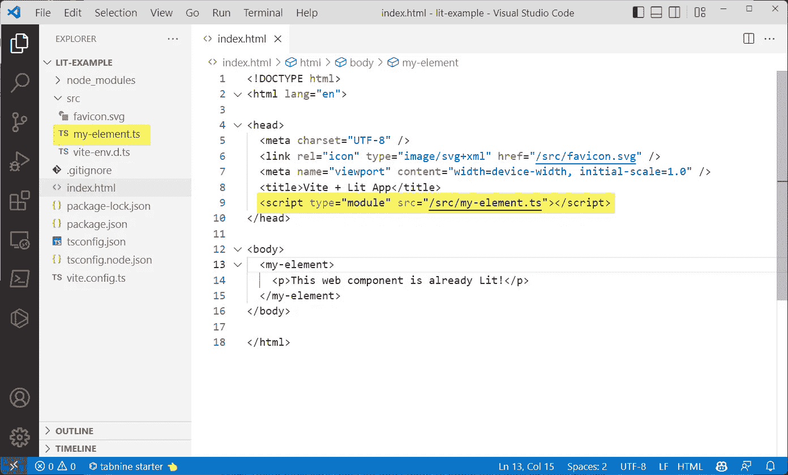

# Web 组件入门& Lit |第 2 部分

> 原文：<https://levelup.gitconnected.com/getting-started-with-web-components-lit-part-2-3cd878aeca73>


# 第 2 部分|设置 Lit & Vite

> 来自谷歌的 Lit ，是一个开始使用 web 组件的简单方法。在本系列的第 1 部分的[中，我解释了我们如何得到 web 组件，以及为什么我称之为 web 应用程序的**反框架**。在这篇文章中，我们将让 Lit 与 VSCode 和 Vite development server 一起安装，然后创建一个测试应用程序并展示它是如何工作的。](https://medium.com/@mimixco/getting-started-with-web-components-lit-part-1-911aa7058e9b)

**快速索引**
第 1 部分:[介绍 Web 组件](https://medium.com/@mimixco/getting-started-with-web-components-lit-part-1-911aa7058e9b)
第 2 部分:[设置 Lit 和 Vite](https://medium.com/@mimixco/getting-started-with-web-components-lit-part-2-3cd878aeca73)
第 3 部分:[构建单页面 App](https://medium.com/@mimixco/getting-started-with-web-components-lit-part-3-81ba933f0f56)

# 先决条件:NPM 和 VSCode

如果这是你第一次用 Typescript 进行本地 web 开发(或者第一次在这台机器上)，你需要安装 NPM，节点包管理器。一个**包**就是一个文件夹，里面有你的应用程序需要的文件。对此的另一个说法是依赖 T21。NPM 从网上安装软件包，并跟踪你有哪些。为了使用一个包，我们把它放到我们的代码中。

> 如果你还没有 NPM，先运行 Mac、Windows 或 Linux 的[安装程序](https://nodejs.org/en/download/)。

VSCode(或者 VS Code，或者 Visual Studio Code)是一个现代的 IDE，一个集成开发环境——这是一种代码文本编辑器的奇特说法。我们将使用 VSCode 来组织我们的文件和文件夹，并编写组成应用程序的文件。

> 如果您还没有 VSCode，请先运行 Mac、Windows 或 Linux 的[安装程序](https://code.visualstudio.com/)。


VSCode 是微软为各种软件提供的免费开源编辑器。它支持数量惊人的有用插件，减少您的开发工作量，并有助于防止错误。

# 文件和文件夹设置

因为它不是一个框架，Lit 没有关于如何设置你的文件和文件夹的任何规则或建议。所以我给你做一些！最佳实践表明，我们需要一个**根文件夹**，你的应用程序将存放在那里。它的唯一内容是提供给浏览器的`index.html`文件，以及一些配置文件。其他所有东西都将存在于单独的文件夹中，每个 web 组件或 Typescript 模块都写在它自己的文件中。

在这个过程中，我会教你一个**模块加载器**技巧，这是我想出来的，当你在文件间共享你的组件时，避免管理一个巨大的`imports`和`exports`列表。

如果你决定使用 [GitHub](https://github.com) ，我推荐它作为在线备份和共享你的代码的一种方式([这是我的](https://github.com/garranplum))，你可能想要有一个单独的文件夹来保存你所有的 **repos** 或 GitHub 库。在那之下，每个应用都有一个单独的文件夹，而*是我们将从这里开始工作的根文件夹。这种模式可以很容易地跟踪哪些回购拥有哪些应用程序，以及你需要在哪里编辑或更新东西。*

# 用 NPM 安装 Vite

[Vite](https://vitejs.dev/) (读作“veet”，法语意为 *quick* )是一个可以在本地运行的开发和构建服务器。它非常适合编写和调试 Typescript 应用程序，因为它会在您每次进行更改时更新浏览器。它非常适合部署你完成的应用程序，因为 Vite 可以轻松地构建一个静态副本，发布到一个便宜的托管网站。您可以在开发的一个阶段保留一个本地副本，在另一个阶段保留产品版本，这通常是您所需要的。

作为奖励，Vite 为用 Typescript 构建的 Lit 应用程序提供了内置脚手架，这正是我们想要的。

> 这里的截图和命令来自 Windows 终端，但是在 Mac 和 Linux 上的过程是相似的。

使用 [Windows 终端](https://apps.microsoft.com/store/detail/windows-terminal/9N0DX20HK701?hl=en-us&gl=US)，导航到您的 **repos** 或您想要保存所有应用程序的父文件夹。从那里，运行这个 NPM 命令。

```
npm create vite@latest
```


用 Vite 搭建站点时键入的项目名称将成为应用程序根文件夹的名称。在这里，那是**点燃——例子**。

在提示符下，为您的应用程序键入“项目名称”。这将成为根文件夹的名称。我选择了`lit-example`。当出现框架提示时，选择**点亮**。当提示输入变量时，选择**灯-ts** 。这些设置告诉 Vite 自动将 Lit 和 Typescript 的节点包添加到您正在构建的应用程序中。

# 更新至最新版本

来自 Vite 的模板将正确工作，但是当我们在这里的时候，让我们用这个命令把它自己更新到最新的版本。在运行它之前，移动到刚刚创建的根文件夹。

```
cd lit-example
npm i lit
```


切换到根文件夹，然后让 Lit 使用 NPM 将自己更新到最新版本。

# 运行开发服务器

我们第一次运行 Lit 应用程序时，我们必须用 NPM 安装应用程序本身，这意味着安装它的所有依赖项。**将来**当我们运行 dev 服务器时，我们只需要这里的第二个命令。

仍然在根文件夹中，运行:

```
npm install
npm run dev
```


开发服务器必须正在运行，如终端中的屏幕所示，以便在浏览器中访问您的工作应用程序。你可以**Ctrl+点击**到 [http://localhost:3000](http://localhost:3000) 的链接打开。

> 您可以稍后通过导航到根文件夹并运行`npm run dev`来启动 dev 服务器。让窗口保持打开，让服务器继续运行。

# 与 VSCode 一起参加比赛！

启动 VSCode 并使用**文件/打开文件夹…** 打开根文件夹。


您的根文件夹应该有一个与 VSCode 左侧完全一样的结构。如果你愿意，打开 index.html 文件，并在 web 组件的 **< my-element >** 中修改 **< p >** 内的文本。

Vite 创建了一个`index.html`,你可以双击它在左边打开并编辑它。请注意，页面中已经有一个 web 组件了！是`<my-element>`。当我们在浏览器中访问页面时，我们将在幕后看到 Lit 组件定义的行为。

# 在浏览器中访问页面


本地主机版本显示了我们所做的改变。**点击计数**按钮，我们还没有检查的点亮元素的一部分，也是功能性的。试着点击它。

要查看新应用程序，请保存您的更改( **Ctrl-S** )并在浏览器中访问网站。您可以键入终端窗口中显示的地址，或者按住**键并单击**来打开它。正常情况下，这将是 [http://localhost:3000。](http://localhost:3000.)

如果你以前没有见过这种地址， **localhost** 听起来就像是你的机器。最后一部分是一个**端口号**，它将你的应用与你可能运行的其他服务器分开。

恭喜你！您刚刚使用 web 组件和 Lit 构建了一个单页面应用程序(SPA )!它还没有做任何令人兴奋的事情…我们会谈到这一点。但是如果你想知道它是如何工作的，请简单地读下去。

# 肮脏的下腹部

马克·吐温曾经说过，你不会想知道法律或者香肠是怎么做出来的。软件也是如此。在我们用大洪水冲走整个示例应用程序(并构建我们自己的示例应用程序来替换它)之前，让我们看看工厂内部，看看它是如何形成的。不可怕！



这个组件工作是因为一个 **<脚本 type="module" >** 标签指向了它。

我们的新 web 组件不仅像普通 HTML 一样出现在屏幕上，它还具有自定义功能，即*点击计数*按钮。组件工作是因为`<head>`中的`<script type=”module”>`定义。虽然这是一种简单的强力方法，但这不是我们将来要用的方法。然而，重要的是要注意你的组件定义必须出现在 [ES6 模块](https://www.tutorialspoint.com/es6/es6_modules.htm)文件中，并且它们必须以该模块类型导入(某处)。当我们在第 3 部分构建模块加载器时，我们将看看如何做到这一点。

ES6 模块对你的应用程序的可重用性至关重要——我不是指其他人。即使你只是为自己编写组件(通常是这样)，模块也允许你把那些组件…模块化！换句话说，你可以在整个应用程序中借用和重用你自己的部件。你应该这么做！这种做法虽然看起来显而易见，但并不常见。**很少有公司**拥有自己定制的 web 组件和 ts 模块，可以自由互换。现在，你是其中之一。

这部分是由于模块是新的，而不是我们用来导入代码和依赖项的方式。事实上，许多流行的库甚至不支持 ES6，因为它们从一开始就不是以这种方式编码的，这意味着你必须在像这个搭建的例子这样的组装`<script>`负载中使用它们。

如果世界上只有一个组件，那么脚本就太棒了。但是你会很快发现，即使你有自己的应用程序，你也有许多组件必须在不同的场景下协同工作。一些组件将需要从两三个自定义 Typescript 模块中调用函数，而其他组件将需要不同的集合。这就是模块，而不是脚本，成为你的朋友的时候。

# 点击计数器的工作原理


每个 Lit 组件的两个关键方面是顶部的**导入**语句，包括 **html** 和 **css** 装饰器，以及底部的`**render()**`函数。这将输出用户将在浏览器中看到的“真实”HTML。每次在屏幕上重新绘制组件时，render 函数都会自动运行。

在本文中，我不会深入探讨可点击按钮的机制，但是如果你打开左边的`my-element.ts`，有两件事情需要注意。首先是要求**你的模块**导入 Lit 模块。是的，这个文件是一个模块，我们在`index.html`的`<script>`加载标签上也这么说过。

这种*我的模块导入你的*的模式在 Lit 编程中非常常见，即使两个模块都是你的。很快你就会认为你的应用程序有两种模块——一种是产生 web 组件的模块，就像这个，另一种只是用 Typescript“做一些事情”,并不直接驱动 UI。正如你将看到的，当我们开发自己的定制应用程序时，我们将把我们写的所有东西都放入其中一个桶中。

第二个是模块以一个`render()`函数结束。它负责将 HTML 实际输出到页面。它可以输出常规的 HTML、CSS、SVG 和您编写的任何其他自定义 web 元素。它还可以输出任何其他类型的框架，如 Angular 或 Vue，这是您可以交叉升级或升级组件到 Lit 的方式，甚至一次一个。不管模块中的代码“before”`render()`发生了什么，呈现本身就是呈现组件的过程。有道理，对吧？通过在渲染之前设置条件，我们可以确保每次都能正确显示。

# 接下来:第 3 部分|带有 Lit 的定制 Web 应用程序

在[第 3 部分](https://medium.com/@mimixco/getting-started-with-web-components-lit-part-3-81ba933f0f56)中，我们将清除我们在这里所做的一切(嗯，差不多)，并构建一个具有您可以在生产中真正使用的结构的应用程序——具有适当的组织、模块加载和做一些很酷的事情的界面。

如果你喜欢这个故事，在[黑客新闻](https://medium.com/@mimixco/getting-started-with-web-components-lit-part-2-3cd878aeca73)上找我，并在帖子里添加你的评论。如果有足够的兴趣，我可能会添加第 4 部分，介绍使用 Firebase 将应用程序部署到 web 上的静态托管。

感谢阅读！下次见。

*— D*