# Web 组件入门& Lit |第 3 部分

> 原文：<https://levelup.gitconnected.com/getting-started-with-web-components-lit-part-3-81ba933f0f56>

# 第 3 部分|用 Lit 构建单页面应用程序

> [*点亮*](https://lit.dev) *，来自 Google，是一种简单的开始使用 web 组件的方法。在本系列的* [*第 1 部分*](https://medium.com/@mimixco/getting-started-with-web-components-lit-part-1-911aa7058e9b) *中，我解释了为什么我为 web 应用程序调用 Lit 的* ***反框架*** *。在* [*第 2 部分*](https://medium.com/@mimixco/getting-started-with-web-components-lit-part-2-3cd878aeca73) *中，我们用 Lit 和 Vite 开发服务器创建了一个工作的 web 组件。在这篇文章中，我们将从头开始创建一个单页应用程序，让我们可以在没有框架的情况下导航到不同的网页内容面板…* ！

**快速索引**
第一部分:[介绍 Web 组件](https://medium.com/@mimixco/getting-started-with-web-components-lit-part-1-911aa7058e9b)
第二部分:[设置 Lit 和 Vite](https://medium.com/@mimixco/getting-started-with-web-components-lit-part-2-3cd878aeca73)
第三部分:[构建单页面 App](https://medium.com/@mimixco/getting-started-with-web-components-lit-part-3-81ba933f0f56)

# 侏罗纪设计:个人网页

回到 web 开发的侏罗纪时代，我们曾经为网站界面的每个功能制作单独的页面，比如用`index.html`页面欢迎它们，但用`cart.asp`显示购物车。用户进度的每个阶段都由服务器上该页面上的任何代码控制，以及用户通过 URL 导航到的任何页面。你可能记得看到过这个时代的警告，比如，“在这个过程中不要使用浏览器的后退按钮！”

这种软件开发的另一个产物是具有超长 URL 的页面，这些 URL 包含大量不可读的代码和多个参数，如果没有复制或 100%正确地输入，就会导致错误页面。你在电子邮件中收到过这种可怕的网址。他们通常只为你工作，或者只工作一次，或者只在其他情况下工作。

这种史前的导航方法也留下了恐龙大小的粪便供我们调试。当用户体验的每个方面都由独立的 URL 和代码页面控制时，我们作为人类很难了解界面是如何创建的，或者在出现错误时修复它。更糟糕的是，这类界面也非常难以添加功能，因为页面和 URL 彼此不了解。每一步都是独立的动物。

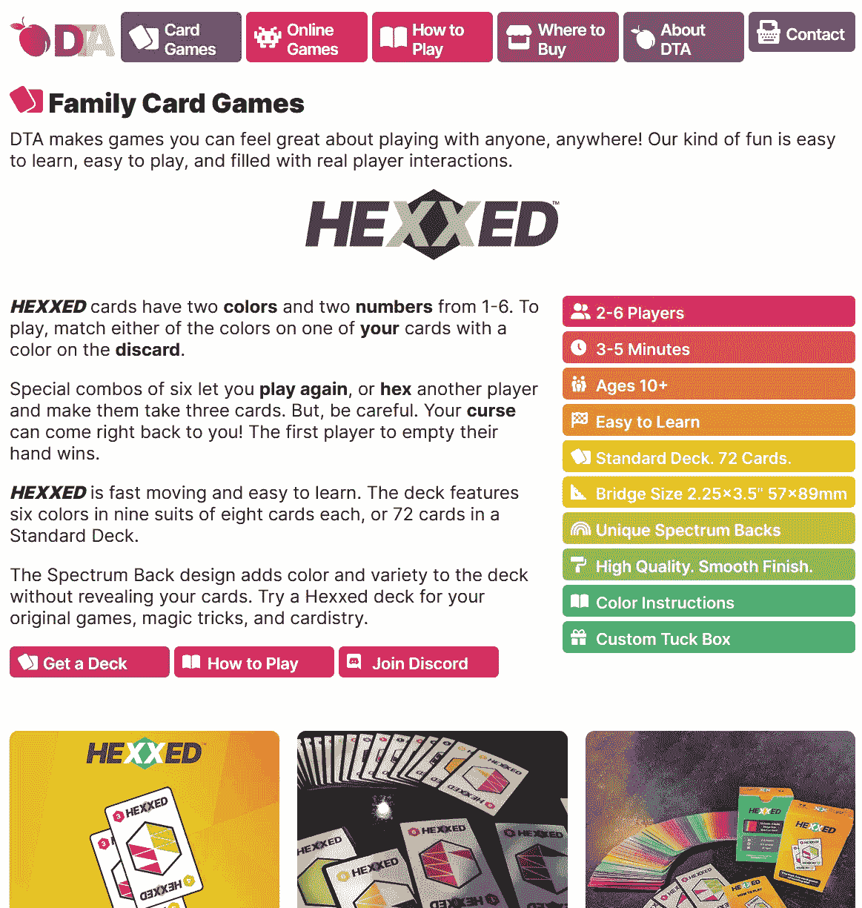

我的游戏公司的商业网站是由我将在这里教你的东西的一个奇特版本制成的。所有的按钮和面板都是带有 Lit 的自定义 web 组件。

# MVC 的时刻

为了远离动物园，我们需要一种单一的方式来组织和呈现页面内容。这种方法叫做 [**MVC**](https://en.wikipedia.org/wiki/Model%E2%80%93view%E2%80%93controller) 或者模型-视图-控制器。这种方法有许多名字，有许多奇特的(和不相关的)味道，像 MVVM 和其他人。但是底线是我们需要一个**模型**来保存数据。所有数据都应该在模型中，而不是在其他地方。我们需要一个**视图**，它包含用户可以看到和触摸到的一切。我们还需要**控制器**软件来将东西移入和移出模型和视图。

# 进入水疗中心

单页应用程序用一个单独的页面，通常是`index.html`，取代了单独的代码页面和 UI 页面。该页面充当 MVC 设计模式中的**控制器**。页面加载的任何视图(在其 HTML `<body>`中)对用户来说都是他们正在查看的一个页面。任何数据对于`index`加载的任何模块都是可用的，这是 MVC 的**模型**部分。如果`index`能够获得数据，它就是我们模型的一部分。

这种安排对于调试来说是极好的，因为不存在谁或什么在创建您所看到的任何输出的问题。答案总是一样的。输出来自你让`index`加载的 web 组件绘制的 HTML。通过仔细调整这些内容，您可以创建一个流畅的用户体验，而不需要不必要的长 URL 或组件之间复杂的数据传递。

当今世界上许多最受欢迎的应用是温泉。它们在 Spotify 等面向消费者的应用程序中特别受欢迎，因为有了良好的 MVC 设计，单页应用程序可以在提供高质量的定制用户界面的同时保持健壮和一致。

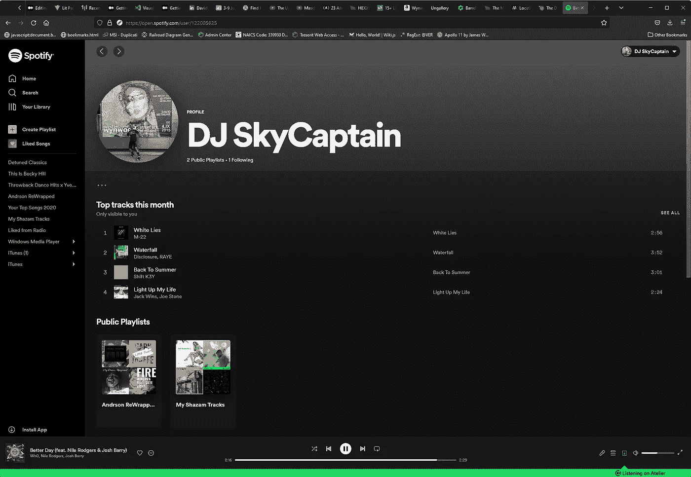

Spotify 是一个很好的单页面应用程序的例子，它也是跨平台的，完全由 web 组件构建。点击按钮和专辑封面会触发**控制器**中的功能，更新**视图**。**模型**由两部分组成，一部分是你的数据模型，另一部分是 Spotify 音乐库的正交模型。

# 用路由模拟导航

由于 SPA 中的 URL 不需要引用任何真实的代码(比如文件名或参数值)，所以我们可以按照自己的意愿设计我们的 URL。我们用一个叫做 **routing** 的想法将我们的设计者 URL 连接到一个可视视图。最初，这意味着通过将用户引导到另一个页面来模拟导航。但是由于我们不在其他任何人的框架内，我们可以让我们的路线代表我们想要的任何东西。

# 创建多页面查看器

让我们为一个页面查看器应用程序创建 web 组件，它就像一个简单的网站。我们将把所有页面数据存储在一个 [JSON](https://en.wikipedia.org/wiki/JSON) 模型中，并编写两个定制的 web 组件，一个用于“主页”(页面的容器)，另一个用于页面本身。最后，我们将添加路由，以便查看者可以“访问”各种页面。

W3C 关于 web 组件的规则之一是，您的定制组件必须有一个由两部分组成的名称，用破折号隔开。我们可以将它与另一个叫做 [*namespacing*](https://en.wikipedia.org/wiki/Namespace) 的好的编程实践一起使用，通过对我们所有的部分和模块使用相同的起始字母来将我们的组件与其他任何组件分开。对于这个例子，我将用 **dta** 启动我所有的 web 组件。所以我们将制作`<dta-home>`和`<dta-page>`。

我们正在构建的实际应用程序是 DTA 游戏公司网站的简化版本，你可以访问该网站，查看用这些相同的想法构建的一些更复杂的布局。

# **整理你的应用**

让我们设置一个 **dta** 文件夹(或者您选择的名称空间名称)，然后创建一个**组件**文件夹和一个**全局**文件夹。您还需要一个**模块**文件夹用于将来的扩展。我使用这种模式来遵守一条严格的规则，即视图中的任何内容都必须位于 components 文件夹中。其他不依赖于特定视图的 Typescript 函数成为它们自己的模块，并驻留在该文件夹中。我把“触及一切”的东西，比如启动材料、加载器、字体和样式放到我的全局文件夹中。

> 要创建一个新文件夹，在 VSCode 的左侧，右键单击空白区域并选择**新建文件夹**。要在文件夹内创建新文件，右击文件夹并选择**新建文件**。

# 创建您的第一个组件

在 components 文件夹中创建一个新的`dta-home.ts`文件(或者以您的名称空间开头的另一个名称)。这是一个带有自定义 CSS 样式和纯文本输出的简单组件。

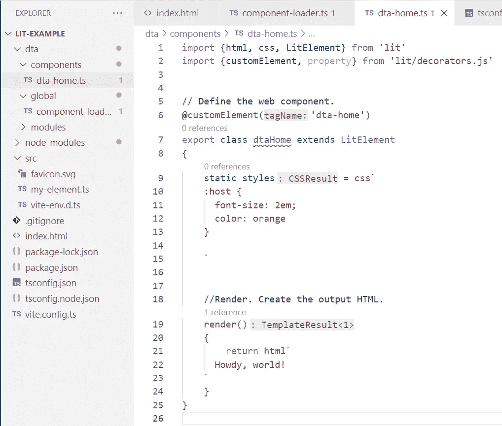

我们的定制元素只需要 3 个部分:一个**导入**语句，一个**导出**类，和一个**呈现()**函数。

这个在`<dta-home>`的第一次尝试除了它的 Lit 导入之外只需要两个部分。首先是一个`@customElement`装饰器，它是 Lit 中将 HTML 元素`<dta-home>`连接到代码的快捷方式。您必须使用出现在您的 HTML 中的准确名称，用破折号分隔，在第 6 行显示为`dta-home`。此外，为您的类使用相同名称的 camelCase 版本是一个很好的实践，如第 7 行所示`dtaHome`。

> 我为这些截图中丑陋的警告和曲线道歉。不必要的警告可以通过一些设置调整删除，但那是另一篇文章。这都是正确的代码，我保证！

# 使组件可访问

我在第 2 部分提到过，Lit 的模块化来自于导入和导出组件和 Typescript 模块。为了防止“导入意大利面条”，我使用了模块加载器技术。加载器导出你写的所有模块。然后，只需要加载或导入模块加载器本身，就可以在任何地方使用完整的组件库。

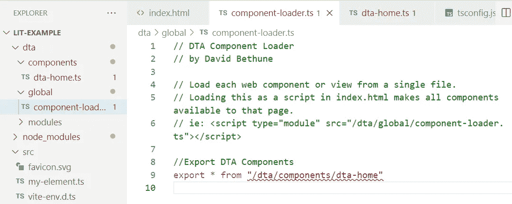

使用全局**组件加载器**意味着你只需要导入一个文件就可以访问你输出的 HTML 中的所有组件。

在您的全局文件夹下添加一个`component-loader.ts`文件。现在，它只需要导出我们编写的单个组件(第 9 行)。

# 将组件添加到页面

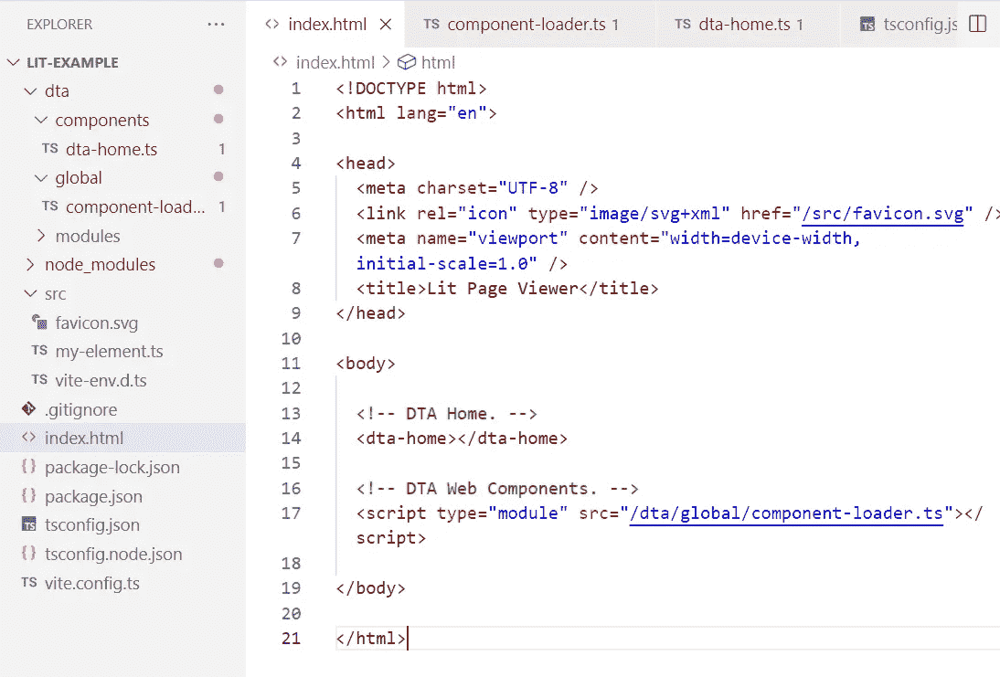

最小的**index.html**页面包含我们的新组件 **< dta-home >** 和一个组件加载器。

我们的页面查看器的`index.html`文件与我们在第 2 部分中从 Vite 看到的示例组件没有什么不同。但是对于我们的通用组件加载器，它在`<body>`中有一个`<script>`加载，而不是在`<head>`中加载一个特定的组件。

为了将未来的组件添加到我们的应用程序中，我们只需要从组件加载器中导出它们，而不是在`index.html`中摆弄它们。

# 查看我们的输出

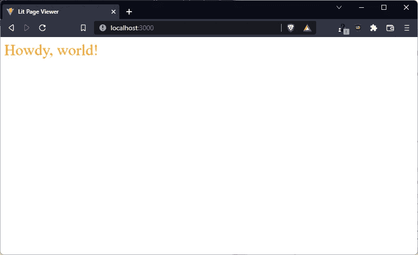

我们使用第 2 部分中提到的阴影 DOM 来创建这个丑陋的大橙色文本。

在我们写作的时候，Vite 应该一直在后台。让我们看看 [https://localhost:3000](https://localhost:3000) 并查看我们的页面。

# 又是那个影子 DOM

这里需要注意两件事。风格从何而来，内容从何而来。这个难看的大文本是我前面提到的阴影 DOM 的一个例子。它只活在这个组件里(谢天谢地)，不能把它的丑陋传播给其他任何人。下面是创建它的代码:

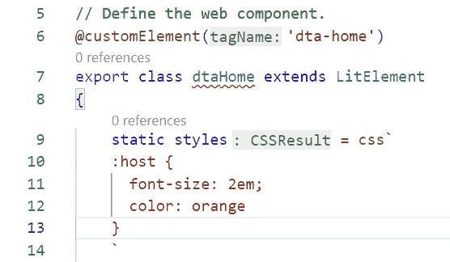

影子 DOM 接受一个以 **css** 装饰开始的参数。

Lit 中的`static`变量不是从外部传递的(比如属性或值)。这里的`css` decorator 是针对*反斜线*写的，是“这东西是 CSS”的一种快捷方式。`:host`语法意味着它是这个 web 组件`<dta-home>`的 CSS。最后，文本的`em`大小表示“正常的倍数”所以这种字体是用户正常文本大小的两倍。在一个小例子中有四个很酷的技巧。无畏的程序员，请注意！

# 你为什么满足？

问候文本本身来自`render()`功能。让我们来看看:

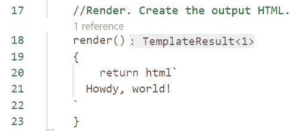

render()函数应该使用装饰符和反勾符号返回 **html** 或 **svg** 。

正如我在第 2 部分中提到的，每次组件更新时，render 函数都会运行。在这种情况下，每当有人访问或刷新`index.html`时就会发生，因为我们的`<dta-home>`组件是`index`的子组件。

注意这里使用的`html`装饰符和反勾符号(称为[标记的模板文字](https://developer.mozilla.org/en-US/docs/Web/JavaScript/Reference/Template_literals))，可以在其中隐藏变量和函数。我们稍后将在页面组件中讨论这一点。

这个 HTML 非常简单，它只是普通文本，甚至不是一个`
`。我给你看这个是有原因的。您可以使用这种简单性来编写任何您喜欢的更复杂的东西，从输出图形和动画的定制 SVG 组件，或者像已经编写了 HTML 的视频播放器这样的预构建组件，您希望用 Lit 来“点亮”它们。

# 添加页面组件

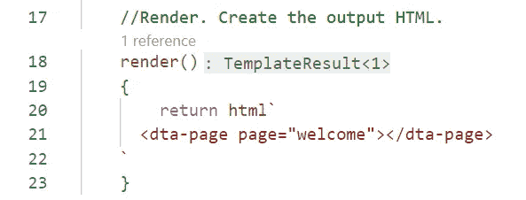

我们可以为我们的组件设计 API 或语法，只需编写一个用例，然后为它编码。

让我们的`<dta-home>`组件返回一个显示我们想要的页面的`<dta-page>`组件，而不是这个问候。我们可以首先搭建我们想要的组件，然后编写行为。因为我们还没有任何路由，所以我们将硬编码一个页面名称，然后使用 URL 中的内容。

# 编写页面组件

让我们添加一个新的`dta-page.ts`文件，其中包含一些我们可以查看的内容。我刚刚粘贴并编辑了`dta-home.ts`文件的内容，你也可以。这是我的:

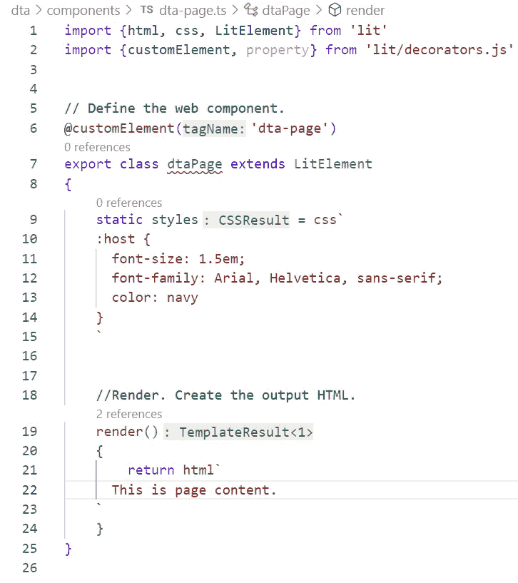

对于我的 **< dta-page >** 组件，我只是稍微改变了一下样式，添加了一些硬编码输出。

定制 web 组件的默认行为是**什么都不做**。这允许你设计一个新的组件，而不需要先把它连接起来，只需要写一个你想用的新组件的例子。您的无线组件不会导致任何错误，但它也不会做任何事情。如果您没有看到来自定制组件的任何输出，请检查类名(上面的第 6 行和第 7 行)是否与您编写的元素名称相对应，以及组件定义文件是否已经加载。

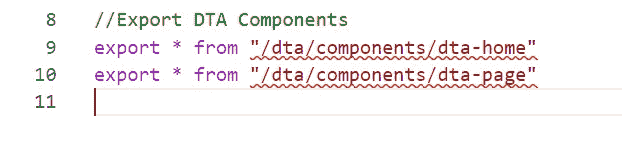

将新组件添加到加载器中，以便您的页面可以访问它。

不要忘记将新组件添加到您的`component-loader.ts`中，然后检查您的浏览器，查看新的`<dta-page>`组件在`<dta-home>`中的呈现。

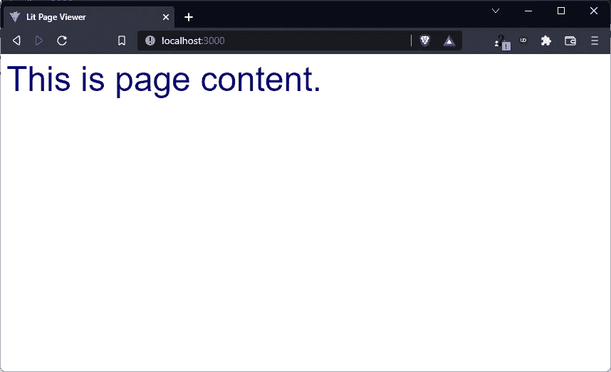

**< dta-page >** 组件也是静态的，但时间不长！

# 加入魔法！

到目前为止，所有这些内容都非常静态，非常乏味。让我们创建一个包含两个页面的数据模型，我们可以通过键访问这两个页面。每个页面本身都是 HTML，提供了我们需要的所有灵活性。然后，我们将通过查找组件的`page=`属性的值来提供来自模型的内容。

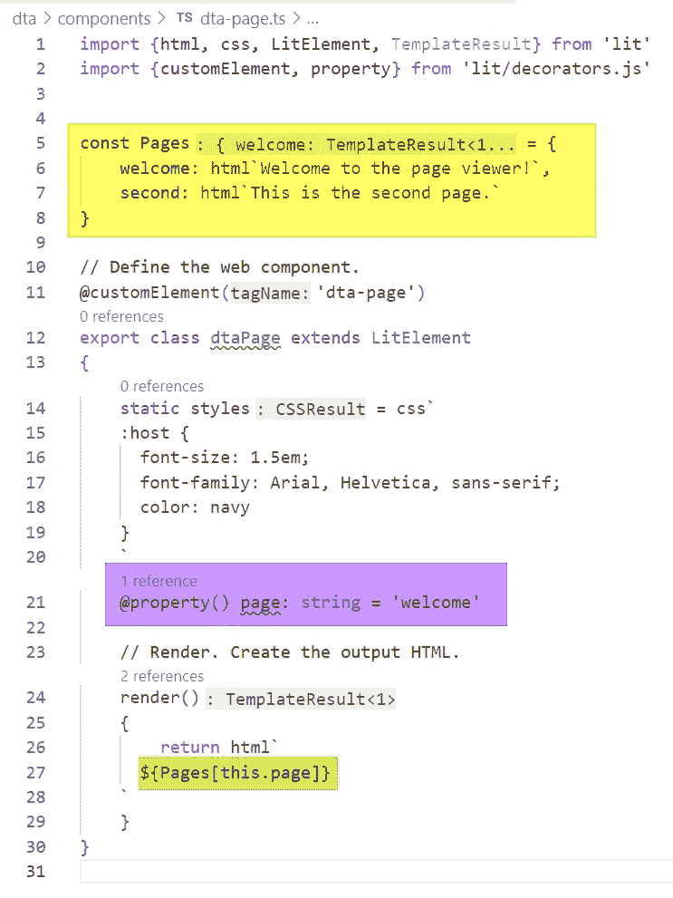

页面组件现在可以考虑传递给它的参数或属性，并使用语法从模型数据中提取内容。

为了方便起见，我们将模型数据定义保留在组件中。它实际上应该在 modules 文件夹中的 Typescript 模块中，我们可以在以后重构这段代码，将它移到那里。我们的模型是一个 JSON 对象，带有一个键和一个`TemplateResult`值，意味着 HTML 或其他 Lit 自定义组件输出。

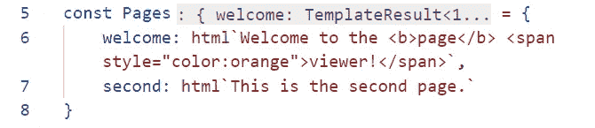

我们的模型只是同一个文件中的一个 JSON 常量，带有键和 HTML 值。

# 访问模型中的数据

为了访问我们写入到`<dta-page>`元素中的`page`属性的值，我们需要一个具有匹配名称的`@property()`。这里我们设置了一个默认值，可以作为主页。

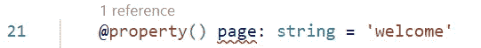

**@property()** decorator 定义了可以在我们的 **< dta-page >** 元素上传递的属性。在本例中，它是我们希望从 **Pages** 对象中得到的键。未定义为属性的特性将被忽略。

最后，在`render()`函数中，我们使用`${expression}`语法通过键访问变量的值。在 Lit 中，关键字 ***这个*** 总是指“这个组件”，所以`this.page`就是这个组件的`page`属性。

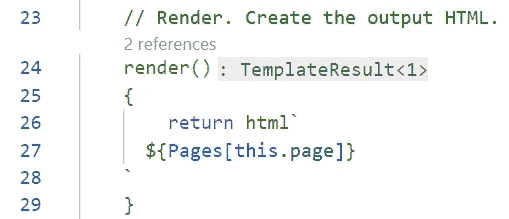

通过在 **${}** 中编写一个表达式，模板文字(在反斜线内)可以运行任何函数或从模型中获取任何数据。这里，我们使用从组件的**页面**属性传递的键来访问模型中的**页面**对象。

尽管这是最简单、最糟糕的一种数据模型(因为它与组件本身结合在一起)，但这里的要点是，无论组件上下文中有什么数据，都是模型的一部分。最好的设计会调用一个远程函数(希望在*模块*文件夹中)，传递他们想要的键，并获取要显示的页面内容或计算页面内容所需的值。考虑如何设计您的应用程序来使用像 Firebase 这样的远程数据源，或者远程 API 调用的结果，然后向您的组件提供这些数据(理想情况下，只有您需要的部分)。

需要注意的是，用`html` decorator 定义的变量实际上是 HTML，所以您可以在那里编写完整的语言，就像在这个例子中，我修改了`welcome`页面的定义，将一个单词加粗，并改变另一个单词的颜色。

Lit 中的 HTML 值是真正的 HTML，包含了该语言的全部功能，以及所有的自定义组件。

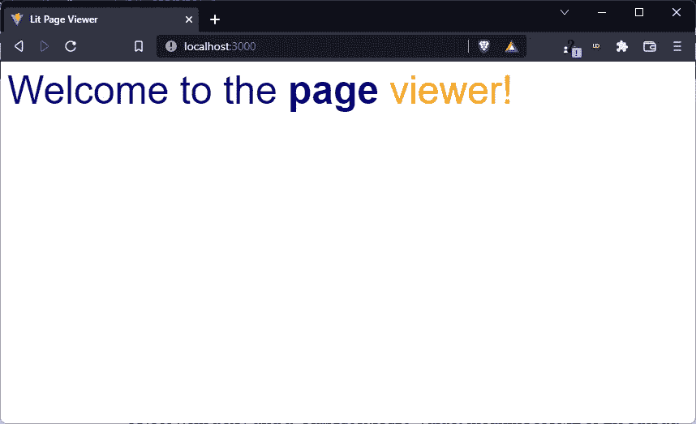

变量定义中带有 HTML 内联样式的输出。

# 添加路由

我们说过希望页面查看器对 URL 做出反应。如果我们对第二页的密钥进行硬编码，我们可以验证底层的概念是否有效。

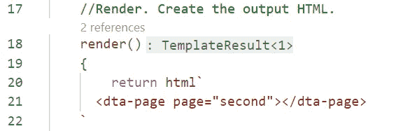

回到 **< dta-home >** ，对第二页进行硬编码。

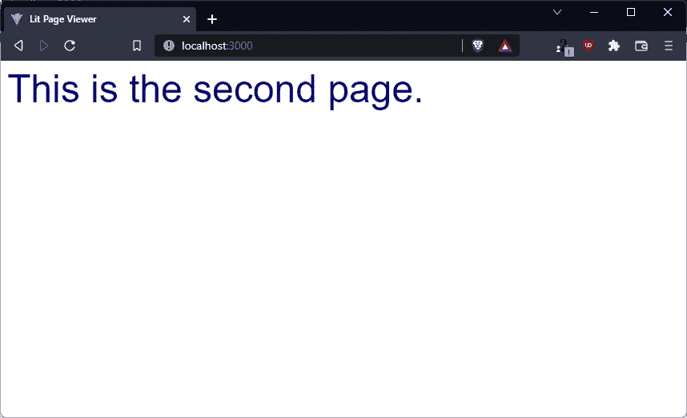

对第二页的视图进行硬编码。

因为我们所需要的就是这个键来显示正确的页面，所以我们可以把它添加到我们的 URL 中，然后去掉它。MDN 文档说有一个`document.location.pathname`会给我们一个 URL 中的“路径”或斜杠值的列表。如果我们取第一个，并把它作为我们的`page=`值传递，我们就应该得到我们想要的！

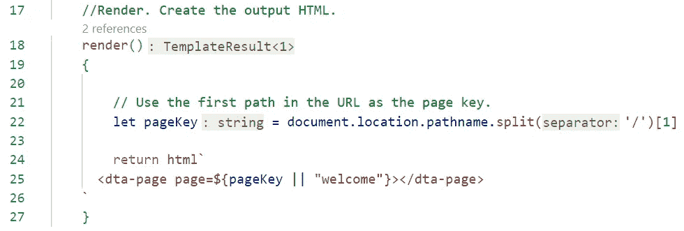

我们将第一个路径赋给一个变量，然后将它用作页面属性，用默认值捕捉 null。

在这里，我为空的`pageKey`添加了一个陷阱，替换第 25 行的“欢迎”。即使我们在它的组件定义中有这个属性的默认值，这个默认值只在属性*没有被提供*(如果我们没有在元素上写`page=` )时生效，而不是在你提供一个 null 或空值时生效。

# 秀出你的招式！

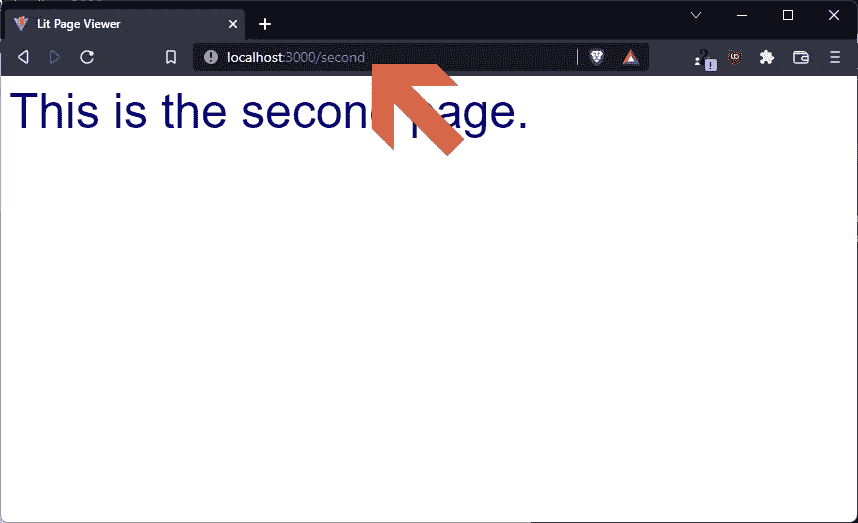

您的路由代码应该根据地址栏中的 URL 显示第二页。

没有斜杠组件的 URL 应该显示我们的默认页面，在 **< dta-home >** 中指定。

# 现在你知道了！

*Et voilá…* 您已经使用一些最佳实践指南，从自定义组件构建了一个单页面应用程序，并且可以扩展到您想要的任何类型的应用程序或用户界面。我的 [Hexxed](https://hexxedgame.com) 游戏，这里显示的，已经点亮了输出 HTML 的 web 组件，花哨的编程 CSS(甚至跨组件共享 CSS)，以及带有动画的 [SVG](https://www.w3schools.com/graphics/svg_intro.asp) 。

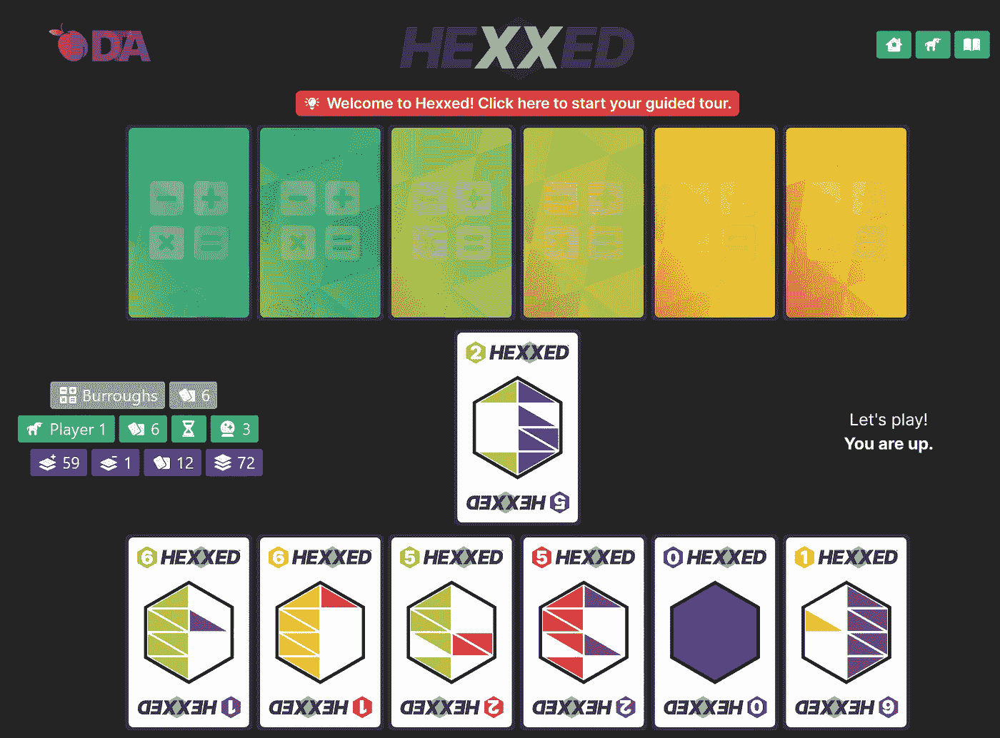

我的在线游戏 Hexxed 正是基于我在这里向你展示的内容，证明你可以用文学和网络组件制作各种应用，而不仅仅是“网站”

一如既往，感谢你的加入！如果有兴趣的话，我会在以后的文章中关注重构和扩展这个例子。

保重！

*— D*