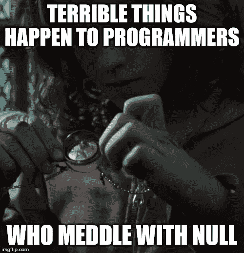

# 了解并爱上 TypeScript 的“元”类型

> 原文：<https://levelup.gitconnected.com/getting-to-know-and-love-typescripts-meta-types-5e17a8856b17>


奇怪的现象向事物本质的边界显现。宇宙也是如此。打字稿也是如此。由 [Kamesh Vedula](https://unsplash.com/@kvedula?utm_source=medium&utm_medium=referral) 在 [Unsplash](https://unsplash.com?utm_source=medium&utm_medium=referral) 上拍摄的照片

随着您在 TypeScript 中编写更多代码或使用更多具有 TypeScript 类型的库，您可能会意识到一些类型的含义可能相当令人费解。让我给你讲几个:

```
any
void
undefined
unknown
never
```

在我的头脑中，我称这些类型为“元”类型，因为它们经常超越描述具体的、真实世界的“事物”。相反，它们要么表现为语言技术性的一部分，要么可以传达一个抽象的概念，一个打字稿程序员应该注意这一点。

如果看到这些类型让你焦虑不安，请继续读下去！在这篇文章中，我将尽我所能让你与这些类型的人和平相处，他们将成为你的盟友！

*免责声明:请注意“meta”名称完全是个人的，因此您可能在别处找不到它。其中两种类型——*`*unknown*`*和*`*never*`*——在类型理论中也被正式称为“顶”和“底”类型。*

# 第一对:“任何”和“未知”类型

> **TL；博士:如果可以的话，避免使用 T2，但是如果必须的话，使用它。**

乍看之下，`any`和`unknown`类型有相似的实际用途:在某种程度上，这两种类型都允许你“含糊”地打字。

```
const a: any = "foo";
const b: unknown = "bar";
```

你可以用任何东西代替上面的`"foo"`和`"bar"`。我指的是任何事情。类型为`any`和`unknown`的变量的所有赋值都是有效的，作为`any`或`unknown`类型的参数提供的所有函数参数值也是有效的。以这种方式，两种类型的行为是相同的。

他们的第一个区别在于相反的方向。如果您试图将*的*的`any`或`unknown`类型的值赋给一个变量(或作为函数参数提供)，该怎么办？

```
const a1: any = "foo";
const a2: string = a1;
const a3: boolean = a1; // sure! (!!!)
const a4: any = a1;
const a5: unknown = a1;const b1: unknown = "bar";
const b2: string = b1; // nope! (!!!)
const b3: boolean = b1; // nope!
const b4: unknown = b1;
const b5: any = b1;
```

([游乐场链接此处](http://www.typescriptlang.org/play/index.html?ssl=1&ssc=1&pln=11&pc=20#code/MYewdgzgLgBAhgRgFzzATxgXhgIgGYgg4DcAUKJLHAEwrQBOAlmAOZbwJkXTwDMKAI0IAbAKZww7RF3A84AFhQSM2aeVlUArCgCuYANZgQAd0mrOpdZRgDkMPYZNncAuPRJWeA2jAbM22LYy1gL8NiLizkGesAKK9gZGpuzR3LHaqCo2nEA))

正如你在操场上看到的，`any`值可以被赋给任何东西，即使根据经验它看起来是一个“错误”类型的值(注意`a3`)。在这方面，`unknown`类型展示了一种“相反”的行为:除了期望`unknown`和`any`之外，它不能赋给任何东西，即使对于经验上看起来是“正确”类型的值(注`b2`)。

现在让我们做一件让 TypeScript 令人敬畏的事情:让我们看看这两种类型在受到[类型保护](https://www.typescriptlang.org/docs/handbook/advanced-types.html#type-guards-and-differentiating-types)时的表现。注意，下面的条件块都不会在运行时执行，这没问题。

```
const a1: any = "foo";
if (typeof a1 === "boolean") {
  const a2: string = a1; // nope!
  const a3: boolean = a1;
}const b1: unknown = "bar";
if (typeof b1 === "boolean") {
  const b2: string = b1; // nope!
  const b3: boolean = b1;
}
```

([游乐场链接此处](http://www.typescriptlang.org/play/index.html?ssl=11&ssc=2&pln=1&pc=1#code/MYewdgzgLgBAhgRgFzzATxgXhgIgGYgg4DcAUAJZ4wAUUaADgKYhWJabY4BGhANo3DA4AlDADepGDFCRYcAEwpoAJ3JgA5lngIyUmdHgBmFDxD9BWxGQC+pUvthdkMAK5gA1mBAB3MFu5wyiQUVLQMzFRO7Jym5kKiEnrgBlyKMCpqmthOutLJjsYwsQJ+2Tqk1kA))

现在，这两种类型的行为又变得一样了。在每个条件块中，我们的“模糊”类型被保护为布尔型，因此它们变成了`boolean`类型。

因此，`unknown`类型是一种安全的、假设永远不变的类型。从这个意义上说，你可以含糊地声明某个东西`unknown`，但是如果你希望有意义地使用这个值，你*必须*使用类型保护或者类型转换。

另一方面,`any`类型本质上等同于完全关闭该值的输入。只要值不受守卫，那就是“`any`的事”(geddit？😅).使用`any`实际上是告诉 TypeScript 后退。

但是为什么您希望 TypeScript 后退呢？嗯，如果你正在将一个庞大的代码库转换成 TypeScript，那么`any`类型是一个救星:它允许一个渐进的转换。首先，在遵守其他约束的情况下，尽可能正确地输入所有内容，并保留其他值`any`。然后，随着你的打字模式变得更加清晰，你放弃了`any`而倾向于更具体的类型。最后，您打开`tsconfig.json`的`[compilerOptions](https://www.typescriptlang.org/docs/handbook/compiler-options.html)`中的`noImplicitAny`选项，这将阻止 TypeScript 假定`any`类型的东西，如果没有您的帮助，它无法推断出这些东西的类型。

## 尽快远离“任何”

> “ไปไหนมา สามวาสองศอก”
> 
> 翻译:
> 
> “你去哪儿了？”
> 
> [另一个回答:]“七米。”
> 
> —泰国谚语

如果你已经在你的代码库中建立了一个严格的类型系统，使用`unknown`作为一种模糊的方式，并通过 guards 断言你想要的类型。更好的是，看看你的模糊性是否实际上是一种可以用[泛型](https://medium.com/@tar.viturawong/the-true-power-of-typescript-generics-1303d78a1c9a)表达的类型多态形式。值得再次重复的是,`any`表示一种*非类型化的*情况，并且您本质上是在处理关于该值的普通 JavaScript。

# 第二对:“无效”和“未定义”类型

> TL；DR:使用“void”忽略函数返回值，使用“undefined”有意返回 undefined。

在 JavaScript 中，`void`和`undefined`都代表相同的概念，即未定义值的概念。一个“returns void”的函数不返回值，如果你试图保存那个不存在的返回值，它将是`undefined`。在 JavaScript 中，“不返回”的函数与显式返回`undefined`的函数在行为上没有什么不同:

```
const a = () => {};
const b = () => undefined;
console.log(a());  // undefined
console.log(b());  // undefined
```

这有什么大不了的？

嗯，在 TypeScript 中，有一个`void`类型与`undefined`类型不同。看看这个:

```
const void1: void = undefined;
const undefined1: undefined = undefined;const void2: void = undefined1;
const undefined2: undefined = void1; // nope!
```

([游乐场链接此处](http://www.typescriptlang.org/play/index.html?ssl=1&ssc=1&pln=6&pc=1#code/MYewdgzgLgBAbiAlgEwIwwLwwK5mQUwDNEx9kBuAKFEllwONLUxzyJLKuvGniWQBMALj4oW9dk1RUavCYzLDWDDshYIU0ykA))

如您所见，您可以将一个`undefined`类型分配给一个`void`类型，但不能反过来。

那么为什么在 JavaScript 中不存在的情况下，TypeScript 会有这种区分呢？为了开始理解这一点，我们应该看看 TypeScript 声明什么是没有任何类型注释的以下表达式的类型:

```
const foo = void 0;
const bar = function(){};
const baz = bar();
```

([游乐场链接此处](http://www.typescriptlang.org/play/index.html?ssl=1&ssc=1&pln=3&pc=19#code/MYewdgzgLgBAZiEMC8MBuICWATGAGAbgChRJYAjAQwCcV4BXMYKTcACgEoBvAX2NOgwqALzpVqnAkA))

*(对于相对不熟悉的人来说，* [*表达式*](https://developer.mozilla.org/en-US/docs/Web/JavaScript/Reference/Operators/void) `[*void 0*](https://developer.mozilla.org/en-US/docs/Web/JavaScript/Reference/Operators/void)` [*产生了*](https://developer.mozilla.org/en-US/docs/Web/JavaScript/Reference/Operators/void) `[*undefined*](https://developer.mozilla.org/en-US/docs/Web/JavaScript/Reference/Operators/void)` [*值*](https://developer.mozilla.org/en-US/docs/Web/JavaScript/Reference/Operators/void) *，这是一个 pre-ES5 遗留的问题，其中的* `*undefined*` *全局变量在某些浏览器中可能会被覆盖；那是一段狂野而美好的时光！)*

如果你检查操场，你会看到`foo`有类型`undefined`，而`baz`有类型`void`。区别就在于此:在 TypeScript 中，不显式返回值的函数返回`void`。

"但是`void` *就是* `undefined`，为什么要在这个问题上斤斤计较呢？"你问。

嗯，在打字的世界里，这是有区别的！在它们身上尝试[无效聚结操作符](https://www.typescriptlang.org/docs/handbook/release-notes/typescript-3-7.html#nullish-coalescing):

```
declare const a: void;
declare const b: undefined;
const aOr42 = a ?? 42; // nope!
const bOr42 = b ?? 42;
```

([游乐场链接此处](https://www.typescriptlang.org/play/?ts=3.8-Beta&ssl=1&ssc=1&pln=14&pc=13#code/CYUwxgNghgTiAEYD2A7AzgF3lAXPAbkgJbADcAUKJLAsulgEZ4CuKoAZkSiGeXZtgDyMACwAmeAF5s8APyz44iv0bDxU+AzkKlQA))

您会发现`void`值不能像`undefined`那样被合并。这里你会被警告`a`不能在这个上下文中使用:*“一个‘void’类型的表达式不能被测试真值”。很快，你会发现这种行为与`void`和`undefined`的其他区别是一致的。*

当我们试图定义一个函数来适应某种类型时，另一个实际的区别就来了。

让我们假设你必须定义一个回调函数，比方说，一个定时器。

```
function delay(callback: () => void){
  setTimeout(callback, 1000);
}
```

现在，让我们看看 TypeScript 将允许什么作为`callback`的参数:

```
delay(() => alert("hi!"));
delay(() => prompt("what's your name?"));
delay(function(){
  prompt("what's your name?");
});
delay(function(){
  return prompt("what's your name?");
});
delay(function(){
  return alert("hi!");
});
delay(function(){
  return undefined;
});
```

([游乐场链接此处](http://www.typescriptlang.org/play/index.html?ssl=1&ssc=1&pln=18&pc=4#code/GYVwdgxgLglg9mABAEwKYBsCGBPAFBTddAI0wgGsAuRXASkQF4A+RANzhmVoG8AoRRAGdUUACowAtqjggo+QiTLkANIgCMABi20A3LwC+vXmix46jFoVQAnOQCIAFjACEd2ruMYcuc80QAHazgJf3sAdwdMKAByQURsGWtEMEwpAH43DxNvUEhYBDo+AUDg0Nw7CKjY+MTk1NQMj30srzxc6HgwQv5EaxEQayQSkPDImLiEgbr0tz1mvWy28A6Cnh6+qAGkK1typ1cmltNcdvyutYENrcRwNGAYMFRkOd0gA))

上面的一切都是允许的，甚至是那些返回非`undefined`值的函数，比如那些调用`prompt`的函数。现在让我们对比一下同一个实验，此时我们的`callback`预期返回`undefined`:

```
function delay(callback: () => undefined){
  setTimeout(callback, 1000);
}
```

([游乐场链接此处](http://www.typescriptlang.org/play/index.html?ssl=1&ssc=1&pln=20&pc=4#code/GYVwdgxgLglg9mABAEwKYBsCGBPAFBTddAI0wgGsAuRXASkQF4A+RcNYGMVZWgbwChEiAM6ooAFRgBbVHBBR8hEmXIAaRAEYADDtoBufgF9+-NFjx1GLQqgBOCgEQALGAEIHtfaYw5cl5ogADrZwUoGOAO5OmFAA5MKI2HK2iGCYMgD8Hl5mvqCQsAh0AkLBoeG4DlEx8YnJqemoWV6GOT54+dDwYMWCiLZiILZIZWGR0XEJSUMNmR4GrQa5HeBdRXx9A1BDSDb2lS7uLW3muJ2FPRtCWzusYOyc3AsneasXvYtAA))

现在，除了一个显式返回`undefined`值的函数之外，几乎所有的函数都中断了。这实际上就是两种类型的*语义*区别。作为返回类型，`undefined`类型要求函数显式返回`undefined`。另一方面，`void`返回类型仅仅意味着函数的返回值*没有意义，应该被简单地忽略*。这对于 arrow 函数表达式尤其重要，因为它们能够隐式返回唯一表达式的值。将`void`作为返回类型让 TypeScript 忽略这样的隐式返回值。

为了以另一种方式演示这一点，让我们看看这些自行定义并直接调用的回调:

```
type Callback = () => void;const a: Callback = () => alert("hi!");
const b: Callback = () => prompt("what's your name?");
const c: Callback = function(){
  prompt("what's your name?");
};
const d: Callback = function(){
  return prompt("what's your name?");
};
const e: Callback = function(){
  return alert("hi!");
};
const f: Callback = function(){
  return undefined;
};
const g: Callback = function(){};const returnA = a();
const returnB = b();
const returnC = c();
const returnD = d();
const returnE = e();
const returnF = f();
const returnG = g();
```

([游乐场链接此处](http://www.typescriptlang.org/play/index.html?ssl=1&ssc=1&pln=26&pc=21#code/C4TwDgpgBAwghgGwQIzgYwNZQLxQBQCUOAfFAG4D2AlgCYDcAUA2hQHYDOwUcAXLIinRZchEtwQQATsDwAiABZUAhLIKMWHLsj7wkqTDnxFspMJIoBbMDNkB3eXGABydlBAUArpKis4FiAD8qupsnFBoOgL6wlAAZh6saMBUbIQA3gxQUGaW1nL2ji5unt6+-kFqDAC+IZpQNJF6QobxicmpBBlZkhDAXqzZ5lY2Bc6u7l4+foHB1bVhEI2CBritSSms6ZlQPX2SA4hSNooqlTXMoVyxS9EtCesdXTu9-VAJNBCxVKwQ9HMXdQA5jdmqt7u1Np1-gCwrt+gBBQxwQjzLhw-YAIUMyBRMLRL32MEMaFxGlhBNYABFDDRSZdnntWABRQwQOl1dGsABiLXZ5MZAHFDICUUA))

请注意，不管函数实现返回什么，当我们实际评估这些函数时，TypeScript 将忽略它们的返回值，并且我们在所有情况下都以`void`结束。

不过请注意，在 TypeScript 最终转换到的 JavaScript-land 中，返回值是完整的(因此上面的`returnB`和`returnD`可能有一个具体的值)。TypeScript 只是阻止您在编译时使用它。其效果是，您可以“草率地”返回一个值，而不打算使它有意义(再次，箭头函数！)，而 TypeScript 将有助于使消耗这样的值变得更加困难。

## 你是回归空虚，还是不回归？

如果没有内置的 ES6 特性，比如 Map 和 WeakMap，它们的 getters 可以返回`undefined`，我会认为应该将`undefined`和`null`等同地表示一个缺失的值，而不是有细微的不同程度的空。然而，对此进行辩论有引发宗教战争的风险，因此我将谦恭地接受不同意见，因为这与此无关。

这里*与*相关的是，如果你使用`undefined`作为返回值，使用`undefined`类型并使用`void`来注释返回值*没有意义*的函数。如果您的函数有条件地返回`undefined` *或* *或者*某个具体值，这种区别就特别重要，ES6 Map getter 就是这种情况。实际的好处是，您将受到保护，不会意外消费不应消费的返回值。

# “从不”型

在所有的元类型中，`never`类型可能是最令人好奇的；它也是一个有用的概念，在许多情况下都有用途——尽管看起来是不相关的。

`never`类型是类型理论称之为“底层”类型的一个例子，这种类型不包含任何可能的实例(这是我有限的理解，我不是类型理论家！).在打字稿中，它表示不可能或不适用的意思。让我们看看发生这种情况的一些情况:

## 控制阻止返回/产出的流程

考虑这些功能:

```
function gameLoop(): never { 
  while (true) {}
}function die(): never { 
  throw Error("boo hoo"); 
}
```

函数`gameLoop`根本不返回，因为它内部有一个无限循环。这个函数可以将其返回类型声明为`never`。(请注意，虽然这在典型的 JavaScript 领域中不太可能是一个现实的函数，但请参见我在本文末尾的脚注。)

函数`die`没有以正常方式返回，而是抛出一个异常。同样，这个函数可以将其返回类型声明为`never`。这里，`never`是控制流使得返回动作不可能的结果，从而使得返回值不适用。

在这种情况下,`never`类型注释非常有用，因为它可以间接地提醒您无法到达的地方。

```
const afterlife = die(); // type never
// because its assignment is unreachable
```

与此类似的是永远不会产生的[发生器。](http://www.typescriptlang.org/play/index.html#code/GYVwdgxgLglg9mAVAAjAUwG5oE4E0ZoA2AJgM4AUAlMgN4C+QA)

> 这里有一个谜:一个`async`函数的返回类型可以是“`never”`吗？

## 缩小到不可能

我对一种叫做 [Chatuskoti](https://en.wikipedia.org/wiki/Catu%E1%B9%A3ko%E1%B9%ADi) 的古印度逻辑形式着迷。在佛教的*佛经中，*经常看到一个命题被分成四部分，比如:[“宇宙是有限的吗？是无限的吗？是既有限又无限吗？它既不是有限的，也不是无限的吗？”对这些古代人来说，一个二元问题似乎可以扩展成四倍的真值。如果你对所有这些可能性都回答“不”,你就会陷入一个不可能的境地。](https://www.accesstoinsight.org/tipitaka/mn/mn.063.than.html)

我们也可以像在 TypeScript 中一样对这样的逻辑建模:

```
enum FourFoldTruthValue {
  Yes,
  No,
  Both,
  Neither
}function answerQuestion(answer: FourFoldTruthValue)
{
  if (answer === FourFoldTruthValue.Yes){ /* ... */ }
  else if (answer === FourFoldTruthValue.No){ /* ... */ }
  else if (answer === FourFoldTruthValue.Both){ /* ... */ }
  else if (answer === FourFoldTruthValue.Both){ /* ... */ }
  else if (answer === FourFoldTruthValue.Neither){ /* ... */ }
  else {
    // what is the type of `answer` here?
  }
}
```

([游乐场链接此处](http://www.typescriptlang.org/play/index.html#code/KYOwrgtgBAYg9mATvANgEwCqLAFwBYBqAhimMAN4BQUUAmsAM4A01UAcnCzQEJz5ftgAS3zBElAL6VKAMzAgAxjiFwQUIiAYB3MQEUyDZaoAUG7WIBcsBMjjosuQiTIBKSlRpCZUU5p2IoAF5g6yRUTGx8YlJgADp6BhdyKAB6ACooWKyoNJSoKRpgFAZgKC8fM38gkPgwuwjHaLJYjiTUjKzYnLyCqCKSsu9fcwDgwNDbe0inGNjefDb0zOzc-NZ+0vLhqrGJ8Ico5zi2YVFERY6VnvXi0o8aVLytPCIcMoYoUU+ATwAHUrg3gABpUxECoHgxMAAPysGig8Q0KQSIA))

最终`else`分支的`answer`类型为`never`。为什么？`answer`必须是四个可能的枚举值中的一个，由于每个`if`子句相继排除了每个剩余的可能性，所以在我们最后的`else`子句中，我们没有剩余的可能性。因此类型为`never`。

当你需要完全处理不同的可能性时，缩小到不可能是常见的。你能想到我们如何利用 TypeScript 来确保我们的函数的完整性，是否应该向它添加更多的可能性(例如，如果我们去一个假设的五倍真值？)，我们应该警告未处理的情况吗？

您可以使用这个漂亮的小函数来实现这一点，您可以根据自己的需要进行调整:

```
function unreachable(neverValue: never){
  return Error("Never get here");
}
```

现在，在我们需要处理所有情况的函数中，我们在底部调用这个函数:

```
function answerQuestion(answer: FourFoldTruthValue)
{
  if (answer === FourFoldTruthValue.Yes){ /* ... */ }
  else if (answer === FourFoldTruthValue.No){ /* ... */ }
  else if (answer === FourFoldTruthValue.Both){ /* ... */ }
  else if (answer === FourFoldTruthValue.Both){ /* ... */ }
  else if (answer === FourFoldTruthValue.Neither){ /* ... */ }
  else {
    throw unreachable(answer);
  }
}
```

只有当`answer`在调用上下文中具有类型`never`时，TypeScript 才会允许这样做。`never`只能分配给自身。一旦你添加了一个尚未处理的新的可能性，你的`answer`类型将不再被缩小为`never`，并且那个对`unreachable`的调用将无效。编译时发现错误！(参见示例[此处](http://www.typescriptlang.org/play/index.html?ssl=1&ssc=1&pln=31&pc=2#code/KYOwrgtgBAYg9mATvANgEwCqLAFwBYBqAhimMAN4BQUUAmsAM4A01UAcnCzQEJz5ftgAS3zBElAL6VKAMzAgAxjiFwQUIiAYB3MQEUyDZaoCMACg3axALlgJkcdFlyESZAJSUqNITKjnNOohQALyhtkiomNj4xKTAAHT0DG7kUAD0AFRQ8TlQGWlQUjTAKAzAUD5+FoEhYfARDlHOsWTxHCnpWTnxeQVFUCVlFb7+lkGhweH2jtEucfG8+B2Z2bn5hayD5ZWjNRNTkU4xrglswqKIy11rfZul5V40UPiIcFpQ8ojARAp4RABGKGAuzEbgA3KwpFJZPIlCo1NU9AYjCAAEwgxA2erTJrHOIeR47RHjOp2Q6zFoJJJXVY9db9LbDKoBMS1SbY8nNE5tOA07q9DbFe5MjFsg6NI5zVqLPB8m6CgbCx40F5vD4gL4-P6A4HE8GQyTSOSKFHqzW-AFA0wgYAANzElJsNvtlygjy+OCQagAoohXohTAAiM4uqAAc2AOCgeDEwEDHgkQA))

## 组合互斥类型

TypeScript 有[非空断言操作符](https://medium.com/@tar.viturawong/a-note-on-typescript-non-null-assertion-operator-bad8fbe62bba)，它让您忽略可能为空或具体的值的`null`方面。例如:

```
declare const foo: string|null;
const concreteFoo = foo!; // concreteFoo is type string
```

正如我在链接文章中提到的，有一个奇怪的表达式，即`null!`，它的类型是`never`。

现在，你为什么要写这种荒谬的废话？！这里反复出现的一个主题是，虽然某样东西本身看起来没什么用，但它可以成为有用作品的一部分。考虑这种情况:

```
someArray
  .map(item => {
    const something = /* ... something to do with item */
    return something.x ? something.y : null!
  })
  .filter(Boolean)
```

结果将是一个元素类型与`something.y`相同的数组。这是因为`null!`是类型`never`，而`never`类型在与另一个具体类型结合时消失。(就像这样:说有两种可能性，其中一种是不可能的，就是说有一种*的可能性。)假设`something.y`可以被 truthiness 过滤，这个贴图过滤器就相当好用了！*

以上可能因为我们使用了`null!`而被认为是“脏”的。事实上,“类型正确”的替代方法是:

```
someArray
  .map(item => {
    const something = /* ... something to do with item */
    return something.x ? something.y : null!
  })
  .filter((item): item is /* ... insert type */ => Boolean(item));// or alternatively
  .filter(Boolean as (item): item is /* ... insert type */);
```

问题是，`filter`中的所有东西本质上都是将`Boolean`函数正式扩充为类型保护。哪种类型的守卫？嗯……`/* ... insert type */`型。试图以“适当”的方式做这件事的不便之处就在于此:您必须引用`something.y`的类型。通常，当你“在事情当中”时，这样的类型可能是一个相当麻烦的表达。

所以使用`null!`加上`Boolean`过滤器，我们可以以一种类型安全的方式映射过滤一个数组，代码看起来简洁，TypeScript 可以推断类型而不需要很多提示，`null!`的“破坏范围”非常有限。

## 空数组

我要提到的`never`最后一个奇怪的常见事件是:TypeScript 将类型`never[]`指定为空数组文字`[]`。

这很有意义，因为一个空数组没有元素，所以元素的类型是没有意义的。

但是它可能会在临时阵列扁平化模式中给您带来惊喜。你不能用任何东西`concat`一个`never`的数组！

```
[].concat(...arrayOfArrays); // nope!
```

相反，您需要为初始数组指定一个元素类型，以匹配您要传播的内容。

```
new Array<number>().concat(...arrayOfArrays);
```

([游乐场链接此处](http://www.typescriptlang.org/play/index.html#code/CYUwxgNghgTiAEYD2A7AzgF3rGUCeA8gGYCCMueaAXPCgK4C2ARiDANoC6nA3AFC+cAdMhRgoGABSDpOfMTIU0ASn4oQAd3gL8AHnrNWAPglLhqMZOmDZhUuXzLuQA))

# 空接口类型{}

有一种类型，有时你会看到。它没有原始名称，但可以用以下形式表示:`{}`。

不要让一个空对象字面上的外观欺骗了你，这个类型确实*而不是*代表一个对象类型。相反，它代表了一种“空接口”类型。不是`null`或`undefined`的任何东西都可以分配给它。

```
const a: {} = 2;
const b: {} = false;
const c: {} = {}
const d: {} = Symbol();
const e: {} = () => 42;
const f: {} = null; // nope
const g: {} = void 0; // nope
```

将类型为`{}`的值赋给除了期望`{}`、`unknown`和`any`的位置以外的任何位置都会失败。您不能访问它的属性(作为对象原型一部分的属性除外)，也不能调用它。本质上，作为一个界面，它完全缺乏功能。

当我第一次看到这种行为时，我得出了一个结论，即`{}`可以用作`unknown`的非空、非未定义的子类型——一种我们一直随意称为“具体”值的值。

然而，我遇到了一个问题。

如果你使用`{}`作为一个泛型约束，意图限制无效类型，当另一个泛型应用一个类型时，它将*而不是*被检查。查看以下示例:

```
interface WithConcreteProp<T extends {}>{
  concrete: T;
}
interface WithNullableProp<T> extends WithConcreteProp<T> { }const foo: WithConcreteProp<null> = {
  concrete: null // nope
};const bar: WithNullableProp<null> = {
  concrete: null // okay! ... wait... really?!
};
```

([游乐场链接此处](https://www.typescriptlang.org/play/?ts=3.6.3&ssl=1&ssc=1&pln=15&pc=2#code/JYOwLgpgTgZghgYwgAgOrDACwMIHsQJQSQAKUuADgDwAqyEAHpCACYDOyA3gL4B8nAKGTIE+QsQgAuZDQDcA7gNCRYiFOiwA5AK4AbXXABGuiGUq1e9JhFYcNOMUVLlqNS52SKBokGzDIYXFxpezwCJ1MXKhA9XUsAXi4hEUcJaRj9BXkfP2RDOCgQjEwdfSMTM2oMuOREwWEfcUh02KyBARhtAjBgfDy4AC8LAApA4LRisKbI8zcASi5kZLGAOkaIlYUgA))

注意上面的`WithNullableProp`是如何被允许扩展`WithConcreteProp` 的，即使没有`{}`约束。[证明了](https://github.com/microsoft/TypeScript/issues/36124#issuecomment-573145332)在通用上下文中，围绕`{}`、默认约束和`null`的行为有点不一致。TypeScript 团队似乎倾向于不管它，我明白这一点，因为弄乱`null`会把你带到非常危险的地方。正如赫敏·格兰杰在*哈利·波特与阿兹卡班的囚徒*中所说:



向 J.K .罗琳道歉

所以，你不能使用`{}`来表示“任何具体类型”作为通用约束。请注意这一点。

# 包扎

*   当您有意不确定数据类型时，请使用`unknown`类型，并断言您的方式进入更合适的类型。这很安全。
*   注意`any`类型关闭类型检查。无论你在哪里做这件事，你都只能靠自己，但是反过来`any`可以帮助你逐渐地将项目转换到 TypeScript。
*   使用`undefined`类型表示一个*有意义的* `undefined`值，使用`void`类型表示缺少一个有意义的值——这是某人说“答案是……没什么”和“我对你无话可说”之间的区别。
*   当你遇到`never`时，要明白你正在处理一个不可能的案子。当你想确保每一种可能性都被考虑在内时，你可能希望利用它来增加额外的安全性。
*   `{}`型可以认为是排除了`null`和`undefined`的`unknown`。然而，这只是我的经验观察，它至少不会像一般约束那样工作。

TypeScript 应用了许多有用的概念，这些概念既来自良好的理论基础，如 top 和 bottom 类型，也来自改善开发人员体验的实用动机。我们已经介绍了元类型是如何体现这些概念的，希望你现在也能够很好地理解和使用它们。

祝大家打字愉快！

*解决* `*async*` *函数之谜:一个* `*async*` *函数即使注定抛出异常，也总是返回一个* `*Promise*` *。* [见此处](https://www.typescriptlang.org/play/?ts=3.6.3#code/IYZwngdgxgBAZgV2gFwJYHsIwCbvQWwAoBKGAbwCgYYpMR0AbAUwDoH0BzQgIgEkYA7qgYMYTAB4AHdtibdiAbioxkACwBO6ATACi6zep64C8pQF8KtCPWZtOPUJFiIUGLOqbIE669wA0OHhExIqWdIys7Fx8AOT4MCBoIjDADKgAbkwA-ACEpkA)**。如果你想知道为什么会这样，“JavaScript 事件循环”是你的谷歌搜索查询。又是一个自己的大话题！**

*也就是说，*运行到*同步*无限循环中的* `*async*` *函数当然不会返回。但是任何同步无限循环都违背了 JavaScript 事件循环的基本原则。所以 TypeScript，在我看来，做了明智的事情，打折了这样一个实例，反而坚持所有的* `*async*` *函数都返回一个* `*Promise*` *。**