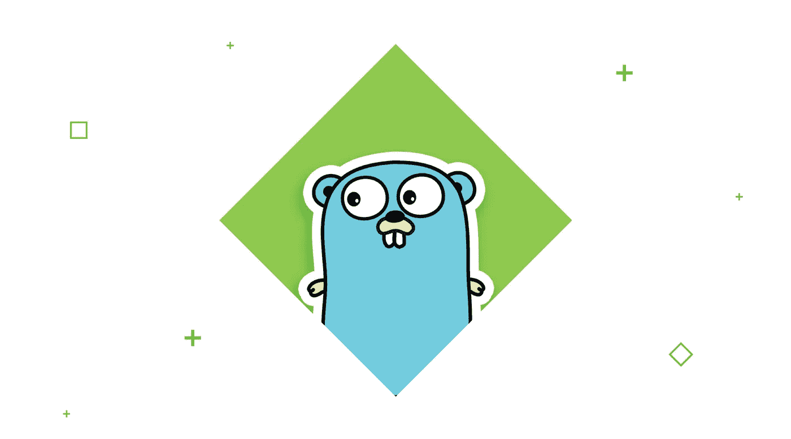
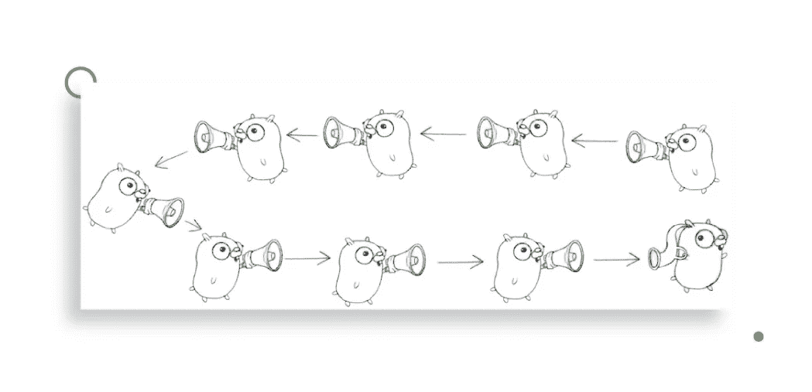
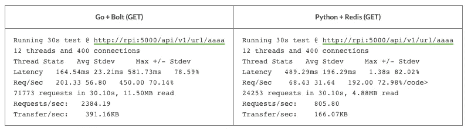
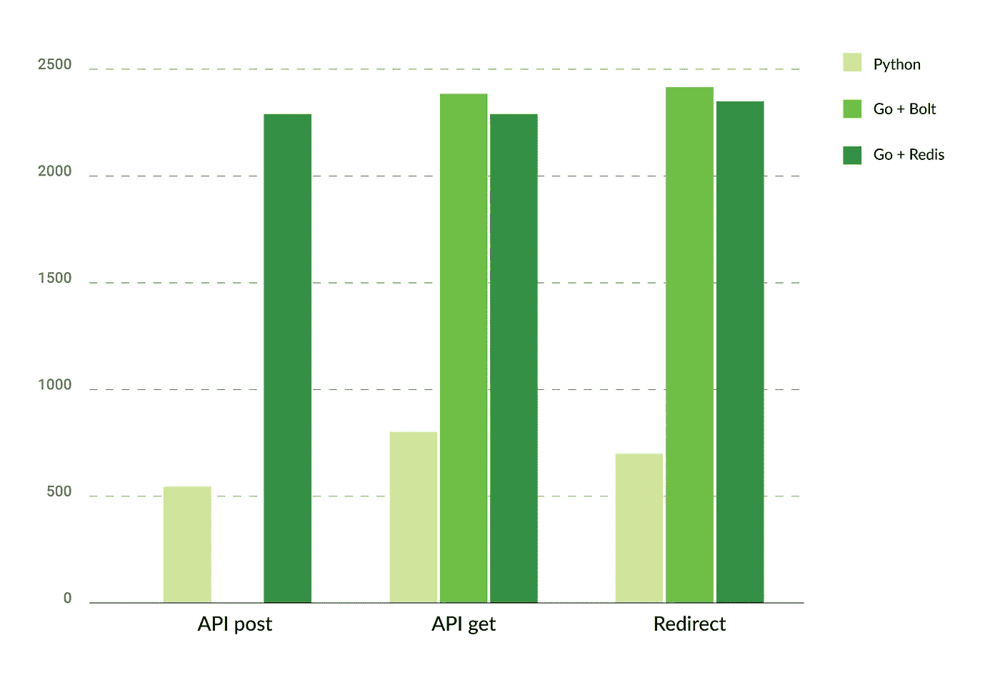

# 了解 Go、Python 和基准

> 原文：<https://levelup.gitconnected.com/getting-to-know-go-python-and-benchmarks-2dc8bbaae402>

你好，我叫 Vadym，这是我开始学习围棋的故事，与 Python(我目前在工作中使用的语言)相比是什么感觉，以及基准测试。


我相信每个开发人员都应该不断学习如何做好自己的工作。这不仅仅是了解新的框架、数据库或平台，如 AWS Lambda。它是关于了解你每天使用的服务是如何相互交互的，区分你最喜欢的语言何时使用一个对象的链接或对象的副本，以及许多其他事情。

10 年来，我一直使用 Python 作为我编写产品代码的主要语言。但是即使作为一名忠诚的 [Python 开发者](https://djangostars.com/services/python-django-development/?utm_source=levelup.gitconnected.com&utm_medium=medium&utm_campaign=getting%20to%20know%20go%2C%20python%20and%20benchmarks&utm_content=python%20developer)，我也尝试过不同的语言。我喜欢学习新的语言，因为我可能会在日常工作中学到一些东西——即使是从我不会使用的语言或我不喜欢的语言中，比如 Ruby 或 Java。另外，仅仅学习新的语言对我来说并不重要。我也喜欢花时间在旧的和很少使用的语言上。例如，除了为 Emacs 编写配置之外，我还尝试过 Lisp。我也很喜欢 Erlang，但是现在不太流行了。



# 了解围棋

几周前，我开始寻找一种新的语言来学习。首先，我开始研究长生不老药，因为我喜欢 Erlang，但看了教程后我并不真的喜欢它。几天后，我选择了围棋，因为我从不同的渠道听到了很多关于这门语言的知识。乍一看，这种语言似乎并不复杂，但是它需要一种不同于 Python 的应用程序架构方法。于是决定深入钻研围棋。

# 第一步

我首先做的是去看看围棋社区。Go 社区有一个很棒的教程，可以马上教你很多关于这门语言的知识。我相信这是一个伟大的起点:【www.tour.golang.org[。本教程分为三个部分，外加一个欢迎部分:](https://tour.golang.org/)

*   **Basic** 向您展示 Go 语法的基础，如何使用变量和函数、流控制语句和更复杂的类型。
*   **方法和接口**解释了如何创建和实现接口。
*   **Go 中的并发**解释了这个主题的所有基础知识。

所有这些部分都有简单的实践任务，涵盖了你所学的内容。

# 第二步

学习围棋的下一步是观看演示。最好的(在我看来)是 Rob Pike 的 [Go Concurrency Patterns](https://www.youtube.com/watch?v=f6kdp27TYZs) 。这个演示很容易观看，非常激励人心。我也推荐看基于这个视频的 YouTube 建议。



# 第三步

在我尝试创建自己的简单应用程序之前，我已经学习了另一个很棒的教程[——带着测试学习 Go](https://github.com/pityonline/learn-go-with-tests)。本教程解释了 Go 以及如何使用测试驱动开发的方法来编写代码。

在浏览了所有这些教程和视频之后，我决定最终尝试自己用 Go 编写一个简单的应用程序。我选择写一个 URL-shortener 服务，类似于 bit.ly 或者 goo.gl，但是更简单，没有统计和 UI。(以后可能会补充。)

首先，我试图用一组准备好的短字符串创建一个通道来识别长 URL。这是与渠道和 goroutines 一起工作的一个极好的练习。但是现在，我没有在服务中使用这些代码，每次我需要存储一个长的 URL 时都生成短的字符串。接下来，我开始为应用程序编写代码——首先是带测试的短字符串生成代码。当我开始考虑存储时，我陷入了困境。发生这种情况是因为我不明白如何正确地拆分我的代码。对我来说，答案就在 Go 标准库的[项目布局](https://github.com/golang-standards/project-layout)和查看一些流行的 Go 库和应用程序中。此外，我发现 [Go 模块](https://github.com/golang/go/wiki/Modules)在任何教程中都没有突出显示。

```
.
├── api
│   └── openapi.yaml
├── build
│   ├── ci
│   │ └── .travis.yml
│   ├── Dockerfile
│   └── docker-compose.yml
├── internal
│   ├── generator
│   │ ├── generator.go
│   │ └── generator_test.go
│   └── storage
│       ├── redis_storage.go
│       ├── redis_storage_test.go
│       ├── simple_storage.go
│       ├── simple_storage_test.go
│       └── storage.go
├── third_party
│   ├── locustfile.py
│   ├── redoc-static.html
│   └── wrk_post.lua
├── .gitignore
├── .travis.yml -> build/ci/.travis.yml
├── LICENSE
├── README.md
├── go.mod
├── go.sum
└── main.go
```

我通过描述我的 API 的 OpenAPI 模式开始了我的第二次尝试。然后，我从前面的代码中复制了生成函数，并开始处理 URL 存储。在我研究 Go 应用程序的项目布局时，我发现了 Bolt——一个用 Go 编写的简单的键值存储库。这个库的描述说存储可以用来存储大量的数据。我决定尝试一下，因为我使用的方法允许我轻松地用不同的数据存储替换这个库，而无需更改大量代码。

## 您可能还喜欢:

[](https://djangostars.com/blog/configuring-django-settings-best-practices/?utm_source=levelup.gitconnected.com&utm_medium=medium&utm_campaign=getting%20to%20know%20go%2C%20python%20and%20benchmarks&utm_content=you%20may%20also%20like) [## 配置 Django 设置:最佳实践

### 本文面向使用 Django 框架的工程师。它对配置 Django 有深刻的见解…

djangostars.com](https://djangostars.com/blog/configuring-django-settings-best-practices/?utm_source=levelup.gitconnected.com&utm_medium=medium&utm_campaign=getting%20to%20know%20go%2C%20python%20and%20benchmarks&utm_content=you%20may%20also%20like) 

# 基准测试和 Python 与 Golang 的性能比较

我在 Go 中的第一个应用已经准备好了，我想做一个基准测试。通常，我使用 wrk 来这样做，但这次我决定使用蝗虫。使用 Locust，可以更容易地创建一个同时使用所有端点的测试。当结果是大约每秒 43 个请求时，我感到很惊讶，这是一个相当小的数字。我的第一个假设是这个数字很小，因为存储只使用我磁盘上的文件。我决定用 asyncio 、aiohttp 和 aioredis 作为存储用 [Python 写同样的应用，检查结果，然后在一个 Go 应用中实现使用 redis 的存储。](https://djangostars.com/blog/asynchronous-programming-in-python-asyncio/)

而且成功了！我在 Python 和 Go 中对这两个应用程序进行了基准测试，得到了相同的结果。首先我运行 wrk 测试 API 端点通过短字符串检索长 URL。这是一个正确的决定，因为我得到了不同的结果。Go 应用程序的速度提高了 9 倍，Python 一秒钟处理超过 43 个请求。对于 Python 来说，这个数字现在是每秒 280 个请求，对于 Go 来说是每秒 2500 个请求。在我看来，这更接近事实。Locust 可能建议让 slaves 进行适当的测试，而不是使用 fork/threads，这就是为什么在当前设置中每秒 43 个请求是 Locust 的极限。



*最终测试的打印输出

下一个测试是关于存储长 URL 的 API。它表明我的 Go 应用程序每秒可以处理大约 20 个请求。这证实了我的预期。在这个测试之后，我使用 Redis 进行了存储实现，并使用 wrk 再次运行了所有测试。

下面，你可以看到测试结果的图表。我使用 Raspberry Pi 3 B+作为应用程序的平台，并使用一台带有 i7 和 16 Gb 内存的笔记本电脑来运行 wrk (Locust 具有相同的配置)。使用 Raspberry Pi 是一个有意的决定，以便给我运行测试的笔记本电脑更多的功能。



所有这些结果都来自 wrk，它已经使用 12 个线程和 400 个连接工作了 30 秒。这些数字是所有线程的总数，而不仅仅是一个线程。如果你对原始的 wrk 结果感兴趣，请点击[这个链接](https://gist.github.com/Quard/74861f27fb956bbe088c002a8574ffbe)。

**阅读还:** [如何用 Django REST 框架开发 APIs】](https://djangostars.com/blog/rest-apis-django-development/?utm_source=levelup.gitconnected.com&utm_medium=medium&utm_campaign=getting%20to%20know%20go%2C%20python%20and%20benchmarks&utm_content=you%20may%20also%20like)

# 我的个人结果

说实话，我用 Python 写的，从一开始就在 Gunicorn 的帮助下运行的应用，结果比我给你看的还要差。它给出了大约。每秒 360 个请求。但是当我将 Gunicorn 的工人数量从 2 个(默认)增加到 4 个时，结果翻倍了。Raspberry Pi 上有 4 个 CPU，拥有比 CPU 更多的工作线程可能会导致更糟糕的结果。

我可能在 Go 应用程序上获得了更好的结果，但是我不太了解如何在生产环境中运行 Go 应用程序。

最后，我想说我对围棋感到非常兴奋。上一次我对一门编程语言如此兴奋是在我开始学习 Python 的时候。对于一个开发 web 应用程序的敏捷公司来说，随着越来越多的开发人员了解 Python，Python 现在可能是更好的选择。Python 给人印象最深的是它庞大的社区。

此外，我认为要用 Go 编写应用程序，开发人员应该比使用 Python 等其他语言时更多地考虑应用程序设计。否则，他们将来将无法进行更改和扩展应用程序功能。或者可能会非常困难。顺便说一下，这是我的 Go 应用程序的存储库，我希望在未来继续工作和扩展:[https://github.com/Quard/gosh](https://github.com/Quard/gosh)。

最后一件事。你们当中有谁在学习这两种语言时有过类似的经历吗？你有什么见解？

> 这篇关于 [**Golang 和 Python**](https://djangostars.com/blog/my-story-with-golang/?utm_source=levelup.gitconnected.com&utm_medium=medium&utm_campaign=getting%20to%20know%20go%2C%20python%20and%20benchmarks&utm_content=originally%20posted) 的文章最初发布于 [**Django Stars 博客**](https://djangostars.com/blog/?utm_source=levelup.gitconnected.com&utm_medium=medium&utm_campaign=getting%20to%20know%20go%2C%20python%20and%20benchmarks&utm_content=ds%20blog) 。

[](https://djangostars.com/services/python-django-development/?utm_source=levelup.gitconnected.com&utm_medium=medium&utm_campaign=getting%20to%20know%20go%2C%20python%20and%20benchmarks&utm_content=banner_end)