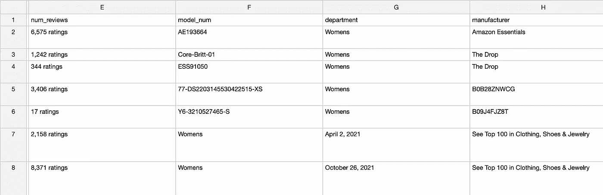

# 从互联网上获取有用的数据:Scrapy 快速入门指南

> 原文：<https://levelup.gitconnected.com/getting-useful-data-from-the-internet-a-quickstart-guide-to-scrapy-4a284a61501a>

## 收集亚马逊产品数据的用例


照片由[乌梅什·索尼](https://unsplash.com/@umeshsonii?utm_source=medium&utm_medium=referral)在 [Unsplash](https://unsplash.com?utm_source=medium&utm_medium=referral) 上拍摄

大多数有用的数据并没有以一种特别便于计算机或人类使用的方式收集。而是以各种无法使用的形式生活在互联网上。

在我们的演示中，我们将从 Amazon 收集产品数据。请注意，这不是一个特别强大的解决方案，因为我没有实现任何类似代理轮换的东西(如果您试图抓取像 Amazon 这样的大型网站，该网站对机器人和爬虫特别有抵抗力，则需要代理轮换)，我也没有介绍如何大规模运行您的蜘蛛(例如在托管的云服务器上)。

至此，您应该已经了解了 HTML 和 CSS 选择器，以及 Python `requests`模块的基础知识。

# 设置 Scrapy

[使用你选择的包管理器下载 Scrapy](https://scrapy.org/download/) (我用的是 conda，但是你也可以用`pip`轻松下载)。然后，`cd`进入一个名为`scrapy`的文件夹，然后运行`scrapy startproject amazon`。将创建一个名为 **amazon** 的文件夹。然后`cd amazon`。

要创建你的第一个蜘蛛，运行`scrapy genspider amazon amazon.com`。

## 文件系统概述

在您的`amazon`文件夹中，您会看到一个 *scrapy.cfg* 文件以及另一个名为`amazon`的文件夹，其中包含更多文件:

```
amazon/
├─ spiders/
│  ├─ __init__.py
│  ├─ amazon.py
├─ __init__.py
├─ pipelines.py
├─ settings.py
├─ middlewares.py
├─ items.py
scrapy.cfg
```

首先，我们来看一下 *settings.py* 文件，里面有`BOT_NAME`等基本信息。对于我们的项目，确保您启用了以下设置:

```
DEPTH_LIMIT = 3
DEPTH_PRIORITY = 1
SCHEDULER_DISK_QUEUE = 'scrapy.squeues.PickleFifoDiskQueue'
SCHEDULER_MEMORY_QUEUE = 'scrapy.squeues.FifoMemoryQueue'
ROBOTSTXT_OBEY = True
CONCURRENT_REQUESTS = 1
DOWNLOAD_DELAY = 0.05
DOWNLOAD_TIMEOUT = 15
```

其中大部分是不言自明的，但是文件顶部的注释也应该引导您到解释它们是什么的文档链接。调度程序只是描述 Scrapy 应该如何访问提供给它的链接。在我们的例子中，我们需要一个先进先出(FIFO)链路优先级队列。

我们还限制了并发请求的数量，这样 Amazon 就不会阻止我们，特别是因为我们还没有使用旋转代理。Scrapy 还可以自动为我们读取网站的`robots.txt`文件，大多数网站都必须制定规则，规定哪些机器人应该能够访问网站的哪些部分。当然，一个网站没有办法在没有机器人检测和阻止的情况下执行这些规则，这并不总是万无一失的，但不管怎样，遵守规则总是好的。

# 创造一只蜘蛛

在 *items.py* 你可以把你喜欢的任何字段放在这里。

```
class AmazonItem(scrapy.Item):
    # define the fields for your item here like:
    name = scrapy.Field()
    price = scrapy.Field()
    rating = scrapy.Field()
    num_reviews = scrapy.Field()
    model_num = scrapy.Field()
    department = scrapy.Field()
    manufacturer = scrapy.Field()
    sizes = scrapy.Field()
    colors = scrapy.Field()
    asin = scrapy.Field()
    image_url = scrapy.Field()
```

我们的 *pipelines.py* 文件应该是非常基本的，我们不需要从这里做任何修改。它定义了一个管道类，使我们能够在收集数据后对项目进行转换。如果我们想清理数据，可以在这里进行。让我们暂时让它保持原样(只是返回传递给它的项)。

最后，让我们编辑**蜘蛛**目录中名为 *amazon.py* 的文件。它定义了一个类(在我的例子中，我称它为`AmazonProductSpider`，但你的可能不同)。在`name`属性中，真正重要的是你如何称呼你的蜘蛛。这对于每只蜘蛛来说一定是不同的。我们还想指定另外两个属性:

```
name = 'AmazonProductSpider'
allowed_domains = ['amazon.com']
start_urls = ['http://amazon.com/']
```

每个蜘蛛都是从调用`start_requests()`方法开始的。默认情况下，这个方法将调用`parse()`方法，但是我们想稍微改变一下设置。首先，我们将定义我们的`start_requests()`方法。记住`from urllib.parse import urlencode, urljoin`。

```
def start_requests(self):
    queries = ["dress"]
    for query in queries:
        yield scrapy.Request(
            'https://www.amazon.com/s?' + urlencode({'k': query}),
            callback=self.parse_keyword_response
        )
```

每个蜘蛛方法应该`yield`一个响应或项目，而不是`return`。这是因为 Scrapy 是异步的，所以`yield`关键字将返回一个指向函数的生成器，而不是数据本身，Scrapy 可以在调度作业时调用函数。在这个方法中，我们告诉 Scrapy 通过产生一个带有 URL 和回调函数(如何处理响应)的`scrapy.Request`对象来访问每个产品查询的搜索 URL。

现在我们实际上可以定义这个回调函数了。创建一个名为`parse_keyword_response()`的新方法。

```
def parse_keyword_response(self, response):
    products = response.xpath("//*[@data-asin]")
    for product in products:
        asin = product.xpath("@data-asin").get()
        yield scrapy.Request(url='https://www.amazon.com/dp/' +
            asin, callback=self.parse_product_response, meta={'asin': asin}
        ) next_page = response.xpath("//*[@class='s-pagination-strip']/a[contains(concat(' ',normalize-space(@class),' '),' s-pagination-next ')]/@href").get()
    if next_page:
        yield scrapy.Request(url=urljoin("http://amazon.com/", next_page), callback=self.parse_keyword_response)
```

Scrapy 允许我们方便地使用 xpath 选择器从响应文本中选择项目和数据。

## xpath 选择器简介

Xpath 选择器是可以在 HTML 文档主体上执行某种搜索的字符串。例如，要选择任何 id 为“cat”的 HTML 元素，我们可以在 Scrapy 中使用`response.xpath("//*[@id='cat']/text()").get()`。`//*`表示搜索`:root`类的任何子元素(不仅仅是直接子元素)。(我们也可以使用类似于`//div`或`//h1`的东西来分别表示 div 或 h1 元素。)在括号中，我们可以标注要搜索的元素属性。`/text()`选择器直接在前一个元素中获取文本*。(使用`/`和`//`选择器分别指示直接子女或子女。)*

`.get()`方法告诉 Scrapy 只获取匹配我们搜索的第一个元素，但是我们也可以使用`.getall()`来获取匹配我们搜索的所有元素。

也许我们想在`data-asin`属性中获得属性值本身，就像我们上面做的那样。我们将获得所有产品选择器的列表，然后对每个选择器调用`asin = product.xpath("@data-asin").get()`。

Chrome 和 Firefox 开发控制台支持测试 xpath 选择器的方法。您可以运行`$x("<path here>")`来获取搜索返回的元素数组。

[这个 xpaths 备忘单](https://devhints.io/xpath#class-check)非常有用。如果想按类搜索，请注意构造选择器的独特方式，因为 xpath 选择器没有内置的方式来检查列表中是否存在类，而是直接搜索类字符串。

回到我们的`parse_keyword_response()`函数。对于在该页面上找到的每个产品，我们会根据产品的 ASIN 号向该产品页面发送一个请求项。有许多方法可以做到这一点(例如，您可以简单地让 Scrapy 跟踪 href 属性中的链接)，但是这种方法允许我们在进行过程中收集每个产品的 ASIN。

接下来我们可以定义一个名为`parse_product_response()`的方法，该方法定义当 Scrapy 到达产品页面时该做什么。

```
def parse_product_response(self, response):
    asin = response.meta['asin']
    name = response.xpath("//*[@id='productTitle']/text()").get()
    price = response.xpath("//*[contains(concat(' ',normalize-space(@class),' '),' a-price ')]//text()").get()
    rating = response.xpath("//*[@id='acrPopover']/@title").get()
    num_reviews = response.xpath("//[@id='acrCustomerReviewText']/text().get() details = response.xpath("//*[@id='detailBulletsWrapper_feature_div']//li//text()").getall()
    if details:
        model_num = details[8]
        department = details[13]
        manufacturer = details[23]
    else:
        model_num = None
        department = None
        manufacturer = None

    colors = response.xpath("//*[@id='variation_color_name']/ul/li/@title").getall()
    if colors:
        colors = [color[16:] for color in colors]

    sizes = response.xpath("//*[@name='dropdown_selected_size_name']/option/@data-a-html-content").getall()
    image_url = response.xpath("//*[@class='imgTagWrapper']/img/@src").get() yield {
        'asin': asin,
        'name': name,
        'price': price,
        'rating': rating,
        'num_reviews': num_reviews,
        'model_num': model_num,
        'department': department,
        'manufacturer': manufacturer,
        'sizes': sizes,
        'colors': colors,
        'image_url': image_url
    }
```

这个方法定义了从页面中获取数据所需的 xpath 选择器。Amazon 产品页面确实很笨重(比您可能想要解析的大多数网站都笨重)，而且经常更改，因此您可能需要在开发控制台中进行大量测试，以获得您想要的结果。我建议在多个页面上进行测试，并避免高度特定的选择器(例如，在许多产品页面上访问价格的选择器是高度可变的，所以我简单地制作了一个选择器，它获取它在价格块中找到的第*个*文本段，包括范围内的文本段——这可能并不总是有效，但对我的用例来说是可行的)。

您可能也注意到了，这次我们返回了一个字典，而不是一个`scrapy.Request`。如果我们生成一个字典而不是一个请求，Scrapy 将自动创建一个`AmazonItem`实例，用我们在 *items.py* 文件中定义的正确字段填充。

就是这样！现在我们可以在我们的终端运行`scrapy crawl AmazonProductSpider -o data.csv`来运行蜘蛛。注意，您应该将命令中的`AmazonProductSpider`替换为您在蜘蛛中设置的`name`属性。

把蜘蛛停在中间的某个地方。您的输出应该如下所示:


输出部分 I .作者提供的图像



产出第二部分。作者图片


产出第三部分。作者图片

可以看出`model_num`、`department`和`manufacturer`列给出的结果不一致。这是因为我使用了超级特定的选择器，在未来的迭代中，我可能会希望调整这些选择器，以更好地适应其他产品页面。我们可能还想运行 *pipelines.py* 文件中的一些脚本或其他一些数据管道脚本，以将`num_reviews`和`rating`转换成浮点数或整数，并将`sizes`列转换成一定范围或数量的大小，以便我们的数据更加可用。

# 扩展 Scrapy

我们还没有实现代理轮换，这很重要，因为如果你一次打太多电话，亚马逊会开始阻止你的 IP 地址。你可以从像 GimmeProxy 或者 T21 免费代理列表这样的网站上找到免费代理，然后设置一个脚本来测试这些代理

```
import requestsfor i in range(10):
    p = requests.get("https://gimmeproxy.com/api/getProxy").json().get('ipPort')
    try:
        if requests.get("https://httpbin.org/ip", proxies={'http': p, 'https': p}).status_code == 200:
            print(p)
            with open('proxies.txt', 'a') as f:
                f.write(p + '\n')
    except requests.exceptions.ConnectionError as e:
        print("Connection error with proxy:", p)
        continue
```

调用 GimmeProxy API，并通过向 [HTTPBin](https://httpbin.org/) 发出请求来测试返回的随机 IP 地址是否可以实际用作代理(Python `requests`模块有一个`proxies`参数，可以更改该参数以包含 IP 代理)。

为了在 Scrapy 中实现，我们需要在*middleware . py*文件中建立一个定制的中间件，或者使用一个专门用于 IP 轮换的第三方中间件，比如`[scrapy-rotating-proxies](https://github.com/TeamHG-Memex/scrapy-rotating-proxies)`。还有许多(付费的)API 提供可靠的代理轮换。

Scrapy 的其他好处我们还没有谈到，那就是动态的自动调节设置、更多的并发请求等等，所以我鼓励你在你的用例中利用这些功能。

Neha Desaraju 是德克萨斯大学奥斯汀分校学习计算机科学的学生。你可以在网上的[**estau dere . github . io**](https://estaudere.github.io/)**找到她。**