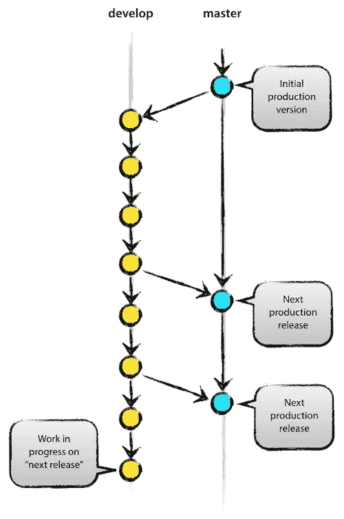

# Git 和使用 GitFlow 的工作流

> 原文：<https://levelup.gitconnected.com/git-and-workflow-with-gitflow-5f9f76530835>


照片由 [Unsplash](https://unsplash.com/?utm_source=unsplash&utm_medium=referral&utm_content=creditCopyText) 上的 [Onur K](https://unsplash.com/@kodozani?utm_source=unsplash&utm_medium=referral&utm_content=creditCopyText) 拍摄

[](https://raulferrer.dev)

当开发软件时，我们发现自己需要管理代码中的变更，并且当作为一个团队工作时，所有团队成员总是有一份该代码的副本，他们可以在其中工作，然后集成这些变更。为了促进这项工作，我们有版本控制系统，它允许我们跟踪和管理代码随时间发生的变化:为此，我们将看到 **GitFlow** 的使用和工作流程。

**Git** 是 Linus Torvarlds(Linux 的创造者)开发的一个版本控制软件，为了和他的合作者协调工作。

请记住, **Git** 有一个分布式架构，因此当开发人员制作该代码的工作副本时，它会生成一个存储库，其中包含该代码中所做更改的完整历史，而不是代码位于一个单独的位置。

# 存储库、修订、提交…一些词汇

当使用 **Git** 和版本控制时，我们会遇到一系列术语，为了知道正在做什么，有必要了解这些术语:

*   **分支。**分支是代码中某一点上的分叉，它允许你在不影响其他分支的情况下开发代码。例如，我们可以创建一个分支，向代码中添加新功能。
*   **结账。**在 **Git** 中，这个命令允许我们创建分支并在它们之间移动。
*   **克隆。**它允许我们在本地获得存储库的副本，以便能够使用它。
*   提交。这是对代码所做的一组变更的提交。该确认包含这些更改以及一条描述性消息和一些附加信息(作者、日期……)。
*   **冲突。**这是一个集成更改的问题，来自不同来源的更改需要在同一个文档中进行，而系统无法解决这个问题。在这种情况下，必须解决冲突的是开发商自己。
*   **差异(变化)。**变化或差异对应于代码的特定变化。版本控制是通过跟踪文件版本之间的差异来完成的。
*   **头。** Head 指的是存储库一直处于的提交(通常与工作分支中的最后一次提交一致)。
*   **合并。** Merge 是两个分支的合并，也就是当我们想把一个分支的代码中所做的更改整合到另一个分支的时候。例如，集成一个分支的变更，在这个分支中，我们向主分支添加了新的功能。
*   **拉。**这是推送的反向过程，所实现的是将代码从中央存储库下载到本地存储库进行更新。
*   **拉请求。**这是向代码所有者提出的请求，要求用我们的更改更新代码。
*   **推。**它允许我们将本地存储库中的代码更改上传到中央存储库进行更新，以便其他开发人员可以下载。
*   **储存库。这是存储代码和已做更改历史的地方。**
*   **标记(标签)。**顾名思义，它允许我们标记一个项目的不同版本，以便能够更容易地识别它们(例如，它们经常用于发布到生产的项目版本)。

# 让我们开始吧

了解了一些词汇之后，让我们看看如何开始以一种基本的方式在我们的项目中使用 git。

首先，我们为项目创建一个目录:

```
$ mkdir gitexample
$ cd gitexample
```

接下来，我们用 ***git init*** 初始化存储库:

```
$ git init
Initialized empty Git repository in /home/username/gitexample/.git/
```

现在我们将创建一个文件，并使用 ***git add*** 将其添加到存储库中:

```
$ touch readme.md
$ git add readme.md
```

***git add*** 让我们能够准备变更以便能够在以后确认它们。使用最多的选项有*{文件}* 、*{目录}* ，或者 ***git add。*** ，即添加所有文件。

我们现在要做的是使用 git commit 来修复所做的修改:

```
$ git commit -m “Added readme.md”
[master (root-commit) cdd097f] Added readme.md
1 file changed, 0 insertions(+), 0 deletions(-)
create mode 100644 readme.md
```

***-m***

现在，我们已经对我们的存储库做了一些更改。要知道它处于什么状态，我们使用 ***git status*** :

```
$ git status
On branch master
nothing to commit, working tree clean
```

这告诉我们，我们在 ***主*** 分支(这是主分支，也是在存储库启动时创建的分支)中，并且所有的更改都被验证了。

现在，我们将了解如何创建一个分支并在其中定位。例如，让我们创建 ***开发*** 分支:

```
$ git branch develop
$ git checkout develop
```

这样我们就创建了 ***开发*** 分支并移动到它上面。所有这些都可以通过以下命令在一个步骤中完成:

```
$ git checkout -b develop
Switched to a new branch 'develop'
```

现在我们假设我们在 *readme.md* 文件中做了一个改变。

如果我们现在做 ***git status*** ，它返回如下信息:

```
$ git status
On branch develop
Changes not staged for commit:
(use "git add <file>..." to update what will be committed)
(use "git restore <file>..." to discard changes in working directory)
modified:   readme.md
no changes added to commit (use "git add" and/or "git commit -a")
```

也就是说，我们在 ***开发*** 分支中，并且我们有未验证的变更(并且我们必须这样做)。

因此，我们:

```
$ git add readme.md
$ git commit -m "Updated readme.md"
[develop 94feba9] Updated readme.md
 1 file changed, 1 insertion(+)
```

好了，现在我们有了包含新的、经过验证的代码的分支，我们希望它也在分支中。我们要做的是转到分支并合并分支:

```
$ git checkout master
$ git merge --no-ff develop
```

当我们这样做时，文本编辑器出现，要求我们向**合并**添加一条消息。

一旦消息被添加，我们就进入屏幕:

```
Merge made by the 'recursive' strategy.
readme.md | 1 +
1 file changed, 1 insertion(+)
```

通过使用标志**-*no-ff****(非快进)，我们将 ***develop*** 合并为***master***keeping***develop***。*

# *GitFlow:组织您的存储库*

*当我们在一个项目上工作时，尤其是如果我们与更多的开发人员一起工作，有必要建立一个版本控制库的组织系统，它允许我们以敏捷的方式创建新的功能，纠正出现的错误，并集成所有这些以将代码投入生产。*

*为此，我们将使用由 [Vincent Driessen](https://nvie.com/posts/a-successful-git-branching-model/) 开发的分支和工作系统，我们从 **GitFlow** 中了解到该系统。根据这个制度，我们应该有几个主要分支和其他次要或支持分支。*

**

*[来源](https://nvie.com/posts/a-successful-git-branching-model/)*

## *主(主要)*

*这个分支包含已经上传到生产环境的每个版本的代码。此外，上传到这个分支的任何代码都必须准备好发布到产品中。*

## *开发(主)*

*这个分支包括项目的下一个迭代或版本的代码，并且它集成了为该版本开发的新功能。*

**

*[来源](https://nvie.com/posts/a-successful-git-branching-model/)*

## *释放(次要)*

*该分支从 **develop** 派生而来，包含即将发布到生产的版本的代码。在这个分支中，您还可以在发布之前更正任何错误。发布版本后，该分支需要集成到**开发**和**主**中。*

*给这个分支命名，常用以下约定:**【发布-** *【版本号】*。例如，要从 develop 为版本 2.3.5 创建一个发布分支，我们将执行以下操作:*

```
*$ git checkout develop
$ git checkout -b release-2.3.5

Or with a single command:

$ git checkout -b release-2.3.5 develop*
```

## *功能(次要)*

*这些分支，像**发布**分支一样，衍生自**开发**分支，包含与新功能相对应的代码。它们通常是只存在于每个开发人员的本地存储库中的分支。每当一个特性被最终确定和批准，它的分支就被整合到**开发**中。*

**

*[来源](https://nvie.com/posts/a-successful-git-branching-model/)*

*按照惯例，这类分支被命名为**feature/**{*feature name }*。例如，要创建包含同步用户信息功能的分支，我们可以执行以下操作:*

```
*$ git checkout develop
$ git checkout -b feature/userinfosync

Or with a single command:

$ git checkout -b feature/userinfosync develop*
```

## *修补程序(辅助)*

*创建一个**热修复**分支是为了纠正生产代码中一个急需修复的 bug。这就是为什么它来自于**主**分支，并且一旦被纠正，就被集成到**主**分支和开发**分支**中。*

**

*[来源](https://nvie.com/posts/a-successful-git-branching-model/)*

*这些分支的命名遵循与**版本**分支相似的模式:**热修复-** *【新版本号】*。因此，如果我们必须在 2.3 版本中制作一个修补程序，我们将以如下方式创建**修补程序**分支:*

*也就是说，从**主**我们创建一个**热修复**分支，其值为将被上传到生产环境的新版本的值(旧版本为 2.3，修正后的版本为 2.3.1)。*

```
*$ git checkout master
$ git checkout -b hotfix-2.3.1

Or with a single command:

$ git checkout -b hotfix-2.3.1 master*
```

# *标记主分支*

*每当我们将一个版本发布到生产环境中，并在主分支中集成代码时，强烈建议对该集成进行标记，以便我们可以识别每个版本的最终代码。*

*为此我们将使用 ***git tag*** 命令。例如，如果我们想要在 master 中标记版本 2.3.1 代码，我们将执行以下操作:*

```
*$ git tag -a 2.3.1 -m "Version 2.3.1"*
```

*我们用 **-a** 标记了版本，用 **-m** 添加了信息。*

# *GitFlow 实现的 Git 扩展*

*我们刚刚看到了一系列允许我们管理代码库的命令:创建分支，在它们之间移动，集成它们……但是多亏了一系列的 **git** 扩展，我们可以用一种更简单的方式来完成所有这些。为此，我们只需在我们的计算机上安装。*

*git-flow 文档解释了如何在不同的环境中安装这些扩展。在 *macOS* 的情况下，我们可以用:*

```
*$ brew install git-flow*
```

*安装完成后，我们可以使用以下命令初始化一个具有基本分支结构的存储库:*

```
*$ git flow init*
```

*并回答向我们提出的问题:*

```
*Which branch should be used for bringing forth production releases?
   - devel
   - master
Branch name for production releases: [master]

Which branch should be used for integration of the "next release"?
   - devel
Branch name for "next release" development: [master] devel

How to name your supporting branch prefixes?
Feature branches? [feature/]
Release branches? [release/]
Hotfix branches? [hotfix/]
Support branches? [support/]
Version tag prefix? []*
```

# *用 git-flow 管理不同的分支*

# *特征*

```
*$ git flow feature*
```

*它向我们显示了所有**特征**类型分支的列表。*

```
*$ git flow feature*
```

*使用该指令，我们创建一个名为*{功能名称}* 的新分支，该分支从该分支中派生并定位我们。*

```
*$ git flow feature finish {feature_name}*
```

*该命令**将***{ feature _ name }*分支合并到分支中，将我们定位在分支中，并删除 *{feature_name* }分支。*

```
*$ git flow feature publish {feature_name}*
```

*该命令用于将 *{feature_name}* 分支发布到远程存储库。*

```
*$ git flow feature publish {feature_name}*
```

*使用此命令，我们从远程存储库下载分支 *{feature_name}* 。*

# *释放；排放；发布*

```
*$ git flow release*
```

*它向我们显示了所有**版本**类型分支的列表。*

```
*$ git flow release start {release_name} [BASE]*
```

*使用此指令，我们创建一个名为 *{release_name}* 的新分支，它从该分支中派生并定位我们。*【BASE】*是一个可选值，对应于我们希望从其派生该分支的集成(**提交**)的 *sha1 散列*。*

```
*$ git flow release publish {release_name}*
```

*这个命令执行不同的任务:它用 *{release_name}* 标记分支，将 *{release_name}* 分支合并到分支和分支中，最后删除分支(记得用 git push origin — tags 发布标签)。*

*该命令用于将分支 *{release_name}* 发布到远程存储库。*

# *修补程序*

```
*$ git flow hotfix*
```

*它向我们显示了所有**热修复**类型分支的列表。*

```
*$ git flow hotfix start {version} [BASE]*
```

*使用该指令，我们创建一个名为 *{version}* 的新分支，该分支从**主**派生，并将我们放置在该分支中。*

```
*$ git flow hotfix finish {version}*
```

*该命令执行不同的任务:用*{ version }***标记分支，将***{ version }*分支合并到**开发**分支和**主**分支中。它还用**热修复**版本标记**主**分支。*