# Git 分支教程

> 原文：<https://levelup.gitconnected.com/git-branches-tutorial-9263f4fc01ad>

## Git 分支的简明介绍


照片由 [Philip Myrtorp](https://unsplash.com/@philipmyr?utm_source=medium&utm_medium=referral) 在 [Unsplash](https://unsplash.com?utm_source=medium&utm_medium=referral) 拍摄

[](https://jorgepit-14189.medium.com/membership) [## 用我的推荐链接加入媒体-乔治皮皮斯

### 阅读乔治·皮皮斯(以及媒体上成千上万的其他作家)的每一个故事。您的会员费直接支持…

jorgepit-14189.medium.com](https://jorgepit-14189.medium.com/membership) 

在本教程中，我们将讨论 Git 分支。用简单的例子，我们将向您展示如何**创建**、**切换**、**重命名**、**删除**、**重置**、**合并**分支。对于本教程，我已经创建了一个 git 项目，您可以跟着做。让我们看看我的 git 项目。

```
ls -ltr
```

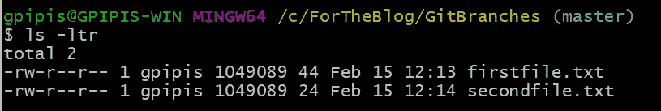

让我们看看[的 git 日志](https://predictivehacks.com/?all-tips=different-formats-of-git-logs)。

```
git log --format=oneline
```

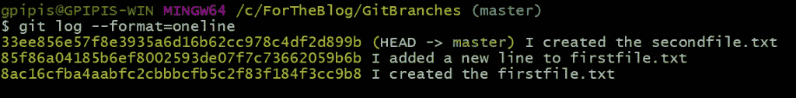

# 如何创建新的分支

如我们所见，目前我们只有主分支机构。我们可以通过运行以下命令来确认:

```
git branch
```

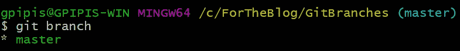

我们可以通过运行以下命令创建一个新分支:

```
git branch <branch_name>
```

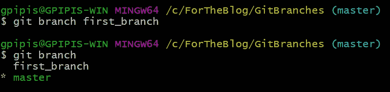

如您所见，我创建了一个名为“ **first_branch** 的新分支，但目前，我仍在主分支中(前面带有*的绿色字母)。接下来，我们将看到如何切换分支。

# 如何切换分支

我们可以通过运行以下命令来切换分支:

```
git checkout <branch_name>
```

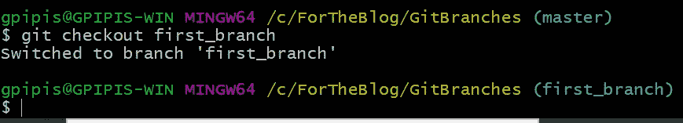

正如我们现在所看到的，我们处于“**第一 _ 分支”**分支中。请注意，我们可以通过运行以下命令在一行中创建和切换到新分支:

```
git checkout -b <branch_name>
```

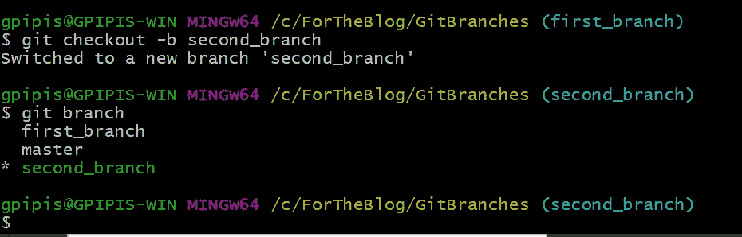

在上面的例子中，我创建了一个名为“second_branch”的新分支，同时切换到它。

# 如何比较分支

我们也可以比较分支。对于这个例子，我们将对`first_branch`进行一些修改，然后将它与`master`进行比较。实际上，我会在文件`firstfile.txt`中增加一行。

```
git commit -am "I added a new line to the firstfile.txt"
```

让我们看看日志。注意现在**头**指向`first_branch`。

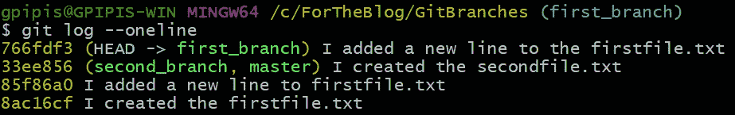

既然我们做了这个改变，我们可以比较两个分支。该命令如下所示:

```
git diff <branch_name>...<another_branch_name>
```

在这个例子中，我将比较“master”分支和“first_branch”。

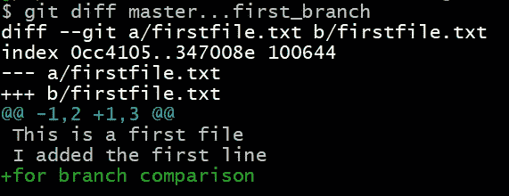

绿色字母是我添加到“firstfile.txt”中的文本。

# 如何重命名分支机构

我们可以通过运行命令来重命名分支。`-m`旗来源于“动”。

```
git branch -m <oldname> <newname>
```

注意`<oldname>`是可选的。如果我们跳过它，它认为是`<oldname>`工作分支。我们将把`second_branch`更名为`renamed_branch`。

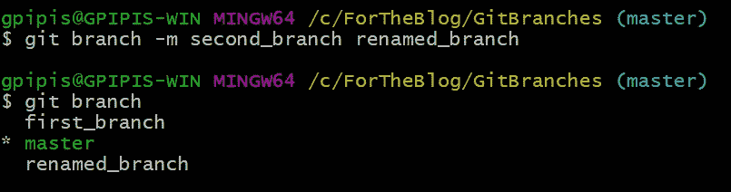

`second_branch`变成了`renamed_branch`。

# 如何删除分支

我们可以通过运行下面的命令简单地删除一个分支。`-d`标志来自“删除”。

```
git branch -d <branchname>
```

你需要知道的一些事情:

*   您不能删除当前所在的分支。例如，如果我们想要删除“重命名的分支”,我们需要先签出到另一个分支。
*   不能使用上述命令删除未完全合并的分支。但是，如果确定要删除，可以运行`git branch -D <branchname>`。注意`-D`标志。

# 如何重置分支

术语“重置”是指将更改重置到特定提交之前的状态。这就像[撤销变更](https://predictivehacks.com/?all-tips=how-to-undo-changes-in-git)，我们在之前的帖子中已经解释过了。有 3 种类型的复位，即“**软**”、“**混合**”和“**硬**”。在 [StackOverflow](https://stackoverflow.com/questions/3528245/whats-the-difference-between-git-reset-mixed-soft-and-hard#:~:text=reset%20%2D%2Dsoft%20%3A%20History%20changed,go%20with%20Git%20%2D%2Dsoft.) 中，你可以找到 3 种复位类型的详细解释。我将保留对苏雷什·夏尔马的解释。

*   重置-软:历史改变，头改变，工作目录不变。
*   重置-混合:历史记录已更改，磁头已更改，工作目录已更改，数据未暂存。
*   硬复位:历史改变，磁头改变，工作目录改变，数据丢失。

一些例子:

```
# soft reset moving the HEAD two steps back 
git reset --soft HEAD^^ # soft reset moving the HEAD at a specific SHA 
git reset --soft <SHA>
```

# 如何合并分支

在这一节中，我们将向您展示如何合并分支。对于这个例子，我们将合并`first_branch`和`master`。首先，我们需要结帐到主分行。

想象一下，当前的分支(这里是主分支)是将“接收”变更的分支。进入主分支后，我们可以运行命令:

```
git merge <branchname>
```

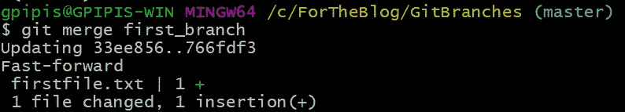

如果我们运行`git diff`命令，我们将看到不再有任何变化。

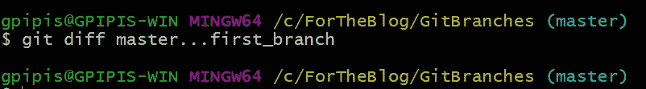

最后，我们可以运行

```
git branch --merged
```

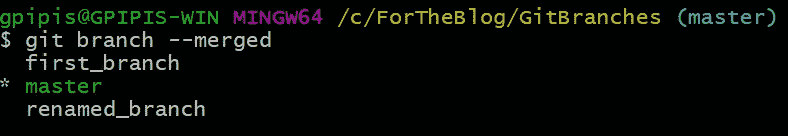

# 合并冲突

当多个开发人员在处理同一个项目时，他们通常会在独立的分支中工作，以避免冲突。git merge 命令组合了这些分支，并解决了任何冲突的编辑。当有冲突时，您会在文件中看到以下内容:

`<<<<<<< HEAD`和`=======`之间的内容是 HEAD 所指向的主分支中存在的内容，`=======`和`>>>>>>> <branch_name>`之间的内容是合并分支中存在的内容。

## 如何解决合并冲突

有两种主要的不同方法来解决合并冲突，例如:

**中止合并**

我们可以简单地键入命令:

```
git merge --abort
```

**手动解决冲突**

我们可以通过比较两个冲突文件并进行必要的更改来解决冲突，以便在两个文件之间达成一致。我们可以通过键入以下内容看出差异:

```
git show --color-words
```

然后，我们必须移除`=======`和`>>>>>>>`标记之间的所有文本以及线条`<<<<<<< HEAD`。清除标记后，您可以将先前冲突的文件添加到舞台上，然后提交更改。

*原为发表于*[*https://predictivehacks.com*](https://predictivehacks.com/git-branches-tutorial/)*。*