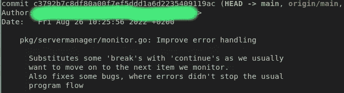

# Git 提交消息—正确的方式

> 原文：<https://levelup.gitconnected.com/git-commit-messages-the-right-way-724dba78c55f>

当新成员加入我们的团队时，我总是检查一些事情:他们如何编写提交消息——在过去的几年里，我注意到编写一个合适的提交消息(至少符合我的标准)是很少有人能真正做到的事情。


[扬西·敏](https://unsplash.com/@yancymin?utm_source=unsplash&utm_medium=referral&utm_content=creditCopyText)在 [Unsplash](https://unsplash.com/s/photos/git?utm_source=unsplash&utm_medium=referral&utm_content=creditCopyText) 上的照片

# 理论:如何编写提交消息

关于如何编写提交消息，有很多约定。这个建议是根据我的个人经验提出的，并不一定是“正确的”方式(即使标题声称是这样；) ).当考虑提交消息时，您脑海中总是有两个用例。要么是你在 9 个月没有接触这个项目后读了它，要么是其他人对这个项目一无所知。尽管如此，应该是:

1.  自描述，描述**改变了什么**，以及**在哪里**
2.  使用一行程序——几乎每个人都使用`git log --oneline`
3.  对细节有更广泛的评论。

# 如何不写提交消息

让我们从如何**而不是**做这件事的例子开始。打开并从 git 中的一个项目复制一条提交消息:


提交消息—不是第一条

哇！好吧——这有什么问题？

*   描述性的:我认为你可以说这是一种描述性的。这提交了未使用变量。好吧。但是**在哪里**？**什么**变量？还有**为什么是**？不再使用..因为？
*   一句俏皮话:的确——这是一句俏皮话。只是部分有帮助，但仍然。
*   详细描述:看不见任何东西。

# 好多了

我认为我们可以做得更好。所以让我贴一个更好的例子:



提交信息—好处 1

首先:提交的标题看起来很棒。它准确地回答了变化发生在哪里，以及修复了什么——太好了。更广泛的描述进入细节，所以这是完美的。但是等等..什么？“还修复了一些 bug”这一行让我很好奇——什么 bug？在哪里？他们被追踪到什么地方了吗？这里可以改进的是列出已经修复的错误和/或甚至更好——将这些错误修复移到单独的提交中。

# 模板

我试图想出一个好的提交应该是什么样的模板

```
{Path/treewide}: {Short description} (Github Issue){Long Description referencing Github Issue or any other tracking system - Feel free to use bullet points here as well.}Signed-off: {Mail Address}
```

保持提交简单明了——经常提交，使用模板并记住你可能需要在几个月或几年后挖掘它——如果提交消息反映了你做了什么——以及为什么，那就太好了。

甚至你在个人项目上也是如此。个人项目是一种很好的学习方式，你永远不知道它通向哪里。想象一下，你的一个项目可能会成长为一个产品或项目。如果前 100 个提交不只是陈述“修复东西”就好了。

# 更多 Git 知识？

[](https://itnext.io/git-bisect-how-to-track-down-a-broken-commit-4fc82ae98ed6) [## Git 二等分——如何跟踪一个中断的提交

### 时不时地——它发生了:有人折断了主树枝。立即找出如何正确地调试它！

itnext.io](https://itnext.io/git-bisect-how-to-track-down-a-broken-commit-4fc82ae98ed6) [](https://itnext.io/become-a-git-terminal-pro-ab6d1955606f) [## 成为 Git 终端 Pro

### 一些有用的提示，可以提高您在命令行中使用 git 的效率。

itnext.io](https://itnext.io/become-a-git-terminal-pro-ab6d1955606f)