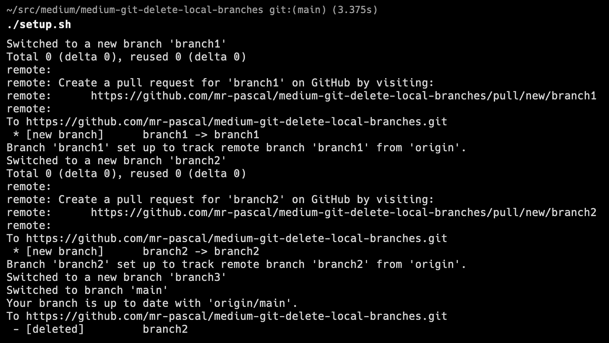
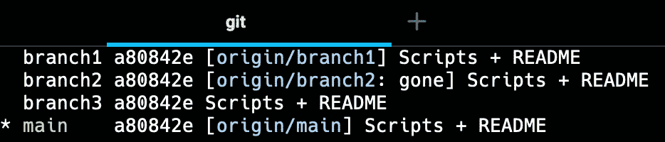
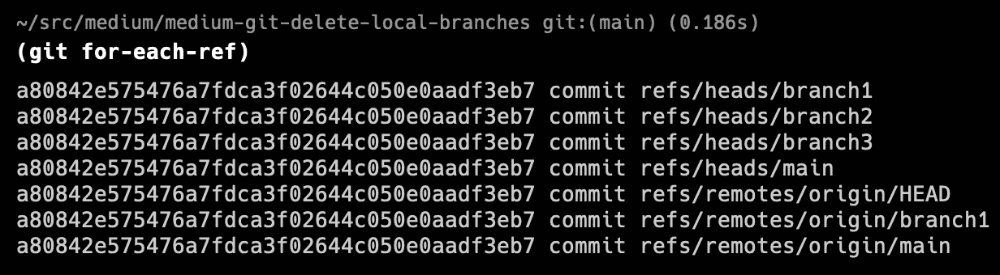
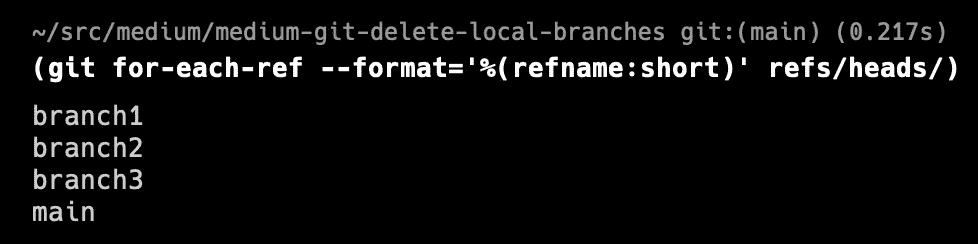
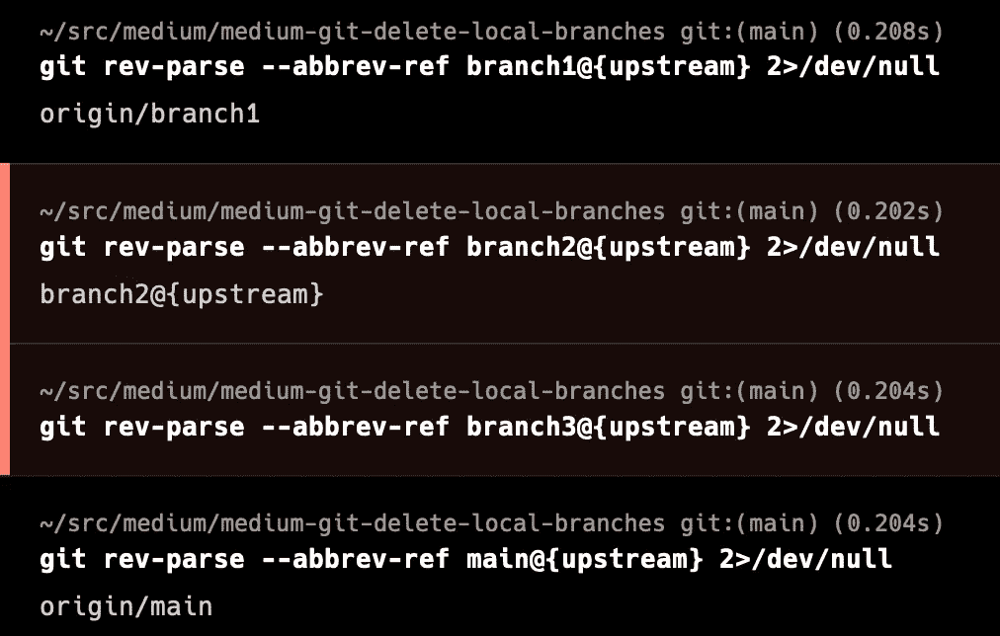
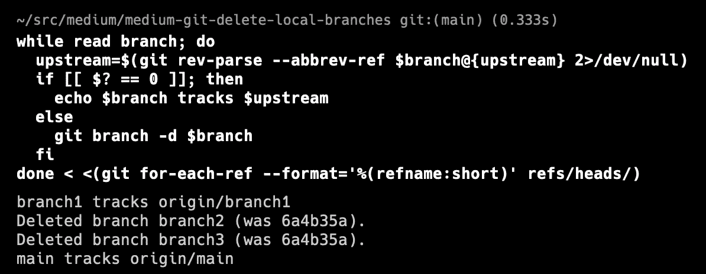

# Git —删除所有本地分支，不包括远程分支

> 原文：<https://levelup.gitconnected.com/git-delete-all-local-branches-without-remote-b5ee13ea2bea>

本简明教程将向您展示如何删除所有没有上游分支的本地分支。

# GitHub 知识库

要查看使用的代码，请查看我为本文创建的 [GitHub 库](https://github.com/mr-pascal/medium-git-delete-local-branches)。

 [## GitHub-Mr-Pascal/medium-git-delete-local-branch

### 此时您不能执行该操作。您已使用另一个标签页或窗口登录。您已在另一个选项卡中注销，或者…

github.com](https://github.com/mr-pascal/medium-git-delete-local-branches) 

# 为什么？

为什么要删除所有没有上游分支的本地分支？

如果您和我一样，在十多个不同的存储库上工作，几乎每天都会创建几个新的分支，那么您必须检查和评审。您最终会得到许多本地分支，这些分支要么从未被推到远程(因为这只是一个小测试)，要么已经被合并并从远程存储库中删除。

一段时间后，您应该从您的机器上清理本地分支，但是您不希望在检查是否还有可用的 remote 之后，逐行删除每个分支。

但是不用担心。我将向您展示一个小型 shell 脚本，它可以帮助您删除所有本地分支，而无需远程分支。

**⚠️注意:如果您仍然需要本地分支，但是还没有设置远程存储库的上游，脚本也会删除这些分支！**

# 演示设置

在向您展示一些代码片段之前，我将向您展示如何通过提供一个运行代码片段的小型演示设置来验证代码片段是否完成了它应该完成的工作。

如果您想一步一步地执行这些步骤，我建议您创建一个新的 GitHub 存储库或任何其他 VCS 服务，并创建一个新的存储库，签出到您的本地系统。

另外，请注意，我将使用`main`作为设置的默认分支/主线。

在开始设置我们的演示之前，让我们通过使用`git branch -vv`来看看我们分支的当前状态。正如您在下图中看到的，目前只有`main`分支可用，显示了最后一个提交散列、上游分支和最后一个提交消息。

git 分支-vv

那么，我们的演示设置会是什么样的呢？

从`main`分支开始，我们将创建分支`branch1`和`branch2`，并将它们推送到远程存储库。

之后，我们创建第三个分支`branch3`,保存在本地。最后，我们切换回我们的`main`分支，并删除我们远程存储库上的`branch2`(本地系统上的**而不是**)。

为了简化设置，我提供了下面的脚本来执行我刚才描述的步骤。

安装脚本的输出(。/setup.sh)

运行脚本后，通过使用提供的 [GitHub 库](https://github.com/mr-pascal/medium-git-delete-local-branches)中的`./setup.sh`或者通过复制&将上面的代码行粘贴到您的终端，您可以通过`git branch -vv`再次检查您的分支。您可以在下图中看到输出。

git 分支-vv

如您所见，我们现在有以下内容:

*   连接到现有远程分支的一个分支(`branch1`)
*   一个分支有一个现有的远程分支，但是远程分支现在是`gone` ( `branch2`)
*   一个从未有过远程分支的本地分支(`branch3`)

这应该涵盖了“正常”环境中的所有情况。你现在经常想做的是，你希望一些“神奇的”清理脚本删除分支`branch2`和`branch3`，因为`branch2`不再有远程操作，而`branch3`可能只是你做的一些本地测试，所以你没有填充主线。

**⚠️再次声明:如果你不想删除** `**branch3**` **就不要运行下面的脚本！首先将这个分支推送到您的远程存储库！**

# 清理代码

现在是时候做些清理了。首先，这里是 shell 脚本:

如果你没有立即得到它，不要担心。我将解释各个部分。

`git for-each-ref --format='%(refname:short)' refs/heads/`:

这个 git 命令遍历所有的 git 引用，并以特定的格式打印它们。在这种情况下，简称为`refname`。我还没有找到关于可能值的官方文档，但是检查 git 源代码，我在这里找到了所有可用的值。命令末尾的`refs/heads/`定义了参考需要匹配才能打印的模式。

让我们看看它的运行情况，一次没有任何格式或模式，有一个上面的参数:

git for-each-ref

git for-each-ref-format = ' %(refname:short)' refs/heads/

然后，该命令的输出行作为变量`branch`被传递到 shell `while do`循环中。

在循环中，当错误被推送到空设备时，代码检查是否有上游可用:

`git rev-parse --abbrev-ref $branch@{upstream} 2>dev/null`

让我们为所有四个可用分支手动运行脚本的这一部分:

git rev-parse-abbrev-ref＄branch @ { upstream } 2 >/dev/null

如您所见，我们为我们的`branch1`和`main`获得了一个值，因此，在 shell 脚本中，一个值被赋给了`upstream`变量。

最后但同样重要的是，我们使用我们的条件`if [[ $? == 0]]; then`来检查前一个命令的退出代码(`git rev-parse ...`)是否成功。一个`0`表示成功，所以如果我们匹配`0`，我们只需要`echo`分支名称和到终端的上游。

当我们有一个退出代码，不相等的`0`，这样，没有上游被发现；我们通过以下方式在本地删除分支:

`git branch -d $branch`

最后但同样重要的是，让我们运行上面的脚本并验证`brach2`和`branch3`是否被删除:

运行清理脚本。

**🚀🎉一切正常🎉🚀**

## 删除分支 1

如果你愿意，你现在也可以手动清理`branch1`来确保你的库再次被清理。

## 你想联系吗？

如果你想联系我，请在 LinkedIn 上给我打电话。

另外，请随意查看我的书籍推荐📚。

 [## 我的书籍推荐

### 在接下来的章节中，你可以找到我对所有日常生活话题的书籍推荐，它们对我帮助很大。

mr-pascal.medium.com](https://mr-pascal.medium.com/my-book-recommendations-4b9f73bf961b)  [## 通过我的推荐链接加入 Medium—Pascal Zwikirsch

### 作为一个媒体会员，你的会员费的一部分会给你阅读的作家，你可以完全接触到每一个故事…

mr-pascal.medium.com](https://mr-pascal.medium.com/membership)