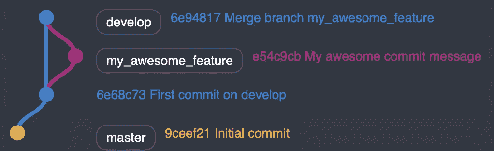
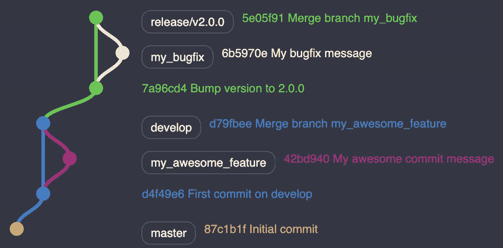
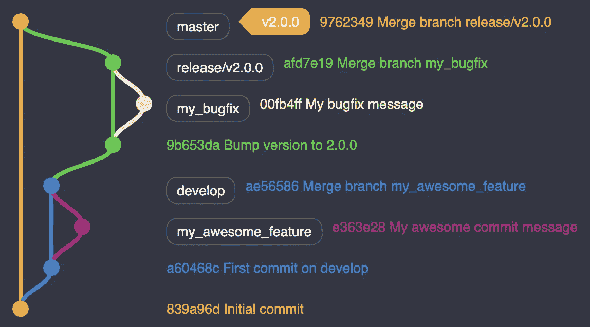
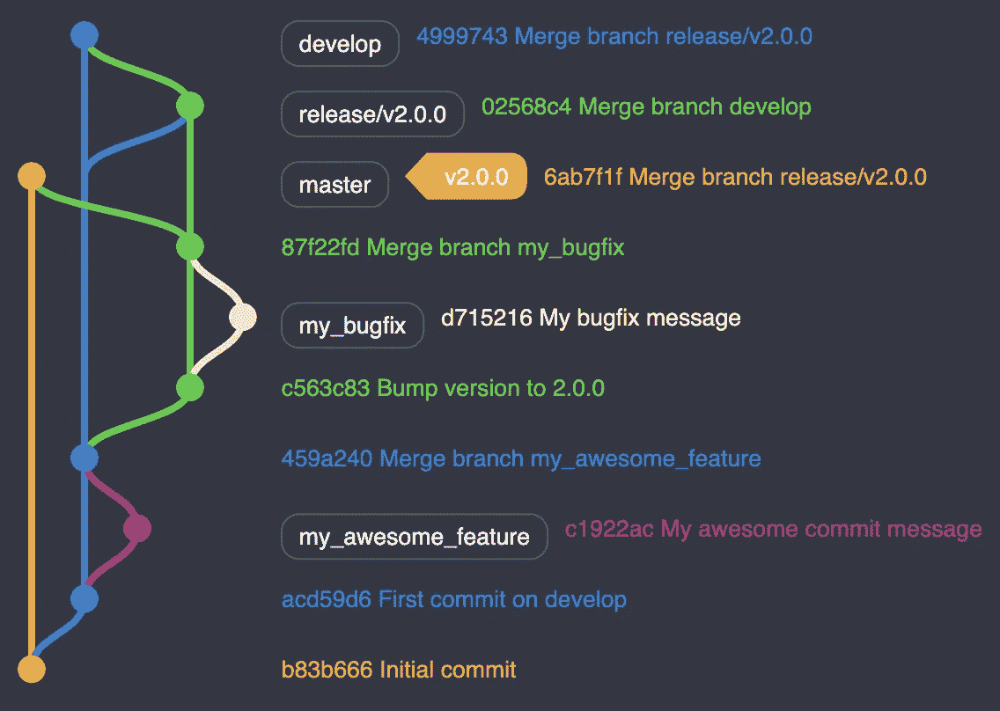
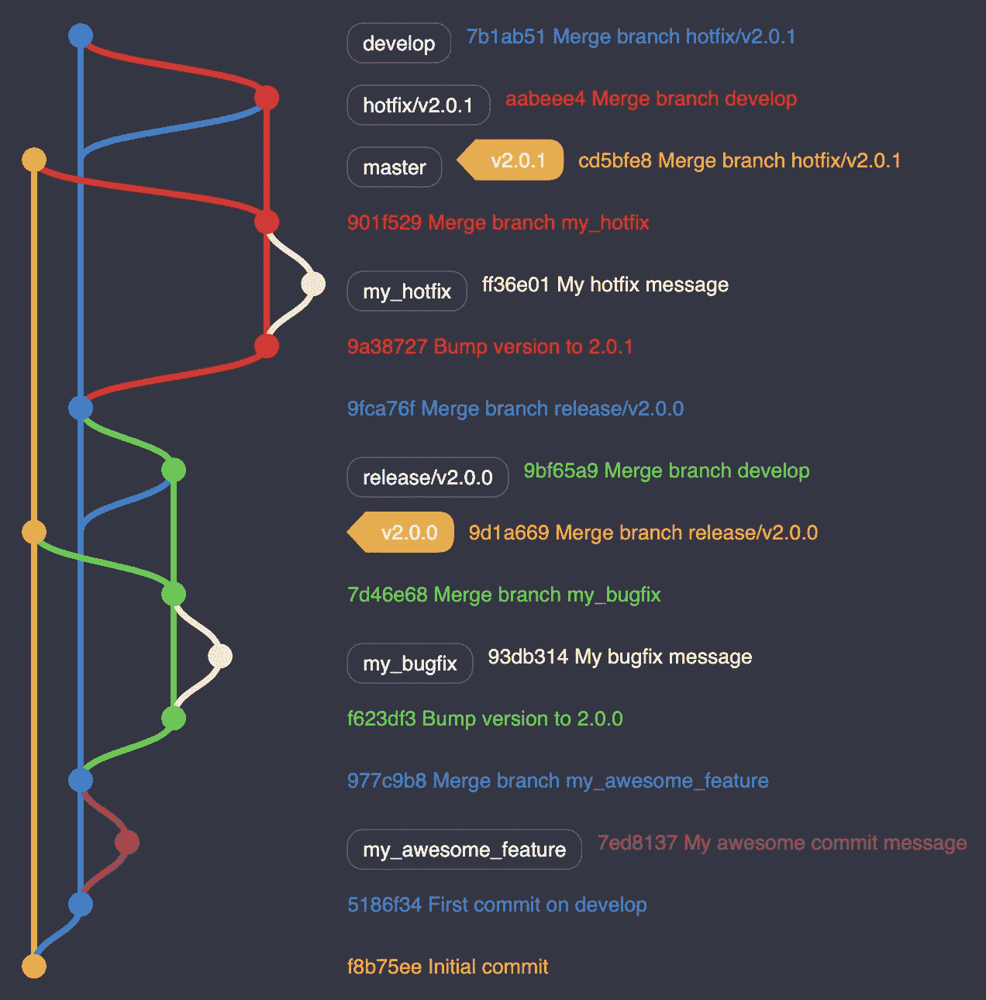

# 这个完整的演练简化了 Git 流

> 原文：<https://levelup.gitconnected.com/git-flow-made-easy-with-this-complete-walkthrough-2570b390bfb2>

## Git 流有十年，Git 流万岁！


马库斯·斯皮斯克在 [Unsplash](https://unsplash.com?utm_source=medium&utm_medium=referral) 上拍摄的照片

Git 是一个强大的版本控制工具，允许你和你的团队共享代码。它让你在一个名为**分支**的专用空间中用沙箱保护你的工作。如何管理分支机构由你决定。重要的是:当交付时间到来时，你如何将所有这些分支粘合在一起。

[文档](https://medium.com/u/e734b7ff7b76#Documentation/git-merge.txt---no-ff)。



`develop`已经从`master`前进了

更新你的远程`develop`分支并做一些清理

```
$ git push origin develop
$ git branch -D feature/my_awesome_branch 
$ git push -d origin feature/my_awesome_branch
```

> 最后一行是可选的，如果您已经从一个拉请求合并，因为您可以从那里删除您的远程分支。

官方文档只提到`feature`是`develop`的支持分支。然而，我们不能用特性来概括项目的生命周期。您需要处理任务，修复新特性带来的错误，等等。

根据您的组织，您应该有一个分支命名策略。例如，你可以将它们命名为`bugfix`或`task`。如果你想实施这样的策略，看看“[如何防止 Git 提交命名错误](https://medium.com/better-programming/how-to-prevent-git-commit-naming-mistakes-a34c8a7c6ae6)”。

# 准备释放你

准备发布新版本了吗？从`develop`创建一个`release`分支，因为这是你最新的分支。用版本名来命名——就说`2.0.0`吧。

> 喜欢用专业命名。未成年人。补丁模式。稍后我们会看到原因。

以下是您将创建的分支:

```
$ git checkout develop
$ git checkout -b release/v2.0.0
```

请记住在代码中插入您的版本，并提交此更改:

```
$ git commit -am "Bump version to 2.0.0"
```

注意`release`分支应该只包含`bugfix`分支。你不想在即将发布新版本的时候发布新特性。

在`release`上有一个合并的`bugfix`分支，你应该有下面的树:



`bugfix`被合并为`release`

# 完成你的释放

一旦您向您的用户发布了这个版本，您就可以将您的`release`分支合并到`master`中。要么创建一个以`master`为目标的拉请求，要么在 CLI 上执行

```
$ git checkout master
$ git merge --no-ff origin release/v2.0.0
```

然后在`master`上用标签`v2.0.0`标记出来。

```
$ git tag v2.0.0
$ git push --tags
```



将`release`合并为`master`

现在，在删除您的`release`分支之前，您必须将您已经修复的所有 bug 合并到`develop`中。首先，将`develop`合并到`release`中，解决你潜在的冲突。

```
$ git checkout release/v2.0.0
$ git merge --no-ff origin develop
```

一旦您的冲突得到解决，您可以打开一个 Pull 请求，将`release`合并到`develop`。

在官方 Git 流程指南中，直接从`develop`开始进行后合并。我推荐做上面的额外步骤有两个原因:

1.  千万不要直接按下`develop`
2.  从拉请求中评估反向合并的正确性总是有益的。你需要一双眼睛来防止错误。



将`release`合并到`develop`中以检索您的错误修复

最后，做清理工作。

```
$ git branch -D release/v2.0.0
$ git push -d origin release/v2.0.0
```

现在您已经部署了您的版本，您可以继续使用您的产品并准备下一个版本。

# 修补您的版本

让我们面对它；您的应用程序在生产中会遇到错误。有时候，有些太关键了，等不到下一次发布。

您需要快速反应，并发布一个意外的版本来修复这个问题。从`master`创建一个`hotfix`分支。用我上面说的补丁号命名为`2.0.1`吧。

在那之后，你将做你为一个`release`分支做的同样的事情:

1.  将`hotfix`合并为`master`
2.  标记您的`hotfix`
3.  将`develop`合并为`hotfix`
4.  修复`hotfix`上的潜在冲突
5.  将`hotfix`合并为`develop`
6.  删除`hotfix`

通过这些步骤，您可以得到完整的树:



完整的树:从`develop`到`release`，带一个`hotfix`

# 关于 Git 流的思考

Git Flow 提供了一个久经考验的工作流。如果你遵循这些原则，你将毫无障碍地快速迭代。

感谢您的阅读，祝 Git Flow 周年快乐！

[](https://skilled.dev) [## 编写面试问题

### 一个完整的平台，在这里我会教你找到下一份工作所需的一切，以及…

技术开发](https://skilled.dev)