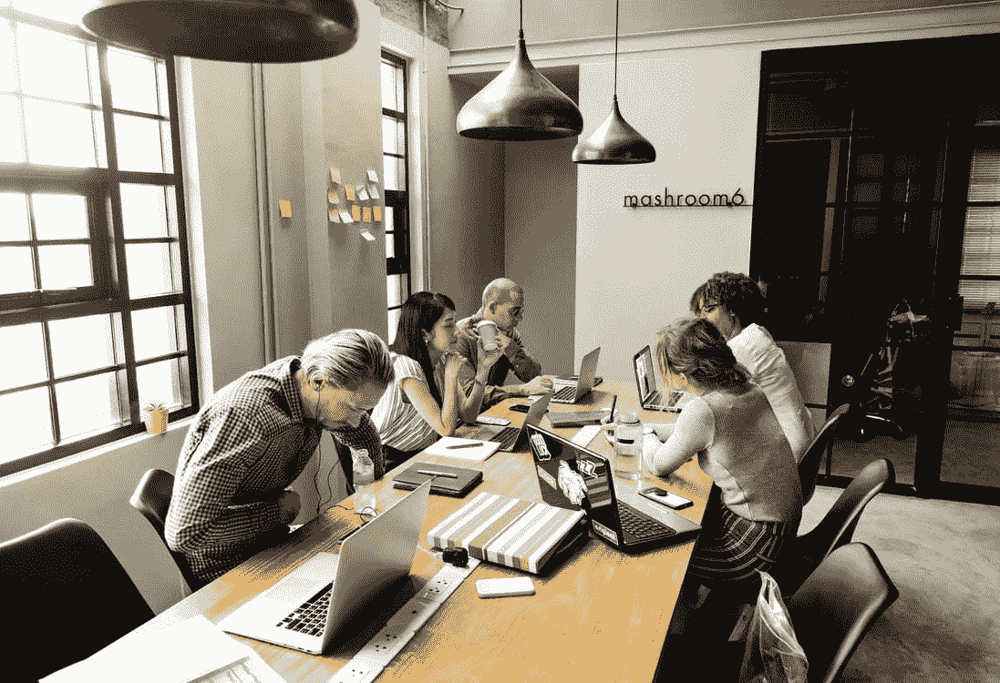
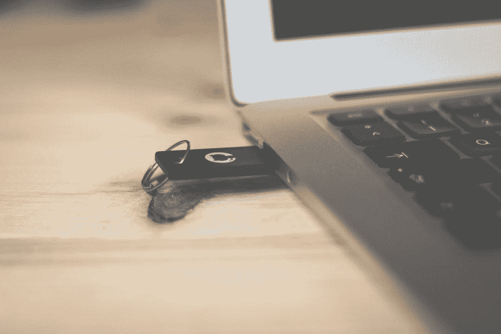

# git——当协作开发发生时，如何重新调整您的本地分支

> 原文：<https://levelup.gitconnected.com/git-how-to-realign-your-local-branch-when-there-is-collaborative-development-happening-96c4eebc469c>



从一周前我在`Git` [这里写的第一篇文章中，我可以看到很多人实际上阅读了它。所以，今天决定再写一篇，希望能对某个人有所帮助。](https://medium.com/@thecruisy/how-to-set-up-a-new-github-repo-from-your-macbook-fadb6bca2d9a)

这一次的焦点是关于协作开发，也就是说，有几个人同时在同一个项目上工作。这意味着当你完成你的部分时，`origin/master`分支有时已经改变了(人们比你更早的合并了他们的改变)。

`origin/master`分支的变化可能包括添加新的文件，在一些文件中添加新的代码行，删除文件等等。



你以前遇到过那种情况吗？

像我这样的第一次，我不太明白这是怎么回事。幸运的是，我正在和我的资深同事进行结对编程，因此，他向我解释了导致这种情况的原因，以及如何修复它并回到正轨。

好的，让我来看看在这种情况下需要做些什么。

# git 拉

假设您想要更新您的分支，以包含您的同事对您正在处理的同一分支所做的最新更改。

```
MacBook-Pro:projectdude bobthedude$ git pull
remote: Enumerating objects: 17, done.
remote: Counting objects: 100% (17/17), done.
remote: Compressing objects: 100% (16/16), done.
remote: Total 17 (delta 4), reused 10 (delta 0), pack-reused 0
Unpacking objects: 100% (17/17), done.
From github.com:bobthedude/projectdude
   0bvvaa5..zx1a53k  dude-feature-bob   -> origin/dude-feature-bob
   99a123f..1b123b1  jackotherdude           -> origin/jackotherdude

Updating 0bvvaa5..zx1a53k
error: Your local changes to the following files would be overwritten by merge:
 SomeFolderHere/generation.py
Please commit your changes or stash them before you merge.
error: The following untracked working tree files would be overwritten by merge:
 utils/SomeJarFile.jar
Please move or remove them before you merge.
Aborting
```

哎呀！它给出了一个错误！不要惊慌或困惑，错误是说您的分支和远程分支之间存在差异，因为远程分支包含来自您同事的更改。谢天谢地，有一个命令叫做`git stash`。

# git 贮藏

这个命令的作用是将您当前的工作目录保存(隐藏)到其他地方，并清除您第一次创建本地分支时所做的更改。这允许你在没有上述错误的情况下进行`git pull`，因为这次合并不会有任何冲突。

```
MacBook-Pro:projectdude bobthedude$ git stash
Saved working directory and index state WIP on dude-feature-bob: 0bvvaa5 add print statements to debug
```

在这之后，继续做`git pull`。现在，您将不会看到任何由于合并冲突而导致的错误。

当拉操作完成时，您可以继续并将之前的更改带回更新后的本地分支。

```
MacBook-Pro:projectdude bobthedude$ git stash pop
```

这个命令将让您知道它正在自动合并一些文件(您之前隐藏的)和所有没有提交的更改。在此之后，它还会删除`stash`参考。

就是这样！现在，您可以像往常一样继续开发项目了。

希望有帮助😃