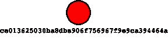
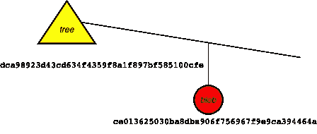
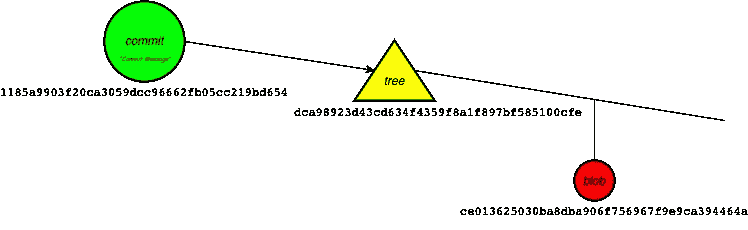
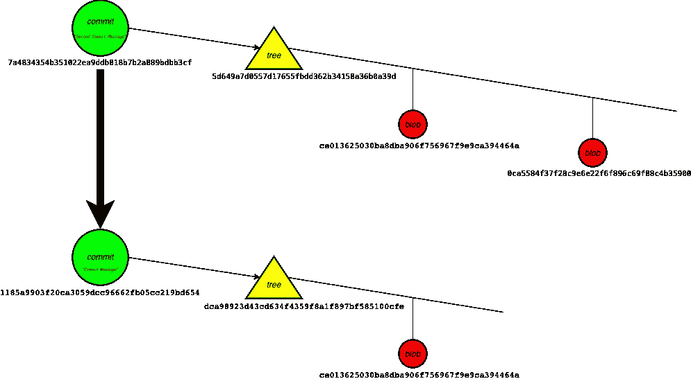
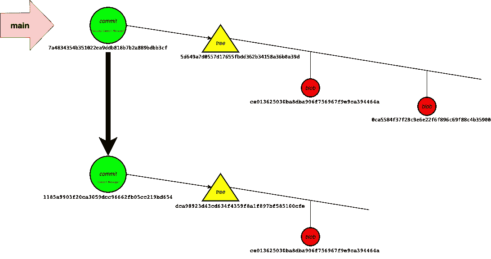

# Git 内部

> 原文：<https://levelup.gitconnected.com/git-internals-c219521d9f6>

## *引擎盖下的 Git*


[叶夫根尼·切尔卡斯基](https://unsplash.com/@evgenit?utm_source=medium&utm_medium=referral)在 [Unsplash](https://unsplash.com?utm_source=medium&utm_medium=referral) 拍摄的照片

Git 是一个数据库，用于在整个开发阶段存储代码库的快照。虽然开发人员熟悉基本命令，但大多数人都不知道内部工作原理。

这将是一个关于 git 如何在内部工作的实践教程。

## 入门指南

让我们设置一个本地 git 存储库。

```
*$* mkdir git-internals-tutorial ; cd $_ # create a new directory
*$* git init # create a git repository locally
```

git 存储库将快照存储在一个`.git`文件夹中。我们可以用树命令来可视化文件夹。

```
*$* tree .git
.git
├── HEAD
├── config
├── hooks
├── objects
│ ├── info
│ └── pack
└── refs
 ├── heads
 └── tags
```

## Git 散列对象

git 的 *hash-object* 命令创建要存储在数据库中的文件内容的散列。

假设我们有一个文件 *file1.txt*

```
*$* echo 'hello' > file1.txt
*$* cat file1.txt
hello
*$* git hash-object file1.txt
ce013625030ba8dba906f756967f9e9ca394464a
```

散列是 git 数据库中内容的 id。对象 id 仅根据内容计算，与文件名无关。如果我们有另一个文件名不同但内容相同的文件，哈希将是相同的。

```
*$* echo 'hello' > file2.md
*$* git hash-object file2.md
ce013625030ba8dba906f756967f9e9ca394464a
```

这里有一种不用显式创建文件就能计算出哈希值的方法。

```
*$* echo 'hello' | git hash-object --stdin
ce013625030ba8dba906f756967f9e9ca394464a
```

## 将 Git Blob 对象保存到数据库

为了将文件内容写入 git 数据库，可以将-w 标志添加到*散列对象*命令中。

```
*$* echo 'hello' | git hash-object --stdin -w
ce013625030ba8dba906f756967f9e9ca394464a
```

这将把内容存储在名称为 object-id 的 **objects** 目录下的一个文件中

```
*$* tree .git
.git
├── HEAD
├── config
├── hooks
├── **objects**
│   ├── **ce**
│   │   └── **013625030ba8dba906f756967f9e9ca394464a**
│   ├── info
│   └── pack
└── refs
    ├── heads
    └── tags
```



blob 对象

cat-file 命令用于从 git 对象获取文件内容。它显然充当了*散列对象*命令的反向操作。

```
*$* git cat-file -p ce013625030ba8dba906f756967f9e9ca394464a
hello
```

p 标志用于打印对象的内容。类似地，-t 标志输出对象的类型。在我们的例子中，它是一个斑点。

```
*$* git cat-file -t ce013625030ba8dba906f756967f9e9ca394464a
blob
```

还有其他类型的 git 对象，比如树，这将在下一节讨论。

## 创建 Git 树对象

与 blob 类似，tree 是 git 中的另一种对象。一棵树能吸住水滴，也能吸住树下的其他树。

使用 *git write-tree* 命令将索引中的文件添加到树中

```
*$* git add file1.txt # add file1 to the index space in git
*$* git write tree # Add file1 to a tree and write it to database
dca98923d43cd634f4359f8a1f897bf585100cfe
```

这会将带有文件内容的树作为 blob 写入数据库。git ls-tree 可用于查看树上的内容:



blob 对象上的树

```
*$* git ls-tree dca98923d43cd634f4359f8a1f897bf585100cfe
100644 blob ce013625030ba8dba906f756967f9e9ca394464a file1.txt
*$* git cat-file -t dca98923d43cd634f4359f8a1f897bf585100cfe
tree
```

树对象也可以在。git 文件夹

```
*$* tree .git
.git
├── HEAD
├── config
├── hooks
├── **objects**
│   ├── ce
│   │   └── 013625030ba8dba906f756967f9e9ca394464a
│   ├── **dc**
│   │   └── **a98923d43cd634f4359f8a1f897bf585100cfe**
│   ├── info
│   └── pack
└── refs
    ├── heads
    └── tags
```

## 让 Git 提交

大多数人都熟悉 *git commit* 命令，该命令对暂存区中的更改进行提交，并更新该提交的分支引用。让我们使用低级 API 来做同样的事情。

git 中的提交对象有一个树，一个到父提交(如果存在)的链接，以及提交消息和关于作者和提交者的细节等信息。

让我们从上一节中创建的*DCA 98923d 43 CD 634 f 4359 F8 a1 f 897 BF 585100 cfe**树*开始。

```
*$* git commit-tree dca98923d43cd634f4359f8a1f897bf585100cfe -m "Commit Message" # Creates a commit with the changes in the tree and the messages
1185a9903f20ca3059dcc96662fb05cc219bd654
```



Commit 有一条消息并指向一棵树

已创建提交 id 为*1185 a 9903 f 20 ca 3059 DCC 9662 FB 05 cc 219 BD 654*的提交。您可能会看到命令的提交

```
*$* git log 1185a9903f20ca3059dcc96662fb05cc219bd654
commit 1185a9903f20ca3059dcc96662fb05cc219bd654
Author: Praveen Mathew <*email@email.com*>
Date:   Wed Feb 17 19:18:40 2021 +0530Commit Message
```

让我们使用低级 git APIs 在它上面创建另一个提交:

```
*$* touch file2.txt$ git add file2.txt$ git write-tree
5d649a7d0557d17655fbdd362b34158a36b0a39d$ git commit-tree 5d649a7d0557d17655fbdd362b34158a36b0a39d -m "Second Commit Message" -p 1185a9903f20ca3059dcc96662fb05cc219bd654 # 
7a4834354b351022ea9ddb818b7b2a889bdbb3cf 
```



提交也指向父提交

现在提交的日志*7a 4834354 b 351022 ea9 DDB 818 b7b 2a 889 bdbb 3c f*将显示两个提交

```
*$* git log 7a4834354b351022ea9ddb818b7b2a889bdbb3cf --oneline
7a48343 Second Commit Message
1185a99 Commit Message
```

但是，如果您注意到 HEAD 指向的当前分支仍然是默认分支。承诺不会出现在那里。

```
*$* git log
fatal: your current branch 'main' does not have any commits yet
```

除了创建提交，git commit 命令还有一件事要做。它还会更新 HEAD 指向的分支的引用。这是通过命令 *git update-ref* 完成的

```
*$* git update-ref refs/heads/main 7a4834354b351022ea9ddb818b7b2a889bdbb3cf # points main reference to the commit
```



引用已更新为指向最新提交

现在主分支指向提交。

```
*$* git log --oneline
7a48343 (HEAD -> main) Second Commit Message
1185a99 Commit Message
(END)
```

因此，我们有一个带有一些提交的分支😀。

因此，git commit 命令使用了两个低级命令

1.  提交树
2.  更新-参考

这是 git 使用的低级命令的简介。在评论中一定要让我知道你的想法。

# 参考文献:

[](https://git-scm.com/book/en/v2/Git-Internals-Git-Objects) [## Git - Git 对象

### Git 是一个内容可寻址的文件系统。很好。这是什么意思？这意味着 Git 的核心是一个简单的…

git-scm.com](https://git-scm.com/book/en/v2/Git-Internals-Git-Objects) [](https://github.blog/2020-12-17-commits-are-snapshots-not-diffs) [## 提交是快照，而不是差异——git hub 博客

### Git 以令人困惑著称。用户偶然发现误导他们的术语和措辞…

github.blog](https://github.blog/2020-12-17-commits-are-snapshots-not-diffs) [](https://medium.com/mindorks/what-is-git-object-model-6009c271ca66) [## 什么是 Git 对象模型

### 今天的动机

medium.com](https://medium.com/mindorks/what-is-git-object-model-6009c271ca66)  [## 树木是如何形成的

### 每个提交都有一棵树，但是树是如何形成的呢？我们知道 blobs 是通过填充…

jwiegley.github.io](https://jwiegley.github.io/git-from-the-bottom-up/1-Repository/4-how-trees-are-made.html) 

[https://github.com/tpn/pdfs](https://github.com/tpn/pdfs/blob/master/Git%20from%20the%20Bottom%20Up.pdf)