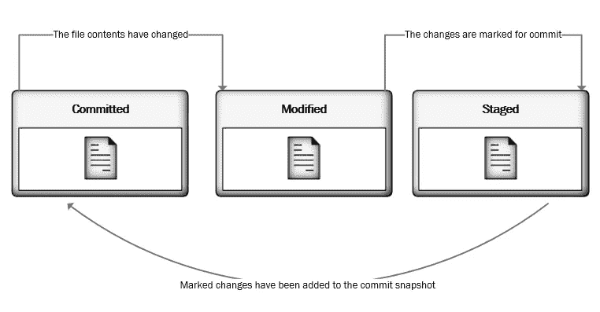
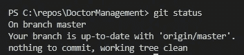
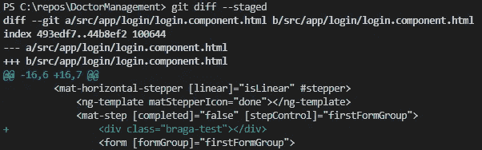
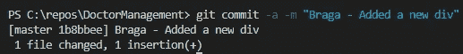
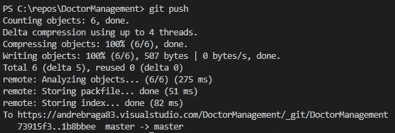
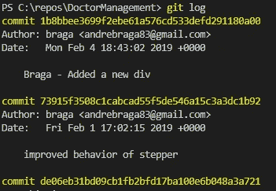

# 像老板一样

> 原文：<https://levelup.gitconnected.com/git-like-a-boss-c77196b94357>

嘿，各位，今天我将向你们展示如何像老板一样使用 GIT。如果您正在处理任何类型的需要版本控制的基于文件的项目，了解使用这种流行的版本控制系统的正确方法可以使您的生活变得容易得多。GIT 的伟大之处在于，你甚至不需要成为一个电脑极客就可以使用它。那么，我们开始吧。😊

# GIT 是什么？

是和其他人一样的 VCS(版本控制系统)，比如 [Mercurial](https://www.mercurial-scm.org/) 或者 [Bazaar](http://bazaar.canonical.com/en/) 。VCS 基本上是一种软件，设计用来记录一个或一组文件随时间的变化。这给了你时间旅行的力量😊。对一个或多个文件做出更改后，您可以恢复或撤回这些更改。您可以比较文件从一个版本到另一个版本的更改，并查看每个版本中的确切更改。Git 让您能够看到何时引入了更改或者是谁进行了更改。

# GIT 是如何工作的？

GIT 将数据视为整个项目文件系统的一系列快照。每次提交或保存项目的状态时，GIT 都会拍摄一张图片或项目的快照，包括该特定时刻的所有文件，然后存储对该快照的引用。

您可以调用之前在任何时间拍摄的任何快照，并查看整个项目的状态。如果该快照的文件没有发生更改，GIT 很聪明，不会再次存储该文件，但它会链接到在该文件发生更改的上一个快照期间存储的相同文件。

GIT 的主要优势之一是能够在本地运行。想象一下，当您的 VPN 无法连接时，或者您需要在无法访问原始服务器的飞机上工作时，您可以在家工作。这会让生活更艰难，你同意吗？使用 GIT，您可以对项目的本地存储库进行更改，然后当您重新连接到网络时，只需将您的更改提交到远程服务器。

# 文件的阶段

Git 有三个文件可以占据的主要阶段:**提交的**、**修改的**和**暂存的**如上图所示。处于**提交**阶段的文件意味着数据安全地存储在项目的本地版本数据库中。当您对该文件进行一些更改时，该文件的状态从**已提交**(或未修改)变为**已修改**，这意味着该文件已经从存储的最后一个已提交版本进行了更改。这就是现在的“工作进行中”状态。完成更改后，您将文件移至**暂存**状态。在这一步中，您告诉 GIT 您想要在 **modified** 状态期间获取对该文件所做的更改，然后将它们提交到您的本地数据库，以便在您的下一个提交快照中使用。请注意，这些阶段仅适用于项目上次提交快照中的文件。

# 基本命令

在我向你展示一些日常使用的重要命令之前，你需要理解术语“源”是位于你的远程服务器上的存储版本，比如 GitHub/TFS/等等。

*   **git 状态
    使用 GIT，您不必猜测或试图跟踪项目或文件的当前状态。您可以使用`git status`随时检查项目的状态:**

来自 GIT 的响应显示我们在主服务器上。注意，当您初始化您的 GIT 存储库时，GIT 默认创建了一个名为“ *master* ”的分支。响应中的第二行告诉我们，我们的分支与源主机是最新的。也就是说，我们的本地主分支机构是与原始主分支机构同步的，例如，在你的 GitHub 账户上托管的那个。最后一行告诉我们没有什么要提交的，我们的工作树是干净的。**“git status”**命令是一个简单但重要的命令，因为它向我们展示了项目在这个特定时间点的状态。

*   这个命令向我们展示了当前“修改”版本和之前“提交”快照之间的代码变化。如果我们想看到已经准备好进入下一次提交的更改，我们可以像这样使用 **git diff - staged** :

*   **git commit
    该命令用于提交我们的更改。还有一些选项可以扩展提交的功能。例如:
    **→git commit-a =>******-a****选项自动将 GIT 正在跟踪的所有变更存放到您的工作目录中。
    →***git commit-m =>***添加一条提交消息如下:****

**

*我们可以在 GIT 输出中看到我们的注释，显示我们的提交快照成功。我们的第一次提交已经完成😊。*

# *高级命令*

*   *git 的一个优点是你可以在本地工作，当你的本地项目到了你想把你的变更发送到你的原始项目的时候，你可以简单地把它上传。您可以使用 **git push** 命令将您的更改发送到您的原始项目，如下所示:*

**

*   ***git log = >** 返回与我们之前的提交相关的信息，默认情况下， **git log** 命令按时间倒序列出对我们的项目所做的提交，最近的提交将首先显示，如下图所示:*

**

*   ***git log -1 = >** 只显示最近一次提交。*
*   ***git log - oneline = >** 以单行格式显示我们的提交列表。响应中的每一行都是带有提交消息的提交。这是一个很好的方式来查看我们项目历史中所有提交的简化的高级概述。*
*   ***git log - stat = >** 给我们一个更详细的信息。*
*   ***git log - patch = >** 为我们提供每次提交时每个文件中确切变化的完整差异。*
*   ***git rm file_name = >** 告诉 git 停止跟踪这个文件。之后，如果您使用`git status`命令，您将在您的暂存代码中看到一个被删除的文件。当您再次提交时，GIT 将不再跟踪这个文件，它将从您的项目中删除。*
*   ***git check out branch _ name =>**从一个分支切换到另一个分支。*
*   ***git check out-b branch _ name =>**新建一个分支，切换到它。*
*   ***git stash = >** “隐藏”你的工作代码并将活动状态返回到最近一次提交。*
*   ***git stash pop = >** 恢复最近隐藏的文件。*
*   ***git stash list = >** 为我们提供了一个已经隐藏的工作进展变更列表，以及分支和一些提交数据。*
*   ***git stash show = >** 让我们更详细地了解隐藏了什么文件，并从较高的层面概述了这些更改。*
*   ***git Merge branch _ name =>**将你引用的分支合并到你实际的分支。假设您在`master`分支中，使用这个命令您将把“branch_name”合并到您的`master`分支中。*
*   ***git reset:** 允许我们将提交从历史移回我们的工作区或暂存区。它也可以用来丢弃更改。注意，这可能是一个破坏性的命令，所以**使用这个命令时要小心**。请记住，您正在使用 reset 命令更改您的 GIT 历史。最佳实践是，一旦我们将提交推送到其他同事可以访问更改的远程源，就不要重置更改。使用 GIT 时，我们有三种不同的选择:
    →**GIT reset-soft =>**将您的提交移回您的暂存区。如果您想将这些更改重新分组到不同的提交中，或者在提交之前添加更多的更改，这将很有帮助。 *→***git reset-mixed =>**这是默认的复位选项，如果你只写 **git reset** 行为将是一样的。它类似于 **- soft** 命令，但它将更改移回工作目录(本地)。
    →**git reset-hard =>**将修改移动到垃圾桶。如果你乱七八糟地做了一些改变，然后你决定不想保留任何东西，只是重新开始，这可能是有帮助的。使用这个时要小心。*
*   ***git clone {url} = >** 克隆你 GitHub 的一个分支，TFS 等。*
*   *设置提交时使用的作者姓名和电子邮件。*例如:*
    **→git config-global user . name " andréBraga "
    →git config-global user . email " Andre Braga @ Portugal . pt "***
*   ***git init = >** 创建一个新的本地仓库。*
*   ***git branch-d branch _ name =>**删除特征分支。*
*   ***git pull = >** 将远程服务器上的更改提取并合并到您的本地存储库中。*

# *结论*

*希望这篇文章能对你有所帮助。我们只是触及了 GIT 强大功能的表面，但是我这篇文章的目标是为您提供 GIT 的基础知识，帮助您入门。我希望这篇文章能激励你更多地学习像老板一样使用*GIT*😊。*

***提示:**我强烈推荐您看一下 Chris Beams 的这篇[文档](https://chris.beams.io/posts/git-commit/)，它向您展示了如何编写 git 提交消息。所以，我的最后一个建议是:去这个 [github 项目](https://git-school.github.io/visualizing-git/),尝试一下你今天学到的每一个命令。我喜欢这个工具，我想你会喜欢它的。*

*** [## 学习 Git -最佳 Git 教程(2019) | gitconnected

### 前 42 个 Git 教程-免费学习 Git。课程由开发者提交并投票，使您能够找到…

gitconnected.com](https://gitconnected.com/learn/git)*