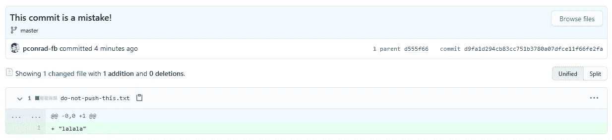
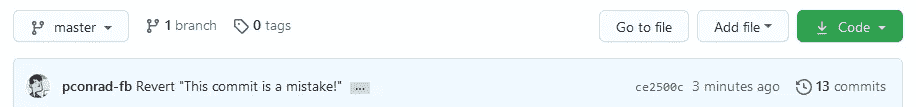

# 摆脱困境

> 原文：<https://levelup.gitconnected.com/git-outta-trouble-56aba6672cb8>


如果你和 Git 去了森林，通常有办法回来。这里有一些命令行技巧可以帮助您重新找到线索。

# 证明

第一次在命令行上使用 Git 时，它可能会要求您在浏览器中完成身份验证:

```
$ git push
info: please complete authentication in your browser...
Everything up-to-date
```

如果发生这种情况，进入浏览器，Git 将帮助您创建一个令牌，在您每次键入命令时对您进行身份验证。

旧的身份验证方法需要在您键入命令时输入用户名和密码:

```
$ git push
Username for 'https://github.com':
```

如果发生这种情况，这意味着您的存储库还没有更新到新的方式。如果您使用的是 GitHub 之类的主机，那么您的存储库应该已经配置为使用令牌。

如果您的回购仍然使用旧的身份验证方法，您可以存储您的用户名和密码，这样就不必每次都输入:

```
$ git config credential.helper store
$ git push
Everything up-to-date
```

这将您的凭据以纯文本形式存储在您的计算机上，远不如使用令牌的新身份验证方法安全。

# 在错误的分支中编辑

您在错误的分支中编辑了一个文件。您希望能够做的是撤销这些更改，切换分支，然后重新进行。实际上，更好的方法是从错误的分支中取出这些变化，轻轻地放在你想要的分支上。幸运的是，Git 提供了一个名为`stash`的命令来做这件事。

如果您不仅进行了编辑，而且错误地提交了更改，请在继续以下步骤之前，首先取消提交更改(请参见下面的“错误提交”)。

1.  确保您在正确的目录中。
2.  使用`git status`检查你在哪个分支上，以确保你确实在错误的分支上。
3.  隐藏你未提交的修改:
    `$ git stash`
4.  切换到你希望一直工作的分支:
    `$ git checkout the-right-branch
    Switched to branch ‘the-right-branch’`
5.  使用`stash pop`来应用那里的变化:
    `$ git stash pop`

# 编辑了错误的文件

你打开一个文件来看，但是你的猫走过了键盘。

您不确定添加或删除了什么。你只是想回到上次提交时的样子。为此，使用`checkout`—它不仅仅用于切换分支！

1.  确保您在正确的目录中。
2.  使用`git status`查看哪些文件被意外修改。例如:
    `$ git status
    On branch main
    Changes not staged for commit:
    (use “git add <file>…” to update what will be committed)
    (use “git checkout — <file>…” to discard changes
    in working directory)

    modified: dont-change-this.md`
3.  使用`git checkout -- <file>`撤销更改。例如:
    `git checkout -- dont-change-this.md`

`git status`命令的输出告诉你如何这样使用`git checkout`。

# 合并冲突

当同一个文件的同一个地方发生了两个变化时，没有您的帮助，Git 无法合并。您需要编辑该文件，并决定保留这两个更改中的哪一个。

当您打开文件时，合并冲突如下所示:

```
<<<<<<< HEAD
Changed content from the point of view of the current commit
=======
Conflicting changed content
>>>>>>> 9af9d3b
```

`HEAD`是一个指针，指向你所在的分支中最近的提交。另一个标签可以是另一个分支名称或代表另一个提交的数字。

您需要做的就是决定您想要保留哪个版本的内容，然后删除合并冲突标记(`<<<<<<<`、`=======`、`#>>>>>>>`)。

在你以那种方式解决了所有的改变之后，再提交一次。

# 错误上演

您以正确的方式编辑了正确的文件，但是您过于匆忙地将它添加到了临时区域。您不想撤销对文件的更改，但希望在下次提交时将其删除。这是`reset`的用途之一。您还可以使用`reset`进行更剧烈的回滚——如果需要，您可以撤销整个提交。

1.  确保您在正确的目录中。
2.  使用`git status`查看哪些文件被意外修改。例如:
    `$ git status
    On branch main
    Changes to be committed:
    (use “git reset HEAD <file>…” to unstage)

    renamed: README.md -> README
    modified: dont-commit-this.md`
3.  使用`git reset`从下一次提交中删除文件。例如:
    `$ git reset HEAD dont-commit-this.md`

`git status`命令的输出告诉您如何使用`reset`取消变更。

# 误犯

如果你提交得太匆忙，只要你还没有提交它们，你就可以取消提交。

1.  确保您在正确的目录中。
2.  使用`git status`检查你在哪个分支上。如有必要，切换到您错误提交的分支。例如:
    `$ git checkout the-wrong-branch
    Switched to branch ‘the-wrong-branch’`
3.  使用`git reset`取消提交更改:
    

如果愿意，您可以稍后重新提交更改。

如果你想先将更改移动到另一个分支，你可以使用`git stash`(见下面的“在错误的分支中编辑”)。

# 误推

如果您错误地提交了一个 commit，您的错误现在会被其他人发现。幸运的是，有一种方法可以“撤销”推送。

登录 git 主机查看实际推送的内容可能会很有用。



## 反击一次糟糕的进攻

以下是恢复错误推送的步骤:

1.  使用`git log`显示最近提交的列表，并确定您错误推送的内容。`--oneline`选项使列表更容易阅读。该列表从最新到最早排序。例:
    `$ git log --oneline
    d9fa1d2 (HEAD -> master, origin/master, origin/HEAD) This commit is a mistake!
    d555f66 Committing some lovely changes`
2.  使用`git revert`和提交号(或提交*散列*)创建一个新的提交，该提交不做坏提交中的任何事情。例:
    `$ git revert d9fa1d2`
3.  出现一个屏幕，您可以在其中键入提交消息，或者只保留默认消息。保存和退出是不同的，这取决于 Git 使用哪个编辑器。如果你在屏幕底部看到一个命令列表，你可能正在使用 Nano。按下`Control-o`，然后按下`Control-x`。
    -否则，你可能会使用`vi`或 Vim。键入一个冒号(`:`)。如果你在屏幕底部看到一个冒号，你现在可以输入`wq`并按回车键。
4.  您可以使用`git status`来查看您有一个新的提交，准备推送:
    `$ git status
    On branch master
    Your branch is ahead of ‘origin/master’ by 1 commit.
    (use “git push” to publish your local commits)`
5.  用`git push`命令推提交:
    `$ git push`

负责修复回购协议。任何退出的人现在都将获得整个历史，包括错误和修复，并且世界都将是正确的。



该操作将事情保持在您错误地推动更改之前的状态。换句话说，您的文件看起来就像您提交“一些可爱的更改”之后的样子，并且您在“这是一个错误”中所做的所有工作都已被撤消。

## 从旧提交中检索更改

如果您想要检索更改以便可以再次处理它们，请返回到旧的提交(例如，`d9fa1d2`)并保存它们:

1.  使用`git checkout`检查旧的提交。例:
    `$ git checkout d9fa1d2`
2.  进行软复位，取消所有的修改:
    `$ git reset --soft HEAD~1`
3.  如果您愿意，可以使用`git status`来查看您现在有哪些未提交的更改。
4.  使用`git stash`来隐藏变化。
5.  使用`git checkout`再次检查分支的`HEAD` 。如果你一直在主分支机构工作，使用`git checkout main`:
    :`$ git checkout main
    Previous HEAD position was d555f66 Committing some lovely changes
    Switched to branch ‘main’
    Your branch is up to date with ‘origin/main’.`
6.  使用`git stash pop`应用更改。

您可以继续进行更改，然后在准备好的时候提交和推送。

# 更多…

**更新:**我认为 *Git 不一定很难*可能是一个足够有趣的主题，可以写一整本书。[于是我做了](https://www.amazon.com/dp/B095NPFJFR):

[](https://www.amazon.com/dp/B095NPFJFR)

如果你没有时间读完一整本书，你可以看一个简短的视频: