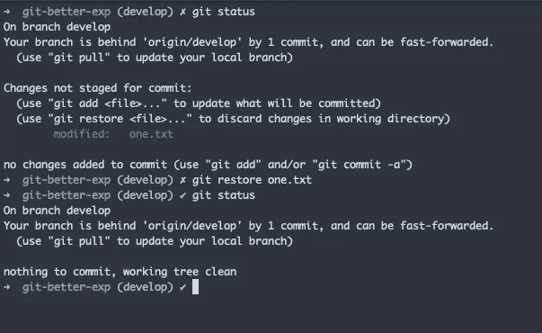
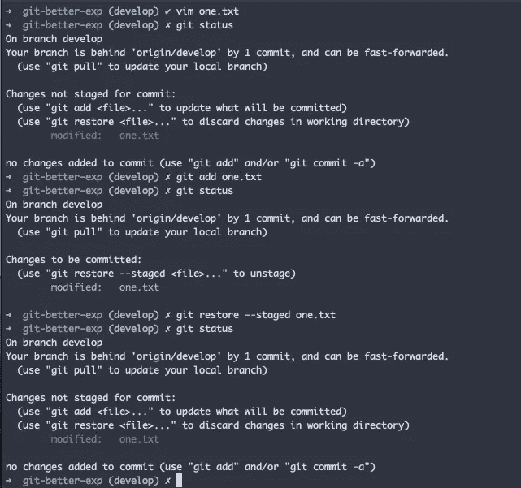
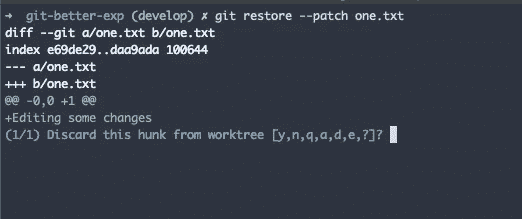

# git 恢复—一个简短的指南

> 原文：<https://levelup.gitconnected.com/git-restore-a-short-guide-a69d9be343bd>


**git restore** 用于恢复或丢弃文件未提交的本地更改。

假设您已经在一些文件中做了一些更改，然后如果您想放弃这些本地更改，您可以安全地使用 **git restore** 。

另一个用例是，如果您想要取消转移文件，可以使用此命令。换句话说，它用来撤销 **git add** 的效果。

## 使用

```
git restore <file_name> **Example:** 
git restore example.txt
```



在上图中，您可以看到我们已经使用 git restore 放弃了文件的本地更改。

**其他选项**

```
**git restore one.txt two.txt** // Mention multiple files **git restore .** // Discard all local changes **git restore *.rb** // Wildcard option
```

## 取消转移文件

如前所述，您还可以使用此命令从登台区中取消登台文件。

```
git restore --staged <file_name>
```



您可以看到提到的文件没有转移，但是文件的本地更改仍然存在。

## 源选项

```
git restore --source <source_id/commit_id>
```

source 选项用于从特定提交中恢复文件。默认情况下，恢复将从**头**获取内容

```
git restore --source f9456ba one.txt
```

在上面的命令中，我们从提到的提交中恢复一个文件。

## 补丁选项

```
git restore one.txt -p
```



如您所见，您可以交互地选择块。

git restore 是一个有用的命令，您可以在工作流中开始使用它。它在 git 文档中被标记为实验性的，但是它不是一个非常具有破坏性的命令，您不必担心。

感谢您的阅读:)

> **如果你已经来了这么久，那么我想你会对 Git 更感兴趣。可以订阅我的简讯**[**Git better**](https://gitbetter.substack.com/)**获取 Git 的招数、技巧、高级话题。**