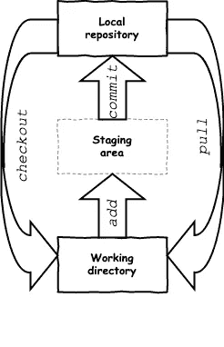

# Git 开始🚀

> 原文：<https://levelup.gitconnected.com/git-started-fce0828fe944>


马库斯·斯皮斯克在 [Unsplash](https://unsplash.com/?utm_source=unsplash&utm_medium=referral&utm_content=creditCopyText) 上拍摄的照片

`git`简单入门指南

# #安装 git

*   视窗:[https://git-scm.com/download/win](https://git-scm.com/download/win)
*   Linux:[https://git-scm.com/download/linux](https://git-scm.com/download/linux)
*   https://git-scm.com/download/mac 的麦克·OS X

# #告诉饭桶你是谁

```
// globally configured username
git config **--global** user.name "John Doe"// locally configured username
git config **--local** user.name "John Doe"
//or 
git config user.name "John Doe"
```

配置用于提交的作者姓名。通常你唯一需要识别自己的两个东西是`user.name`和`user.email`。

在全局级别配置属性意味着配置值适用于特定用户的所有存储库，除非在本地级别被覆盖。

在本地级别设置配置值意味着该设置仅适用于该存储库的上下文。

还有第三种类型的配置`--system`，这意味着配置值适用于给定系统上的所有存储库，除非被较低级别(全局或本地)覆盖。

## #撤消配置设置

```
git config unset user.name
```

## #列出配置设置

```
git config --list
```

这将打印所有配置，包括系统、全局和本地范围。要仅查看特定范围的设置，只需将其添加到命令中:

```
git config --local --list
```

# #初始化存储库

```
git init
```

键入这个命令将在本地目录中创建一个新的空的`git`存储库。或者，您可以通过指定项目名称在新目录中创建存储库:

```
git init <project name>
```

# #签出存储库

从现有的远程存储库填充本地存储库

```
git clone username@host:/path/to/repository
```

或者，您可以通过运行以下命令来创建本地存储库的工作副本

```
git clone /path/to/repository
```

通过克隆一个存储库，您获得了一个现有存储库的副本，您可以在其上开始工作。

# # git 的作用域

本地存储库由 git 维护的三个“范围”组成。第一个是保存实际文件的`working directory`。第二个是充当烘焙区的`staging (index)`，最后是指向你最后一次提交的`local repository`。



# #检查文件的更改

```
git status
```

这将显示已更改文件的列表以及尚未转移或提交的文件。有时您可能希望看到更简洁的输出。这可以通过以下方式实现:

```
git status -s
```

# #撤消更改

有时候你引入的改变并不是你所希望的。要放弃这些更改，您可以执行以下操作:

```
// discard all of the changes
git checkout .
// or 
git checkout --// discard the changes from a file 
git checkout -- <filename>
```

# #向曲目添加内容

```
// adding a file with specified name
git add <filename>// adding all changed files (everything)
git add .// adding group of files specified by pattern (e.g. all .java files)
git add *.java
```

通过执行该命令，指定的文件将被*添加*到暂存(索引)中。

# #完成更改

```
git commit -m "Commit message"
```

# #向上游发送更改

```
git push
```

这将把更改发送到您的远程存储库的`master`分支。

如果您没有克隆一个现有的远程存储库，那么您需要在执行`git push`之前将您的本地存储库与 remote 连接起来。下一节将解释如何做到这一点。

# #遥控器

如果你和多人一起工作，每个人都有自己的本地环境。要与其他人共享变更，您需要将其发布到一个公共的远程存储库中。远程存储库是多个用户将其更改发布到的连接点。这样每个人都知道变化和最新的。

## #列出当前配置的遥控器

```
git remote -v
```

## #连接本地和远程存储库

如果您已经开始在本地处理您的新项目，并且您想要将您的存储库连接到远程服务器，那么您需要使用

```
git remote add origin <server>
```

# #分支

分支是孤立的发展路线。它通常代表一个特征。创建存储库时创建的“默认”分支是`master`分支。其他分支用于开发，并在特性完成时合并回`master`。


分支

## #创建分支机构

```
git branch <branch name>
```

## #检查分支机构

```
git checkout -b <branch name>
```

这将创建一个带有`branch name`的新分支并切换到它。

## #获取关于分支机构的信息

```
// lists local branches
git branch// lists local branches with one-line commit summary
git branch -v// filter branches based on pattern
git branch --list branch*
```

## #删除分支

```
git branch -d <branch name>// force delete branch
git branch -d -f <branch name>
// or
git branch -D <branch name>
```

## #重命名分支机构

```
git branch -m <current branch name> <new branch name>// force rename branch
git branch -m -f <current branch name> <new branch name>
// or
git branch -M <current branch name> <new branch name>
```

## #开关分支

```
git checkout <branch name>
```

## #在远程上发布分支

前面的所有命令都适用于本地分支。要使分支可供其他人使用，您需要发布它:

```
git push origin <branch name>
```

这个会公布具体的`<branch name>`。如果您希望从工作存储库中发布分支列表或所有分支，您可以使用以下命令:

```
// publishing list of branches
git push origin <branch name #1> <branch name #2>// publishing all of the branches
git push --all origin
```

## #删除远程上的分支

```
git push origin :<branch name>
```

## #检索新的更改

```
git fetch origin
```

该命令允许用户从远程存储库中获取最新的历史记录。

## #合并分支

当你在你的分支上完成开发新的特性时，下一步就是让其他人可以使用它。为此，您需要将最初分支的变更与您的分支结合起来，并发布它。

```
git merge <branch name>
```

当这个命令被触发时，git 试图自动合并更改。不幸的是，这并不总是可能的，并且会导致*冲突*。您负责通过编辑 git 显示的文件来手动解决那些*冲突*。

## #从远程更新

```
git pull
```

这将把`fetch`和`merge`合并到一个命令中。

# #标记更改

当您完成更改后，在发布新版本的软件之前，建议在上面做一个标记。为此，您可以使用标记/标签:

```
git tag <tag name> <commit>
```

这将在指定的提交上创建一个具有指定名称的新标记。

## #列表标签

```
git tag --list
```

## #重命名标签

```
git tag <new tag name> <old tag name>
```

但这并不是结束。这将在一个`<old tag name>`中创建一个带有`<new tag name>`的新标签。然后，您需要删除旧的标记名。

## #删除标签

```
git tag -d <tag name>
```

## #发布标签

```
git push --tags origin
```

# #检查历史记录

```
git log
```

这是该命令的最简单形式。通过用附加参数修饰日志，您可以将日志定制为您想要的样子。咨询`git log --help`来检查所有可用的选项。

# #给予帮助

```
git help -a// or for a specific command
git <command name> --help
```