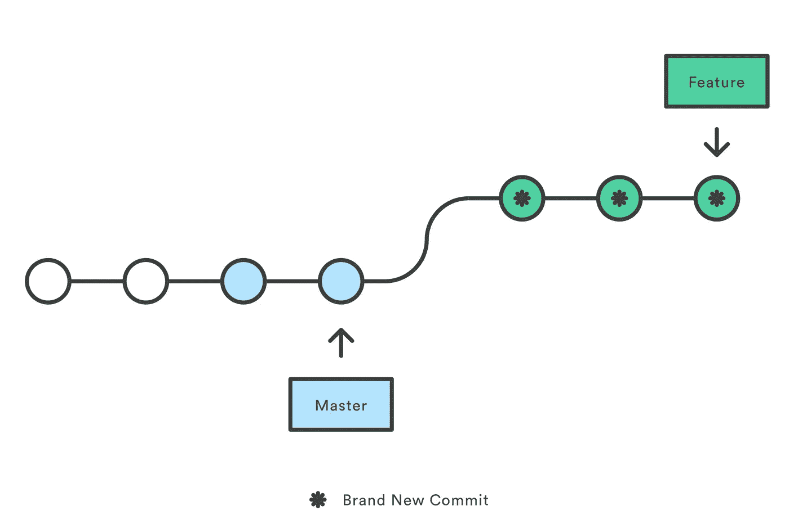

# Git Stash 和 Git Rebase

> 原文：<https://levelup.gitconnected.com/git-stash-and-git-rebase-535811a3cb84>

## 何时使用它们以及如何处理将代码合并到 master

当我第一次学习编码时，我是唯一一个开发应用程序的工程师。每隔一段时间，我会有一个项目，我会与另一名工程师一起工作，但很多进展都是在结对编程会议期间取得的，我们只是将所有的更改直接推给 master。

当我转向更大的应用程序，并开始在一家有十几名工程师的公司工作时，我开始学习如何使用分支，以及如何使用拉请求将我的更改合并到代码库中，而不影响其他工程师的代码。我发现的两个最有用的命令是‘git rebase’和‘git stash’。与 git pull、git merge 等其他命令一起使用。您开始真正意识到 git 是一个多么强大的工具。

## Git 贮藏

当你开始在一个更大的团队中工作时，尤其是当你的产品正在运行时，有时你可能会开始在一个分支上工作，但是为了解决一些更紧急的问题，你不得不突然停止工作。

如果您只是使用 git checkout 切换到分支，git 将尝试将您在当前分支(分支 A)上的所有更改转移到您要切换到的分支(分支 B)。有时，如果没有冲突，它会无问题地切换，但有时它会警告您需要在签出新分支之前提交您的更改。

无论哪种方式，很多时候你都不想把你在分支 A 上工作的新代码带到分支 B 上。你想做的是保存你添加的代码，但是当你切换到分支 B 时，你想让它恢复到你创建分支 A 之前的状态。这正是`git stash`的设计目的。

命令`git stash`帮助你*保存*你的工作并清空你的工作目录。那么当你签出的时候，它就不会带着新代码了。

现在，假设您修复了分支 B 中的紧急错误，并且您决定导入您在分支 a 上所做的这些更改。您可以使用命令`git stash list`来查看您已经存储在*存储库*中的所有更改的列表。从那里，您可以使用命令`git stash apply <stash_name>`应用这些更改，其中 stash_name 是 list 命令给出的名称(看起来有点像 stash@{0}:)

最后，你可以使用命令`git stash drop <stash_name>`从你的列表中删除一个旧的或者不想要的东西。

## Git Rebase

命令`git rebase`将您的提交应用到另一个分支的顶部。下面是我在网上找到的一个有效的图解来解释。

比方说，你从 master 中分支出来，开始在你的应用程序中添加一个新功能。当你工作时，你的应用程序代码的一部分，你的新功能依赖于什么改变来修复一个 bug。您现在的代码在新特性和一些其他 bug 修复方面都不同于 master，因此您在 master 之后和之前都有几次提交。

蓝色代表修复 bug 的提交，绿色代表新特性的提交。

当你合并你的代码时，会有很多合并冲突，你不知道如何解决。如果有一种方法可以将 master 上的 bug 修复程序放到您的分支中，然后将您的新特性的提交添加到修复后的代码中就好了。

你很幸运，这正是`git rebase`所做的！它会将您的新特性移动到 master 上新提交的末尾，创建一个连续的提交流，应该是无冲突的，并且取代了合并的需要。

这两个命令将真正增强您避免冲突的能力，并在更大的团队中从一个分支转移到另一个分支！