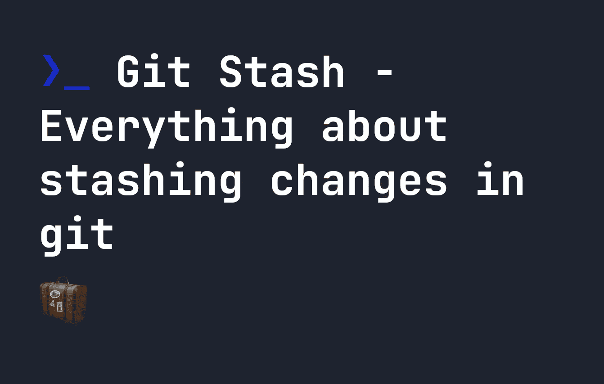

# Git Stash——在 git 中存储变更的所有内容

> 原文：<https://levelup.gitconnected.com/git-stash-everything-about-stashing-changes-in-git-9e94ef7e8213>



有时，当我们在 git 中对一个项目进行更改时，我们会突然意识到我们需要恢复到我们项目的最后一个干净的工作目录版本——这意味着没有应用本地更改的版本。例如，假设您最近克隆或提取了一个项目的版本到您的本地计算机，并对三个文件做了一些本地更改。要将项目恢复到您克隆或提取的版本，您可以运行以下命令:

```
git stash
```

这既可以保存您的更改，将它们藏在安全的地方，也可以恢复到一个干净的项目版本，然后您可以保存、编辑或做任何您喜欢的事情。大多数人都知道他们可以使用`git stash`来做这件事，但是还有一些其他的事情`git stash`也可以让我们做。说到`git stash`，有几个真正有用的命令你应该知道:

*   `git stash list`
*   `git stash show`
*   `git stash apply`
*   `git stash pop`
*   `git stash push`
*   `git stash clear`
*   `git stash drop`

# 列出或显示所有 git stash 的变化 [#](https://fjolt.com/article/git-mastering-stash#listing-or-showing-all-git-stash-changes)

虽然我们可以很容易地使用`git stash`来清理我们的工作树，但是我们也可以使用下面的命令来查看所有的栈:

```
git stash list
```

有趣的是，这将显示在过去发生的多个 stashes。因此 Git 会存储所有的隐藏内容，以防将来需要检索它们。例如，在运行`git stash list`之后，下面是一个有许多仓库的项目:

```
stash@{0}: WIP on master: abf89a3 feat-ui: updated look and feel
stash@{1}: WIP on master: 39329d5 feat-ui: Updated CSS Quiz Button
stash@{2}: WIP on master: 46bc7aa feat-ui: Bug fix on article API
stash@{3}: WIP on master: 5dafc53 feat-ui: Fixed issue with secondary-navigation overflow
```

所有的隐藏都存储在您的`ref/stash`文件中，在`.git`文件夹中。最近`git stash`的更详细视图也可通过`git stash show`查看:

```
common.js      | 405 +--------------------------------------------------------
public/quiz.js | 267 +------------------------------------
```

虽然这对于某些人来说没什么问题，但是通过运行以下命令可以显示包括代码级别更改在内的更详细的视图:

```
git stash show -p
```

`git stash show`还有一些其他有用的选项:

*   `-u`或`--include-untracked`，显示`git show`中隐藏的未跟踪文件，即`git stash show -u`
*   `--only-untracked`，仅显示`git show`中未被跟踪的文件，即`git stash show --only-untracked`

# 使用 apply 或 pop 恢复 git 存储库 [#](https://fjolt.com/article/git-mastering-stash#recovering-a-git-stash-with-apply-or-pop)

虽然知道藏了什么本身是有用的，但能够找回藏起来的东西也是非常有用的。要恢复最新的代码，可以运行以下命令:

```
git stash apply
```

不过，如果你像我一样，有成吨的未使用的储备，有时找回以前的储备也是有用的，比如`stash@{3}`或`stash@{25}`，就像我们之前看到的列表一样。在这些情况下，我们只需在命令后列出存储的编号。例如，为了恢复`stash@{25}`，我们将运行以下命令:

```
git stash apply 25
```

正如您所料，如果您修改了文件，然后试图在上面运行`git stash apply`，您可能会遇到合并冲突。因此，在运行这个命令之前，请确保已经处理好了这些问题。

# git stash apply 与 git stash pop

刚才，我们已经用`git stash apply`恢复了一堆代码。这将获取我们隐藏的代码，并将其应用到我们的工作树上。它还会将代码的隐藏副本留在您的隐藏代码列表中——这样您就不会丢失它。如果您想要恢复隐藏的代码，并从您的隐藏列表中删除该代码，您必须使用`pop`来代替:

```
git stash pop
```

# 把你的藏物变成树枝 [#](https://fjolt.com/article/git-mastering-stash#turning-your-stash-into-a-branch)

`git stash`做的另一件未被充分利用的有用的事情是，它允许我们从隐藏的代码中创建一个新的分支。如果您有一些隐藏的代码，您可以将您当前的项目和其中的更改放在一起，在上面应用您隐藏的代码，然后根据您的喜好创建一个新的分支。例如，下面将创建一个名为`new-code`的分支:

```
git stash branch new-code
```

# 其他方法保存您的存储和 git 存储推送 [#](https://fjolt.com/article/git-mastering-stash#other-ways-to-save-your-stash-and-git-stash-push)

虽然我们已经介绍了如何使用`git stash`来隐藏最新的代码，但是您也可以在野外看到下面的命令:

```
git stash push
```

这个命令实际上与`git stash`相同，但是如果你没有意识到这一点，可能会有点混乱。除此之外，`git stash`和`git stash push`还提供了许多有用的选项，如果你想使用它们的话:

*   `-a`或`--all`，将整个工作树保存到 stash，即`git stash push -a`
*   `-S`或`--staged`，将仅保存使用`git add`，即`git stash push -S`添加的阶段性变更
*   `-p`或`--patch`，将允许您浏览每一个更改，并选择性地决定是否要保存它，即`git stash -p`
*   `-u`或`--include-untracked`，将所有未跟踪的文件与您的存储一起保存，即`git stash push -u`

# 使用 git stash 抑制消息

顺便提一下，在这一点上，提到几乎所有的`git stash`命令都带有`-q`选项是有意义的，它抑制了任何消息或错误:

```
git stash apply -q
```

# 移走你的藏物 [#](https://fjolt.com/article/git-mastering-stash#removing-your-stash)

最后，有时你想把所有的存货都拿走。这有点危险，所以要小心使用，但是如果你想的话，你只需要运行:

```
git stash clear
```

如果你不想这样做，但仍然想删除一个特定的隐藏项目，你可以运行`git stash drop`删除最近隐藏的条目，或者`git stash drop 25`删除在你的`git stash list`结果中列为`stash@{25}`的隐藏项目。

# 分级编码

感谢您成为我们社区的一员！在你离开之前:

*   👏为故事鼓掌，跟着作者走👉
*   📰查看[升级编码出版物](https://levelup.gitconnected.com/?utm_source=pub&utm_medium=post)中的更多内容
*   🔔关注我们:[Twitter](https://twitter.com/gitconnected)|[LinkedIn](https://www.linkedin.com/company/gitconnected)|[时事通讯](https://newsletter.levelup.dev)

🚀👉 [**加入升级人才集体，找到一份神奇的工作**](https://jobs.levelup.dev/talent/welcome?referral=true)