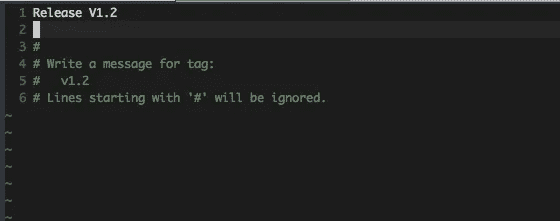
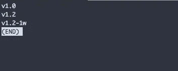
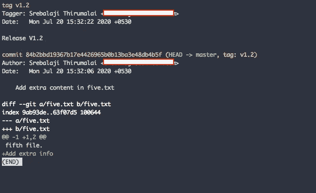

# Git 标签——简要指南

> 原文：<https://levelup.gitconnected.com/git-tagging-a-brief-guide-1af080b5bb6f>


Git 提供了一个选项来标记(或标记)repo 中的特定点，这有助于您在以后识别标记，并在将来的任何时候查看更改。

您可以将标签视为 repo 中的一个检查点。它们就像分支，但是一旦创建了标记，就不能再对其进行更多的更改。简单。

大多数人使用标签来标记项目中的特定发布。以便他们可以在以后查看这些版本。

而且使用标签也是一个非常好的做法。它帮助人们理解项目在一段时间内是如何发展的。

## 创建标签

在创建标签之前，我想提一下有两种类型的标签。

**轻量级标签**只是简单的标签，只是一个指向特定提交散列的指针。大多数情况下，这些标签是出于临时原因而使用的。

**带注释的标签**最常用，有附加信息，如标签人姓名、日期和标签信息。如果你正在为一个永久指针做标记，你应该使用带注释的标记。

## 创建轻量级标签

```
git tag <tag_name> **Example**: git tag v1.1-1w
```

在上面的命令中，**v 1.1–1w**是标签名。

## 创建带注释的标签

```
git tag -a <tag_name> **Example:** git tag -a v1.2
```

**-**是用于创建带注释标签的选项。

您将被提示一条标记消息



你可以为发布写一些相关的消息并保存文件。

上述命令的简写如下

```
git tag -a v1.2 -m "Release V1.2"
```

上述命令将采用标记消息选项。

还要记住，Git 将采用头部提交(最新提交)来创建标签。

## 将标签推到遥控器上

您必须显式地将标签推送到遥控器。

```
git push origin v1.2 // Will push the mentioned tag. git push origin --tags // Will push all the tags to the origin.
```

## 标记旧提交

您还可以通过显式提及提交散列来创建标记。正如我之前说过的，默认情况下，Git 会将头部提交给 tag。

标记显式提交

```
git tag -a <tag_name> <commit_hash> **Example:** git tag -a v1.1 84b2bbd
```

## 列出所有标签

上述命令将列出 repo 的所有标签。



要搜索标签，您可以使用

**-l** 将采用搜索模式并列出相关标签。上面的命令将列出 v1 系列中的所有标签。 ***** 充当通配符。

## 标签信息

您可以使用查看标签信息



在上面的例子中，我们已经显示了标签信息。您可以看到标记名、标记者、日期、标记消息和各自的提交。

## 签出标签

标记的一个有用的特性是我们可以在将来回顾那个指针。您可以签出类似于分支的标记。

```
git checkout <tag_name>
```

但是通过退房，你会进入“超脱头”状态。这意味着您不应该对标记进行任何更改。即使您提交了任何更改，它也不会出现在标记中，甚至不会出现在任何分支中。

签出标签有助于您使用该指针并查看更改。

## 删除标签

标签非常轻量级。他们不会在回购中消耗太多空间。但是如果你需要清理标签，你可以删除旧的标签。

要从遥控器上移除标签

```
git push origin --delete <tag_name>
```

## 重新标记标签

有时，你创建了一个错误的标签。您必须从标记中添加一些提交或删除一些提交。

因为我们不能创建具有相似名称的标签(标签名称是唯一的)，所以最简单的解决方法是删除标签并创建一个具有相同名称的新标签。

另一种选择是强制创建标签。

```
git tag -a -f <tag_name> <optional_commit_hash> **Example:** 
git tag -a -f v1.2 // Considering HEAD commit git tag -a -f v1.2 84b2bbd // Considering a particular commit
```

**-f** 是强制创建标签的选项。因此，已经创建的标记将被新的提交哈希替换。

强制将创建的标签推送到远程

```
git push origin -f --tags
```

这将强制将标签推送到遥控器。

记住要小心使用这个。如果您强制推送标签，那么在本地拥有标签的团队成员在推送时将会面临冲突。

## Github 中的标签和发布

Github 中也会列出标签。您可以查看所有标签，编辑和创建新标签。

Github 还有一个功能叫做 Releases。版本与标签相关联。每当您按下标签时，也会创建一个释放。你也可以在 Github 中创建你自己的版本，它也会创建一个标签。

当产品的新版本发布到生产时，大多数人会创建一个新版本。

你可以在这里看到 Rails 回购[](https://github.com/rails/rails/releases)**的版本**

**标记是 Git 的有用特性之一。它有助于您了解您的项目是如何随着时间的推移而发展的。**

**感谢你的阅读，希望你学到了新的东西:)**

## **如果你已经来了这么久，那么我想你会对 Git 非常感兴趣。你可以订阅我的时事通讯 [GitBetter](https://gitbetter.substack.com/) 来获得 Git 的技巧、提示和高级主题。**