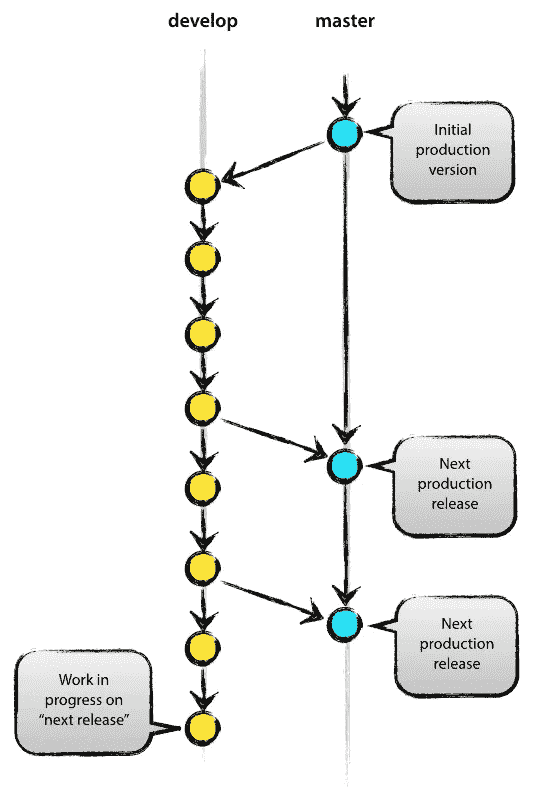
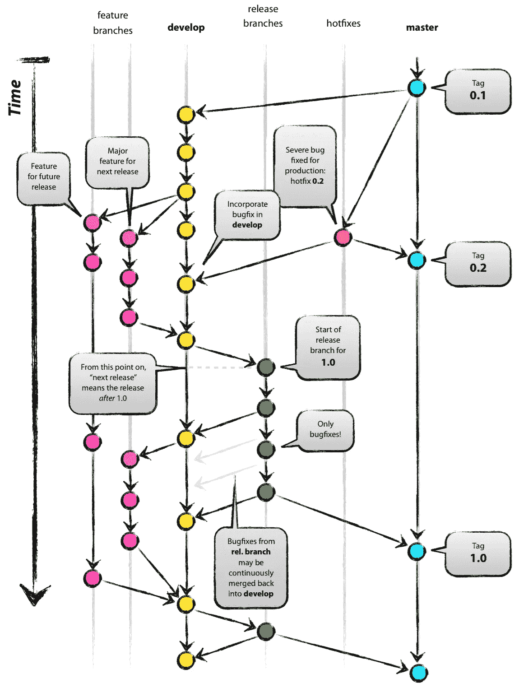
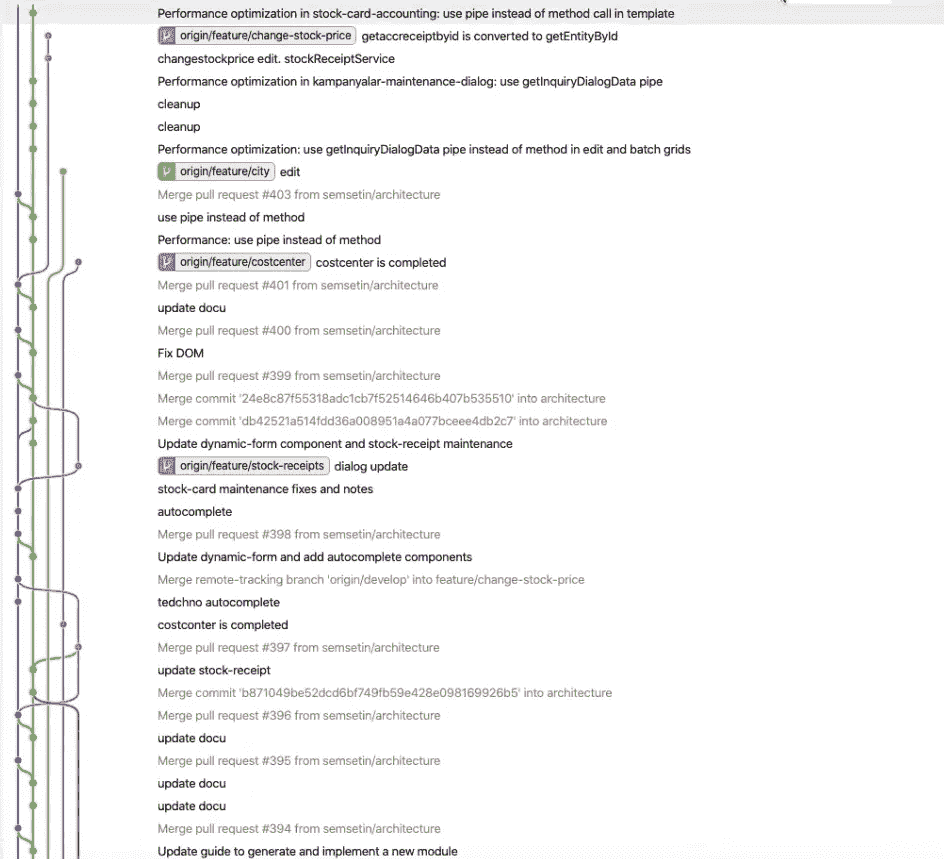
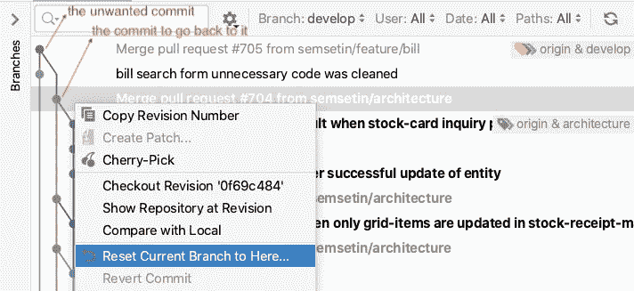
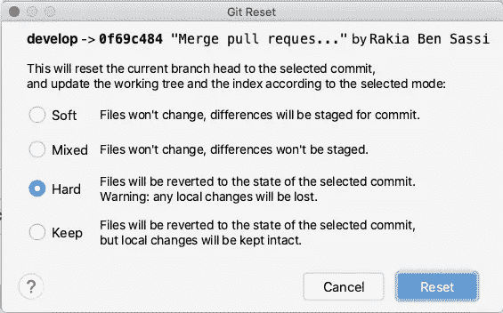

# 哎呀，你不小心合并到了错误的分支。你该怎么办？

> 原文：<https://levelup.gitconnected.com/git-workflow-devops-69e5a9071be1>

## [软件工程](https://rakiabensassi.medium.com/list/software-engineering-7a179a23ebfd)

## 如何撤销推送或与 Git 合并？


由[塞巴斯蒂安·赫尔曼](https://unsplash.com/@officestock?utm_source=medium&utm_medium=referral)在 [Unsplash](https://unsplash.com?utm_source=medium&utm_medium=referral) 上拍摄的照片

我仍然记得当我试图使用 eclipse 更新我的本地分支时，突然“有冲突”的消息出现在我的眼前。在我职业生涯的那个阶段，解决合并冲突是一次可怕的经历。我不确定我正在做的事情——应该是修复——是对还是错。但我并不孤单。

在经典的 subversion 世界中，合并和分支被认为有点可怕。随着 Git 的事情发生了变化。这些实践变得简单，成为我们日常编码工作流程的一部分。为了更加流畅和熟悉它们，您所需要的就是理解 Git 工作流和特性分支概念。

> “功能分支工作流程背后的核心思想是，所有功能开发都应该在一个专门的分支中进行，而不是在`master`分支中进行。这一概念使得多个开发人员在不干扰主要代码库的情况下处理特定功能变得容易。这也意味着`master`分支永远不会包含破损的代码。”— [亚特兰大人](https://www.atlassian.com/git/tutorials/comparing-workflows/feature-branch-workflow)

但是，如果您不小心将损坏的代码推入或合并到所有团队成员使用的分支中，您应该怎么办？

别担心，在你的现实生活中你不能让时间倒流，但是在 Git subversion 系统中，你可以。在这篇文章中，我们将看到如何去做。

# Git 分支模型

Git 工作流定义了一个严格的分支模型，有助于实现 DevOps 实践。中央存储库包含两个具有无限生命周期的主要分支:

*   `master`
*   `develop`



主和开发:中央存储库中的两个主要分支(图片[来源](https://nvie.com/posts/a-successful-git-branching-model/)

`master`包含生产就绪代码，而`develop`包含下一版本的最新开发变更。Git 模型中使用了各种其他支持分支(功能分支、发布分支和补丁分支):

*   为了帮助团队成员之间的并行开发
*   为了便于特征跟踪
*   准备生产发布和
*   协助解决现场生产问题



Vincent Driessen 的 Git 分支模型

# 用 Git 撤消推送的合并

在看到 Git 分支模型的一般结构之后，让我们回到我们的主要问题:

午夜时分，您正坐在桌面上，计划在创建一个“拉”请求后上床睡觉，该请求允许您的同事检查您当前对新功能的实现，并向您提供反馈。不幸的是，你点击了错误的按钮，你的代码现在被合并到*开发*分支，没有任何审查。

你该怎么办？

以下步骤将撤销您的错误操作:

**1。**切换到*开发*在你本地的分支机构

**2。**通过从远程*开发*分支“拉”来更新您的本地开发分支

**3。**如果您使用 VSCode、Git view(在 IntelliJ 中)或 SourceTree，请在“Git History”插件中打开分支历史。



Git 分支

**4。**右键单击您想要返回的提交。应该是在你犯错之前。

**5。**点击*将当前分支重置到此处*



将当前分支重置到此处

6。选择“硬”选项，然后点击“复位”按钮:



Git:恢复到选定的提交

7。现在你需要用力推动。打开您的终端并运行:

```
git push origin HEAD --force
```

如果你只在你的本地*开发*分支中做了错误的提交，你不需要最后一步 7。

**注:**作为步骤 3 的替代方案。4.5.6.在复制了想要返回的提交的 id 之后，可以执行下面的命令。打开您的终端并运行:

```
git reset --hard <commit-id>
```

就是这样！

希望这篇文章能让你在面对自己在 git 存储库中做过的不想要的操作时更加自信。记住第一条规则:

> 永远不要在午夜创建拉取请求！

🧠💡我为一群聪明、好奇的人写关于工程、技术和领导力的文章。 [**加入我的免费电子邮件简讯独家访问**](https://rakiabensassi.substack.com/) 或在此报名 Medium。

*你可以在 Udemy 上查看我的* ***视频课程****:*[*如何识别、诊断、修复 Web Apps 中的内存泄漏*](https://www.udemy.com/course/identify-and-fix-javascript-memory-leaks/) *。*

[](https://medium.com/better-programming/angular-keyboard-listeners-good-practices-b208edc6bf89) [## Angular 中的可访问性——良好实践和缺陷

### 关于键盘监听器的 5 个案例研究

medium.com](https://medium.com/better-programming/angular-keyboard-listeners-good-practices-b208edc6bf89) [](https://medium.com/better-programming/angular-dynamic-layout-with-ngtemplate-8b6faa995a8f) [## 动态角度模板:如何构建一个具有 3 种布局风格的应用

### Angular ngTemplateLayout 的高级用例

medium.com](https://medium.com/better-programming/angular-dynamic-layout-with-ngtemplate-8b6faa995a8f)