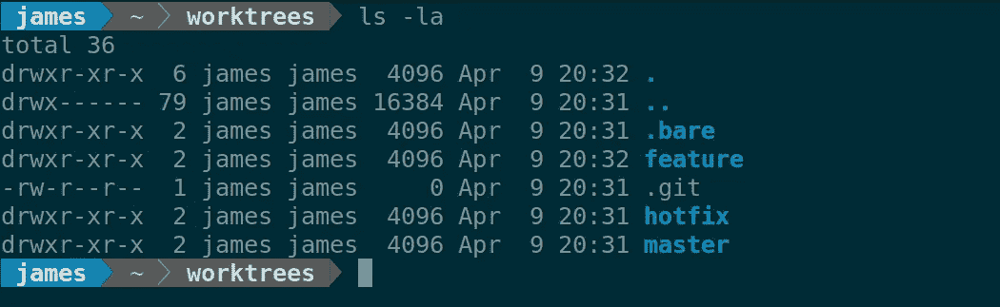

# Git 工作树:你从未听说过的最好的 Git 特性

> 原文：<https://levelup.gitconnected.com/git-worktrees-the-best-git-feature-youve-never-heard-of-9cd21df67baf>

# 在有树之前

当我第一次专业地使用 git 时，我的一个习惯是经常隐藏代码。我正在开发一个特定的特性，我会看到一个 Hipchat 警告(是的，这是在 Slack 之前),关于生产中抛出的一个错误。我会查看 Sentry 中的 stacktrace，并找到代码中有问题的部分。从那里我会返回到我的终端，隐藏我的更改，打开一个新的 bugfix 分支，并开始尝试在本地重现错误。

通常这个过程不会太痛苦。如果我的工作树中有未被跟踪的文件，我会添加它们并隐藏所有东西。在我将一个 bugfix 分支推送到 Github 之后，我会将我的更改和我添加的任何原始未跟踪的文件卸载。偶尔我会犯一个错误，做一些可怕的事情，比如不小心破坏了我未跟踪的文件，或者未提交的更改。

其他时候，我会做一个专题，我会看到一个同事的公关审查请求。我通常会尽可能快地审查代码，根据变更的紧急程度，我会停止我正在做的工作来审查变更。同样，这意味着保存我的更改并在本地下载代码，以尝试新的更改，并验证边缘情况的行为。

最终，我对存储和卸载的痛苦感到沮丧，并决定我应该将存储库克隆到另一个目录中，并将该存储库的副本用于错误修复和代码审查。这基本上奏效了。然而，它也不是没有缺点。

将一个回购的多个副本放在不同的目录中的一个大问题是，它们之间不能共享分支。当然，您可以将一个目录设置为另一个目录的远程目录，但是不断同步分支仍然很痛苦。在实践中，如果您使用一种开发模型，其中所有代码都被推送到一个像 Github 这样的中央存储库，这并不痛苦。类似地，如果你经常使用 stashing，就像我一样，只需要做一点点工作就可以将一个 stashing 从我的目录应用到另一个目录作为补丁。

另一个问题是每个目录都有自己的`.git`目录。这意味着所有类型的配置都必须复制。我使用了相当多的 git 预提交钩子，所以现在这两个目录中都需要有。同样，有办法解决这个问题，比如使用符号链接，或者可能将一些配置集中在您的主文件夹的`.gitconfig`中，但是这并不理想。

最后，这个过程不容易扩展到 2 个并发回购案例之外。当我发现自己需要暂停现有的工作，创建一个 bugfix，同时审查同事的代码时，我面临着克隆另一个 repo 副本的前景。克隆 repo 并不太快，而且我又一次面临着为现有的两个存储库复制并保持所有配置同步的负担。

# 输入 Git 工作树

Git 工作树是一个特性，它允许您拥有一个单一的存储库，同时拥有多个检出的工作分支。这听起来可能不那么酷，但让我举个例子。

我有一份位于`/home/James/Aperture`的`ApertureScience`存储库的副本。我将开始制作一部新的电影《T2》。在我开始这项工作之前，我首先要运行`git worktree add cake`。这将为我在`/home/James/Aperture/cake`创建一个新的目录来完成我的工作。我花了几个小时制作我的`cake`专题。

我们的生产应用程序中出现了一个严重错误。可能是一个捣乱的测试对象…最好去处理一下。

我停止了对`cake`特性的工作，并运行了`/home/James/Aperture`目录中的命令`git worktree add bugfix`。这几乎立即在名为`bugfix`的新分支上的`/home/James/Aperture/bugfix`处创建了一个新的存储库工作副本。我进入那个目录，运行我需要的任何命令来启动应用程序。一旦我发现了 bug，并找出了需要进行哪些更改来修复，我就提交这些更改，将我的分支推上来进行评审，然后返回到我在`/home/James/Aperture/cake`上所做的特性工作。没有隐藏的麻烦，也不用担心我最近的预提交钩子没有运行。

实际上，你可以并行处理尽可能多的事情，并且可以随意暂停工作，稍后再回来。

为什么没有更多的人谈论 Git Worktrees？？他们太不可思议了！

# 你真的能同时拥有蛋糕和 Bugfix 分支吗？

当然，在使用 git 工作树时，需要注意一些缺点。

如果您没有隐藏您的代码，或者被迫提交它，您更有可能只是让代码处于工作状态。通常，这是好的，但是这意味着如果出现问题，您可能在 reflog 中没有任何引用，或者如果您遇到磁盘故障，您可能不太可能在某个地方有代码的提交副本。

有可能一次能做更多的事情也不利于你的工作效率。你可能会分散注意力，试图同时做太多事情。

最后，有些工具可能不完全支持工作树。工作树依赖于 git 允许`.git`是一个指向目录的文件，而不是一个实际的目录。一些工具错误地认为`.git`必须是目录，并遇到工作树问题。

# 推荐设置

我倾向于保持事物的整洁，所以我用一种特殊的方式来设置我的工作树，让我可以轻松地工作。我的工作树文件夹如下所示:

对我的工作树设置的近乎准确的描述

`/home/James/worktrees/.bare` —这是实际的 git 存储库，一个简单的实例。它只存储回购元数据，没有实际的工作树。我将它保存在一个单独的隐藏目录中，这样我就可以从这个文件夹中创建新的工作树，但是不要意外地试图检出`worktrees`目录中的一个分支，这是一个只能在工作树中完成的操作。

`/home/James/worktree/.git` —这个文件正好指向`.bare`目录。

我总是保留一份主文件的副本，主要是为了如果有什么事情发生，我可以在生产中运行任何东西的本地副本。

`/home/James/worktree/hotfix` —这个分支是我执行修补程序的地方。这种情况经常发生，所以我为它准备了一个专用的工作树。

`/home/James/worktree/<feature>` —我有许多不同的特性工作树，它们由代码库的特定特性区域划分。

对于如何组织这些分支，我已经尝试了几种不同的方案，仍然认为有改进的空间，但我很高兴至少有一个`master`工作树，它允许轻松地准确旋转 master 上的 live，以及许多允许我并行处理多个事情的功能分支。我也喜欢保留工作树，例如，`dependencies`，在那里我可以顺便访问，添加一个依赖项，并花几分钟时间让我们的代码库与新版本的依赖项一起工作。

另外，如果您使用 Docker-Compose 或任何其他通过目录路径隔离的工具，您可以同时运行应用程序的多个副本。Docker-Compose 依赖于使用它的包含文件夹作为创建的容器的名称，并管理运行的容器。当然，要做到这一点，您需要确保您的应用程序能够通过动态端口分配等适当地隔离自己。

总的来说，这种工作方式让我在必要的时候更容易切换环境，并为我提供了小块的工作，我可以在不到 1 小时的增量内完成。

我认为 git worktrees 是我工具箱中的秘密武器之一，无法想象没有它们会回到开发中去。