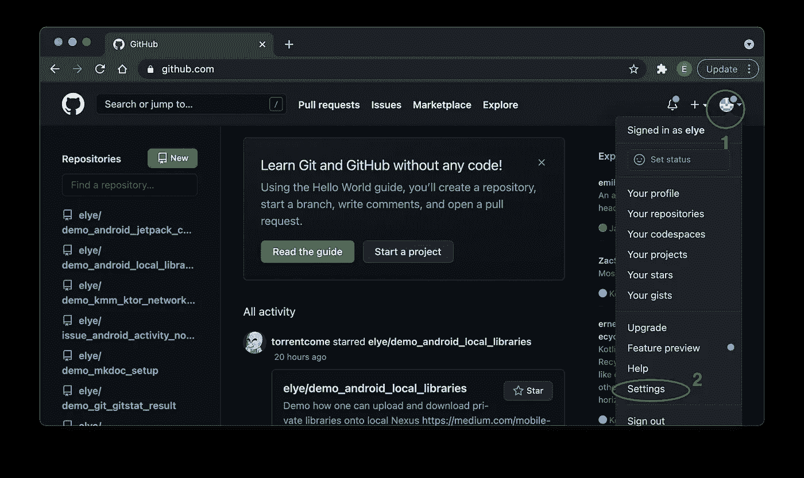
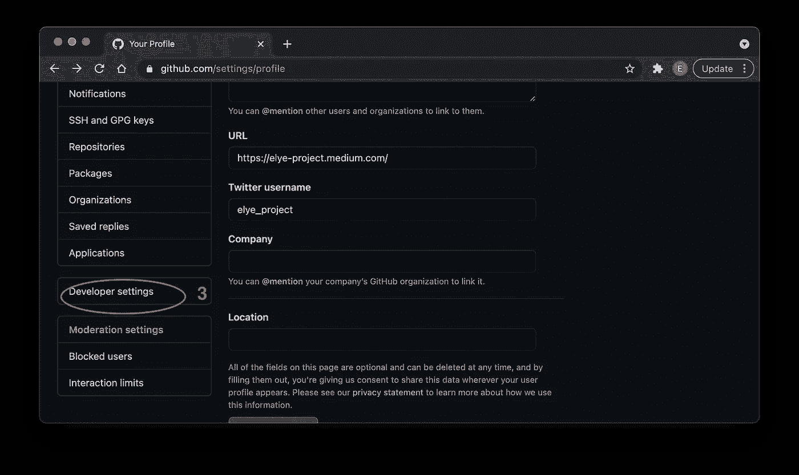
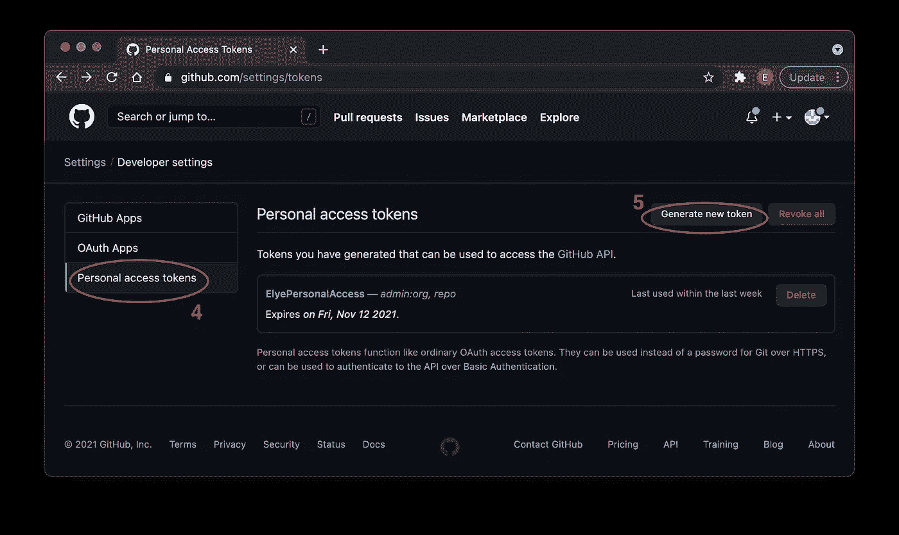
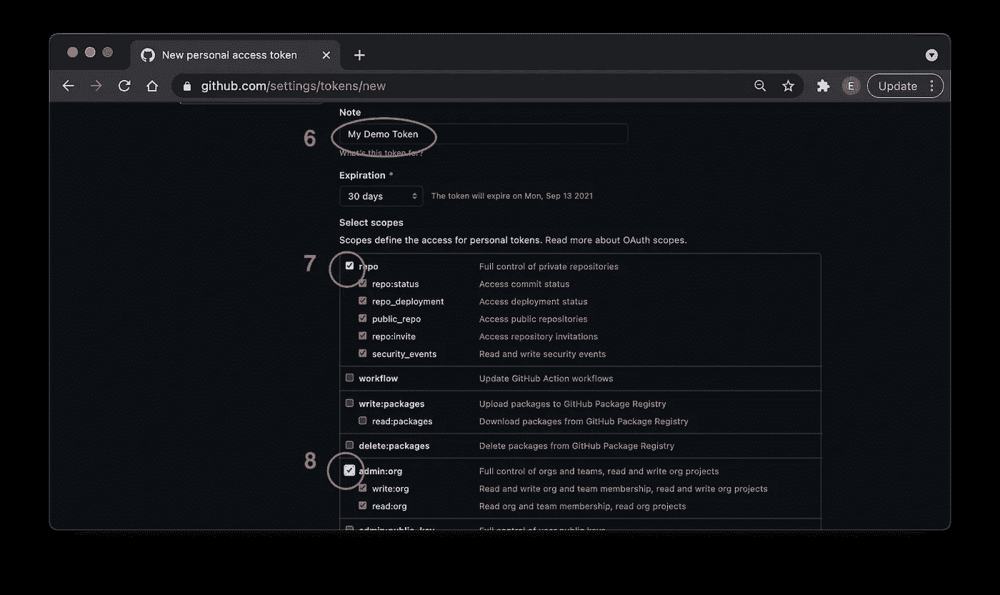
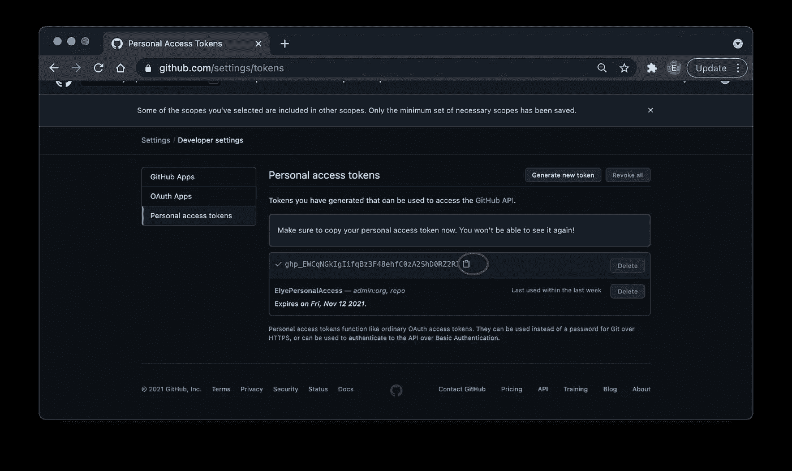
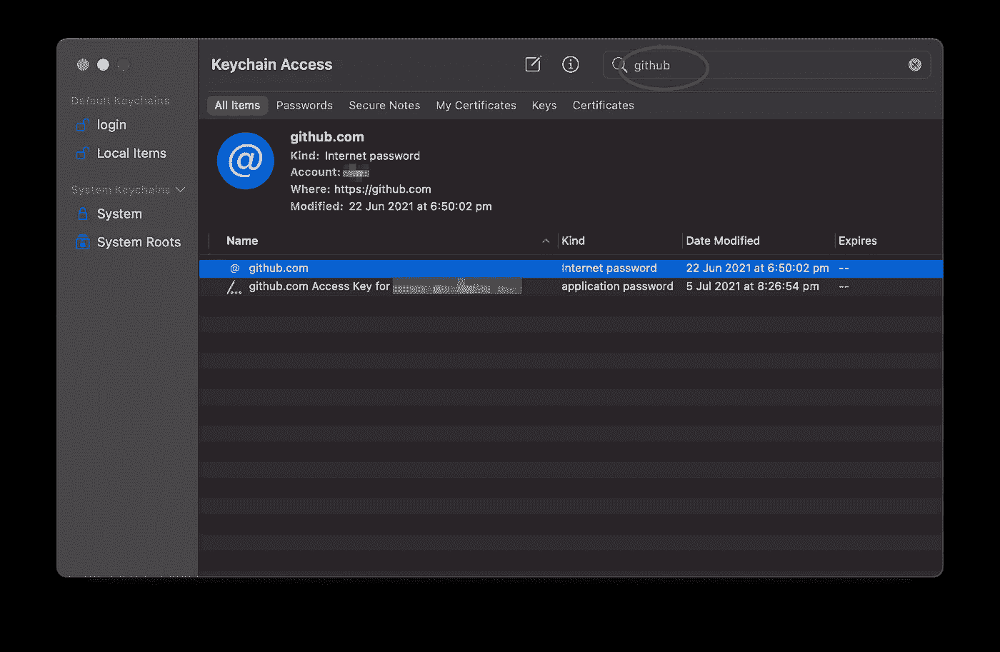
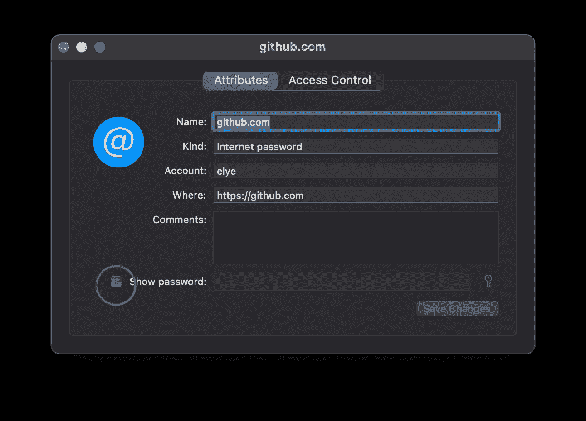

# Github 访问授权访问变得简单

> 原文：<https://levelup.gitconnected.com/github-access-authorisation-access-change-made-easy-f84693024fc6>

## 软件世界

## Github 对密码认证的支持被个人访问令牌所取代


照片由 [Immo Wegmann](https://unsplash.com/@macroman?utm_source=medium&utm_medium=referral) 在 [Unsplash](https://unsplash.com?utm_source=medium&utm_medium=referral) 上拍摄

从 2021 年 8 月 13 日开始，如果您尝试推送您的 Github 回购，您可能会收到以下消息。

```
remote: Support for password authentication was removed on August 13, 2021\. Please use a personal access token instead.remote: Please see https://github.blog/2020-12-15-token-authentication-requirements-for-git-operations/ for more information.fatal: unable to access 'https://github.com/<your github repo>/': The requested URL returned error: 403
```

我面对这个问题，并在解决它之前做了一些调查。因此，在一页上分享它，让任何面临这个问题的人更容易，一页就能解决这个问题。

# 1.创建个人访问令牌

过去，我们可以使用 Github 密码轻松访问我们的回购协议。但是为了更好的安全性，Github 希望我们使用令牌(可以过期)。这确保了我们

*   不要将我们的密码存储在本地设备上(例如钥匙串)
*   我们可以设置令牌的到期日期(这样它就不会永远存在)
*   我们可以限制令牌拥有的权限，而不是拥有全部权力
*   我们可以在需要时随时删除令牌访问

Github 在这里提供了明确的[指令](https://docs.github.com/en/github/authenticating-to-github/authenticating-with-saml-single-sign-on/authorizing-a-personal-access-token-for-use-with-saml-single-sign-on)，但为了简单起见，我将在下面解释。

访问您的 Github 设置



转到开发者设置



转到个人访问令牌页面以生成新令牌



输入令牌的名称，并授予`repo`和`admin:org`权限(对于这种情况，您只需要将您的更改向上推)



然后单击底部的“生成令牌”按钮。

最后，生成令牌后，记得复制它



# 2.更新您的设备对 GitHub 的访问

做完这些后，我还需要一段时间才能在哪里使用这个代币。

我从[这个 StackOverflow](https://stackoverflow.com/a/68781050/3286489) 里找到了答案。我在 macOS 上，因此我需要更新我的钥匙串访问。

然后搜索`github`，双击`github.com`



之后，检查显示密码，如下所示。系统会提示您输入机器密码。访问后，现在只需粘贴您的令牌作为密码。



就是这样！

如果你不是在 macOS 上，只需检查[这个 StackOverflow](https://stackoverflow.com/a/68781050/3286489) 。