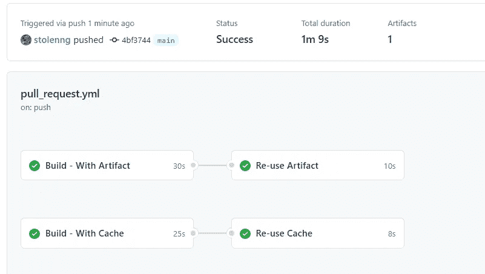
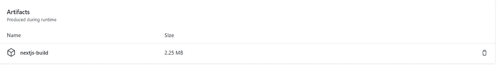

# GitHub 操作——如何在作业间共享数据

> 原文：<https://levelup.gitconnected.com/github-actions-how-to-share-data-between-jobs-fc1547defc3e>

最近，我有机会使用 GitHub Actions，我不得不在多个工作之间共享我的前端项目构建。我做了调查，发现了所有的选择和实现它的方法，我很乐意分享它！

对于那些不熟悉 [**GitHub 动作**](https://github.com/features/actions) **，**的人来说，这是一种通过简单地添加一个 YML 文件，在 GitHub 存储库中使用 CI/CD 来自动化工作流的方法。

在本文中，我将主要关注如何在作业之间共享数据，因此如果您想要了解一些基本知识，您可以在这里找到:。

在 GitHub 操作中，有两种主要的方法在作业之间共享数据:

1.  隐藏物
2.  史前古器物

# 隐藏物

GitHub 给你提供了一个动作叫做:`actions/cache` ( [GitHub Repo](https://github.com/actions/cache) )，我们可以用它来上传缓存，然后在不同的作业中下载( [Docs](https://docs.github.com/en/actions/guides/caching-dependencies-to-speed-up-workflows) )。

让我们看一个活生生的例子，然后再看一遍:

如您所见，它使用起来非常简单，动作本身有 3 个参数:

*   **path** (必选):运行程序上要缓存或恢复的文件路径。路径可以是绝对路径，也可以是相对于工作目录的路径。
*   **key** (必选):保存缓存时创建的密钥，也是搜索缓存时使用的密钥。它可以是任何组合。
*   **restore-keys** (可选):如果`key`没有发生缓存命中，则用于查找缓存的可选键的有序列表。

这个动作输出一个`cache-hit`，我们也可以用它来运行这样的动作:

正如你所看到的，它非常简单，开箱即用，让我们继续第二个。

# 工件上传/下载

工件是 GitHub Actions 提供给你的一种持久化文件的方式，在运行结束后使用它们，或者在作业之间共享它们([文档](https://docs.github.com/en/actions/guides/storing-workflow-data-as-artifacts))。

要创建一个工件并使用它，您需要不同的操作:[上传](https://github.com/actions/upload-artifact)和[下载](https://github.com/actions/download-artifact)。

要上传文件或目录，您只需像这样使用它:

这里您只需要提供 2 个参数:

*   **name** :您想要用来识别工件的名称。
*   **路径**:文件或目录的路径。

然后下载神器来使用它:

在这里你只需要提供以前上传的名字:`my-artifcat`就可以了！

# 差异

既然我们知道了这两种方法，让我们回顾一下它们之间最重要的区别( [Docs](https://docs.github.com/en/actions/guides/caching-dependencies-to-speed-up-workflows#comparing-artifacts-and-dependency-caching) ):

两者都是用来在 GitHub 上存储文件的，但是每一个都有不同的用途，最主要也是最大的区别是:

**缓存**用于在作业或工作流程之间重用数据/文件，而**工件**用于在工作流程结束后保存文件。

例如，如果您想要在几个不同的作业之间共享一个构建，您会选择缓存，因为使用缓存只需几秒钟，而上传/下载工件则需要时间，这取决于文件的大小，很容易就会浪费很多时间。

另一方面，如果你想:日志，测试结果，报告等。你肯定会想用神器。

# 比较

下面是一个使用缓存和工件来共享 NextJS 空项目构建的工作流:

您可以看到缓存流和工件流之间的微小差异，因为这只是一个示例，项目的构建非常小，因为它实际上是空的，这种差异非常小，但是想象一下您有一个真实的项目，所以时间差将变得非常大，我已经看到了上传(5+-分钟)和下载(2+-分钟)时间与缓存秒的对比，但是在工件上传之后，您可以下载它:

您也可以同时使用两者，例如:如果您不想等待构建上传，但是拥有构建对您来说仍然很重要，您可以使用缓存，然后在其他作业正在运行时异步上传构建，而不是等待上传。

# 摘要

我希望你喜欢这篇文章，如果有人会研究这个话题，这篇文章将帮助他们很容易地快速理解，如果这篇文章对你有帮助，请随意鼓掌！:)

*   [回购示例](https://github.com/stolenng/github-actions-sharing-data)
*   [动作用法示例](https://github.com/stolenng/github-actions-sharing-data/actions/runs/510223214)
*   [YML 文件示例](https://github.com/stolenng/github-actions-sharing-data/blob/main/.github/workflows/pull_request.yml)

# 分级编码

感谢您成为我们社区的一员！ [**订阅我们的 YouTube 频道**](https://www.youtube.com/channel/UC3v9kBR_ab4UHXXdknz8Fbg?sub_confirmation=1) 或者加入 [**Skilled.dev 编码面试课程**](https://skilled.dev/) 。

 [## 编写面试问题+获得开发工作

### 掌握编码面试的过程

技术开发](https://skilled.dev)