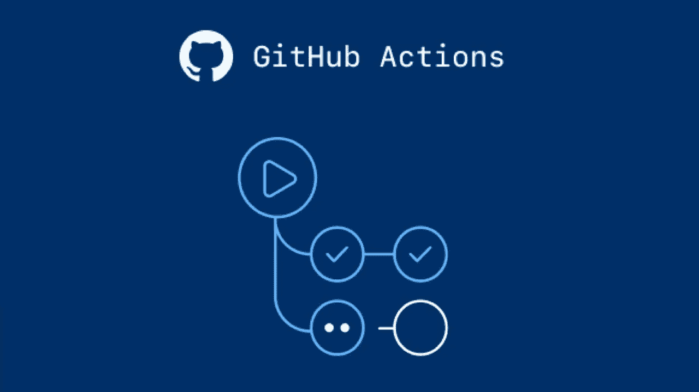

# GitHub Actions 构建您的 Java/Scala 应用程序，测试并将其部署到 Kubernetes 集群

> 原文：<https://levelup.gitconnected.com/github-actions-to-build-your-java-scala-application-test-and-deploy-it-to-kubernetes-cluster-484779dfc200>



在过去的几年里，我一直在使用一些 CI/CD 服务器，比如 TeamCity 和 Jenkins。我发现这些产品非常强大，因为它们能够运行分布式构建(即使是现在，3 个月后，Kubernetes 中的 Jenkins 也让我感到惊讶:)，与不同构建系统的高度集成以及对各种编程语言的支持，更不用说它们灵活的身份验证/授权系统了。

然而，当我处理我最喜欢的项目时，我想要 Jenkins 的一些功能子集。我准备好接受任何托管或云 Jenkins 解决方案了吗—没有！所以，当我收到 GitHub 的下一个使用它的“动作”的邀请后，我决定研究一下它是什么。“GitLab CI/CD”的克隆！不，当然，我不想指责任何人窃取了这个概念——这只是我在阅读一些文档时想到的一个想法。

GitHub Actions 能在一个大项目(有许多服务、复杂的部署逻辑、不同的语言、私有存储库)中取代 Jenkins(或任何其他专用 CI/CD 解决方案)吗——不能！能有用吗(至少对我来说)——肯定有用！

我阅读了大量关于 GitHub Action on Medium 的文章，但还没有找到描述我需求的内容。然而，现在我知道了如何构建和部署 React 应用程序:)。

我希望从未来管道中获得什么:

*   缓存构建/编译依赖项(我不希望在每次构建时等待额外的时间，因为依赖项会一次又一次地下载，就像在以前的构建中没有做的那样)
*   在每次推送时运行现有测试

进一步的步骤应该只针对`master`分支:

*   构建新的 docker 映像(带有标签`latest`和上次提交的 SHA)
*   对我的 Kubernetes 集群进行滚动更新

让我们从创建管道定义开始。GitHub Action 重用 GitLab 和 Jenkins 的方法——使用存储库本身进行管道定义存储(当然，如果你不在 Jenkins 中使用类似[共享库的东西)。所以我们会创建一个 YAML 文件`.github/workflows/ci-cd.yml`，这个文件的名字起不到显著的作用它只应该是有意义的。](https://www.jenkins.io/doc/book/pipeline/shared-libraries/)

我将一步一步地介绍 YML 的所有部分，并加上一些评论(评论将在每个部分的下面)。

我们从全球事物开始:

```
name: ci-cd

on:
  push:

jobs:
  build-test-deploy:
    runs-on: ubuntu-18.04
    steps:
```

在那里，我们声明了管道的名称，以及管道开始的条件(在任何分支的每次推送中)。我们还定义了我们将要运行的单个作业(`build-test-deploy`):由于我们的步骤依赖于前一步骤的结果，我看不出它有什么分离的理由。当然，我们指定了一个 docker 映像，一切都将在其中执行。

```
- uses: actions/checkout@v2
- name: set-up-jdk
  uses: actions/setup-java@v1
  with:
    java-version: '11' # The JDK version to make available on the path.
    java-package: jdk # (jre, jdk, or jdk+fx) - defaults to jdk
    architecture: x64 # (x64 or x86) - defaults to x64
```

在那里，我们定义了两个步骤:当前分支的检出和特定的 JDK 安装。

```
- name: cache-local-repository
  uses: actions/cache@v2
  with:
    path: |
      ~/.m2/repository
      ~/.gradle/caches
      ~/.gradle/wrapper
    key: ${{ runner.os }}-gradle-${{ hashFiles('**/*.gradle*') }}
    restore-keys: |
      ${{ runner.os }}-gradle-
```

在那里，我们定义了我们的构建助推器——依赖关系缓存。在每一次成功的编译中，它都被压缩并以我们的密钥名存储在某个地方(可用于不同的参数，如操作系统、编译工具、JDS 版本等)。)通过自动创建的步骤。

```
- name: grant-execute-permission-for-gradlew
  run: chmod +x gradlew
- name: build-with-gradle
  run: ./gradlew build
- name: run-tests
  run: ./gradlew scalatest
```

在那里，我们为 gradle 定义了 3 个简单的步骤:使其包装器可执行，构建并测试我们的代码。

```
- name: login-to-docker-hub
  if: ${{ github.ref == 'refs/heads/master' }}
  uses: docker/login-action@v1
  with:
    username: ${{ secrets.DOCKER_USERNAME }}
    password: ${{ secrets.DOCKER_PASSWORD }}
- name: set-up-docker-buildx
  if: ${{ github.ref == 'refs/heads/master' }}
  uses: docker/setup-buildx-action@v1
```

在那里我们定义了 2 个步骤(根据[https://github.com/docker/build-push-action](https://github.com/docker/build-push-action)动作的新发布):在 DockerHub 创建并设置 Docker 的 [Buildx](https://github.com/docker/buildx) 之后，登录 Docker hub 推送新的图像。

这是第一步，我们使用关键字`if`检查我们的分支，并且仅当我们在条件中得到肯定结果时才执行该步骤(对我们来说，这意味着我们不会在除`master`之外的任何分支上运行该步骤)。

此外，这是我们第一次使用 [GitHub Secrets](https://docs.github.com/en/free-pro-team@latest/actions/reference/encrypted-secrets) 的地方，这对于敏感数据是必不可少的，比如密码或证书。我们可以将这些作为秘密保存在 GitHub 中，然后在工作流中使用它们作为`${{ secrets.XXXX }}`形式的环境变量。

```
- name: get-short-sha # https://github.community/t/substring-function/18401
  if: ${{ github.ref == 'refs/heads/master' }}
  run: |
    id=$(echo ${{github.sha}} | cut -b-7)
    echo "::set-output name=sha::sha-$id"
  id: get-short-sha-id
```

在这里，我们使用 GitHub 的输出概念为 docker 图像生成一个带有标签值的字符串(目前没有更简单的方法)。你也可以看到我使用了`id`关键字，这将有助于在其他步骤中引用这些输出。

```
- name: build-and-push-docker-image
  if: ${{ github.ref == 'refs/heads/master' }}
  uses: docker/build-push-action@v2
  with:
    push: true
    file: docker/Dockerfile
    context: build/libs
    tags: |
      fedormalyshkin/conway-life-stream-server:latest
      fedormalyshkin/conway-life-stream-server:${{steps.get-short-sha-id.outputs.sha}}
```

在那里，我们定义了图像构建及其在 DockerHub 上发布的步骤

```
- name: set-k8s-context
  if: ${{ github.ref == 'refs/heads/master' }}
  uses: azure/k8s-set-context@v1
  with:
    method: kubeconfig
    kubeconfig: ${{ secrets.KUBE_CONFIG }}
```

在那里，我们初始化了 Kubernetes 客户端(`kubectl`)的配置，我们将在最后一步中使用它。正如你看到的，我们再次使用 GitHub Secret record，在其中我们保存了`.kube/config`文件的全部内容(默认情况下启用了所需的上下文)。

```
- name: roll-update-k8s
  if: ${{ github.ref == 'refs/heads/master' }}
  run: kubectl set image deployment/stream-server-deployment conway-life-stream-server=fedormalyshkin/conway-life-stream-server:${{steps.get-short-sha-id.outputs.sha}}
```

最后一步是在 Kubernetes 集群中运行滚动更新，方法是将 docker 的映像名称更改为我们在上一步中创建的新映像名称。

完整版本可在此处获得:[https://github . com/fedor-malyshkin/Conway-life-stream-server/blob/master/。github/workflows/ci-cd.yml](https://github.com/fedor-malyshkin/conway-life-stream-server/blob/master/.github/workflows/ci-cd.yml)

总而言之，GitHub 扩展了它的动作列表，它们在使用中变得越来越有趣，而对我来说，它已经很适合一些应用程序了。

祝您在开发自动化方面一切顺利:)