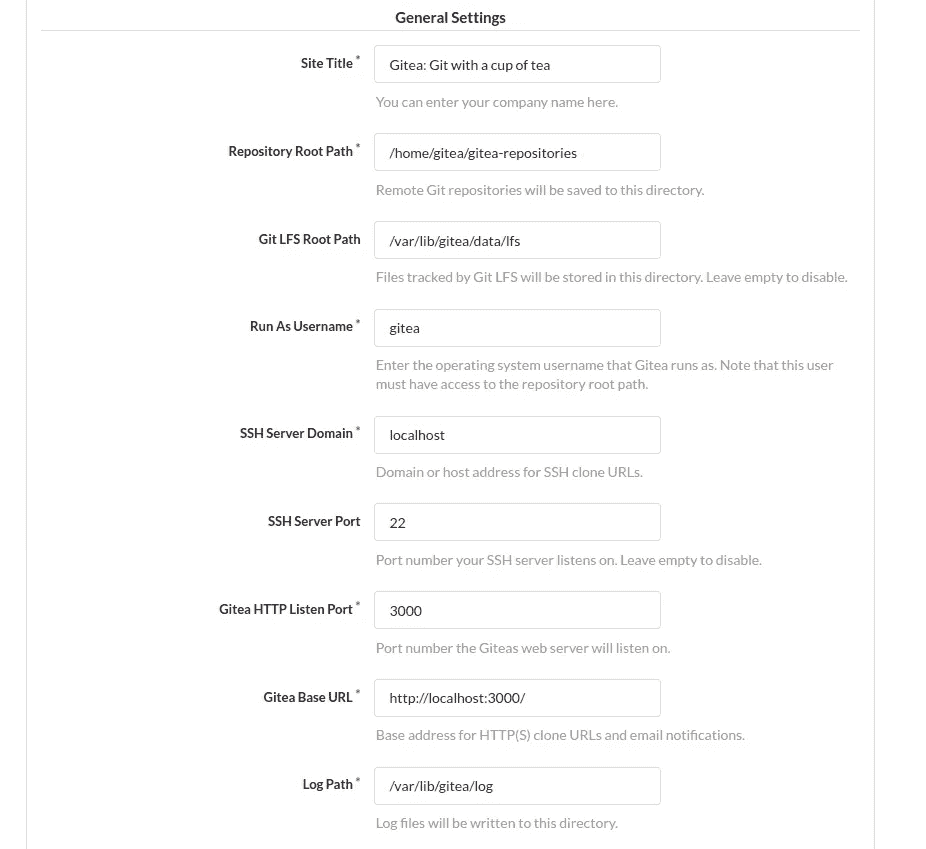
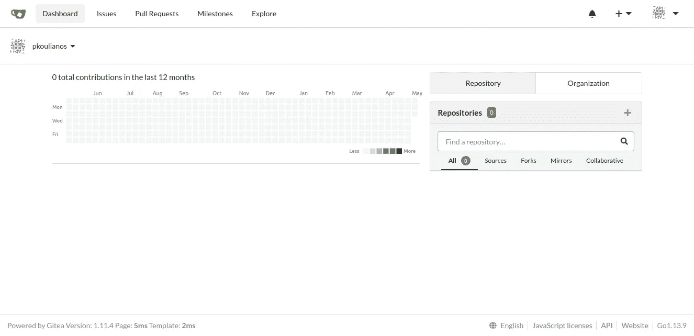

# GitHub 替代方案，提供自托管的无痛 Git 服务

> 原文：<https://levelup.gitconnected.com/github-alternative-with-self-hosted-painless-git-service-6c1b3a29f4fa>

为你的团队安装一个 GitHub 替代方案，超级简单，没有痛苦。


图片来自 [https://try.gitea.io](https://try.gitea.io)

开发团队经常不得不在封闭的安全网络区域工作，无法访问互联网，因此 GitHub、GitLab 等大型 git 服务无法使用。这是一个巨大的问题，版本控制系统是开发过程的一部分，我们必须找到解决方案。

别担心社区已经为你建立了 [gitea.io](https://gitea.io/en-us/) 。

**Gitea** 是麻省理工学院许可下的开源解决方案，用于自托管 Git 服务。

## 为什么选择 Gitea:

1.  Gitea 得到各大公司的支持
2.  由活跃的社区定期更新
3.  在 GitHub 上有 19.6k 颗星星
4.  在任何操作系统中运行(Linux、Windows、macOS)
5.  超级容易安装
6.  轻量级要求
7.  支持的数据库 SQLite3、MySQL、PostgreSQL、MSSQL

# 获取更多免费 Node.js 故事并保持更新

# 🔥 🔥订阅我的[简讯](https://landing.mailerlite.com/webforms/landing/l5q4o0)📰 📰

# Gitea 安装

我们将在 Linux 中安装 Gitea，因为 Linux 发行版实际上是托管应用程序的选项。

安装 git 软件

```
//Debian-based distribution
sudo apt install git-all
```

检查 git 安装

```
git --version
//console output
git version 2.26.2
```

为您的 gitea 安装创建一个文件夹

```
mkdir gitea.io
cd gitea.io
```

下载 gitea 二进制文件

```
wget -O gitea https://dl.gitea.io/gitea/1.11.4/gitea-1.11.4-linux-amd64
chmod +x gitea
```

创建一个名为 **gitea** 的新用户来运行 gitea

```
sudo adduser \
   --system \
   --shell /bin/bash \
   --gecos 'Gitea' \
   --group \
   --disabled-password \
   --home /home/gitea \
   gitea
```

准备文件夹结构

```
sudo mkdir -p /var/lib/gitea/{custom,data,log}
sudo chown -R root:gitea /var/lib/gitea/
sudo chmod -R 750 /var/lib/gitea/
sudo mkdir /etc/gitea
sudo chown root:gitea /etc/gitea
sudo chmod 770 /etc/gitea
```

将 Gitea 二进制文件复制到全局位置

```
cp gitea /usr/local/bin/gitea
```

将 Gitea 作为 Linux 服务运行

```
//Create and open gitea.service with nano
sudo nano /etc/systemd/system/gitea.service
// copy and paste the gitea.service
```

gitea.service

启用并启动 Gitea as a service。

```
sudo systemctl enable gitea
sudo systemctl start gitea
```

恭喜你你的 Gitea 正在运行于 [localhost:3000](http://localhost:3000) 。


本地主机:3000

# Gitea 配置

按下主屏幕左上方的注册按钮。

## 数据库设置

首先我们必须选择数据库，让我们选择 SQLite3。


SQLite3

## 常规设置

在这一部分，我们必须配置一些重要的设置:

1.  存储库根路径设置存储存储库的路径
2.  SSH 服务器域，设置您的服务器的域名
3.  Gitea HTTP 侦听端口，服务将要运行的端口号
4.  Gitea 基本 URL、主机名和端口号。[http://mygitea.com:5000](http://mygitea.com:5000)



常规设置

## 可选设置

在最后一部分，我们可以配置:

1.  电子邮件设置、SMTP 服务器等…
2.  检查应用程序的一些设置
3.  创建管理员用户(推荐)


可选设置

保存设置，我们就可以开始了！



# 恭喜👏 👏你的 Gitea 准备好了

# 参考

*   [gitea.io](https://gitea.io/en-us/)
*   [git](https://git-scm.com)

# 感谢你阅读我的故事

请随意评论，给我发电子邮件，告诉我任何想法、变化等等。

[](https://medium.com/javascript-in-plain-english/learn-to-use-regular-expressions-like-a-ninja-in-node-js-20cfb6806f26) [## Node.js 中的正则表达式备忘单

### 轻松学习、编写和执行正则表达式的详细故事。

medium.com](https://medium.com/javascript-in-plain-english/learn-to-use-regular-expressions-like-a-ninja-in-node-js-20cfb6806f26) [](/how-to-schedule-cron-jobs-and-set-health-checks-in-node-js-93cf88d2c247) [## 如何在 Node.js 中调度 Cron 作业和设置健康检查

### 使用 node.js 中的 Cron 作业自动化您的任务

levelup.gitconnected.com](/how-to-schedule-cron-jobs-and-set-health-checks-in-node-js-93cf88d2c247)